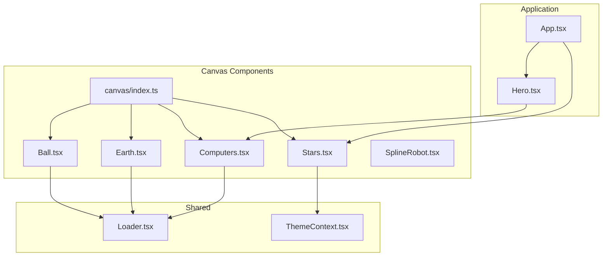
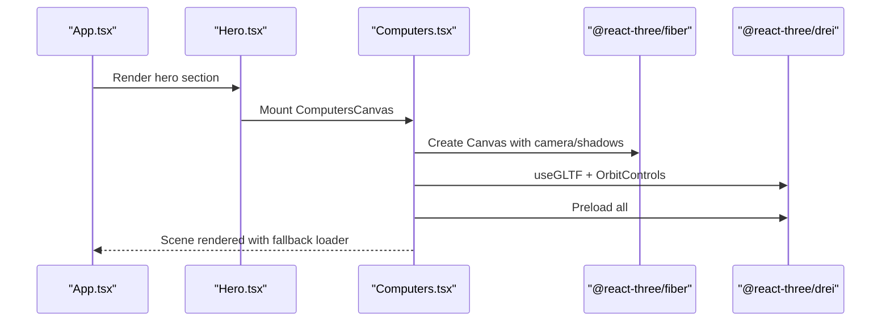
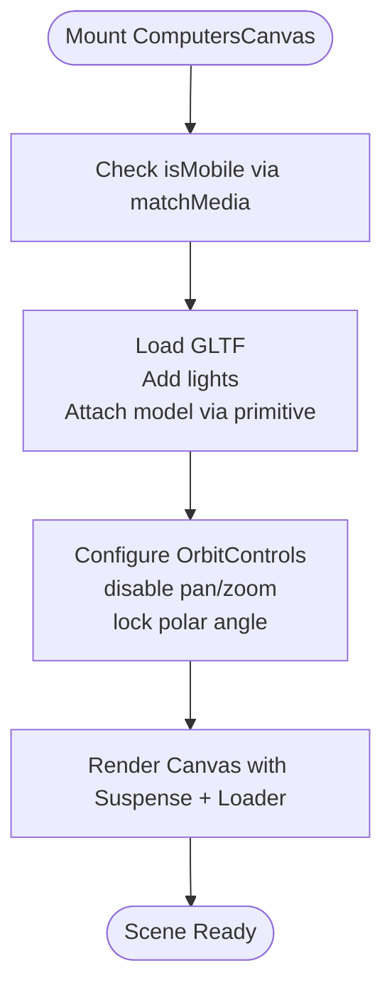
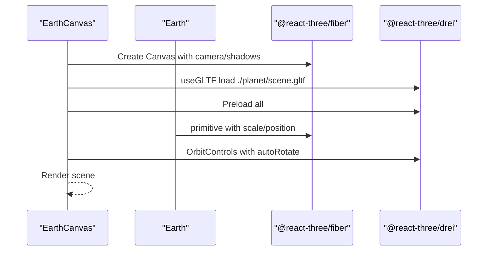
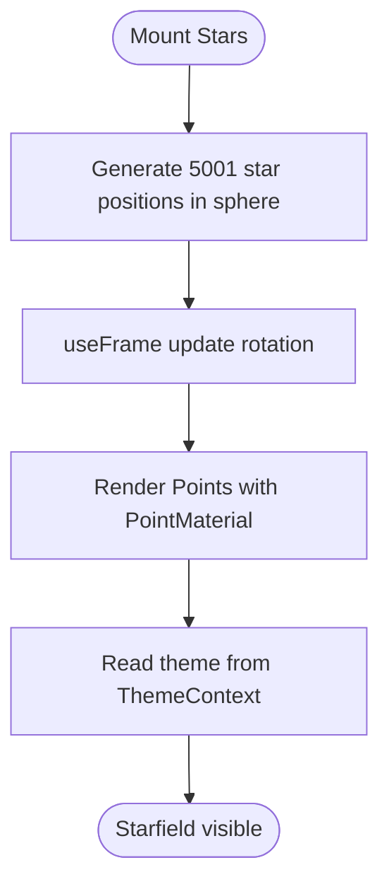
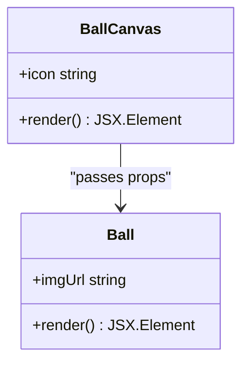
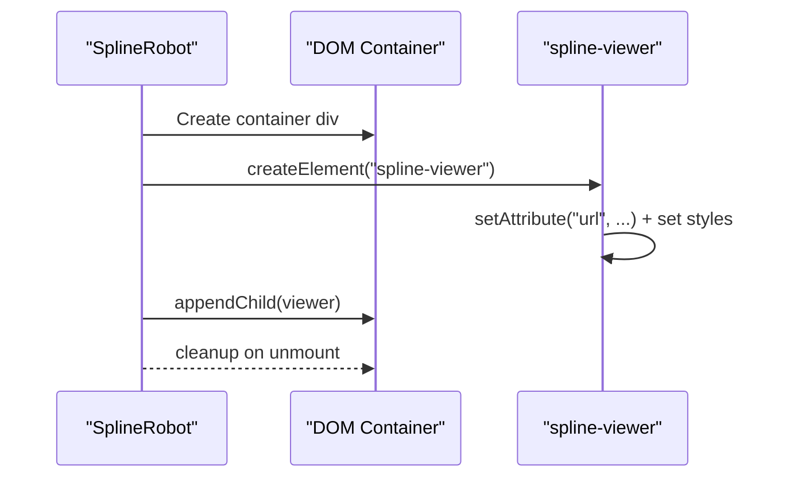
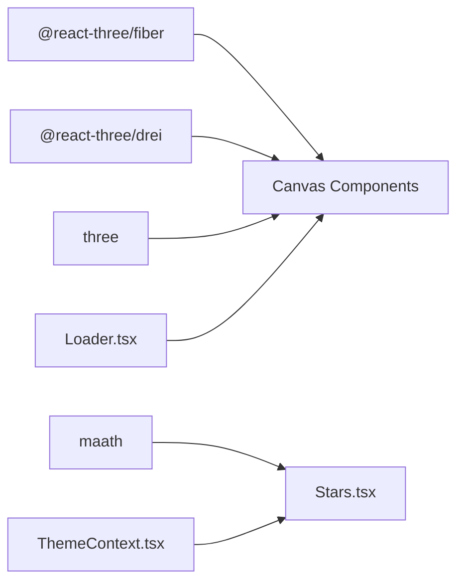

# 3D Canvas Components

<cite>
**Referenced Files in This Document**
- [index.ts](file://src/components/canvas/index.ts)
- [Computers.tsx](file://src/components/canvas/Computers.tsx)
- [Earth.tsx](file://src/components/canvas/Earth.tsx)
- [Stars.tsx](file://src/components/canvas/Stars.tsx)
- [Ball.tsx](file://src/components/canvas/Ball.tsx)
- [SplineRobot.tsx](file://src/components/canvas/SplineRobot.tsx)
- [App.tsx](file://src/App.tsx)
- [Hero.tsx](file://src/components/sections/Hero.tsx)
- [Loader.tsx](file://src/components/layout/Loader.tsx)
- [ThemeContext.tsx](file://src/context/ThemeContext.tsx)
- [package.json](file://package.json)
</cite>

## Table of Contents
1. [Introduction](#introduction)
2. [Project Structure](#project-structure)
3. [Core Components](#core-components)
4. [Architecture Overview](#architecture-overview)
5. [Detailed Component Analysis](#detailed-component-analysis)
6. [Dependency Analysis](#dependency-analysis)
7. [Performance Considerations](#performance-considerations)
8. [Troubleshooting Guide](#troubleshooting-guide)
9. [Conclusion](#conclusion)
10. [Appendices](#appendices)

## Introduction
This document explains the 3D canvas components used in the portfolio application. It covers how interactive 3D scenes are built with Three.js via @react-three/fiber and @react-three/drei, how GLTF models are loaded and animated, and how responsive scaling and rendering are handled. It also documents performance strategies, memory management, customization of models/textures/animations, and extension patterns for adding new 3D elements.

## Project Structure
The 3D canvas components live under src/components/canvas and are integrated into the main application and hero section.

**Diagram sources**
- [App.tsx:19-48](file://src/App.tsx#L19-L48)
- [Hero.tsx:7-29](file://src/components/sections/Hero.tsx#L7-L29)
- [Computers.tsx:32-82](file://src/components/canvas/Computers.tsx#L32-L82)
- [Earth.tsx:15-43](file://src/components/canvas/Earth.tsx#L15-L43)
- [Ball.tsx:41-56](file://src/components/canvas/Ball.tsx#L41-L56)
- [Stars.tsx:37-49](file://src/components/canvas/Stars.tsx#L37-L49)
- [SplineRobot.tsx:3-33](file://src/components/canvas/SplineRobot.tsx#L3-L33)
- [index.ts:1-7](file://src/components/canvas/index.ts#L1-L7)
- [Loader.tsx:3-21](file://src/components/layout/Loader.tsx#L3-L21)
- [ThemeContext.tsx:17-44](file://src/context/ThemeContext.tsx#L17-L44)

**Section sources**
- [index.ts:1-7](file://src/components/canvas/index.ts#L1-L7)
- [App.tsx:19-48](file://src/App.tsx#L19-L48)
- [Hero.tsx:7-29](file://src/components/sections/Hero.tsx#L7-L29)

## Core Components
- Computers.tsx: Renders a desktop PC model with lighting and orbit controls; adapts scale and position for mobile.
- Earth.tsx: Displays a rotating Earth model with auto-rotation and minimal user controls.
- Stars.tsx: Generates a dynamic starfield using point clouds with per-frame rotation and theme-aware colors.
- Ball.tsx: Shows a floating, decal-textured icosahedron ball with directional lighting and shadow casting.
- SplineRobot.tsx: Embeds a Spline viewer element for animated robotic scenes.

Each component composes a @react-three/fiber Canvas with Suspense for resource preloading and @react-three/drei helpers for GLTF loading, controls, and materials.

**Section sources**
- [Computers.tsx:7-30](file://src/components/canvas/Computers.tsx#L7-L30)
- [Earth.tsx:7-13](file://src/components/canvas/Earth.tsx#L7-L13)
- [Stars.tsx:8-35](file://src/components/canvas/Stars.tsx#L8-L35)
- [Ball.tsx:13-39](file://src/components/canvas/Ball.tsx#L13-L39)
- [SplineRobot.tsx:3-33](file://src/components/canvas/SplineRobot.tsx#L3-L33)

## Architecture Overview
The 3D architecture follows a component-per-canvas pattern. Each canvas component encapsulates:
- Scene composition with lights, geometry, materials, and models
- Camera and control configuration
- Resource preloading and fallback loading UI
- Responsive behavior and performance tuning

**Diagram sources**
- [App.tsx:19-48](file://src/App.tsx#L19-L48)
- [Hero.tsx:29](file://src/components/sections/Hero.tsx#L29)
- [Computers.tsx:32-82](file://src/components/canvas/Computers.tsx#L32-L82)
- [Loader.tsx:3-21](file://src/components/layout/Loader.tsx#L3-L21)

## Detailed Component Analysis

### Computers.tsx
- Purpose: Interactive desktop PC visualization in the hero section.
- Three.js integration: Loads GLTF via useGLTF, applies hemisphere/spot/point lights, and positions the model with primitive.
- Responsive scaling: Uses a media query to detect small screens and adjusts scale and position accordingly.
- Controls: Disables pan/zoom; locks polar angle for a fixed view.
- Performance: demand frame loop, shadows enabled, device pixel ratio capped.

**Diagram sources**
- [Computers.tsx:32-82](file://src/components/canvas/Computers.tsx#L32-L82)
- [Computers.tsx:7-30](file://src/components/canvas/Computers.tsx#L7-L30)

**Section sources**
- [Computers.tsx:7-30](file://src/components/canvas/Computers.tsx#L7-L30)
- [Computers.tsx:32-82](file://src/components/canvas/Computers.tsx#L32-L82)

### Earth.tsx
- Purpose: Globe visualization with auto-rotation.
- Three.js integration: Loads GLTF for the Earth scene and scales/positions it.
- Controls: Auto-rotation enabled; pan/zoom disabled; polar angles constrained.
- Performance: demand frame loop, shadows enabled, capped DPR.

**Diagram sources**
- [Earth.tsx:15-43](file://src/components/canvas/Earth.tsx#L15-L43)
- [Earth.tsx:7-13](file://src/components/canvas/Earth.tsx#L7-L13)

**Section sources**
- [Earth.tsx:7-13](file://src/components/canvas/Earth.tsx#L7-L13)
- [Earth.tsx:15-43](file://src/components/canvas/Earth.tsx#L15-L43)

### Stars.tsx
- Purpose: Dynamic starfield background using a point cloud.
- Three.js integration: Generates positions in a sphere with maath.random.inSphere, rotates every frame, and renders with Points and PointMaterial.
- Theming: Color selection depends on current theme from ThemeContext.
- Performance: depthWrite disabled for blending; demand frame loop; minimal draw calls.

**Diagram sources**
- [Stars.tsx:8-35](file://src/components/canvas/Stars.tsx#L8-L35)
- [ThemeContext.tsx:17-44](file://src/context/ThemeContext.tsx#L17-L44)

**Section sources**
- [Stars.tsx:8-35](file://src/components/canvas/Stars.tsx#L8-L35)
- [ThemeContext.tsx:17-44](file://src/context/ThemeContext.tsx#L17-L44)

### Ball.tsx
- Purpose: Floating, decal-textured icosahedron ball with soft shadows.
- Three.js integration: Creates an icosahedron geometry, applies a white material with flat shading, and projects a decal texture onto the front face.
- Animation: Float effect for subtle bobbing and rotation; directional light simulates headlight.
- Controls: Pan/zoom disabled for a fixed composition.

**Diagram sources**
- [Ball.tsx:13-39](file://src/components/canvas/Ball.tsx#L13-L39)
- [Ball.tsx:41-56](file://src/components/canvas/Ball.tsx#L41-L56)

**Section sources**
- [Ball.tsx:13-39](file://src/components/canvas/Ball.tsx#L13-L39)
- [Ball.tsx:41-56](file://src/components/canvas/Ball.tsx#L41-L56)

### SplineRobot.tsx
- Purpose: Embeds a Spline viewer element for animated robotic scenes.
- Integration: Dynamically creates and appends a <spline-viewer> element to the DOM during mount; cleans up on unmount.
- Positioning: Absolute positioning fills the container while maintaining z-index stacking.

**Diagram sources**
- [SplineRobot.tsx:3-33](file://src/components/canvas/SplineRobot.tsx#L3-L33)

**Section sources**
- [SplineRobot.tsx:3-33](file://src/components/canvas/SplineRobot.tsx#L3-L33)

## Dependency Analysis
- Libraries:
  - @react-three/fiber: React renderer for Three.js scenes
  - @react-three/drei: Helpers for GLTF, controls, materials, and loaders
  - three: Core 3D engine
  - maath: Utility for procedural point distributions
- Internal dependencies:
  - Loader.tsx provides a Suspense fallback for asset loading
  - ThemeContext supplies theme state consumed by Stars.tsx

**Diagram sources**
- [package.json:13-25](file://package.json#L13-L25)
- [Stars.tsx:8-35](file://src/components/canvas/Stars.tsx#L8-L35)
- [ThemeContext.tsx:17-44](file://src/context/ThemeContext.tsx#L17-L44)
- [Loader.tsx:3-21](file://src/components/layout/Loader.tsx#L3-L21)

**Section sources**
- [package.json:13-25](file://package.json#L13-L25)

## Performance Considerations
- Frame loop control:
  - demand frame loop reduces CPU/GPU usage when idle; ideal for static or slowly changing scenes.
- Device pixel ratio:
  - Cap DPR to [1, 2] to balance quality and performance on high-DPI devices.
- Shadows:
  - Enable shadows selectively; disable where unnecessary to reduce render overhead.
- Geometry and materials:
  - Prefer simpler geometry (e.g., icosahedron) and flat shading for lightweight visuals.
  - Disable depth writes for transparent or additive effects when appropriate.
- Preloading:
  - Use Preload to fetch resources early and avoid runtime stalls.
- Suspense fallback:
  - Provide a lightweight loader to keep the UI responsive while assets stream.
- Responsive scaling:
  - Adjust model scale and camera distance based on viewport to maintain consistent perceived size.

[No sources needed since this section provides general guidance]

## Troubleshooting Guide
- Assets fail to load:
  - Verify GLTF paths and ensure they are served by the static folder. Confirm Preload is present.
- Scene flickers or stutters:
  - Switch to demand frame loop and reduce shadow complexity.
- Starfield looks too bright/dim:
  - Adjust PointMaterial color and size; confirm theme state updates propagate.
- Spline viewer not appearing:
  - Ensure the Spline URL is valid and the element is appended to a visible container.

**Section sources**
- [Loader.tsx:3-21](file://src/components/layout/Loader.tsx#L3-L21)
- [Stars.tsx:25-31](file://src/components/canvas/Stars.tsx#L25-L31)
- [SplineRobot.tsx:10-19](file://src/components/canvas/SplineRobot.tsx#L10-L19)

## Conclusion
The 3D canvas components leverage @react-three/fiber and @react-three/drei to deliver performant, responsive, and visually engaging scenes. They demonstrate best practices in resource preloading, controlled frame loops, and responsive scaling. The modular architecture allows straightforward customization and extension with new models, textures, and effects.

[No sources needed since this section summarizes without analyzing specific files]

## Appendices

### How to Customize Models, Textures, and Animations
- GLTF models:
  - Replace the GLTF path in useGLTF and adjust scale/position/rotation in the component.
- Materials and textures:
  - Swap materials or load textures via useTexture; tweak uniforms and flags (e.g., flatShading, polygonOffset).
- Lighting:
  - Add or modify light types (ambient, directional, spot) and adjust intensity and shadows.
- Animations:
  - Use useFrame for per-frame updates; consider easing or external motion libraries for complex sequences.
- Background effects:
  - Modify Stars.tsx parameters (point count, size, color) and rotation speeds.

[No sources needed since this section provides general guidance]

### Extending the 3D Component Library
- New canvas component:
  - Create a new file under src/components/canvas with a Canvas wrapper, resource preloading, and Suspense fallback.
- Adding a new model:
  - Place the GLTF and textures in the public directory; import via useGLTF; compose lights and controls as needed.
- Integrating into the app:
  - Export the new component from canvas/index.ts and render it in the desired section (e.g., App.tsx or Hero.tsx).

[No sources needed since this section provides general guidance]