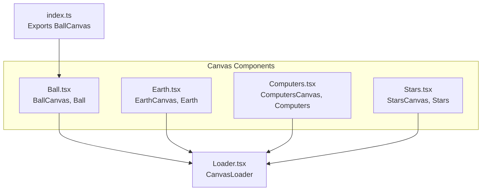
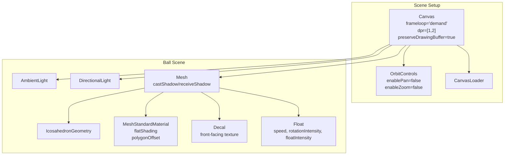
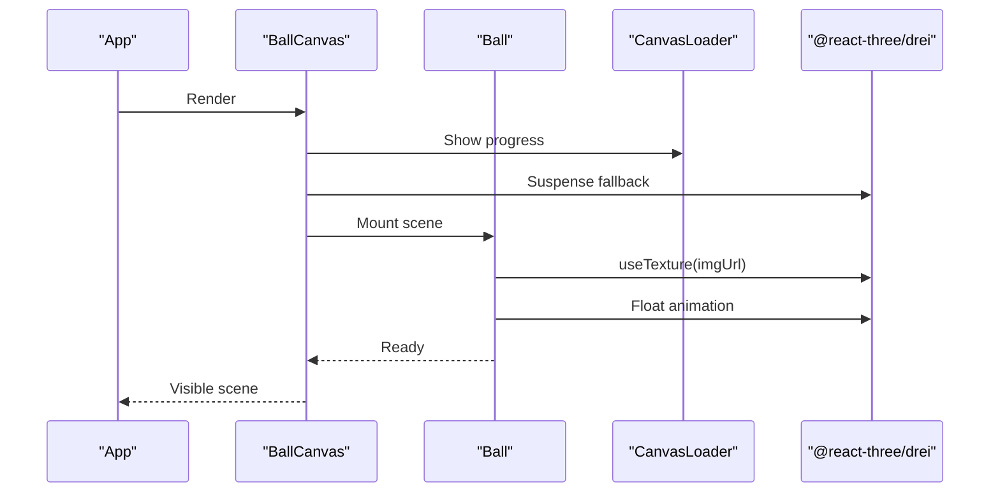
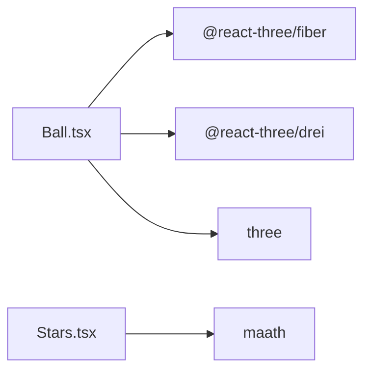

# Ball Physics Component

<cite>
**Referenced Files in This Document**
- [Ball.tsx](file://src/components/canvas/Ball.tsx)
- [index.ts](file://src/components/canvas/index.ts)
- [Loader.tsx](file://src/components/layout/Loader.tsx)
- [Stars.tsx](file://src/components/canvas/Stars.tsx)
- [Computers.tsx](file://src/components/canvas/Computers.tsx)
- [Earth.tsx](file://src/components/canvas/Earth.tsx)
- [package.json](file://package.json)
- [motion.ts](file://src/utils/motion.ts)
</cite>

## Table of Contents
1. [Introduction](#introduction)
2. [Project Structure](#project-structure)
3. [Core Components](#core-components)
4. [Architecture Overview](#architecture-overview)
5. [Detailed Component Analysis](#detailed-component-analysis)
6. [Dependency Analysis](#dependency-analysis)
7. [Performance Considerations](#performance-considerations)
8. [Troubleshooting Guide](#troubleshooting-guide)
9. [Conclusion](#conclusion)
10. [Appendices](#appendices)

## Introduction
This document explains the Ball physics component implementation in the 3D portfolio project. It focuses on how the component integrates with Three.js via @react-three/fiber and @react-three/drei, how it sets up lighting and geometry/materials, and how it achieves interactive and animated behavior. While the current implementation does not include explicit physics simulation (e.g., velocity, collisions, gravity), it demonstrates a practical pattern for building interactive 3D experiences with floating animation, decal textures, and responsive rendering. The guide also outlines how to extend the component to incorporate physics-based movement and collision detection.

## Project Structure
The Ball component resides under the canvas components and is exported via the canvas index for use across the application. It leverages shared loaders and related canvas scenes for consistent rendering behavior.



**Diagram sources**
- [Ball.tsx:1-58](file://src/components/canvas/Ball.tsx#L1-L58)
- [index.ts:1-6](file://src/components/canvas/index.ts#L1-L6)
- [Loader.tsx:1-23](file://src/components/layout/Loader.tsx#L1-L23)
- [Earth.tsx:1-46](file://src/components/canvas/Earth.tsx#L1-L46)
- [Computers.tsx:1-85](file://src/components/canvas/Computers.tsx#L1-L85)
- [Stars.tsx:1-52](file://src/components/canvas/Stars.tsx#L1-L52)

**Section sources**
- [Ball.tsx:1-58](file://src/components/canvas/Ball.tsx#L1-L58)
- [index.ts:1-6](file://src/components/canvas/index.ts#L1-L6)

## Core Components
- BallCanvas: The top-level canvas container that configures frame loop, device pixel ratio, and global GL settings. It suspends rendering until assets are ready and preloads resources.
- Ball: A mesh-based 3D ball composed of an icosahedron geometry and a standard material with a front-facing decal texture. It is wrapped in a floating animation effect for subtle motion.

Key rendering and interaction characteristics:
- Frame loop set to demand-driven updates for efficiency.
- Device pixel ratio optimized for quality vs. performance.
- Lighting includes ambient and directional light; shadows enabled on the mesh.
- Decal texture applied to the front face of the sphere for visual customization.
- Orbit controls disabled for pan and zoom to keep focus on the floating ball.

**Section sources**
- [Ball.tsx:41-58](file://src/components/canvas/Ball.tsx#L41-L58)
- [Ball.tsx:13-39](file://src/components/canvas/Ball.tsx#L13-L39)

## Architecture Overview
The Ball component participates in a broader 3D scene ecosystem. It shares common patterns with other canvas scenes (Earth, Computers, Stars) for consistent rendering and loading behavior.



**Diagram sources**
- [Ball.tsx:41-58](file://src/components/canvas/Ball.tsx#L41-L58)
- [Ball.tsx:13-39](file://src/components/canvas/Ball.tsx#L13-L39)

## Detailed Component Analysis

### Ball Component Internals
The Ball component composes a floating, lit, textured sphere with a front-facing decal. It uses:
- Geometry: IcosahedronGeometry with radius and detail parameters.
- Material: MeshStandardMaterial configured for flat shading and polygon offset to prevent rendering artifacts.
- Lighting: Ambient and directional light to enhance surface detail.
- Decal: A front-facing decal mapped from a provided image URL.
- Animation: Float effect for gentle rotation and vertical movement.

```mermaid
classDiagram
class BallCanvas {
+props : { icon : string }
+Canvas(frameloop, dpr, gl.preserveDrawingBuffer)
+OrbitControls(enablePan=false, enableZoom=false)
+Ball(imgUrl)
+CanvasLoader()
+Preload(all)
}
class Ball {
+props : { imgUrl : string }
+Float(speed, rotationIntensity, floatIntensity)
+ambientLight(intensity)
+directionalLight(position)
+mesh(castShadow, receiveShadow, scale)
+icosahedronGeometry(args)
+meshStandardMaterial(flatShading, polygonOffset)
+decal(map, position, rotation, scale, flatShading)
}
BallCanvas --> Ball : "renders"
Ball --> Float : "wraps mesh"
Ball --> Decal : "applies"
```

**Diagram sources**
- [Ball.tsx:41-58](file://src/components/canvas/Ball.tsx#L41-L58)
- [Ball.tsx:13-39](file://src/components/canvas/Ball.tsx#L13-L39)

**Section sources**
- [Ball.tsx:13-39](file://src/components/canvas/Ball.tsx#L13-L39)
- [Ball.tsx:41-58](file://src/components/canvas/Ball.tsx#L41-L58)

### Rendering Pipeline and Loading
- The component uses Suspense to defer rendering until textures and geometry are ready.
- A global loader displays progress during asset loading.
- Preload ensures all assets are fetched early to reduce runtime stalls.



**Diagram sources**
- [Ball.tsx:41-58](file://src/components/canvas/Ball.tsx#L41-L58)
- [Loader.tsx:1-23](file://src/components/layout/Loader.tsx#L1-L23)

**Section sources**
- [Ball.tsx:41-58](file://src/components/canvas/Ball.tsx#L41-L58)
- [Loader.tsx:1-23](file://src/components/layout/Loader.tsx#L1-L23)

### Interactive Behavior and User Input
- OrbitControls are configured to disable panning and zooming, keeping the focus on the floating ball.
- Camera settings are left to defaults, allowing the Float animation to remain the primary interaction cue.

Practical extension points:
- Enable panning/zooming selectively for user navigation.
- Add pointer-based interactions (e.g., raycasting) to respond to clicks or hover events.

**Section sources**
- [Ball.tsx:49](file://src/components/canvas/Ball.tsx#L49)

### Physics Simulation Setup (Conceptual)
The current implementation does not include explicit physics (velocity, acceleration, collisions). To add physics:
- Integrate a physics engine compatible with Three.js (e.g., Cannon.js, Oimo, or react-three/cannon).
- Replace static transforms with dynamic bodies and apply forces/gravity.
- Implement collision shapes matching the icosahedron geometry or simplified spheres.
- Add boundary constraints (walls, floor) and restitution/friction parameters.

Note: These steps describe how to extend the component; they are not implemented in the current codebase.

### Customizing Ball Properties
While the current component exposes a single prop for the decal image, customization can be expanded:
- Decal appearance: adjust position, rotation, scale, and map.
- Material properties: modify color, roughness, metalness, and shading mode.
- Floating animation: tune speed, rotationIntensity, and floatIntensity.
- Lighting: adjust ambient/directional light intensities and positions.

These customizations are visible in the component’s JSX structure and props.

**Section sources**
- [Ball.tsx:13-39](file://src/components/canvas/Ball.tsx#L13-L39)

### Integration with the 3D Scene
- Consistent canvas configuration across scenes (frameloop, dpr, preserveDrawingBuffer).
- Shared loader and preload patterns for predictable UX.
- Related scenes (Earth, Computers, Stars) demonstrate similar patterns for comparison.

**Section sources**
- [Earth.tsx:15-43](file://src/components/canvas/Earth.tsx#L15-L43)
- [Computers.tsx:32-82](file://src/components/canvas/Computers.tsx#L32-L82)
- [Stars.tsx:37-51](file://src/components/canvas/Stars.tsx#L37-L51)

## Dependency Analysis
External libraries and their roles:
- @react-three/fiber: React renderer for Three.js scenes.
- @react-three/drei: Helpers for textures, controls, loading, and GLTF assets.
- three: Core 3D library for geometries, materials, lights, and meshes.
- maath: Lightweight math utilities (used in Stars for procedural point clouds).



**Diagram sources**
- [Ball.tsx:1-9](file://src/components/canvas/Ball.tsx#L1-L9)
- [Stars.tsx:1-5](file://src/components/canvas/Stars.tsx#L1-L5)
- [package.json:13-24](file://package.json#L13-L24)

**Section sources**
- [package.json:13-24](file://package.json#L13-L24)

## Performance Considerations
- Demand-driven frame loop reduces unnecessary renders when nothing moves.
- Device pixel ratio capped to [1, 2] balances visual fidelity and performance.
- Shadows are not enabled on the Ball mesh to minimize GPU overhead; enable only when necessary.
- Preloading assets avoids runtime stalls and improves perceived performance.
- Floating animation is lightweight; avoid heavy per-frame computations.

Recommendations:
- Keep geometry detail low for the icosahedron (already minimal).
- Use texture atlases for multiple decals to reduce draw calls.
- Consider disabling shadows for non-critical objects.

**Section sources**
- [Ball.tsx:43-46](file://src/components/canvas/Ball.tsx#L43-L46)
- [Ball.tsx:20-27](file://src/components/canvas/Ball.tsx#L20-L27)

## Troubleshooting Guide
Common issues and resolutions:
- Blank screen while loading: Verify the decal image URL and ensure Suspense fallback is visible.
- Poor performance on low-end devices: Reduce dpr range, disable shadows, simplify geometry.
- Texture not appearing: Confirm the image path and that useTexture resolves correctly.
- Unexpected lighting: Adjust ambient/directional light intensities and positions.

Related utilities:
- CanvasLoader provides progress feedback during asset loading.
- Preload ensures assets are fetched early.

**Section sources**
- [Loader.tsx:1-23](file://src/components/layout/Loader.tsx#L1-L23)
- [Ball.tsx:47-53](file://src/components/canvas/Ball.tsx#L47-L53)

## Conclusion
The Ball component establishes a clean foundation for interactive 3D experiences using Three.js and React Three Fiber. It demonstrates proper resource loading, responsive rendering, and subtle animation. While physics simulation is not currently implemented, the component’s structure supports easy extension with dynamic bodies, collisions, and boundary constraints. By following the patterns shown here, developers can build robust, performant, and visually appealing 3D interactions.

## Appendices

### How to Extend the Component with Physics
- Add a physics world and body for the ball.
- Apply gravity and forces; compute velocity/position each frame.
- Detect collisions with planes/walls and bounce with restitution.
- Tune mass, friction, and elasticity for desired behavior.

### Related Scenes for Reference
- Earth and Computers scenes illustrate consistent canvas configuration and control setups.
- Stars scene shows procedural generation and frame-based rotation patterns.

**Section sources**
- [Earth.tsx:15-43](file://src/components/canvas/Earth.tsx#L15-L43)
- [Computers.tsx:32-82](file://src/components/canvas/Computers.tsx#L32-L82)
- [Stars.tsx:37-51](file://src/components/canvas/Stars.tsx#L37-L51)