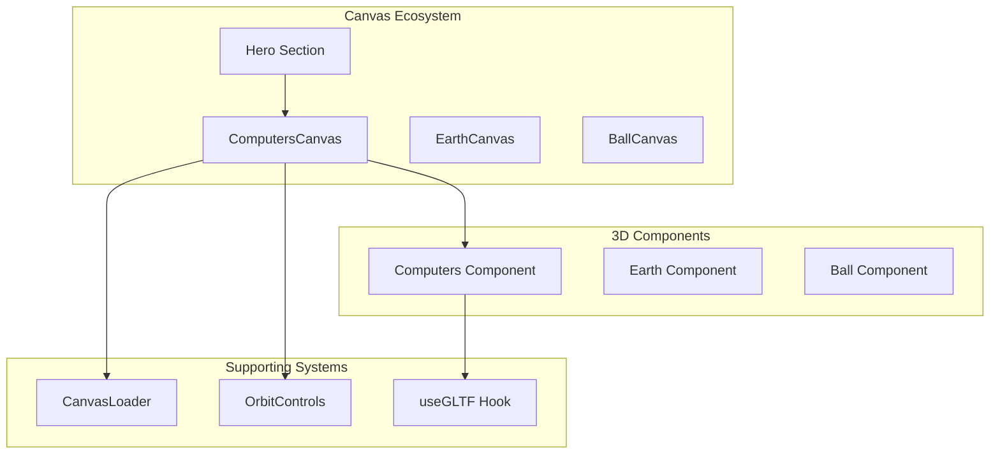
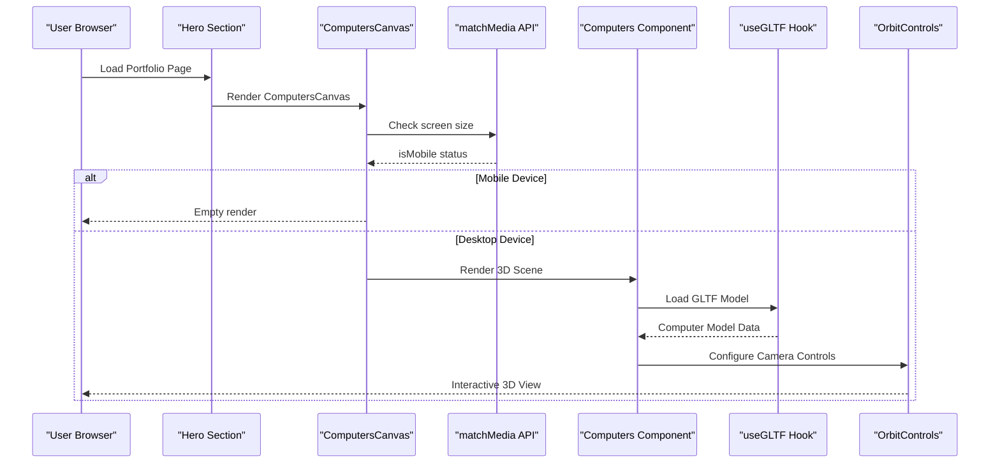
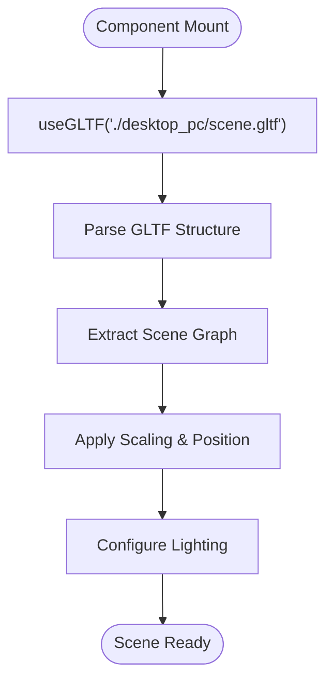
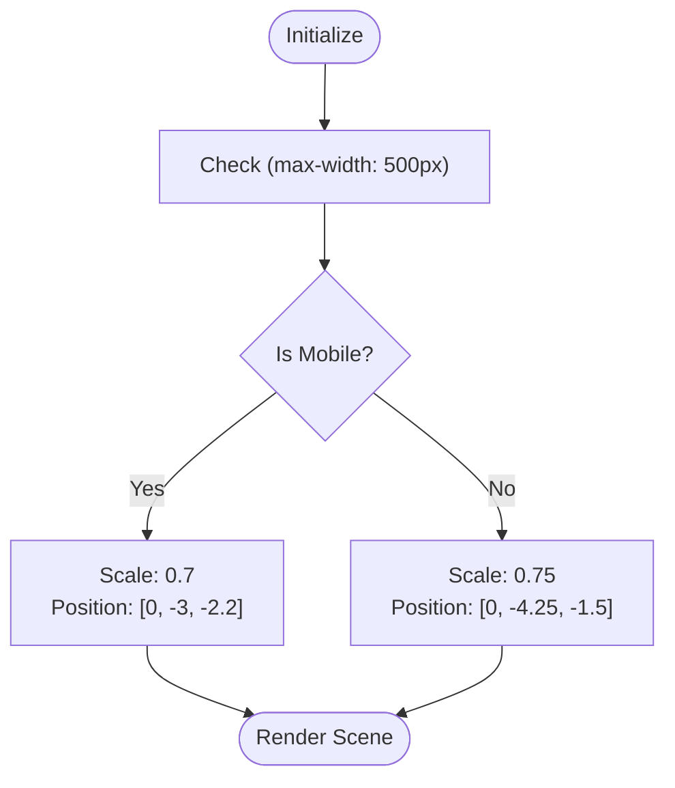
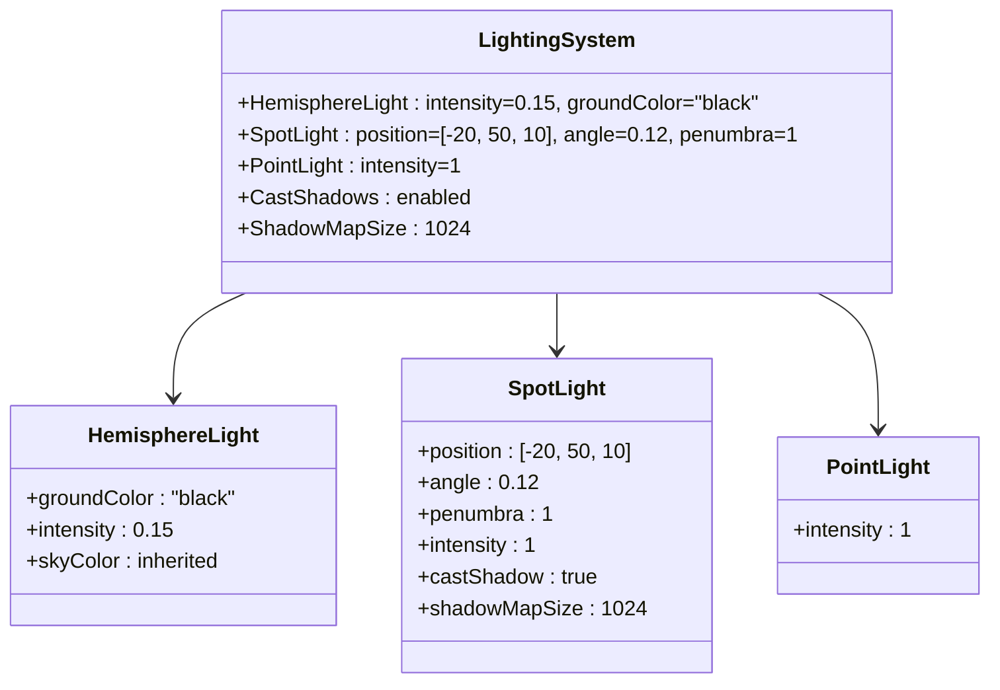
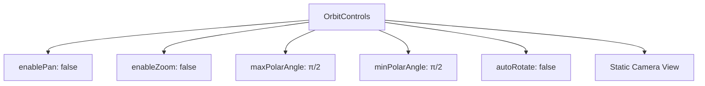
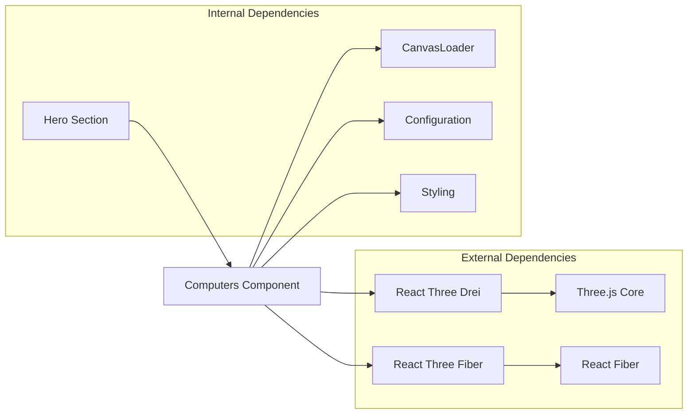

# Computers 3D Component

<cite>
**Referenced Files in This Document**
- [Computers.tsx](file://src/components/canvas/Computers.tsx)
- [Loader.tsx](file://src/components/layout/Loader.tsx)
- [Hero.tsx](file://src/components/sections/Hero.tsx)
- [index.ts](file://src/components/canvas/index.ts)
- [globals.css](file://src/globals.css)
- [config.ts](file://src/constants/config.ts)
- [styles.ts](file://src/constants/styles.ts)
</cite>

## Table of Contents
1. [Introduction](#introduction)
2. [Project Structure](#project-structure)
3. [Core Components](#core-components)
4. [Architecture Overview](#architecture-overview)
5. [Detailed Component Analysis](#detailed-component-analysis)
6. [Dependency Analysis](#dependency-analysis)
7. [Performance Considerations](#performance-considerations)
8. [Troubleshooting Guide](#troubleshooting-guide)
9. [Conclusion](#conclusion)

## Introduction
The Computers 3D component is a specialized Three.js canvas implementation that renders a desktop computer model with responsive behavior and optimized performance. This component demonstrates advanced techniques in 3D rendering including GLTF model loading, responsive scaling, sophisticated lighting setups, and performance optimizations tailored for portfolio websites.

The implementation showcases modern React Three Fiber patterns with hooks for GLTF loading, dynamic responsive behavior using matchMedia API, and comprehensive performance optimizations including demand-driven frame loops and shadow configurations.

## Project Structure
The Computers component is part of a larger canvas ecosystem within the portfolio application, positioned alongside other 3D scenes like Earth and Balls.



**Diagram sources**
- [Computers.tsx:1-85](file://src/components/canvas/Computers.tsx#L1-L85)
- [Hero.tsx:29](file://src/components/sections/Hero.tsx#L29)

**Section sources**
- [Computers.tsx:1-85](file://src/components/canvas/Computers.tsx#L1-L85)
- [index.ts:1-7](file://src/components/canvas/index.ts#L1-L7)

## Core Components

### ComputersCanvas Container
The main container component manages responsive behavior and canvas lifecycle. It implements a sophisticated mobile detection system using the matchMedia API and conditionally renders the 3D scene based on screen size.

Key features:
- Mobile detection with matchMedia "(max-width: 500px)"
- Conditional rendering that hides the 3D scene on mobile devices
- Performance-optimized canvas configuration with demand-driven frame loop
- Shadow support and high-DPR rendering for crisp visuals

### Computers Model Renderer
The core rendering component handles GLTF model loading and presentation with adaptive scaling and positioning for different screen sizes.

Responsive scaling parameters:
- Mobile: Scale factor 0.7, Position [0, -3, -2.2]
- Desktop: Scale factor 0.75, Position [0, -4.25, -1.5]
- Fixed rotation: [-0.01, -0.2, -0.1]

**Section sources**
- [Computers.tsx:7-30](file://src/components/canvas/Computers.tsx#L7-L30)
- [Computers.tsx:32-82](file://src/components/canvas/Computers.tsx#L32-L82)

## Architecture Overview



**Diagram sources**
- [Computers.tsx:32-82](file://src/components/canvas/Computers.tsx#L32-L82)
- [Hero.tsx:29](file://src/components/sections/Hero.tsx#L29)

## Detailed Component Analysis

### GLTF Model Loading Implementation
The component utilizes the `useGLTF` hook from @react-three/drei to efficiently load and manage the desktop computer model. The GLTF file is loaded from the public directory and processed through Three.js's built-in loader system.



**Diagram sources**
- [Computers.tsx:8](file://src/components/canvas/Computers.tsx#L8)
- [Computers.tsx:22-27](file://src/components/canvas/Computers.tsx#L22-L27)

### Responsive Scaling System
The component implements a dual-scale system using the matchMedia API for device detection:



**Diagram sources**
- [Computers.tsx:35-54](file://src/components/canvas/Computers.tsx#L35-L54)
- [Computers.tsx:24-26](file://src/components/canvas/Computers.tsx#L24-L26)

### Lighting Configuration
The component employs a three-light lighting setup optimized for showcasing the desktop computer model:



**Diagram sources**
- [Computers.tsx:12-21](file://src/components/canvas/Computers.tsx#L12-L21)

### OrbitControls Configuration
The camera controls are configured to provide an optimal viewing experience while preventing unwanted user interactions:



**Diagram sources**
- [Computers.tsx:69-74](file://src/components/canvas/Computers.tsx#L69-L74)

### Performance Optimizations
The component implements several performance optimization strategies:

```mermaid
classDiagram
class PerformanceOptimizations {
+frameloop : "demand"
+shadows : true
+dpr : [1, 2]
+preserveDrawingBuffer : true
+camera : {position : [20, 3, 5], fov : 25}
}
class DemandLoop {
+Only renders when needed
+Reduces CPU/GPU usage
+Improves battery life
}
class ShadowQuality {
+High-quality shadows
+Realistic lighting effects
+Performance trade-offs
}
class DPRSettings {
+Min : 1 (mobile)
+Max : 2 (desktop)
+Adaptive quality
}
PerformanceOptimizations --> DemandLoop
PerformanceOptimizations --> ShadowQuality
PerformanceOptimizations --> DPRSettings
```

**Diagram sources**
- [Computers.tsx:61-66](file://src/components/canvas/Computers.tsx#L61-L66)

**Section sources**
- [Computers.tsx:1-85](file://src/components/canvas/Computers.tsx#L1-L85)

## Dependency Analysis



**Diagram sources**
- [Computers.tsx:1-5](file://src/components/canvas/Computers.tsx#L1-L5)
- [Hero.tsx:4](file://src/components/sections/Hero.tsx#L4)

**Section sources**
- [Computers.tsx:1-85](file://src/components/canvas/Computers.tsx#L1-L85)
- [index.ts:1-7](file://src/components/canvas/index.ts#L1-L7)

## Performance Considerations

### Frame Loop Optimization
The component uses `frameloop="demand"` which significantly reduces computational overhead by only rendering frames when changes occur. This is particularly beneficial for portfolio websites where static 3D scenes don't require continuous animation updates.

### Shadow Configuration
Shadows are enabled with a balanced shadow map size of 1024, providing realistic lighting effects while maintaining acceptable performance. The shadow quality can be adjusted based on target hardware capabilities.

### Dynamic Pixel Ratio
The DPR (Device Pixel Ratio) setting of [1, 2] ensures optimal visual quality across different display densities while preventing excessive memory usage on lower-powered devices.

### Mobile Responsiveness
The matchMedia-based responsive system prevents unnecessary resource consumption on mobile devices by conditionally rendering the 3D scene only when appropriate.

## Troubleshooting Guide

### Common Issues and Solutions

**Model Not Loading**
- Verify GLTF file path exists in public directory
- Check browser console for 404 errors
- Ensure proper MIME type configuration

**Performance Issues**
- Monitor frame rate using browser dev tools
- Consider reducing shadow quality for mobile devices
- Adjust DPR settings based on device capabilities

**Responsive Behavior Problems**
- Test breakpoint at 500px threshold
- Verify matchMedia API support in target browsers
- Check CSS media query conflicts

**Lighting Artifacts**
- Adjust hemisphere light intensity for ambient lighting
- Modify spot light position for better model highlighting
- Fine-tune point light placement for depth perception

**Section sources**
- [Computers.tsx:35-54](file://src/components/canvas/Computers.tsx#L35-L54)
- [Loader.tsx:1-24](file://src/components/layout/Loader.tsx#L1-L24)

## Conclusion

The Computers 3D component represents a sophisticated implementation of modern 3D web development practices. It successfully balances visual appeal with performance optimization through strategic use of React Three Fiber, responsive design patterns, and performance-conscious configuration choices.

The component serves as an excellent foundation for portfolio websites requiring interactive 3D elements, demonstrating best practices in GLTF loading, responsive scaling, lighting setup, and performance optimization. Its modular design allows for easy customization and extension while maintaining optimal user experience across different devices and screen sizes.

The implementation showcases how modern web technologies can be combined to create engaging, performant 3D experiences that enhance rather than hinder the overall user experience of portfolio websites.