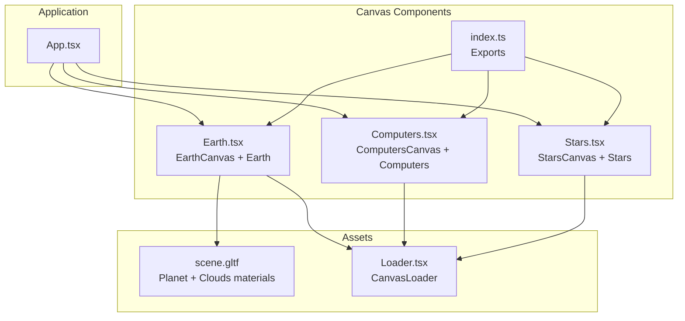
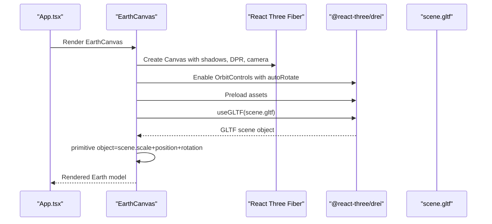
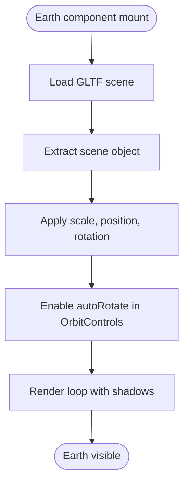
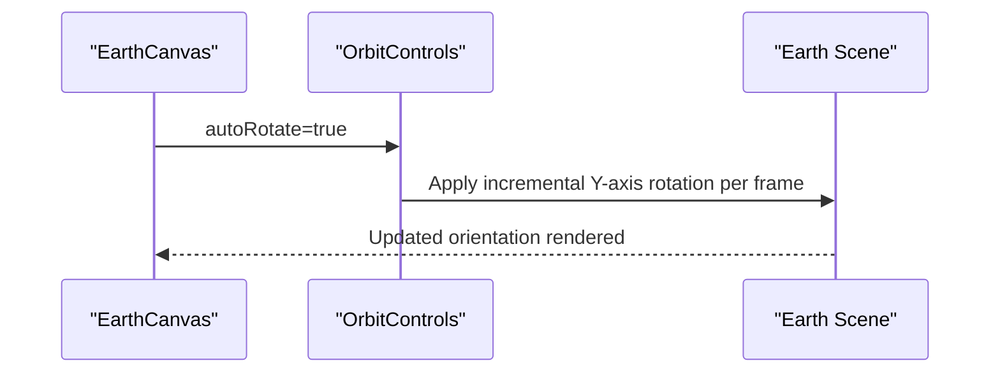
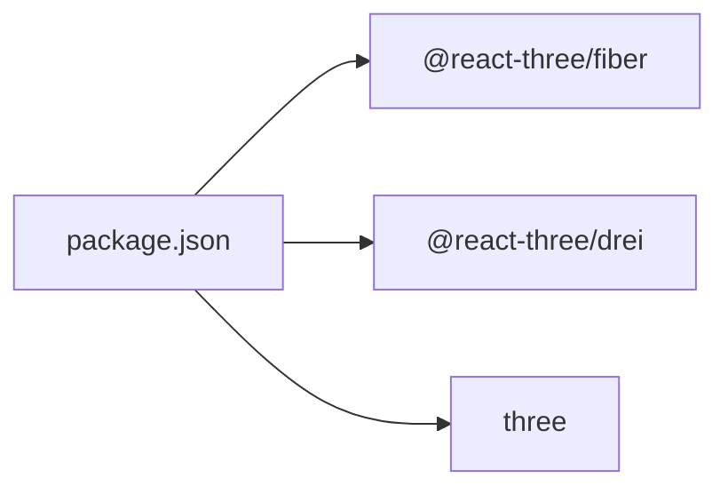

# Earth 3D Component

<cite>
**Referenced Files in This Document**
- [Earth.tsx](file://src/components/canvas/Earth.tsx)
- [index.ts](file://src/components/canvas/index.ts)
- [Loader.tsx](file://src/components/layout/Loader.tsx)
- [scene.gltf](file://public/planet/scene.gltf)
- [App.tsx](file://src/App.tsx)
- [Computers.tsx](file://src/components/canvas/Computers.tsx)
- [Stars.tsx](file://src/components/canvas/Stars.tsx)
- [package.json](file://package.json)
</cite>

## Table of Contents
1. [Introduction](#introduction)
2. [Project Structure](#project-structure)
3. [Core Components](#core-components)
4. [Architecture Overview](#architecture-overview)
5. [Detailed Component Analysis](#detailed-component-analysis)
6. [Dependency Analysis](#dependency-analysis)
7. [Performance Considerations](#performance-considerations)
8. [Troubleshooting Guide](#troubleshooting-guide)
9. [Conclusion](#conclusion)

## Introduction
This document explains the Earth 3D component implementation in a React application powered by Three.js via @react-three/fiber and @react-three/drei. It covers how the Earth model is loaded from a GLTF asset, how Three.js materials and textures are applied, how the scene is configured for realistic rendering, and how the component integrates with other canvas-based components in the application. It also provides guidance on customization, performance tuning, and troubleshooting.

## Project Structure
The Earth component is part of a set of canvas-based interactive scenes. The main files involved are:
- Earth rendering and canvas configuration
- Scene asset metadata (GLTF materials and meshes)
- Loader component for resource preloading feedback
- Export index for canvas components
- Application integration points

**Diagram sources**
- [App.tsx:19-48](file://src/App.tsx#L19-L48)
- [Earth.tsx:7-43](file://src/components/canvas/Earth.tsx#L7-L43)
- [Computers.tsx:7-82](file://src/components/canvas/Computers.tsx#L7-L82)
- [Stars.tsx:8-49](file://src/components/canvas/Stars.tsx#L8-L49)
- [index.ts:1-6](file://src/components/canvas/index.ts#L1-L6)

**Section sources**
- [Earth.tsx:1-46](file://src/components/canvas/Earth.tsx#L1-L46)
- [index.ts:1-7](file://src/components/canvas/index.ts#L1-L7)
- [App.tsx:19-48](file://src/App.tsx#L19-L48)

## Core Components
- EarthCanvas: Sets up the Three.js canvas with shadow support, dynamic pixel ratio, camera configuration, and orbit controls with auto-rotation.
- Earth: Loads the GLTF scene and applies scaling and positioning to render the planet model.
- CanvasLoader: Provides a loading indicator during asset preloading.
- scene.gltf: Contains the GLTF model with two materials (Planet and Clouds), textures, and nodes.

Key capabilities:
- Realistic material rendering via KHR materials extensions and emissive textures.
- Automatic rotation for continuous animation.
- Responsive rendering with dynamic pixel ratio.
- Shadow casting enabled for lighting realism.

**Section sources**
- [Earth.tsx:7-43](file://src/components/canvas/Earth.tsx#L7-L43)
- [Loader.tsx:3-21](file://src/components/layout/Loader.tsx#L3-L21)
- [scene.gltf:351-398](file://public/planet/scene.gltf#L351-L398)

## Architecture Overview
The Earth component participates in a layered canvas architecture. It shares the same canvas configuration patterns as other canvas components (Computers, Stars) while maintaining its own lighting and material characteristics.

**Diagram sources**
- [App.tsx:19-48](file://src/App.tsx#L19-L48)
- [Earth.tsx:15-43](file://src/components/canvas/Earth.tsx#L15-L43)
- [scene.gltf:400-430](file://public/planet/scene.gltf#L400-L430)

## Detailed Component Analysis

### Earth Rendering Pipeline
The Earth component loads a GLTF scene and renders it with automatic rotation. The GLTF defines:
- Planet material with base color texture and emissive properties.
- Clouds material with base color texture and unlit extension.
- Mesh primitives with position, normal, and UV attributes.
- Nodes organizing the scene hierarchy.

**Diagram sources**
- [Earth.tsx:7-13](file://src/components/canvas/Earth.tsx#L7-L13)
- [Earth.tsx:30-36](file://src/components/canvas/Earth.tsx#L30-L36)
- [scene.gltf:400-430](file://public/planet/scene.gltf#L400-L430)

**Section sources**
- [Earth.tsx:7-13](file://src/components/canvas/Earth.tsx#L7-L13)
- [scene.gltf:351-398](file://public/planet/scene.gltf#L351-L398)

### Texture Mapping and Materials
The GLTF materials define how textures are mapped onto the sphere:
- Planet material uses a base color texture and an emissive texture, with metallic factor set to zero.
- Clouds material uses a base color texture and an emissive texture, marked double-sided and using an unlit extension.
- Sampler settings indicate wrapping and filtering modes for texture sampling.

These materials are applied to mesh primitives with appropriate vertex attributes (position, normal, UV coordinates).

**Section sources**
- [scene.gltf:351-398](file://public/planet/scene.gltf#L351-L398)
- [scene.gltf:400-430](file://public/planet/scene.gltf#L400-L430)

### Spherical Geometry Creation
The GLTF file defines mesh primitives with position and normal attributes and indices. While the GLTF does not explicitly specify a parametric sphere geometry, the vertex data and normals imply a spherical topology suitable for a 3D globe. The Planet and Clouds meshes are organized under separate nodes, enabling independent material application and potential animation.

**Section sources**
- [scene.gltf:1-200](file://public/planet/scene.gltf#L1-L200)
- [scene.gltf:400-430](file://public/planet/scene.gltf#L400-L430)

### Lighting Setup for Realistic Appearance
The current Earth component relies on the GLTF materials' emissive properties and the default lighting environment. To enhance realism, consider adding:
- Hemisphere light for ambient illumination.
- Directional light (sun) with shadows enabled.
- Optional point lights for local highlights.

These additions would align with the lighting patterns used in other canvas components (e.g., Computers component demonstrates spot and hemisphere lighting).

**Section sources**
- [Computers.tsx:11-21](file://src/components/canvas/Computers.tsx#L11-L21)

### Rotation Animation Implementation
Rotation is handled automatically by enabling autoRotate in OrbitControls. This provides a smooth, continuous spin around the vertical axis without manual frame updates. The rotation speed can be tuned by adjusting the autoRotate speed property.

**Diagram sources**
- [Earth.tsx:30-36](file://src/components/canvas/Earth.tsx#L30-L36)

**Section sources**
- [Earth.tsx:30-36](file://src/components/canvas/Earth.tsx#L30-L36)

### Responsive Sizing and Shadow Casting
- Responsive sizing: Dynamic pixel ratio (DPR) is configured to balance quality and performance across devices.
- Shadow casting: Shadows are enabled in the canvas configuration, supporting realistic lighting interactions.

**Section sources**
- [Earth.tsx:17-21](file://src/components/canvas/Earth.tsx#L17-L21)

### Integration with Other Canvas Components
The Earth component follows the same canvas pattern as other components:
- Shared canvas configuration (shadows, DPR, camera).
- Consistent use of Suspense and Preload for asset loading.
- Similar export structure via the canvas index.

Integration points:
- App.tsx composes multiple canvas scenes.
- Loader component provides unified loading feedback.

**Section sources**
- [index.ts:1-6](file://src/components/canvas/index.ts#L1-L6)
- [App.tsx:19-48](file://src/App.tsx#L19-L48)

## Dependency Analysis
External libraries and their roles:
- @react-three/fiber: React renderer for Three.js scenes.
- @react-three/drei: Helpers for GLTF loading, controls, and preloading.
- three: Core 3D library for geometries, materials, and rendering.

**Diagram sources**
- [package.json:13-24](file://package.json#L13-L24)

**Section sources**
- [package.json:13-24](file://package.json#L13-L24)

## Performance Considerations
- Frame loop: demand mode reduces unnecessary frames when nothing moves, ideal for static or slowly animated scenes.
- Dynamic pixel ratio: DPR range balances visual fidelity and GPU load.
- Asset preloading: Ensures smooth rendering after initial load.
- Material simplicity: Unlit materials reduce shader overhead while maintaining visual quality.
- Shadow configuration: Enable shadows judiciously to avoid heavy shadow map computations.

[No sources needed since this section provides general guidance]

## Troubleshooting Guide
Common issues and resolutions:
- Blank or missing model: Verify the GLTF path and ensure textures are bundled. Confirm Preload completes before rendering.
- Excessive CPU/GPU usage: Reduce DPR range or switch to fixed frame rate if needed.
- Poor lighting or flat appearance: Add ambient and directional lights to complement emissive materials.
- Loading spinner stuck: Check network requests for the GLTF and textures; confirm CORS and asset paths.

**Section sources**
- [Earth.tsx:29-40](file://src/components/canvas/Earth.tsx#L29-L40)
- [Loader.tsx:3-21](file://src/components/layout/Loader.tsx#L3-L21)

## Conclusion
The Earth 3D component leverages a GLTF asset with carefully configured materials and textures to deliver a visually appealing globe. Its integration with @react-three/fiber and @react-three/drei simplifies scene setup, lighting, and controls. By following the established patterns in the canvas module and applying optional lighting enhancements, developers can customize the Earth component’s appearance, adjust rotation behavior, and maintain smooth performance across devices.