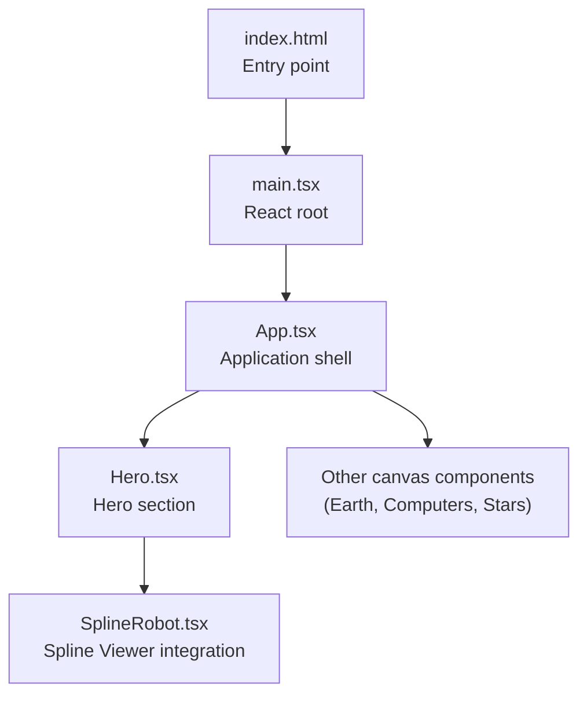
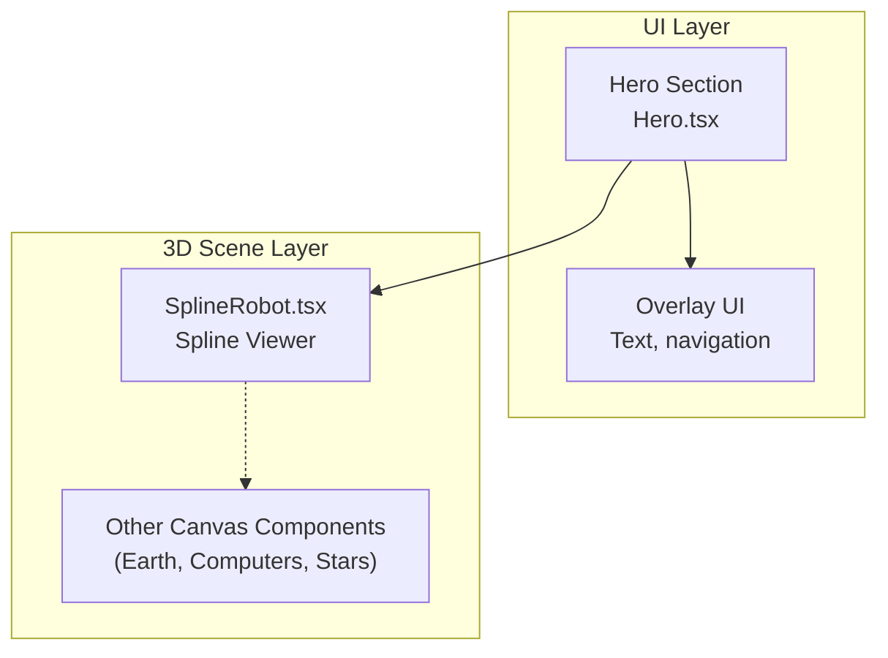
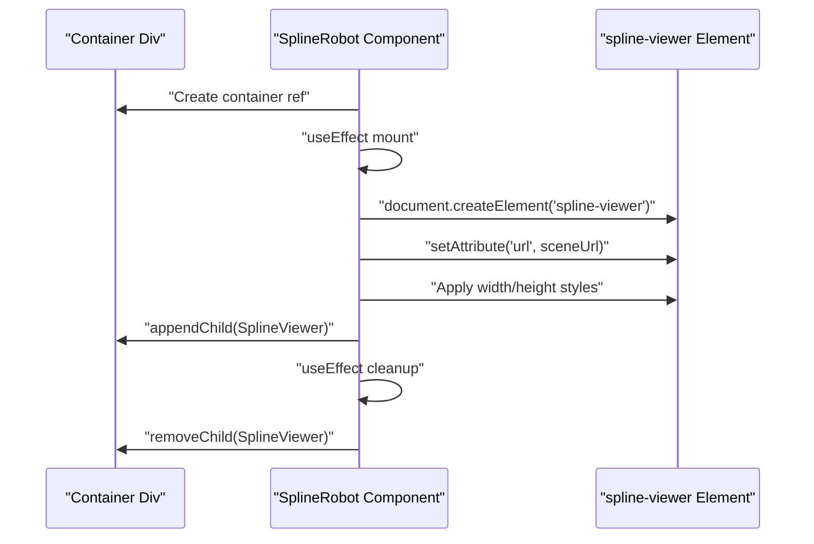
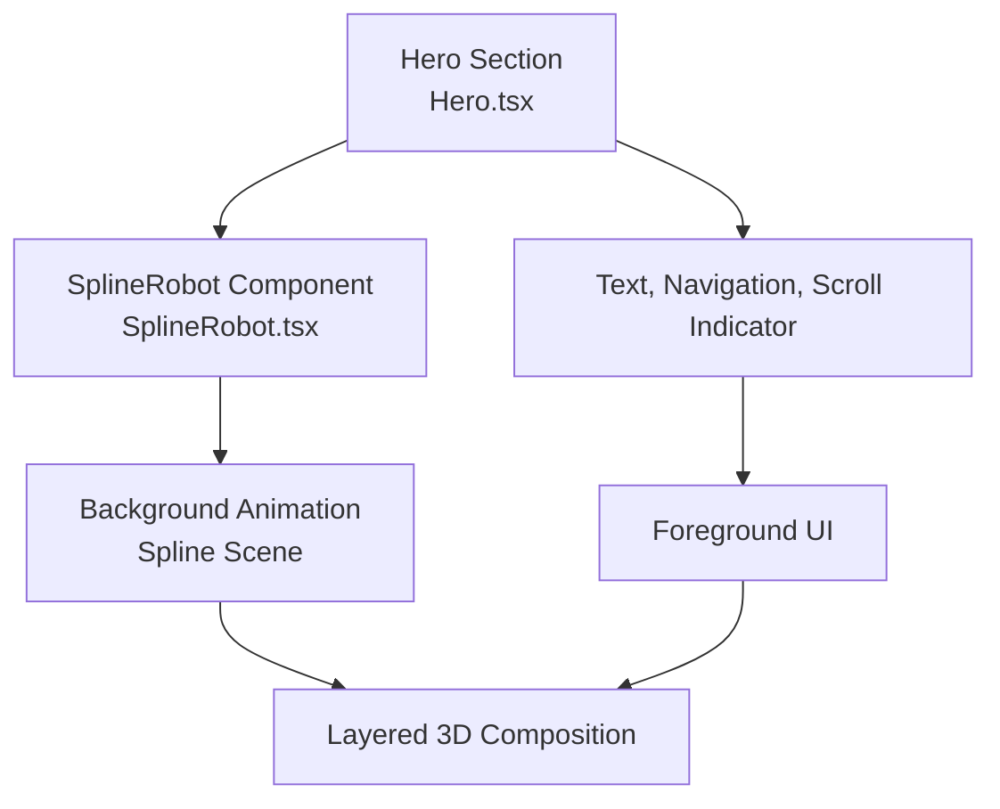
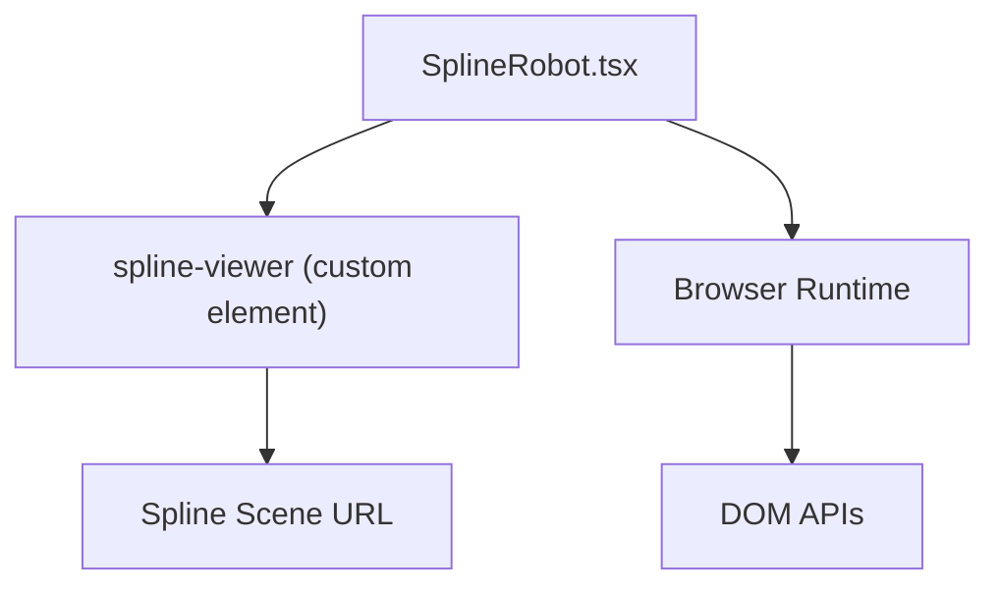

# Spline Robot Component

<cite>
**Referenced Files in This Document**
- [SplineRobot.tsx](file://src/components/canvas/SplineRobot.tsx)
- [index.html](file://index.html)
- [package.json](file://package.json)
- [Hero.tsx](file://src/components/sections/Hero.tsx)
- [App.tsx](file://src/App.tsx)
- [motion.ts](file://src/utils/motion.ts)
- [config.ts](file://src/constants/config.ts)
- [main.tsx](file://src/main.tsx)
</cite>

## Table of Contents
1. [Introduction](#introduction)
2. [Project Structure](#project-structure)
3. [Core Components](#core-components)
4. [Architecture Overview](#architecture-overview)
5. [Detailed Component Analysis](#detailed-component-analysis)
6. [Dependency Analysis](#dependency-analysis)
7. [Performance Considerations](#performance-considerations)
8. [Troubleshooting Guide](#troubleshooting-guide)
9. [Conclusion](#conclusion)

## Introduction
This document explains the Spline Robot 3D component implementation in a portfolio website. The component integrates a Spline-designed animated scene into the page using the official Spline Viewer web component. It enables procedural movement along predefined paths through the Spline editor, while contributing to dynamic visual storytelling within the overall 3D scene composition alongside other canvas-based elements.

## Project Structure
The Spline Robot component is part of a modular canvas system that includes multiple 3D scenes and animations. The SplineRobot component specifically embeds a Spline scene via a custom HTML element, complementing other canvas-based sections such as the hero area and starry background.

**Diagram sources**
- [index.html:1-14](file://index.html#L1-L14)
- [main.tsx:1-12](file://src/main.tsx#L1-L12)
- [App.tsx:1-51](file://src/App.tsx#L1-L51)
- [Hero.tsx:1-53](file://src/components/sections/Hero.tsx#L1-L53)
- [SplineRobot.tsx:1-36](file://src/components/canvas/SplineRobot.tsx#L1-L36)

**Section sources**
- [index.html:1-14](file://index.html#L1-L14)
- [main.tsx:1-12](file://src/main.tsx#L1-L12)
- [App.tsx:1-51](file://src/App.tsx#L1-L51)
- [Hero.tsx:1-53](file://src/components/sections/Hero.tsx#L1-L53)
- [SplineRobot.tsx:1-36](file://src/components/canvas/SplineRobot.tsx#L1-L36)

## Core Components
- SplineRobot: A React component that dynamically creates and mounts a Spline Viewer element to render a Spline scene. It manages lifecycle cleanup to remove the element when the component unmounts.
- Spline Scene: Hosted externally and referenced by URL, containing pre-authored animations and procedural movements along splines.
- Integration Points: The component is embedded within the hero section and positioned absolutely to cover the viewport, enabling layered composition with other canvas elements.

Key implementation characteristics:
- Uses a DOM element creation pattern to attach the Spline Viewer to a container div.
- Applies full-viewport sizing to the viewer element.
- Cleans up the viewer element on component unmount to prevent memory leaks.

**Section sources**
- [SplineRobot.tsx:1-36](file://src/components/canvas/SplineRobot.tsx#L1-L36)

## Architecture Overview
The Spline Robot component participates in a layered 3D scene architecture. It is positioned behind other UI elements and can be combined with other canvas-based components to create immersive storytelling.

**Diagram sources**
- [Hero.tsx:1-53](file://src/components/sections/Hero.tsx#L1-L53)
- [SplineRobot.tsx:1-36](file://src/components/canvas/SplineRobot.tsx#L1-L36)

## Detailed Component Analysis

### SplineRobot Component
The SplineRobot component encapsulates the integration with the Spline Viewer web component. It:
- Creates a custom element named "spline-viewer".
- Sets the scene URL attribute to load the hosted Spline scene.
- Applies full-width and full-height styles to fill the container.
- Appends the element to a managed container div.
- Removes the element during cleanup to avoid orphan nodes.

**Diagram sources**
- [SplineRobot.tsx:6-24](file://src/components/canvas/SplineRobot.tsx#L6-L24)

Implementation highlights:
- Absolute positioning and full-viewport sizing ensure the Spline scene acts as a background layer.
- The component relies on the browser's custom element support and the Spline Viewer script availability.
- Cleanup prevents residual DOM nodes after unmounting.

Customization hooks:
- Scene URL: Change the URL attribute to load a different Spline scene.
- Container sizing: Adjust container styles to control the viewport coverage.
- Lifecycle: Extend cleanup logic if additional teardown is required.

**Section sources**
- [SplineRobot.tsx:1-36](file://src/components/canvas/SplineRobot.tsx#L1-L36)

### Integration with the Hero Section
The SplineRobot component is embedded within the Hero section, enabling the Spline scene to serve as a dynamic backdrop. The Hero section coordinates layout and animation with other UI elements, while the Spline scene provides continuous, self-contained motion.

**Diagram sources**
- [Hero.tsx:7-49](file://src/components/sections/Hero.tsx#L7-L49)
- [SplineRobot.tsx:26-32](file://src/components/canvas/SplineRobot.tsx#L26-L32)

**Section sources**
- [Hero.tsx:1-53](file://src/components/sections/Hero.tsx#L1-L53)
- [SplineRobot.tsx:1-36](file://src/components/canvas/SplineRobot.tsx#L1-L36)

### Procedural Movement Along Splines
The Spline scene defines procedural movement along predefined paths. These animations are authored in the Spline editor and executed by the Spline Viewer runtime. The component itself does not implement the spline math; it delegates animation playback to the external scene.

Guidance:
- Modify the scene URL to point to a Spline project with desired spline paths and robot/vehicle animations.
- Use the Spline editor timeline and path tools to define waypoints, tangents, and timing.
- Control pacing by adjusting keyframe spacing and interpolation modes in the Spline editor.

Note: The current implementation loads a fixed scene URL. To customize paths, update the URL attribute to reference a different Spline scene.

**Section sources**
- [SplineRobot.tsx:10-18](file://src/components/canvas/SplineRobot.tsx#L10-L18)

### Visual Styling and Material Properties
The Spline Viewer renders materials and lighting as defined in the Spline scene. The component applies full-viewport sizing to ensure the rendered scene fills the designated area. There are no explicit material overrides in the component code; styling is handled by the Spline scene itself.

Customization approaches:
- Adjust the Spline scene materials and lighting to match the site theme.
- Use the Spline editor to fine-tune material properties, shadows, and post-processing effects.
- Control visibility and blending by setting the container's z-index and background properties.

**Section sources**
- [SplineRobot.tsx:16-17](file://src/components/canvas/SplineRobot.tsx#L16-L17)

### Interactive Controls and Timing-Based Animations
The Spline Viewer executes animations independently. The component does not introduce additional interactive controls; however, the broader application uses Framer Motion for UI-level animations and transitions. These can be coordinated with the Spline scene to create cohesive storytelling.

Examples of complementary animations:
- Text fade-ins and slide-ins using Framer Motion variants.
- Scroll-triggered reveals synchronized with the Spline scene's pacing.

**Section sources**
- [motion.ts:1-92](file://src/utils/motion.ts#L1-L92)
- [Hero.tsx:32-47](file://src/components/sections/Hero.tsx#L32-L47)

## Dependency Analysis
The Spline Robot component depends on:
- Browser custom element support for the "spline-viewer" element.
- The Spline Viewer script being available in the hosting environment.
- The referenced Spline scene URL being publicly accessible.

External dependencies:
- The project includes @react-three/fiber and @react-three/drei, but the Spline component does not rely on these libraries. The Spline Viewer operates outside the Three.js pipeline.

**Diagram sources**
- [SplineRobot.tsx:10-18](file://src/components/canvas/SplineRobot.tsx#L10-L18)
- [package.json:13-24](file://package.json#L13-L24)

**Section sources**
- [SplineRobot.tsx:10-18](file://src/components/canvas/SplineRobot.tsx#L10-L18)
- [package.json:13-24](file://package.json#L13-L24)

## Performance Considerations
- Scene loading: The Spline Viewer handles resource loading; ensure the scene URL resolves quickly to minimize perceived load time.
- Viewport sizing: Full-viewport rendering can be GPU-intensive; monitor frame rates on lower-end devices.
- Layering: Position the Spline scene behind foreground UI to reduce unnecessary redraws.
- Cleanup: The component removes the viewer element on unmount, preventing memory accumulation.

[No sources needed since this section provides general guidance]

## Troubleshooting Guide
Common issues and resolutions:
- Scene not visible:
  - Verify the Spline scene URL is accessible and the viewer element is appended to the DOM.
  - Confirm the container has non-zero dimensions and is not hidden by CSS.
- Script errors:
  - Ensure the Spline Viewer script is available in the hosting environment.
  - Check browser console for errors related to custom elements or network requests.
- Cleanup artifacts:
  - Confirm the component's cleanup runs by checking for removal of the "spline-viewer" element on unmount.

**Section sources**
- [SplineRobot.tsx:6-24](file://src/components/canvas/SplineRobot.tsx#L6-L24)

## Conclusion
The Spline Robot component provides a streamlined integration of a Spline-authored 3D scene into the portfolio. By embedding the Spline Viewer and managing its lifecycle, it enables procedural movement along predefined paths and contributes to dynamic visual storytelling. Customization focuses on selecting and modifying the Spline scene, while complementary UI animations enhance the overall narrative flow.

[No sources needed since this section summarizes without analyzing specific files]