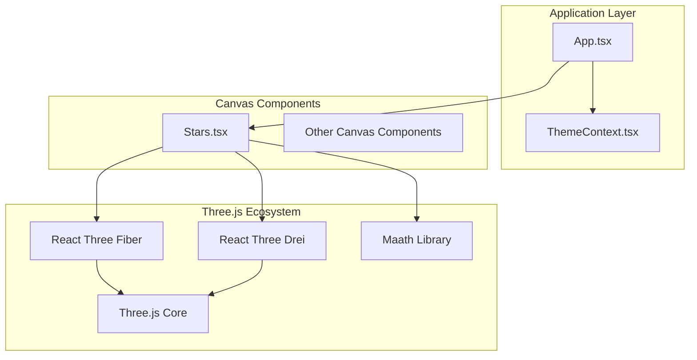
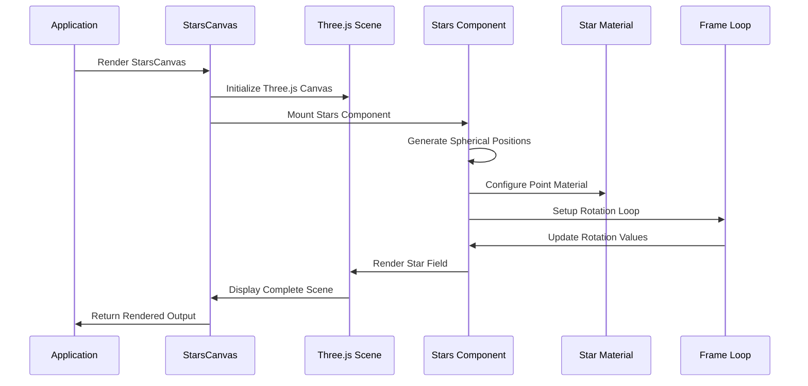
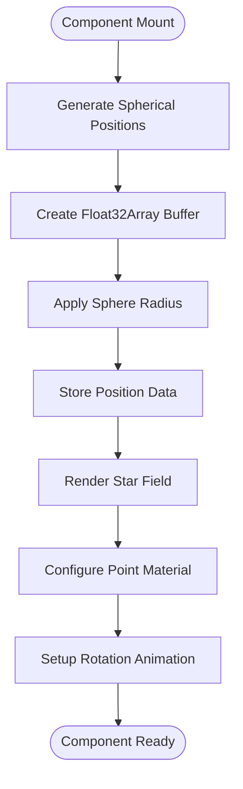
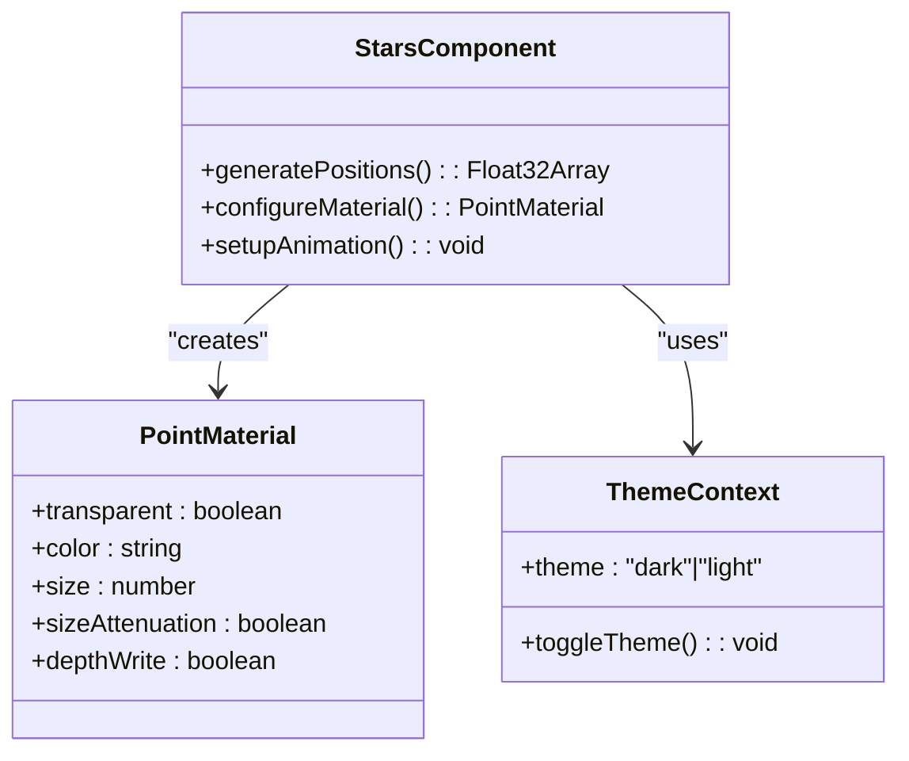
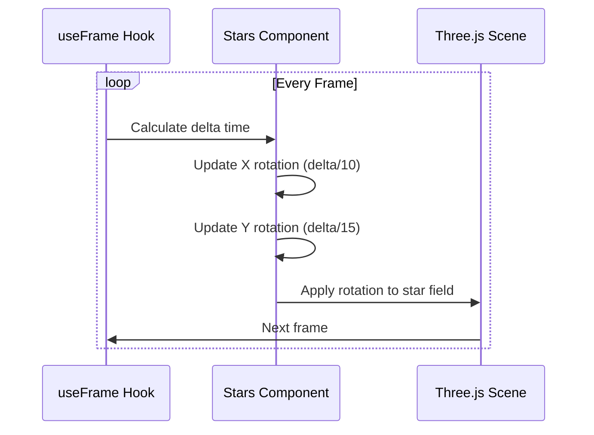
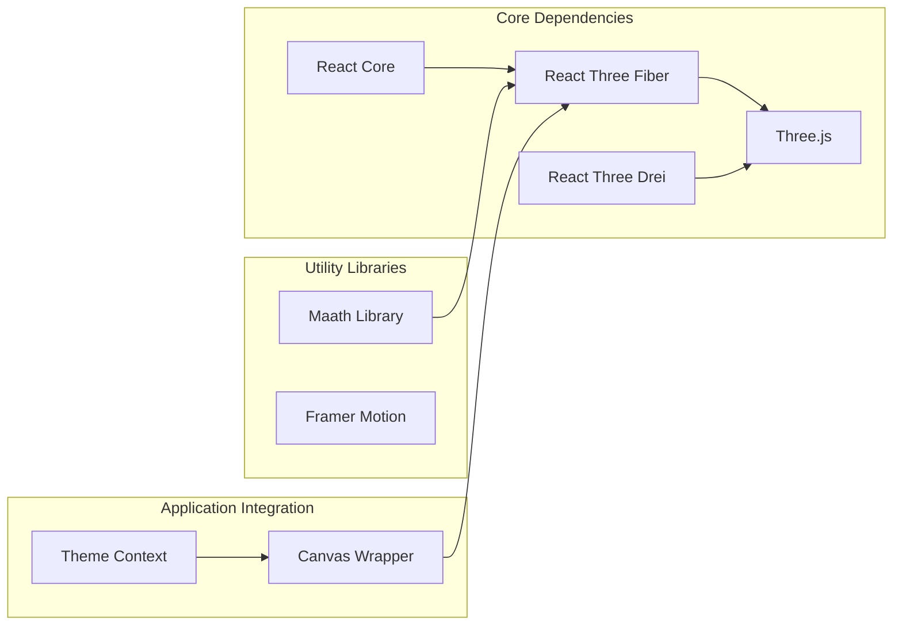

# Stars 3D Component

<cite>
**Referenced Files in This Document**
- [Stars.tsx](file://src/components/canvas/Stars.tsx)
- [ThemeContext.tsx](file://src/context/ThemeContext.tsx)
- [App.tsx](file://src/App.tsx)
- [index.ts](file://src/components/canvas/index.ts)
- [package.json](file://package.json)
</cite>

## Table of Contents
1. [Introduction](#introduction)
2. [Project Structure](#project-structure)
3. [Core Components](#core-components)
4. [Architecture Overview](#architecture-overview)
5. [Detailed Component Analysis](#detailed-component-analysis)
6. [Dependency Analysis](#dependency-analysis)
7. [Performance Considerations](#performance-considerations)
8. [Troubleshooting Guide](#troubleshooting-guide)
9. [Conclusion](#conclusion)

## Introduction
The Stars 3D component creates a dynamic star field background using Three.js and React Three Fiber. It generates thousands of stars positioned randomly within a sphere around the camera, applies distance-based visual effects, and rotates slowly to create a sense of depth and movement. The component integrates seamlessly into the portfolio website's layout as a full-screen background element.

## Project Structure
The Stars component is part of a larger Three.js canvas ecosystem within the portfolio application. It follows a modular architecture where individual canvas components are exported and integrated into the main application layout.

**Diagram sources**
- [App.tsx:19-47](file://src/App.tsx#L19-L47)
- [Stars.tsx:1-51](file://src/components/canvas/Stars.tsx#L1-L51)

**Section sources**
- [App.tsx:19-47](file://src/App.tsx#L19-L47)
- [index.ts:1-6](file://src/components/canvas/index.ts#L1-L6)

## Core Components
The Stars component consists of two main parts: the StarsCanvas wrapper and the Stars rendering component. The StarsCanvas provides the Three.js context and camera setup, while the Stars component handles the star field generation and animation.

Key architectural elements:
- **Canvas Container**: Full-screen positioning with z-index management
- **Star Field Generation**: Random spherical distribution using mathematical algorithms
- **Material Configuration**: Distance-based visual effects and transparency
- **Animation System**: Continuous rotation for depth perception
- **Theme Integration**: Dynamic color adaptation based on user preferences

**Section sources**
- [Stars.tsx:37-49](file://src/components/canvas/Stars.tsx#L37-L49)
- [Stars.tsx:8-35](file://src/components/canvas/Stars.tsx#L8-L35)

## Architecture Overview
The Stars component follows a layered architecture pattern that separates concerns between scene setup, geometry generation, material configuration, and animation logic.

**Diagram sources**
- [Stars.tsx:37-49](file://src/components/canvas/Stars.tsx#L37-L49)
- [Stars.tsx:15-20](file://src/components/canvas/Stars.tsx#L15-L20)

## Detailed Component Analysis

### Star Field Generation System
The component uses the maath library's `random.inSphere` function to generate a uniform distribution of points within a spherical volume. This creates a realistic star field appearance with proper spacing and density.

**Diagram sources**
- [Stars.tsx:11-13](file://src/components/canvas/Stars.tsx#L11-L13)
- [Stars.tsx:24-31](file://src/components/canvas/Stars.tsx#L24-L31)

The star generation algorithm creates a buffer containing 5001 floating-point values representing X, Y, Z coordinates for each star. The positions are distributed uniformly within a sphere of radius 1.2 units around the camera.

**Section sources**
- [Stars.tsx:11-13](file://src/components/canvas/Stars.tsx#L11-L13)

### Material Configuration and Visual Effects
The component uses Three.js PointMaterial with specific configurations for optimal visual performance and appearance:

- **Transparency**: Enabled for proper blending with the background
- **Size Attenuation**: Automatically scales stars based on distance
- **Depth Writing**: Disabled to prevent depth conflicts with other scene elements
- **Theme-based Coloring**: Dynamic color selection based on user theme preference

**Diagram sources**
- [Stars.tsx:25-31](file://src/components/canvas/Stars.tsx#L25-L31)
- [ThemeContext.tsx:3-8](file://src/context/ThemeContext.tsx#L3-L8)

**Section sources**
- [Stars.tsx:25-31](file://src/components/canvas/Stars.tsx#L25-L31)
- [ThemeContext.tsx:17-37](file://src/context/ThemeContext.tsx#L17-L37)

### Animation and Movement System
The component implements a sophisticated animation system that creates subtle, continuous motion:

- **Rotation Animation**: Slow, continuous rotation around both X and Y axes
- **Delta-based Timing**: Frame-rate independent animation using Three.js delta values
- **Independent Axis Speeds**: Different rotation speeds for X and Y axes create organic movement
- **Camera-relative Motion**: Rotation occurs relative to the camera's position

**Diagram sources**
- [Stars.tsx:15-20](file://src/components/canvas/Stars.tsx#L15-L20)

**Section sources**
- [Stars.tsx:15-20](file://src/components/canvas/Stars.tsx#L15-L20)

### Theme Integration and Color Management
The component dynamically adapts its appearance based on the user's theme preference, creating different visual experiences for light and dark modes.

**Section sources**
- [Stars.tsx:10](file://src/components/canvas/Stars.tsx#L10)
- [ThemeContext.tsx:17-37](file://src/context/ThemeContext.tsx#L17-L37)

## Dependency Analysis
The Stars component relies on several key dependencies that work together to create the 3D star field effect.

**Diagram sources**
- [package.json:13-24](file://package.json#L13-L24)
- [Stars.tsx:1-6](file://src/components/canvas/Stars.tsx#L1-L6)

**Section sources**
- [package.json:13-24](file://package.json#L13-L24)
- [Stars.tsx:1-6](file://src/components/canvas/Stars.tsx#L1-L6)

## Performance Considerations
The Stars component is designed with performance optimization in mind for handling large numbers of stars efficiently:

### Rendering Optimizations
- **Frustum Culling**: Automatic visibility culling prevents rendering off-screen stars
- **Instanced Rendering**: Single geometry with thousands of instances reduces draw calls
- **Buffer Geometry**: Efficient Float32Array storage minimizes memory overhead
- **Depth Testing**: Proper depth handling prevents unnecessary re-renders

### Animation Performance
- **Delta-based Timing**: Frame-rate independent animation ensures smooth performance
- **Efficient Rotation**: Simple trigonometric calculations minimize CPU usage
- **Memory Management**: Proper cleanup of animation frames prevents memory leaks

### Visual Quality vs Performance
- **Size Attenuation**: Automatic scaling maintains visual quality while optimizing rendering
- **Transparent Materials**: Careful alpha blending balances visual appeal with performance
- **Theme-based Optimization**: Different materials for different themes optimize for various backgrounds

## Troubleshooting Guide

### Common Issues and Solutions

**Stars Not Visible**
- Verify camera position is at [0, 0, 1] as configured
- Check that the star field is positioned within camera frustum
- Ensure depthWrite is disabled for proper transparency

**Performance Issues**
- Monitor frame rate during star field rendering
- Consider reducing star count if experiencing performance drops
- Verify frustum culling is functioning properly

**Theme Color Problems**
- Confirm ThemeContext is properly wrapped around the application
- Check that theme state updates trigger component re-rendering
- Verify color values are valid hex strings

**Animation Glitches**
- Ensure useFrame hook is properly cleaning up on unmount
- Check for conflicting animation libraries
- Verify delta time calculations are correct

**Section sources**
- [Stars.tsx:39-48](file://src/components/canvas/Stars.tsx#L39-L48)
- [ThemeContext.tsx:17-37](file://src/context/ThemeContext.tsx#L17-L37)

## Conclusion
The Stars 3D component demonstrates a sophisticated approach to creating immersive 3D backgrounds using modern React and Three.js technologies. Its implementation showcases several key principles:

**Technical Excellence**: The component effectively combines mathematical algorithms, efficient rendering techniques, and responsive design patterns to create a visually stunning yet performant star field.

**Architectural Soundness**: The modular design allows for easy integration, testing, and maintenance while providing clear separation of concerns between scene setup, geometry generation, and animation logic.

**User Experience Focus**: The dynamic theme integration, smooth animations, and performance optimizations contribute to an engaging visual experience that enhances the overall portfolio presentation.

**Customization Flexibility**: The component's design allows for easy customization of star counts, colors, sizes, and animation patterns while maintaining optimal performance characteristics.

This implementation serves as an excellent foundation for similar 3D background effects and demonstrates best practices for integrating Three.js into React applications at scale.