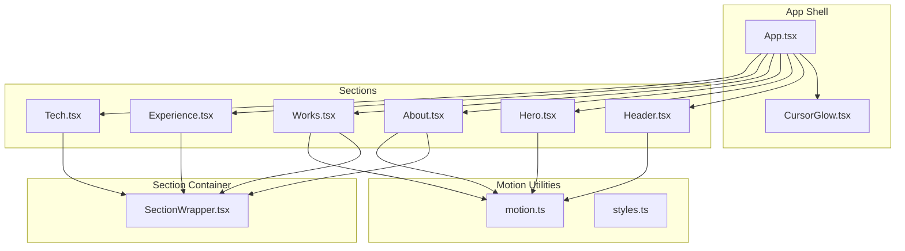
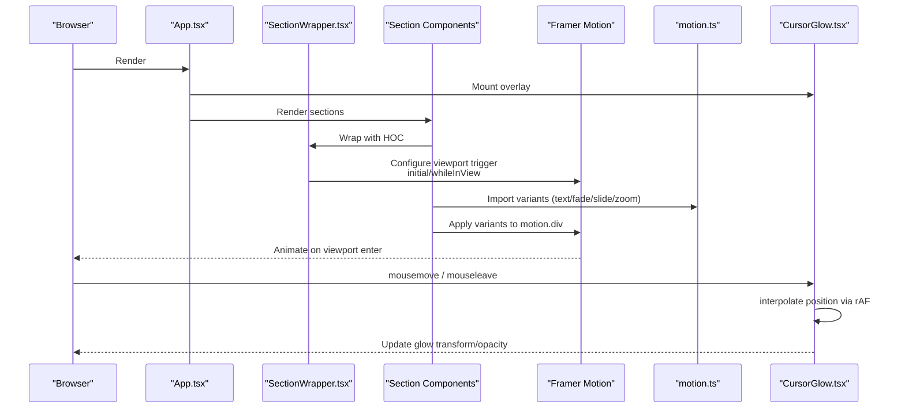
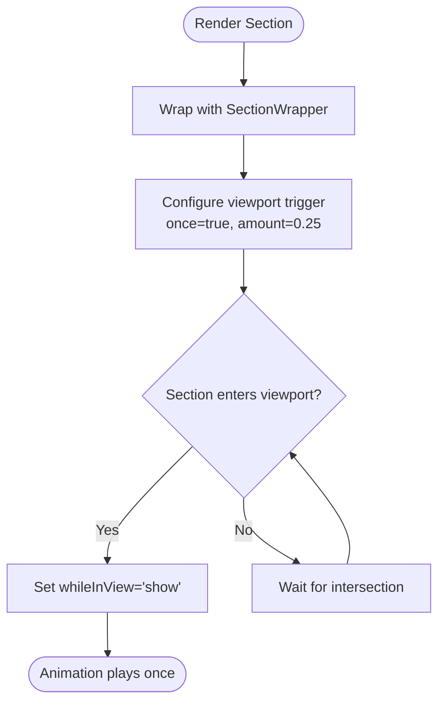
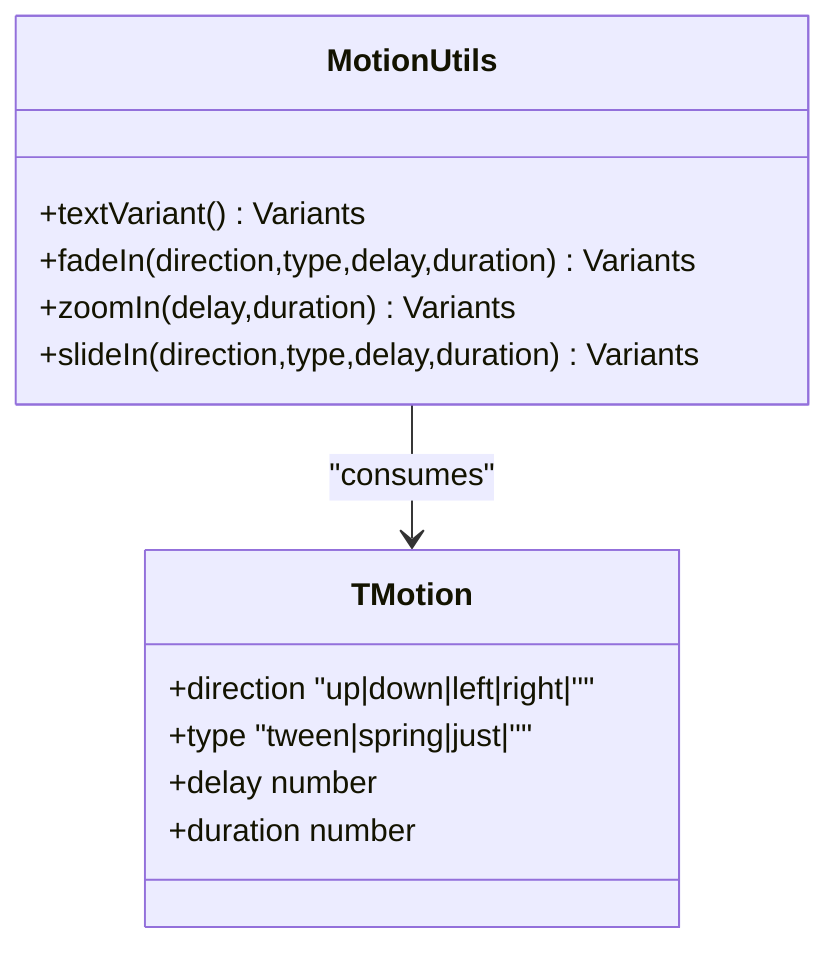
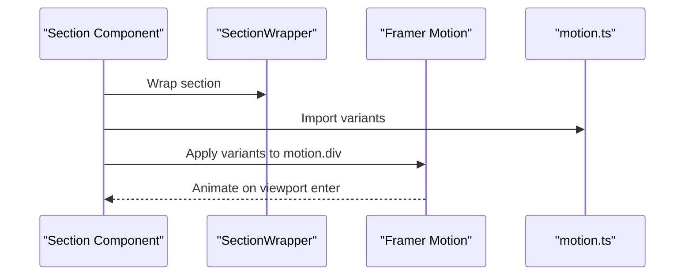
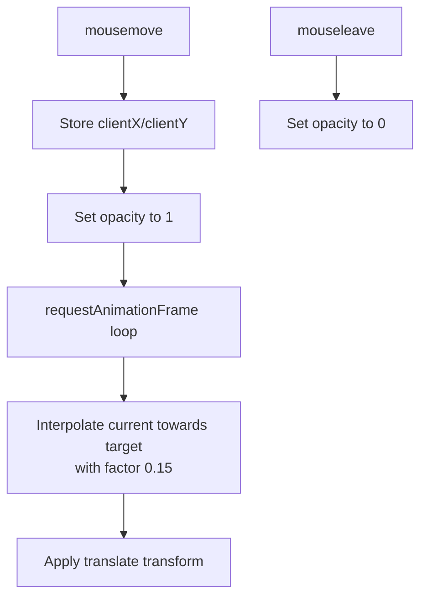
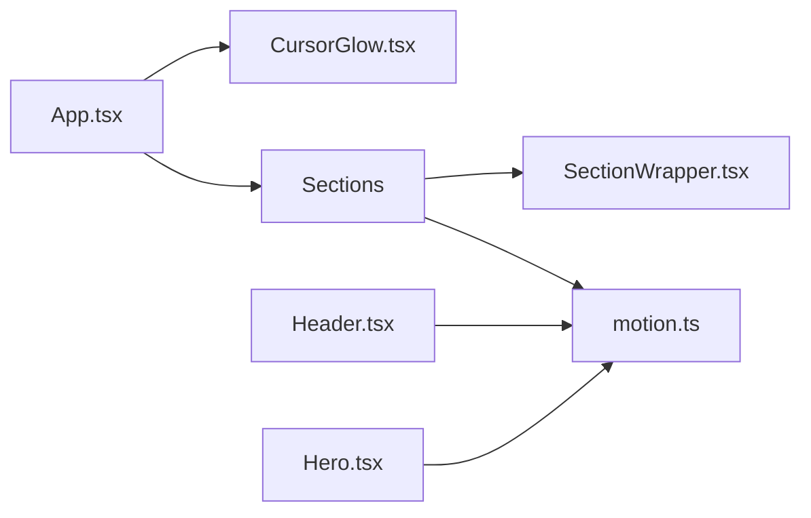

# Animation System

<cite>
**Referenced Files in This Document**
- [App.tsx](file://src/App.tsx)
- [CursorGlow.tsx](file://src/components/layout/CursorGlow.tsx)
- [SectionWrapper.tsx](file://src/hoc/SectionWrapper.tsx)
- [motion.ts](file://src/utils/motion.ts)
- [Header.tsx](file://src/components/atoms/Header.tsx)
- [Hero.tsx](file://src/components/sections/Hero.tsx)
- [About.tsx](file://src/components/sections/About.tsx)
- [Works.tsx](file://src/components/sections/Works.tsx)
- [Experience.tsx](file://src/components/sections/Experience.tsx)
- [Tech.tsx](file://src/components/sections/Tech.tsx)
- [styles.ts](file://src/constants/styles.ts)
- [config.ts](file://src/constants/config.ts)
- [index.d.ts](file://src/types/index.d.ts)
</cite>

## Table of Contents
1. [Introduction](#introduction)
2. [Project Structure](#project-structure)
3. [Core Components](#core-components)
4. [Architecture Overview](#architecture-overview)
5. [Detailed Component Analysis](#detailed-component-analysis)
6. [Dependency Analysis](#dependency-analysis)
7. [Performance Considerations](#performance-considerations)
8. [Troubleshooting Guide](#troubleshooting-guide)
9. [Conclusion](#conclusion)

## Introduction
This document explains the animation system of the 3D Portfolio application. It covers how Framer Motion integrates with scroll-triggered animations via a Higher-Order Component (HOC), the reusable motion utilities that define consistent variants and transitions, and interactive cursor effects. It also documents timing, easing, responsiveness, and practical guidance for creating custom animations and optimizing performance across devices and browsers.

## Project Structure
The animation system spans several layers:
- Global app shell and interactive cursor overlay
- Scroll-triggered section container (SectionWrapper HOC)
- Motion utilities for variants and transitions
- Section components that consume motion utilities and variants
- Typography and header motion integration
- Example of inline motion usage for micro-interactions

**Diagram sources**
- [App.tsx:19-48](file://src/App.tsx#L19-L48)
- [CursorGlow.tsx:4-74](file://src/components/layout/CursorGlow.tsx#L4-L74)
- [SectionWrapper.tsx:10-28](file://src/hoc/SectionWrapper.tsx#L10-L28)
- [motion.ts:4-91](file://src/utils/motion.ts#L4-L91)
- [Header.tsx:13-28](file://src/components/atoms/Header.tsx#L13-L28)
- [Hero.tsx:34-47](file://src/components/sections/Hero.tsx#L34-L47)
- [About.tsx:46-67](file://src/components/sections/About.tsx#L46-L67)
- [Works.tsx:66-89](file://src/components/sections/Works.tsx#L66-L89)
- [Experience.tsx:63-82](file://src/components/sections/Experience.tsx#L63-L82)
- [Tech.tsx:5-19](file://src/components/sections/Tech.tsx#L5-L19)

**Section sources**
- [App.tsx:19-48](file://src/App.tsx#L19-L48)
- [styles.ts:1-16](file://src/constants/styles.ts#L1-L16)

## Core Components
- SectionWrapper HOC: Provides scroll-triggered animations per section using viewport intersection and whileInView.
- Motion utilities: Reusable variants for text, fade-in, zoom-in, and slide-in with typed parameters for direction/type/delay/duration.
- CursorGlow: Smooth mouse-following radial glow with requestAnimationFrame interpolation and theme-aware gradients.
- Inline motion usage: Micro-interactions such as animated scroll-down indicator.

Key integration points:
- Sections wrap content with the HOC to enable viewport-triggered animations.
- Motion utilities are passed as variants to motion.div elements.
- CursorGlow is mounted globally and controlled via mousemove and leave events.

**Section sources**
- [SectionWrapper.tsx:10-28](file://src/hoc/SectionWrapper.tsx#L10-L28)
- [motion.ts:4-91](file://src/utils/motion.ts#L4-L91)
- [CursorGlow.tsx:13-49](file://src/components/layout/CursorGlow.tsx#L13-L49)
- [Hero.tsx:34-47](file://src/components/sections/Hero.tsx#L34-L47)

## Architecture Overview
The animation pipeline combines viewport detection with Framer Motion variants and a global interactive effect.

**Diagram sources**
- [App.tsx:26-44](file://src/App.tsx#L26-L44)
- [SectionWrapper.tsx:16-22](file://src/hoc/SectionWrapper.tsx#L16-L22)
- [motion.ts:4-91](file://src/utils/motion.ts#L4-L91)
- [CursorGlow.tsx:13-49](file://src/components/layout/CursorGlow.tsx#L13-L49)

## Detailed Component Analysis

### SectionWrapper HOC
Purpose:
- Standardizes viewport-triggered animations across sections.
- Ensures animations play only once and start when 25% of the section enters the viewport.

Behavior:
- Uses initial="hidden" and whileInView="show".
- viewport configuration: once=true and amount=0.25.
- Wraps the section content and adds an anchor element for navigation.

**Diagram sources**
- [SectionWrapper.tsx:16-22](file://src/hoc/SectionWrapper.tsx#L16-L22)

**Section sources**
- [SectionWrapper.tsx:10-28](file://src/hoc/SectionWrapper.tsx#L10-L28)

### Motion Utilities (motion.ts)
Defines four reusable variants:
- textVariant: Spring-based vertical reveal with opacity.
- fadeIn: Directional fade with configurable type, delay, and duration; defaults to easeOut.
- zoomIn: Scale-based entrance with tween type and easeOut.
- slideIn: Directional slide with configurable type, delay, and duration; defaults to easeOut.

Timing and easing:
- Duration and delay are typed via TMotion.
- Easing defaults to easeOut for most utilities.
- textVariant uses spring type with a fixed duration.

**Diagram sources**
- [motion.ts:4-91](file://src/utils/motion.ts#L4-L91)
- [index.d.ts:39-44](file://src/types/index.d.ts#L39-L44)

**Section sources**
- [motion.ts:4-91](file://src/utils/motion.ts#L4-L91)
- [index.d.ts:39-44](file://src/types/index.d.ts#L39-L44)

### Header Motion Integration
- Header optionally wraps content in a motion.div and applies textVariant for a spring-based entrance.
- Controlled by a prop useMotion to toggle animation on/off.

**Section sources**
- [Header.tsx:13-28](file://src/components/atoms/Header.tsx#L13-L28)
- [motion.ts:4-19](file://src/utils/motion.ts#L4-L19)

### Section Animations: About, Works, Experience
- About: Cards use fadeIn with staggered delays (index * 0.5) and spring type for entrance.
- Works: Project cards use fadeIn with up direction and spring type; paragraph uses a subtle fade-in.
- Experience: Uses a third-party timeline; animations are applied to individual cards and the page header.

**Diagram sources**
- [About.tsx:27-67](file://src/components/sections/About.tsx#L27-L67)
- [Works.tsx:21-84](file://src/components/sections/Works.tsx#L21-L84)
- [Experience.tsx:63-82](file://src/components/sections/Experience.tsx#L63-L82)
- [SectionWrapper.tsx:16-22](file://src/hoc/SectionWrapper.tsx#L16-L22)
- [motion.ts:21-45](file://src/utils/motion.ts#L21-L45)

**Section sources**
- [About.tsx:27-67](file://src/components/sections/About.tsx#L27-L67)
- [Works.tsx:21-84](file://src/components/sections/Works.tsx#L21-L84)
- [Experience.tsx:63-82](file://src/components/sections/Experience.tsx#L63-L82)

### Hero Scroll Indicator Animation
- A small dot inside a scroll-down indicator animates vertically with repeat and loop to signal scrolling.
- Demonstrates inline motion usage outside of the HOC pattern.

**Section sources**
- [Hero.tsx:34-47](file://src/components/sections/Hero.tsx#L34-L47)

### Cursor Glow Effects
- Smooth radial glow follows the mouse with requestAnimationFrame interpolation.
- Opacity fades in on first move and out on mouse leave.
- Gradient color depends on theme (light/dark) with transition for smoothness.
- Fixed positioning with will-change hint for performance.

**Diagram sources**
- [CursorGlow.tsx:13-49](file://src/components/layout/CursorGlow.tsx#L13-L49)

**Section sources**
- [CursorGlow.tsx:4-74](file://src/components/layout/CursorGlow.tsx#L4-L74)

## Dependency Analysis
- App mounts CursorGlow globally and renders sections.
- SectionWrapper depends on Framer Motion and styles for consistent padding and layout.
- Section components depend on motion.ts for variants and on SectionWrapper for viewport triggers.
- Header consumes motion.ts for typography entrance.
- Hero demonstrates inline motion usage.

**Diagram sources**
- [App.tsx:26-44](file://src/App.tsx#L26-L44)
- [SectionWrapper.tsx:10-28](file://src/hoc/SectionWrapper.tsx#L10-L28)
- [motion.ts:4-91](file://src/utils/motion.ts#L4-L91)
- [Header.tsx:13-28](file://src/components/atoms/Header.tsx#L13-L28)
- [Hero.tsx:34-47](file://src/components/sections/Hero.tsx#L34-L47)

**Section sources**
- [App.tsx:26-44](file://src/App.tsx#L26-L44)
- [SectionWrapper.tsx:10-28](file://src/hoc/SectionWrapper.tsx#L10-L28)
- [motion.ts:4-91](file://src/utils/motion.ts#L4-L91)
- [Header.tsx:13-28](file://src/components/atoms/Header.tsx#L13-L28)
- [Hero.tsx:34-47](file://src/components/sections/Hero.tsx#L34-L47)

## Performance Considerations
- Viewport triggers: SectionWrapper uses viewport.once=true and amount=0.25 to minimize repeated reflows and ensure animations fire only once when the section becomes visible.
- Motion easing: Defaults to easeOut for smooth perceived motion; spring type is used for textVariant to feel lively yet controlled.
- Interactive cursor: requestAnimationFrame interpolation with a moderate factor balances smoothness and CPU usage; opacity transitions and will-change hints help maintain compositing performance.
- Staggered animations: Using index-based delays prevents simultaneous heavy animations, improving perceived smoothness on lower-end devices.
- Inline motion: Short-duration, low-complexity animations (like the scroll indicator) keep the UX fluid without heavy computations.
- Device and browser compatibility: Framer Motion’s variants and transitions are broadly supported; ensure to test on older devices and adjust durations or easing if needed.

[No sources needed since this section provides general guidance]

## Troubleshooting Guide
- Animations not triggering:
  - Verify the section is wrapped with SectionWrapper and that the viewport threshold is appropriate.
  - Confirm the element is rendered and visible in the DOM.
- Variants not applied:
  - Ensure variants are imported and passed to motion.div correctly.
  - Check that the whileInView state is set to "show" after initial.
- Cursor glow not visible:
  - Confirm the overlay is mounted and mousemove events are firing.
  - Check opacity transitions and theme-dependent gradient values.
- Jank during scroll:
  - Reduce animation duration or switch to less expensive easing.
  - Limit the number of concurrent viewport-triggered animations.
  - Prefer transform/opacity for GPU acceleration.

**Section sources**
- [SectionWrapper.tsx:16-22](file://src/hoc/SectionWrapper.tsx#L16-L22)
- [motion.ts:21-45](file://src/utils/motion.ts#L21-L45)
- [CursorGlow.tsx:13-49](file://src/components/layout/CursorGlow.tsx#L13-L49)

## Conclusion
The animation system leverages a consistent viewport-triggered pattern via SectionWrapper, reusable motion utilities for predictable entrances, and a polished interactive cursor effect. By combining typed motion parameters, sensible easing defaults, and performance-conscious practices, the portfolio achieves smooth, accessible animations across devices and browsers.