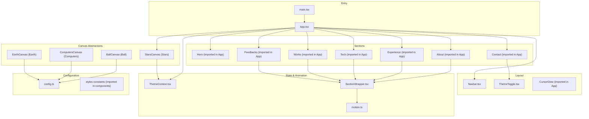
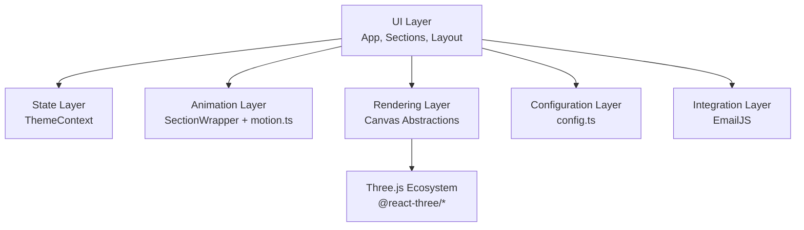
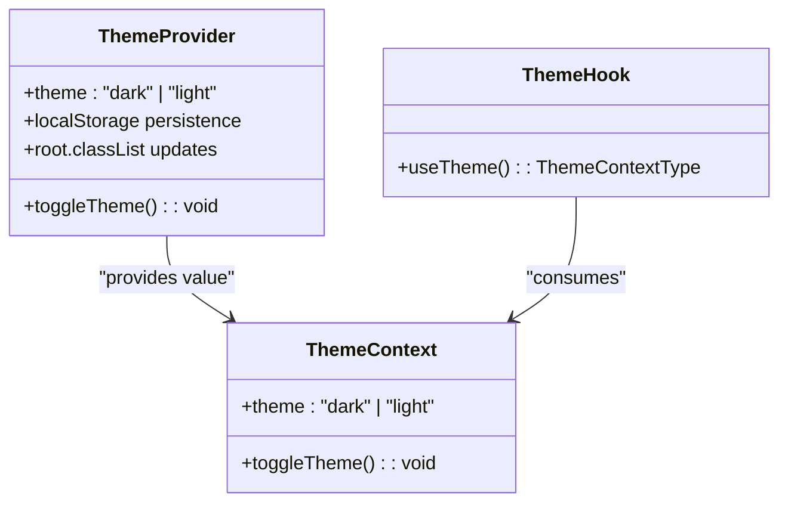
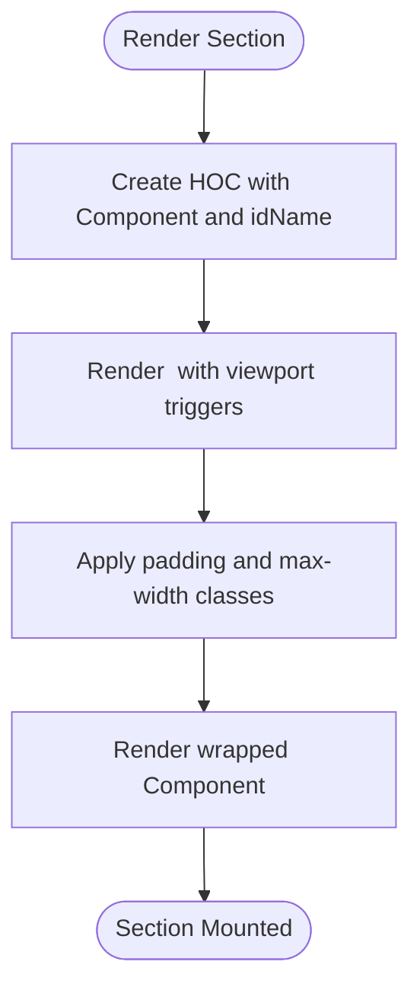
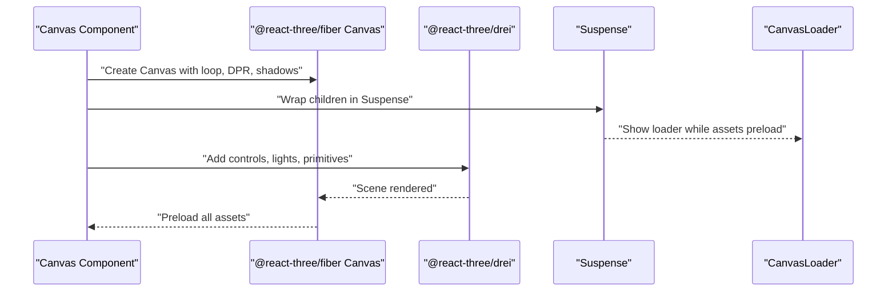
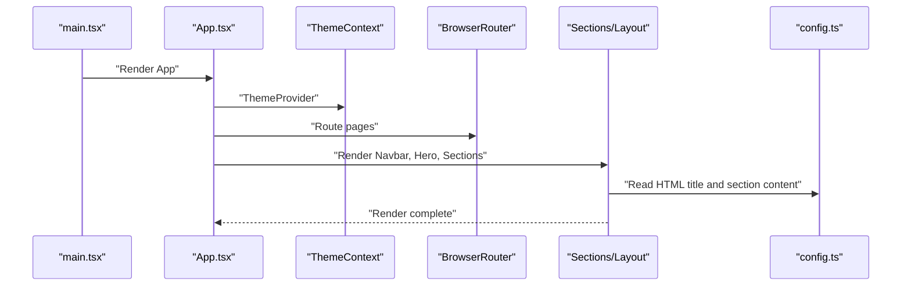
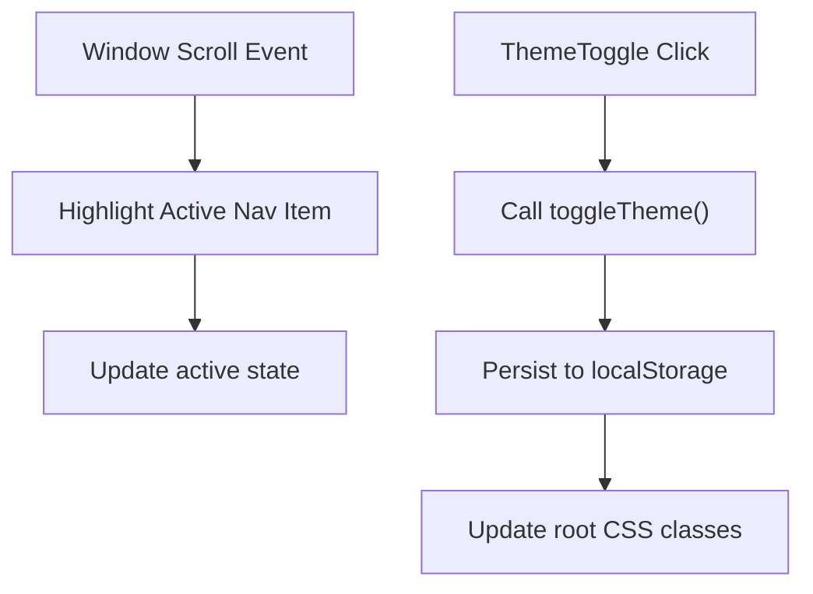
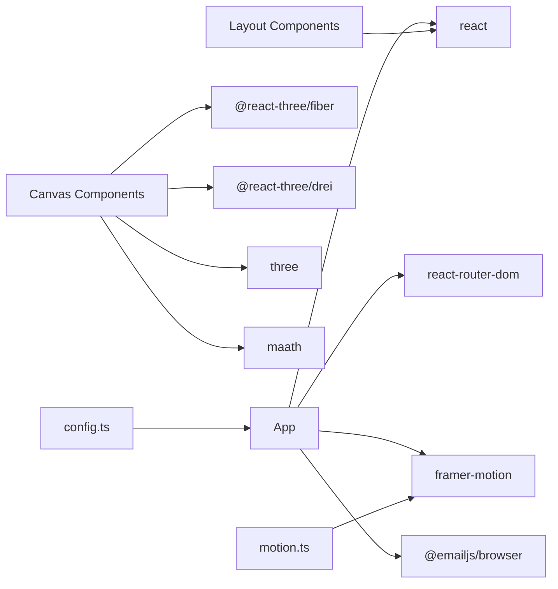

# Architecture Overview

<cite>
**Referenced Files in This Document**
- [App.tsx](file://src/App.tsx)
- [main.tsx](file://src/main.tsx)
- [ThemeContext.tsx](file://src/context/ThemeContext.tsx)
- [SectionWrapper.tsx](file://src/hoc/SectionWrapper.tsx)
- [config.ts](file://src/constants/config.ts)
- [motion.ts](file://src/utils/motion.ts)
- [index.ts (canvas)](file://src/components/canvas/index.ts)
- [Ball.tsx](file://src/components/canvas/Ball.tsx)
- [Computers.tsx](file://src/components/canvas/Computers.tsx)
- [Earth.tsx](file://src/components/canvas/Earth.tsx)
- [Stars.tsx](file://src/components/canvas/Stars.tsx)
- [Navbar.tsx](file://src/components/layout/Navbar.tsx)
- [Loader.tsx](file://src/components/layout/Loader.tsx)
- [ThemeToggle.tsx](file://src/components/layout/ThemeToggle.tsx)
- [package.json](file://package.json)
- [.github/workflows/deploy.yml](file://.github/workflows/deploy.yml)
</cite>

## Table of Contents
1. [Introduction](#introduction)
2. [Project Structure](#project-structure)
3. [Core Components](#core-components)
4. [Architecture Overview](#architecture-overview)
5. [Detailed Component Analysis](#detailed-component-analysis)
6. [Dependency Analysis](#dependency-analysis)
7. [Performance Considerations](#performance-considerations)
8. [Troubleshooting Guide](#troubleshooting-guide)
9. [Conclusion](#conclusion)
10. [Appendices](#appendices)

## Introduction
This document describes the architecture of the 3D Portfolio application. It focuses on three primary design patterns:
- Provider pattern for theme management via a dedicated context provider
- Higher-Order Component (HOC) pattern for animation wrappers around sections
- Canvas abstraction pattern for encapsulating 3D rendering concerns with Three.js and React Three Fiber

It also explains how App orchestrates sections, how ThemeContext provides global state, how SectionWrapper ensures animation consistency, and how configuration flows through constants into UI rendering. System boundaries separate 3D canvas components, content sections, and layout components. Integration points with external services such as EmailJS and the Three.js ecosystem are documented, along with the build system using Vite and the deployment pipeline via GitHub Actions.

## Project Structure
The project follows a feature-based organization with clear separation of concerns:
- Entry point renders the app inside React Strict Mode
- App composes layout, sections, and canvas components
- ThemeContext provides global theme state and persistence
- SectionWrapper wraps sections with shared animation behavior
- Canvas components encapsulate Three.js scenes behind a consistent interface
- Constants and styles drive configuration and presentation
- Utilities centralize animation variants for Framer Motion

**Diagram sources**
- [main.tsx:1-12](file://src/main.tsx#L1-L12)
- [App.tsx:1-51](file://src/App.tsx#L1-L51)
- [ThemeContext.tsx:1-45](file://src/context/ThemeContext.tsx#L1-L45)
- [SectionWrapper.tsx:1-31](file://src/hoc/SectionWrapper.tsx#L1-L31)
- [motion.ts:1-92](file://src/utils/motion.ts#L1-L92)
- [config.ts:1-87](file://src/constants/config.ts#L1-L87)
- [Ball.tsx:1-59](file://src/components/canvas/Ball.tsx#L1-L59)
- [Computers.tsx:1-85](file://src/components/canvas/Computers.tsx#L1-L85)
- [Earth.tsx:1-46](file://src/components/canvas/Earth.tsx#L1-L46)
- [Stars.tsx:1-52](file://src/components/canvas/Stars.tsx#L1-L52)
- [Navbar.tsx:1-126](file://src/components/layout/Navbar.tsx#L1-L126)
- [ThemeToggle.tsx:1-63](file://src/components/layout/ThemeToggle.tsx#L1-L63)

**Section sources**
- [main.tsx:1-12](file://src/main.tsx#L1-L12)
- [App.tsx:1-51](file://src/App.tsx#L1-L51)

## Core Components
- App orchestrator: Composes layout, sections, and canvas components; applies global transitions and routing
- ThemeContext provider: Manages theme state, persists selection, and toggles CSS classes on the root element
- SectionWrapper HOC: Wraps sections with shared animation behavior using Framer Motion and viewport triggers
- Canvas abstractions: Encapsulate Three.js scenes with consistent props, loaders, and controls
- Configuration: Centralized configuration for HTML metadata, hero copy, and section content
- Motion utilities: Reusable Framer Motion variants for text, fade, zoom, and slide-in animations

**Section sources**
- [App.tsx:19-51](file://src/App.tsx#L19-L51)
- [ThemeContext.tsx:17-44](file://src/context/ThemeContext.tsx#L17-L44)
- [SectionWrapper.tsx:10-28](file://src/hoc/SectionWrapper.tsx#L10-L28)
- [config.ts:41-87](file://src/constants/config.ts#L41-L87)
- [motion.ts:4-92](file://src/utils/motion.ts#L4-L92)

## Architecture Overview
The application follows a layered architecture:
- Presentation layer: App composes UI sections and layout
- State layer: ThemeContext provides global theme state and persistence
- Animation layer: SectionWrapper and motion utilities standardize animations
- Rendering layer: Canvas abstractions encapsulate Three.js scenes
- Configuration layer: Constants feed UI with content and metadata
- Integration layer: External libraries (Three.js ecosystem, EmailJS) integrated via npm dependencies

[No sources needed since this diagram shows conceptual architecture, not a direct code mapping]

## Detailed Component Analysis

### Provider Pattern: Theme Management
The Provider pattern centralizes theme state and persistence:
- Context defines theme and toggleTheme
- Provider initializes from localStorage, updates CSS classes on the root element, and persists changes
- Consumers use a typed hook to access theme and toggle

**Diagram sources**
- [ThemeContext.tsx:17-44](file://src/context/ThemeContext.tsx#L17-L44)

**Section sources**
- [ThemeContext.tsx:1-45](file://src/context/ThemeContext.tsx#L1-L45)

### Higher-Order Component Pattern: Animation Wrapper
SectionWrapper standardizes section animations:
- Accepts a component and an ID
- Wraps the component in a motion section with viewport-triggered animations
- Applies consistent padding and max-width classes

**Diagram sources**
- [SectionWrapper.tsx:10-28](file://src/hoc/SectionWrapper.tsx#L10-L28)

**Section sources**
- [SectionWrapper.tsx:1-31](file://src/hoc/SectionWrapper.tsx#L1-L31)

### Canvas Abstraction Pattern: 3D Components
Canvas components encapsulate Three.js scenes:
- Each canvas component creates a Canvas with consistent loop and DPR settings
- Suspense handles asset loading with a loader component
- Controls and lighting are configured per scene
- Preload ensures assets are ready before rendering
- Some components adapt to mobile queries

**Diagram sources**
- [Ball.tsx:41-56](file://src/components/canvas/Ball.tsx#L41-L56)
- [Computers.tsx:32-82](file://src/components/canvas/Computers.tsx#L32-L82)
- [Earth.tsx:15-43](file://src/components/canvas/Earth.tsx#L15-L43)
- [Stars.tsx:37-49](file://src/components/canvas/Stars.tsx#L37-L49)

**Section sources**
- [Ball.tsx:1-59](file://src/components/canvas/Ball.tsx#L1-L59)
- [Computers.tsx:1-85](file://src/components/canvas/Computers.tsx#L1-L85)
- [Earth.tsx:1-46](file://src/components/canvas/Earth.tsx#L1-L46)
- [Stars.tsx:1-52](file://src/components/canvas/Stars.tsx#L1-L52)
- [index.ts (canvas):1-7](file://src/components/canvas/index.ts#L1-L7)

### App Orchestration and Data Flow
App composes the page and wires providers:
- Sets document title from configuration
- Wraps children in ThemeProvider
- Renders layout and sections
- Integrates canvas components at strategic positions

**Diagram sources**
- [main.tsx:7-11](file://src/main.tsx#L7-L11)
- [App.tsx:19-48](file://src/App.tsx#L19-L48)
- [config.ts:41-87](file://src/constants/config.ts#L41-L87)

**Section sources**
- [App.tsx:14-24](file://src/App.tsx#L14-L24)
- [App.tsx:26-47](file://src/App.tsx#L26-L47)

### Layout and Navigation
- Navbar manages scroll highlighting and responsive behavior
- ThemeToggle integrates with ThemeContext to switch modes
- CursorGlow is rendered globally alongside the app container

**Diagram sources**
- [Navbar.tsx:14-49](file://src/components/layout/Navbar.tsx#L14-L49)
- [ThemeToggle.tsx:3-59](file://src/components/layout/ThemeToggle.tsx#L3-L59)
- [ThemeContext.tsx:23-33](file://src/context/ThemeContext.tsx#L23-L33)

**Section sources**
- [Navbar.tsx:1-126](file://src/components/layout/Navbar.tsx#L1-L126)
- [ThemeToggle.tsx:1-63](file://src/components/layout/ThemeToggle.tsx#L1-L63)

### Animation Utilities and Consistency
Motion utilities provide reusable variants for consistent entrance animations across sections:
- textVariant for header text
- fadeIn for directional fades
- zoomIn for scaling entrances
- slideIn for sliding directions

These are consumed by SectionWrapper and individual components to maintain a cohesive animation language.

**Section sources**
- [motion.ts:4-92](file://src/utils/motion.ts#L4-L92)
- [SectionWrapper.tsx:16-22](file://src/hoc/SectionWrapper.tsx#L16-L22)

## Dependency Analysis
External dependencies integrate the application with the Three.js ecosystem and UI animation library:
- Three.js and @react-three/* for 3D rendering
- Framer Motion for animations
- EmailJS for contact form submission
- Tailwind CSS and PostCSS for styling
- Vite for build and dev server

**Diagram sources**
- [package.json:13-25](file://package.json#L13-L25)
- [package.json:26-42](file://package.json#L26-L42)

**Section sources**
- [package.json:1-45](file://package.json#L1-L45)

## Performance Considerations
- Canvas performance: Canvas components configure frameloop demand and dpr thresholds to balance quality and performance
- Asset preloading: Preload ensures assets are ready before rendering, reducing jank
- Conditional rendering: Mobile-specific logic avoids rendering heavy scenes on small screens
- CSS class toggling: Theme switching updates root classes to avoid expensive re-renders
- Lazy loading: Suspense fallbacks prevent blocking during asset load

[No sources needed since this section provides general guidance]

## Troubleshooting Guide
Common areas to inspect:
- Theme persistence: Verify localStorage keys and root class updates
- Canvas loading: Confirm Suspense fallback and Preload usage
- Navigation highlighting: Ensure section IDs match navbar links and scroll handlers are attached
- Build and preview: Use Vite scripts to develop, build, and preview locally

**Section sources**
- [ThemeContext.tsx:18-33](file://src/context/ThemeContext.tsx#L18-L33)
- [Loader.tsx:3-21](file://src/components/layout/Loader.tsx#L3-L21)
- [Navbar.tsx:27-41](file://src/components/layout/Navbar.tsx#L27-L41)
- [package.json:6-12](file://package.json#L6-L12)

## Conclusion
The 3D Portfolio application employs clean architectural patterns:
- Provider pattern for theme state
- HOC for animation consistency
- Canvas abstraction for encapsulated 3D rendering
- Centralized configuration for content and metadata
- Integration with Three.js ecosystem and EmailJS
- Vite-based build and GitHub Actions-driven deployment

These patterns yield a modular, maintainable, and extensible codebase suitable for iterative enhancements.

## Appendices

### Build System and Deployment Pipeline
- Build system: Vite script compiles TypeScript and bundles assets
- Preview: Local preview server for testing builds
- CI/CD: GitHub Actions workflow for automated deployment

**Section sources**
- [package.json:6-12](file://package.json#L6-L12)
- [.github/workflows/deploy.yml](file://.github/workflows/deploy.yml)