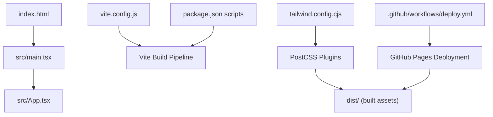
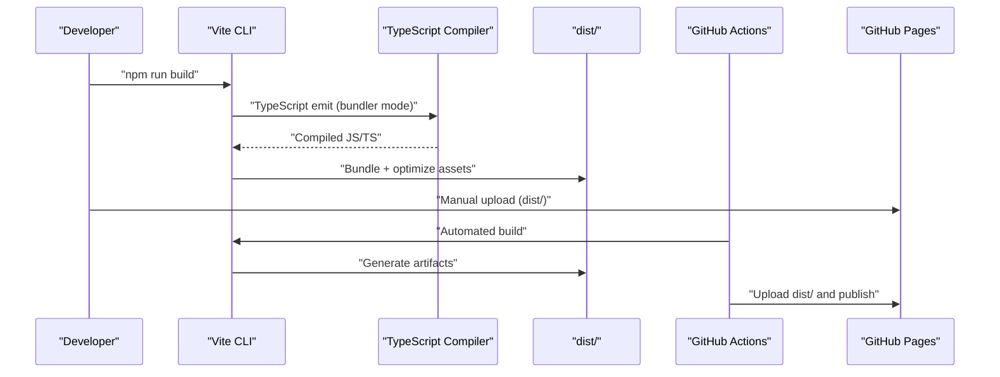
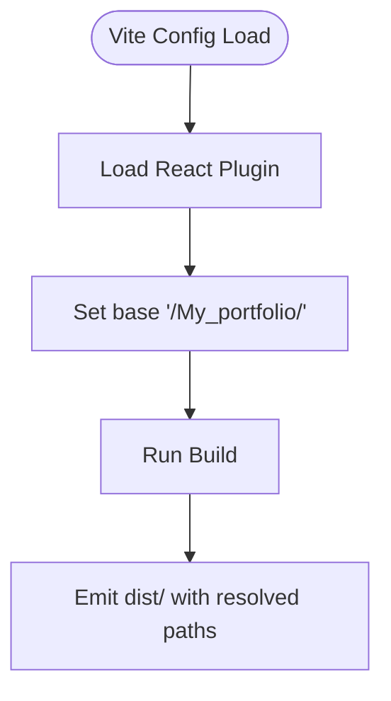
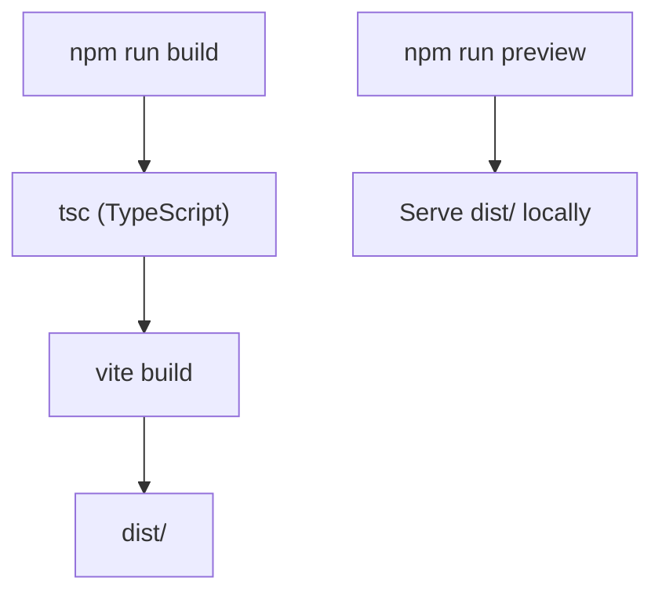
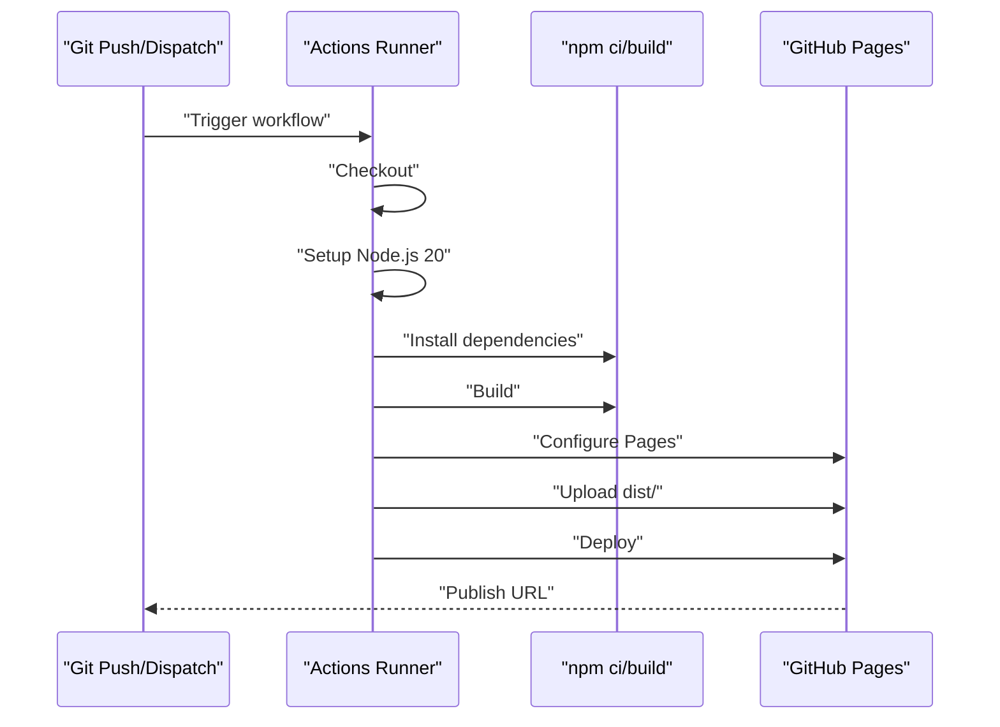
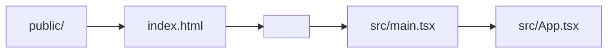
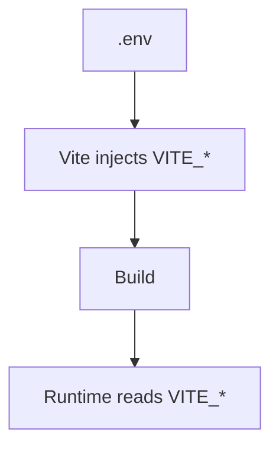
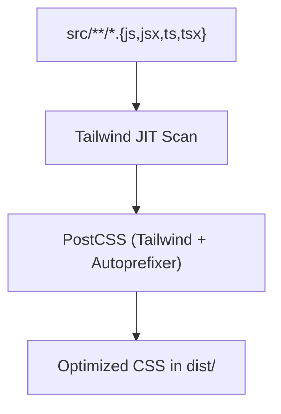
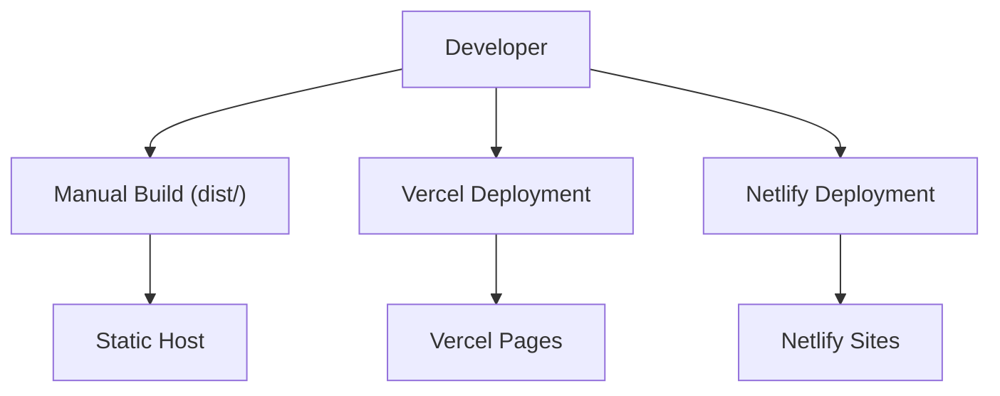
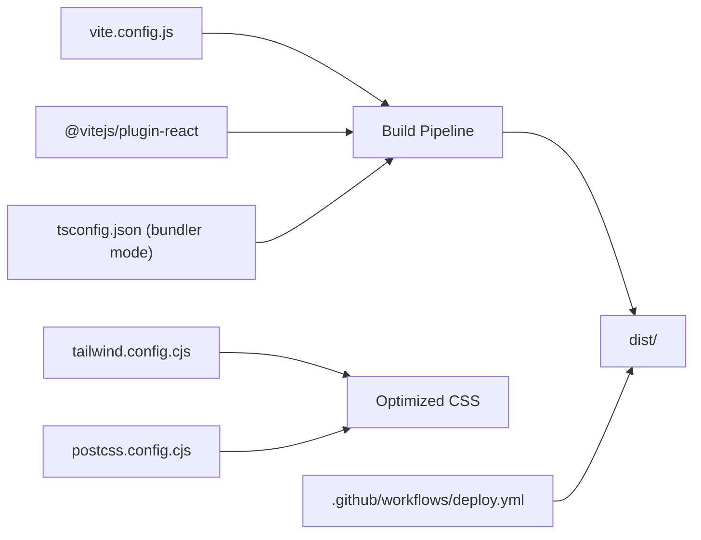

# Build and Deployment

<cite>
**Referenced Files in This Document**
- [vite.config.js](file://vite.config.js)
- [package.json](file://package.json)
- [.github/workflows/deploy.yml](file://.github/workflows/deploy.yml)
- [README.md](file://README.md)
- [index.html](file://index.html)
- [tsconfig.json](file://tsconfig.json)
- [tailwind.config.cjs](file://tailwind.config.cjs)
- [postcss.config.cjs](file://postcss.config.cjs)
- [src/vite-env.d.ts](file://src/vite-env.d.ts)
- [src/main.tsx](file://src/main.tsx)
- [src/App.tsx](file://src/App.tsx)
</cite>

## Table of Contents
1. [Introduction](#introduction)
2. [Project Structure](#project-structure)
3. [Core Components](#core-components)
4. [Architecture Overview](#architecture-overview)
5. [Detailed Component Analysis](#detailed-component-analysis)
6. [Dependency Analysis](#dependency-analysis)
7. [Performance Considerations](#performance-considerations)
8. [Troubleshooting Guide](#troubleshooting-guide)
9. [Conclusion](#conclusion)
10. [Appendices](#appendices)

## Introduction
This document explains the build and deployment system for the 3D Portfolio application. It covers Vite configuration, build optimization, asset handling, environment variables, and GitHub Pages integration. It also documents the GitHub Actions workflow for automated deployment, the end-to-end deployment pipeline, and provides guidance for manual builds, Vercel, and Netlify deployments. Finally, it includes troubleshooting tips and performance best practices for both build-time and production deployment.

## Project Structure
The project is a Vite-powered React application with TypeScript. Key build and deployment artifacts include:
- Vite configuration for bundling, plugins, and base path
- Package scripts for development, build, preview, linting, and type checking
- GitHub Actions workflow for automated deployment to GitHub Pages
- Tailwind CSS and PostCSS for styling
- TypeScript configuration for bundler mode and strictness
- HTML entry template and environment typing

**Diagram sources**
- [index.html](file://index.html)
- [src/main.tsx](file://src/main.tsx)
- [src/App.tsx](file://src/App.tsx)
- [vite.config.js](file://vite.config.js)
- [package.json](file://package.json)
- [tailwind.config.cjs](file://tailwind.config.cjs)
- [postcss.config.cjs](file://postcss.config.cjs)
- [.github/workflows/deploy.yml](file://.github/workflows/deploy.yml)

**Section sources**
- [vite.config.js](file://vite.config.js)
- [package.json](file://package.json)
- [.github/workflows/deploy.yml](file://.github/workflows/deploy.yml)
- [index.html](file://index.html)
- [tsconfig.json](file://tsconfig.json)
- [tailwind.config.cjs](file://tailwind.config.cjs)
- [postcss.config.cjs](file://postcss.config.cjs)
- [src/vite-env.d.ts](file://src/vite-env.d.ts)
- [src/main.tsx](file://src/main.tsx)
- [src/App.tsx](file://src/App.tsx)

## Core Components
- Vite configuration defines the React plugin and the base path for GitHub Pages compatibility.
- Package scripts orchestrate development, build, preview, linting, and type checking.
- GitHub Actions workflow automates building and deploying the dist folder to GitHub Pages.
- Tailwind and PostCSS handle styling and CSS optimization.
- TypeScript configuration enables bundler mode and strict type checking.
- HTML entry template initializes the React root and assets.

Key responsibilities:
- Build: TypeScript compilation and Vite bundling into dist/
- Preview: Local static server for testing the production build
- Linting and type checking: Pre-deploy quality gates
- Deployment: GitHub Pages via Actions or manual upload

**Section sources**
- [vite.config.js](file://vite.config.js)
- [package.json](file://package.json)
- [.github/workflows/deploy.yml](file://.github/workflows/deploy.yml)
- [tailwind.config.cjs](file://tailwind.config.cjs)
- [postcss.config.cjs](file://postcss.config.cjs)
- [tsconfig.json](file://tsconfig.json)
- [index.html](file://index.html)

## Architecture Overview
The build and deployment pipeline integrates development, build, and deployment stages across local and CI environments.

**Diagram sources**
- [package.json](file://package.json)
- [vite.config.js](file://vite.config.js)
- [tsconfig.json](file://tsconfig.json)
- [.github/workflows/deploy.yml](file://.github/workflows/deploy.yml)

## Detailed Component Analysis

### Vite Configuration
- Plugin: React plugin for JSX/TSX transforms and Fast Refresh
- Base path: Ensures assets resolve correctly under a subpath for GitHub Pages
- Implication: When hosting under a username.github.io/My_portfolio/ path, assets and routes must align with the base setting

**Diagram sources**
- [vite.config.js](file://vite.config.js)

**Section sources**
- [vite.config.js](file://vite.config.js)

### Build Scripts and Toolchain
- Development: Starts Vite dev server
- Build: Runs TypeScript compiler and Vite build to produce dist/
- Preview: Serves dist/ locally for verification
- Lint: Runs ESLint across TS/TSX files
- Type check: Validates TypeScript without emitting

**Diagram sources**
- [package.json](file://package.json)

**Section sources**
- [package.json](file://package.json)

### GitHub Actions Workflow (Automated Deployment)
- Triggers: On push to main branch and manual dispatch
- Permissions: Write access to Pages and ID token
- Steps:
  - Checkout repository
  - Setup Node.js 20 with npm caching
  - Install dependencies
  - Build project
  - Configure GitHub Pages
  - Upload dist/ artifact
  - Deploy to GitHub Pages

**Diagram sources**
- [.github/workflows/deploy.yml](file://.github/workflows/deploy.yml)

**Section sources**
- [.github/workflows/deploy.yml](file://.github/workflows/deploy.yml)

### Asset Handling and Static Assets
- Public assets: Place static assets under the public/ directory for direct inclusion
- Base path alignment: With base set to "/My_portfolio/", ensure asset URLs and router paths match this prefix
- HTML entry: The HTML template mounts the React root and loads the main script

**Diagram sources**
- [index.html](file://index.html)
- [src/main.tsx](file://src/main.tsx)
- [src/App.tsx](file://src/App.tsx)

**Section sources**
- [index.html](file://index.html)
- [vite.config.js](file://vite.config.js)

### Environment Variables
- Required for EmailJS integration: service ID, template ID, and access token
- Stored in a .env file at the repository root and injected at build time with the Vite prefix VITE_

**Diagram sources**
- [README.md](file://README.md)
- [src/vite-env.d.ts](file://src/vite-env.d.ts)

**Section sources**
- [README.md](file://README.md)
- [src/vite-env.d.ts](file://src/vite-env.d.ts)

### Styling Pipeline (Tailwind + PostCSS)
- Tailwind scans src/**/*.{js,jsx,ts,tsx} for class usage
- JIT mode enables on-demand CSS generation
- PostCSS applies Tailwind and Autoprefixer to produce optimized CSS

**Diagram sources**
- [tailwind.config.cjs](file://tailwind.config.cjs)
- [postcss.config.cjs](file://postcss.config.cjs)

**Section sources**
- [tailwind.config.cjs](file://tailwind.config.cjs)
- [postcss.config.cjs](file://postcss.config.cjs)

### Manual Builds and Deployment Options
- Manual build: npm run build produces dist/
- Host manually: Upload dist/ to any static host
- Vercel: Recommended deployment option per project documentation
- Netlify: Alternative static hosting option

**Diagram sources**
- [README.md](file://README.md)
- [package.json](file://package.json)

**Section sources**
- [README.md](file://README.md)
- [package.json](file://package.json)

## Dependency Analysis
- Vite orchestrates bundling and dev server
- TypeScript compiles TS/TSX to JS in bundler mode
- React plugin powers JSX/TSX transforms
- Tailwind and PostCSS manage CSS optimization
- GitHub Actions coordinates CI deployment

**Diagram sources**
- [vite.config.js](file://vite.config.js)
- [package.json](file://package.json)
- [tsconfig.json](file://tsconfig.json)
- [tailwind.config.cjs](file://tailwind.config.cjs)
- [postcss.config.cjs](file://postcss.config.cjs)
- [.github/workflows/deploy.yml](file://.github/workflows/deploy.yml)

**Section sources**
- [vite.config.js](file://vite.config.js)
- [package.json](file://package.json)
- [tsconfig.json](file://tsconfig.json)
- [tailwind.config.cjs](file://tailwind.config.cjs)
- [postcss.config.cjs](file://postcss.config.cjs)
- [.github/workflows/deploy.yml](file://.github/workflows/deploy.yml)

## Performance Considerations
- Bundle size and code splitting: Prefer dynamic imports for route-level or feature-level lazy loading to reduce initial payload
- Asset optimization: Use Tailwind JIT to avoid unused CSS; compress images and GLB/GLTF assets externally before bundling
- Base path correctness: Ensure base path matches hosting path to prevent extra network requests and broken asset resolution
- Dev/prod parity: Keep environment variables and build scripts consistent across environments
- Preview builds: Use npm run preview to validate production-like behavior before deployment

[No sources needed since this section provides general guidance]

## Troubleshooting Guide
Common issues and resolutions:
- Broken assets after deploy: Verify base path matches the hosting subpath and that public assets are referenced correctly
- Missing environment variables at runtime: Confirm .env variables are prefixed with VITE_ and present during build
- CSS not applied: Ensure Tailwind content paths include all source files and rebuild after changes
- Unexpected routing issues: Confirm router paths and base path align; test with npm run preview
- CI deployment failures: Check Actions logs for dependency installation and build steps; confirm dist/ is uploaded

**Section sources**
- [vite.config.js](file://vite.config.js)
- [README.md](file://README.md)
- [tailwind.config.cjs](file://tailwind.config.cjs)
- [.github/workflows/deploy.yml](file://.github/workflows/deploy.yml)

## Conclusion
The 3D Portfolio application uses a streamlined build and deployment setup centered on Vite, TypeScript, and GitHub Actions. The configuration ensures assets resolve correctly under a subpath, the Actions workflow automates production deployment, and the toolchain supports fast iteration and reliable previews. Following the outlined practices and troubleshooting steps will help maintain a smooth development and deployment experience.

[No sources needed since this section summarizes without analyzing specific files]

## Appendices
- Build artifacts: dist/ contains the production-ready bundle and assets
- Hosting notes: When changing the base path, update both Vite config and hosting configuration accordingly

**Section sources**
- [package.json](file://package.json)
- [vite.config.js](file://vite.config.js)