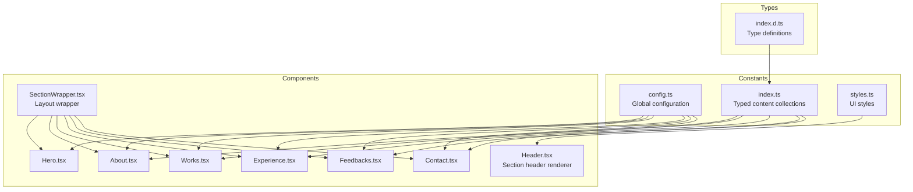
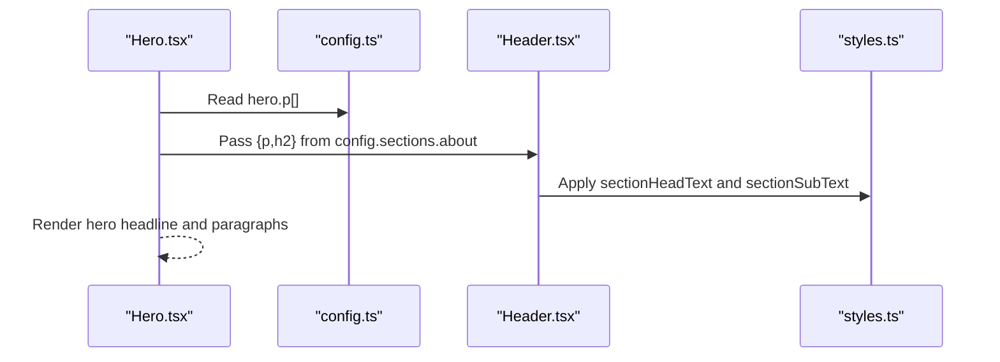
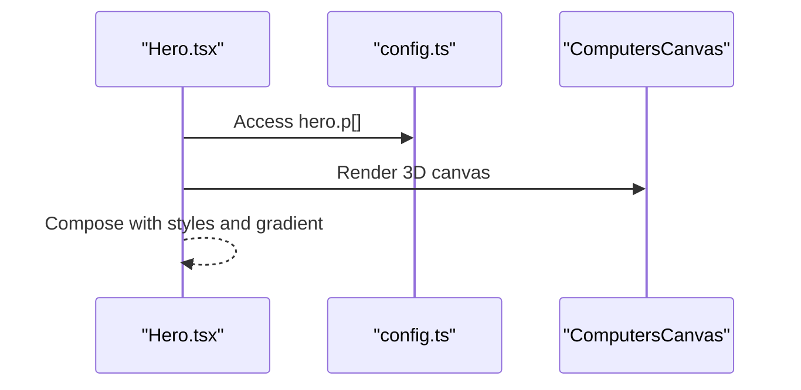
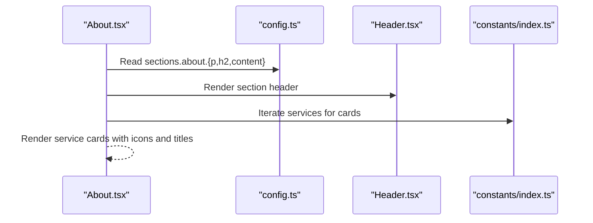
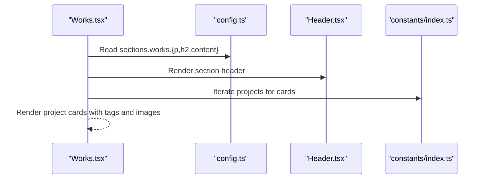
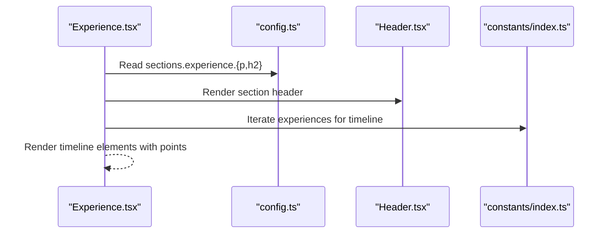
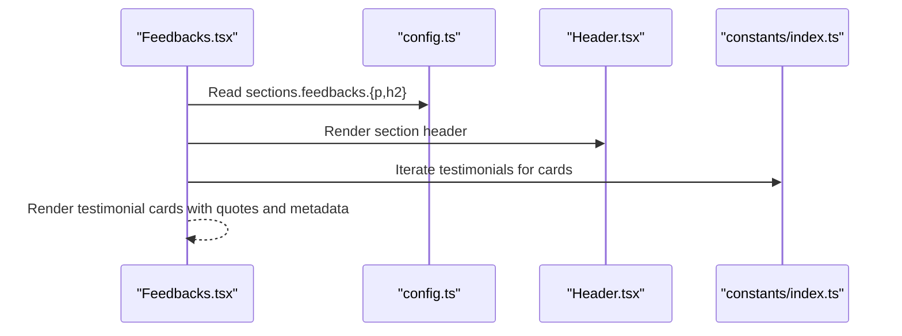
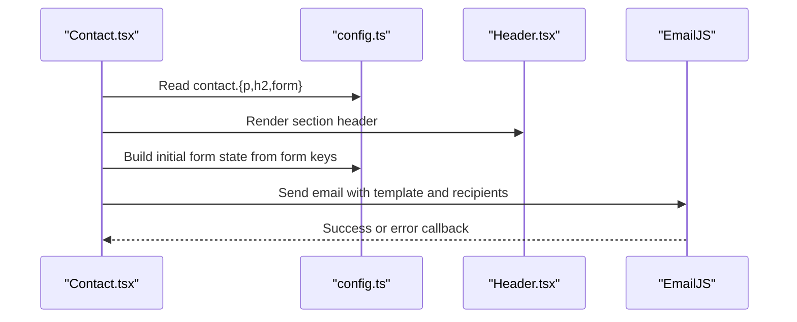
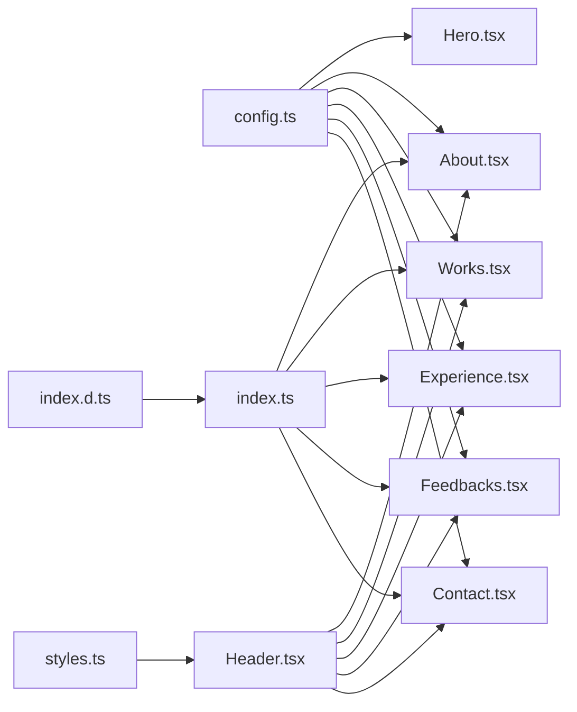

# Configuration Management

<cite>
**Referenced Files in This Document**
- [config.ts](file://src/constants/config.ts)
- [index.d.ts](file://src/types/index.d.ts)
- [index.ts](file://src/constants/index.ts)
- [Hero.tsx](file://src/components/sections/Hero.tsx)
- [About.tsx](file://src/components/sections/About.tsx)
- [Works.tsx](file://src/components/sections/Works.tsx)
- [Experience.tsx](file://src/components/sections/Experience.tsx)
- [Feedbacks.tsx](file://src/components/sections/Feedbacks.tsx)
- [Contact.tsx](file://src/components/sections/Contact.tsx)
- [Header.tsx](file://src/components/atoms/Header.tsx)
- [SectionWrapper.tsx](file://src/hoc/SectionWrapper.tsx)
- [styles.ts](file://src/constants/styles.ts)
</cite>

## Table of Contents
1. [Introduction](#introduction)
2. [Project Structure](#project-structure)
3. [Core Components](#core-components)
4. [Architecture Overview](#architecture-overview)
5. [Detailed Component Analysis](#detailed-component-analysis)
6. [Dependency Analysis](#dependency-analysis)
7. [Performance Considerations](#performance-considerations)
8. [Troubleshooting Guide](#troubleshooting-guide)
9. [Conclusion](#conclusion)
10. [Appendices](#appendices)

## Introduction
This document explains the configuration management system of the 3D Portfolio application. It focuses on the centralized configuration structure defined in config.ts, the TypeScript type definitions that enforce type safety across the application, and how content is organized for experiences, projects, testimonials, and contact information. It also covers customization patterns, extension strategies, and considerations for localization and multi-language support.

## Project Structure
The configuration system is organized around two primary locations:
- Centralized configuration: src/constants/config.ts defines the global configuration shape and values.
- Typed content models: src/types/index.d.ts defines strongly typed models for experiences, projects, testimonials, technologies, navigation links, services, and motion parameters.
- Content collections: src/constants/index.ts exports arrays of typed content (services, technologies, experiences, testimonials, projects) that are consumed by UI components.

**Diagram sources**
- [config.ts:1-87](file://src/constants/config.ts#L1-L87)
- [index.d.ts:1-45](file://src/types/index.d.ts#L1-L45)
- [index.ts:1-258](file://src/constants/index.ts#L1-L258)
- [Header.tsx:1-29](file://src/components/atoms/Header.tsx#L1-L29)
- [SectionWrapper.tsx:1-31](file://src/hoc/SectionWrapper.tsx#L1-L31)
- [styles.ts:1-16](file://src/constants/styles.ts#L1-L16)
- [Hero.tsx:1-53](file://src/components/sections/Hero.tsx#L1-L53)
- [About.tsx:1-68](file://src/components/sections/About.tsx#L1-L68)
- [Works.tsx:1-90](file://src/components/sections/Works.tsx#L1-L90)
- [Experience.tsx:1-83](file://src/components/sections/Experience.tsx#L1-L83)
- [Feedbacks.tsx:1-67](file://src/components/sections/Feedbacks.tsx#L1-L67)
- [Contact.tsx:1-124](file://src/components/sections/Contact.tsx#L1-L124)

**Section sources**
- [config.ts:1-87](file://src/constants/config.ts#L1-L87)
- [index.d.ts:1-45](file://src/types/index.d.ts#L1-L45)
- [index.ts:1-258](file://src/constants/index.ts#L1-L258)
- [styles.ts:1-16](file://src/constants/styles.ts#L1-L16)

## Core Components
This section documents the configuration structure and type definitions that underpin the application’s content management.

- Global configuration shape
  - The configuration object defines:
    - html: metadata such as title, full name, and email.
    - hero: headline and paragraph arrays for the hero section.
    - contact: contact form field labels and placeholders, plus shared section metadata (p, h2).
    - sections: reusable section metadata for about, experience, feedbacks, and works, including optional content for paragraphs and HTML content blocks.

- Type-safe content models
  - TCommonProps: Shared props across content types (title, name, icon).
  - TExperience: Experience entries with company, icon background, date, and bullet points; extends TCommonProps with required fields excluding name.
  - TTestimonial: Testimonial entries with testimonial text, designation, company, and image; requires name.
  - TProject: Project entries with description, tags (name and color), image, and source code link; requires name.
  - TTechnology, TNavLink, TService: Additional content models for technologies, navigation links, and services.
  - TMotion: Motion configuration for animations.

- Typed content collections
  - services, technologies, experiences, testimonials, projects are exported arrays typed with their respective models.

How type safety is enforced
- TypeScript types ensure that each content item adheres to a strict contract. For example, TExperience guarantees presence of required fields and prevents accidental omission of keys. This reduces runtime errors and improves developer confidence when editing content.

**Section sources**
- [config.ts:1-87](file://src/constants/config.ts#L1-L87)
- [index.d.ts:1-45](file://src/types/index.d.ts#L1-L45)
- [index.ts:1-258](file://src/constants/index.ts#L1-L258)

## Architecture Overview
The configuration system follows a unidirectional data flow:
- Components import configuration and typed content from constants and types.
- Header and SectionWrapper components render section metadata consistently.
- Contact form dynamically builds inputs from configuration to ensure label and placeholder parity.

**Diagram sources**
- [Hero.tsx:1-53](file://src/components/sections/Hero.tsx#L1-L53)
- [config.ts:1-87](file://src/constants/config.ts#L1-L87)
- [Header.tsx:1-29](file://src/components/atoms/Header.tsx#L1-L29)
- [styles.ts:1-16](file://src/constants/styles.ts#L1-L16)

## Detailed Component Analysis

### Configuration Structure and Content Models
- Configuration shape
  - TSection: Defines reusable section metadata (p, h2, optional content).
  - TConfig: Aggregates html, hero, contact, and sections. The contact section merges TSection with a nested form structure containing name, email, and message spans and placeholders.
  - Sections: about and works require content; experience and feedbacks are optional.

- Type definitions
  - TCommonProps: Provides a base for content types.
  - TExperience, TTestimonial, TProject: Extend TCommonProps with required fields and constraints.
  - TTechnology, TNavLink, TService: Define auxiliary content models.
  - TMotion: Standardizes animation parameters.

- Typed content collections
  - services: Array of TService entries.
  - technologies: Array of TTechnology entries.
  - experiences: Array of TExperience entries.
  - testimonials: Array of TTestimonial entries.
  - projects: Array of TProject entries.

**Section sources**
- [config.ts:1-87](file://src/constants/config.ts#L1-L87)
- [index.d.ts:1-45](file://src/types/index.d.ts#L1-L45)
- [index.ts:1-258](file://src/constants/index.ts#L1-L258)

### Hero Section Integration
- The Hero component reads hero.p[] from the configuration and renders headline and paragraphs.
- It composes with styled text classes from styles.ts and renders a 3D canvas component.

**Diagram sources**
- [Hero.tsx:1-53](file://src/components/sections/Hero.tsx#L1-L53)
- [config.ts:1-87](file://src/constants/config.ts#L1-L87)
- [styles.ts:1-16](file://src/constants/styles.ts#L1-L16)

**Section sources**
- [Hero.tsx:1-53](file://src/components/sections/Hero.tsx#L1-L53)
- [config.ts:1-87](file://src/constants/config.ts#L1-L87)
- [styles.ts:1-16](file://src/constants/styles.ts#L1-L16)

### About Section Integration
- The About component uses Header to render section metadata from config.sections.about.
- It displays a paragraph from config.sections.about.content.
- It renders a grid of service cards sourced from the typed services collection.

**Diagram sources**
- [About.tsx:1-68](file://src/components/sections/About.tsx#L1-L68)
- [config.ts:1-87](file://src/constants/config.ts#L1-L87)
- [Header.tsx:1-29](file://src/components/atoms/Header.tsx#L1-L29)
- [index.ts:1-258](file://src/constants/index.ts#L1-L258)

**Section sources**
- [About.tsx:1-68](file://src/components/sections/About.tsx#L1-L68)
- [config.ts:1-87](file://src/constants/config.ts#L1-L87)
- [index.ts:1-258](file://src/constants/index.ts#L1-L258)

### Works Section Integration
- The Works component uses Header to render section metadata from config.sections.works.
- It displays a paragraph from config.sections.works.content.
- It renders project cards sourced from the typed projects collection.

**Diagram sources**
- [Works.tsx:1-90](file://src/components/sections/Works.tsx#L1-L90)
- [config.ts:1-87](file://src/constants/config.ts#L1-L87)
- [Header.tsx:1-29](file://src/components/atoms/Header.tsx#L1-L29)
- [index.ts:1-258](file://src/constants/index.ts#L1-L258)

**Section sources**
- [Works.tsx:1-90](file://src/components/sections/Works.tsx#L1-L90)
- [config.ts:1-87](file://src/constants/config.ts#L1-L87)
- [index.ts:1-258](file://src/constants/index.ts#L1-L258)

### Experience Section Integration
- The Experience component uses Header to render section metadata from config.sections.experience.
- It renders a timeline of experiences sourced from the typed experiences collection.

**Diagram sources**
- [Experience.tsx:1-83](file://src/components/sections/Experience.tsx#L1-L83)
- [config.ts:1-87](file://src/constants/config.ts#L1-L87)
- [Header.tsx:1-29](file://src/components/atoms/Header.tsx#L1-L29)
- [index.ts:1-258](file://src/constants/index.ts#L1-L258)

**Section sources**
- [Experience.tsx:1-83](file://src/components/sections/Experience.tsx#L1-L83)
- [config.ts:1-87](file://src/constants/config.ts#L1-L87)
- [index.ts:1-258](file://src/constants/index.ts#L1-L258)

### Feedbacks Section Integration
- The Feedbacks component uses Header to render section metadata from config.sections.feedbacks.
- It renders testimonials sourced from the typed testimonials collection.

**Diagram sources**
- [Feedbacks.tsx:1-67](file://src/components/sections/Feedbacks.tsx#L1-L67)
- [config.ts:1-87](file://src/constants/config.ts#L1-L87)
- [Header.tsx:1-29](file://src/components/atoms/Header.tsx#L1-L29)
- [index.ts:1-258](file://src/constants/index.ts#L1-L258)

**Section sources**
- [Feedbacks.tsx:1-67](file://src/components/sections/Feedbacks.tsx#L1-L67)
- [config.ts:1-87](file://src/constants/config.ts#L1-L87)
- [index.ts:1-258](file://src/constants/index.ts#L1-L258)

### Contact Section Integration
- The Contact component uses Header to render section metadata from config.contact.
- It dynamically constructs form fields from config.contact.form, mapping span and placeholder to inputs.
- It sends emails using EmailJS with recipient and sender addresses derived from config.html.

**Diagram sources**
- [Contact.tsx:1-124](file://src/components/sections/Contact.tsx#L1-L124)
- [config.ts:1-87](file://src/constants/config.ts#L1-L87)
- [Header.tsx:1-29](file://src/components/atoms/Header.tsx#L1-L29)

**Section sources**
- [Contact.tsx:1-124](file://src/components/sections/Contact.tsx#L1-L124)
- [config.ts:1-87](file://src/constants/config.ts#L1-L87)

### Content Customization Patterns
- Text content
  - Modify config.html.title, config.html.fullName, config.html.email for metadata and email routing.
  - Adjust config.hero.p[] for hero headline and subtitle.
  - Change config.sections.about.content and config.sections.works.content for descriptive paragraphs.
  - Update config.sections.{experience,feedbacks}.p and config.sections.works.h2 for section headings.

- Adding new experiences
  - Append a new TExperience object to the experiences array in constants/index.ts, ensuring required fields (title, companyName, icon, iconBg, date, points[]) are present.

- Adding new projects
  - Append a new TProject object to the projects array in constants/index.ts, ensuring required fields (name, description, tags[], image, sourceCodeLink) are present.

- Adding new testimonials
  - Append a new TTestimonial object to the testimonials array in constants/index.ts, ensuring required fields (testimonial, name) are present.

- Extending the configuration system
  - Add new keys to TSection and TConfig to introduce new section metadata.
  - Introduce new typed content models in index.d.ts and export arrays in index.ts.
  - Update components to consume new configuration keys and typed content.

- Localization considerations
  - The current configuration does not include explicit locale switching. To support multiple languages:
    - Split configuration into locale-specific files (e.g., config.en.ts, config.es.ts).
    - Load the appropriate configuration based on user preference or detected locale.
    - Ensure all strings referenced by components are sourced from the selected locale configuration.
    - Consider extracting dynamic content (e.g., testimonials, project descriptions) into locale-aware stores or i18n libraries.

**Section sources**
- [config.ts:1-87](file://src/constants/config.ts#L1-L87)
- [index.d.ts:1-45](file://src/types/index.d.ts#L1-L45)
- [index.ts:1-258](file://src/constants/index.ts#L1-L258)
- [Hero.tsx:1-53](file://src/components/sections/Hero.tsx#L1-L53)
- [About.tsx:1-68](file://src/components/sections/About.tsx#L1-L68)
- [Works.tsx:1-90](file://src/components/sections/Works.tsx#L1-L90)
- [Experience.tsx:1-83](file://src/components/sections/Experience.tsx#L1-L83)
- [Feedbacks.tsx:1-67](file://src/components/sections/Feedbacks.tsx#L1-L67)
- [Contact.tsx:1-124](file://src/components/sections/Contact.tsx#L1-L124)

## Dependency Analysis
The configuration system exhibits low coupling and high cohesion:
- Components depend on configuration and typed content via imports.
- Header and SectionWrapper provide consistent rendering and layout.
- styles.ts centralizes typography and spacing classes.

**Diagram sources**
- [config.ts:1-87](file://src/constants/config.ts#L1-L87)
- [index.d.ts:1-45](file://src/types/index.d.ts#L1-L45)
- [index.ts:1-258](file://src/constants/index.ts#L1-L258)
- [Header.tsx:1-29](file://src/components/atoms/Header.tsx#L1-L29)
- [styles.ts:1-16](file://src/constants/styles.ts#L1-L16)
- [Hero.tsx:1-53](file://src/components/sections/Hero.tsx#L1-L53)
- [About.tsx:1-68](file://src/components/sections/About.tsx#L1-L68)
- [Works.tsx:1-90](file://src/components/sections/Works.tsx#L1-L90)
- [Experience.tsx:1-83](file://src/components/sections/Experience.tsx#L1-L83)
- [Feedbacks.tsx:1-67](file://src/components/sections/Feedbacks.tsx#L1-L67)
- [Contact.tsx:1-124](file://src/components/sections/Contact.tsx#L1-L124)

**Section sources**
- [config.ts:1-87](file://src/constants/config.ts#L1-L87)
- [index.d.ts:1-45](file://src/types/index.d.ts#L1-L45)
- [index.ts:1-258](file://src/constants/index.ts#L1-L258)
- [Header.tsx:1-29](file://src/components/atoms/Header.tsx#L1-L29)
- [styles.ts:1-16](file://src/constants/styles.ts#L1-L16)

## Performance Considerations
- Centralized configuration avoids repeated string literals and reduces bundle duplication.
- Typed content collections enable compile-time checks, minimizing runtime errors and re-renders caused by missing or mismatched data.
- Dynamic form construction in Contact.tsx ensures minimal DOM updates by iterating over a fixed configuration shape.

[No sources needed since this section provides general guidance]

## Troubleshooting Guide
- Missing or extra fields in typed content
  - If a component fails to render, verify that the corresponding typed content array includes all required fields defined in index.d.ts.
  - Example: TExperience requires title, companyName, icon, iconBg, date, and points[].

- Incorrect configuration keys
  - Ensure components read from the correct keys in config.ts. For example, Hero reads hero.p[], About reads sections.about.content, and Contact reads contact.form.

- Form submission issues
  - Confirm that the contact form keys match the configuration keys and that environment variables for EmailJS are set correctly.

- Styling inconsistencies
  - Verify that Header receives p and h2 from config and that styles.ts classes are applied consistently.

**Section sources**
- [index.d.ts:1-45](file://src/types/index.d.ts#L1-L45)
- [config.ts:1-87](file://src/constants/config.ts#L1-L87)
- [Contact.tsx:1-124](file://src/components/sections/Contact.tsx#L1-L124)
- [Header.tsx:1-29](file://src/components/atoms/Header.tsx#L1-L29)
- [styles.ts:1-16](file://src/constants/styles.ts#L1-L16)

## Conclusion
The configuration management system provides a robust, type-safe foundation for content in the 3D Portfolio application. By centralizing configuration and enforcing strict TypeScript contracts, it simplifies customization, reduces errors, and enables scalable content updates. Extending the system involves adding new configuration keys, introducing new typed content models, and updating components to consume the new data.

[No sources needed since this section summarizes without analyzing specific files]

## Appendices
- Example: Adding a new content type
  - Define a new model in index.d.ts (e.g., TNewItem extending TCommonProps).
  - Export an array of TNewItem in index.ts.
  - Add a new section to TSection and TConfig in config.ts.
  - Update components to render the new content using the configuration and typed arrays.

[No sources needed since this section provides general guidance]