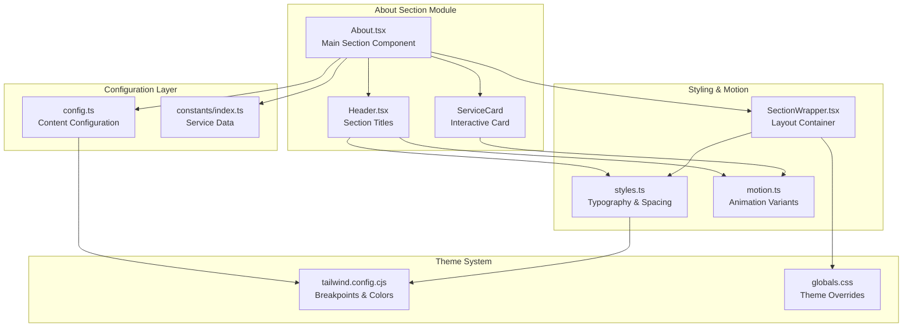
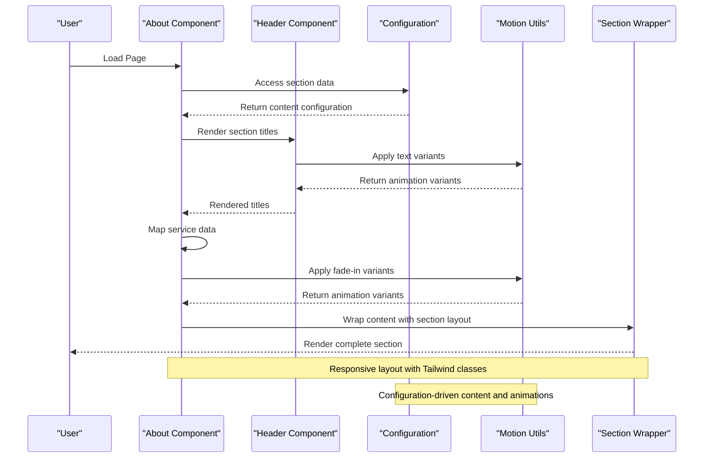
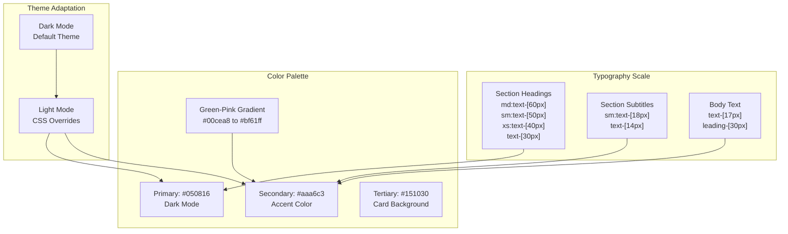
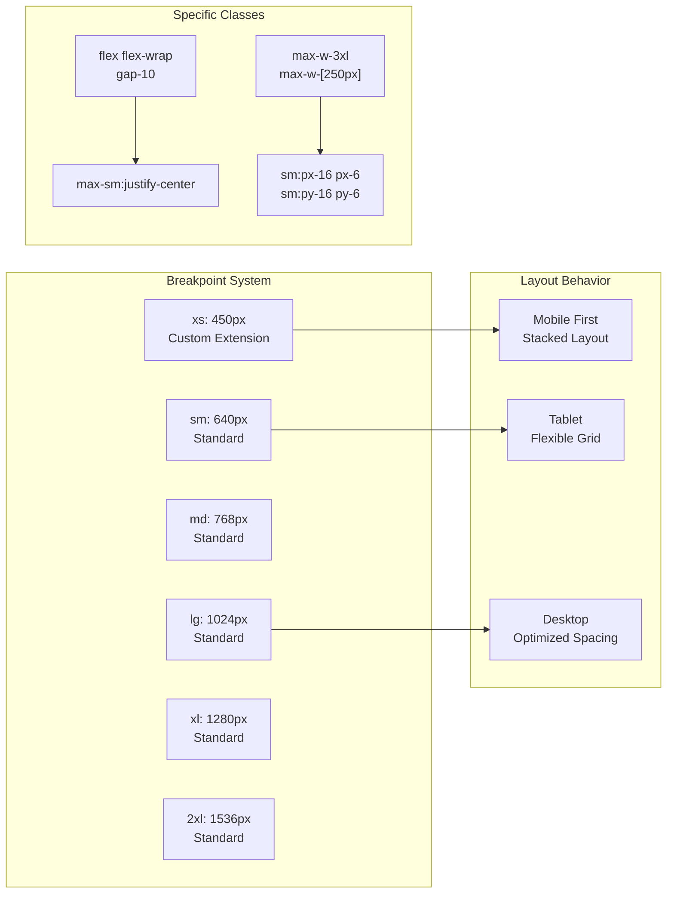
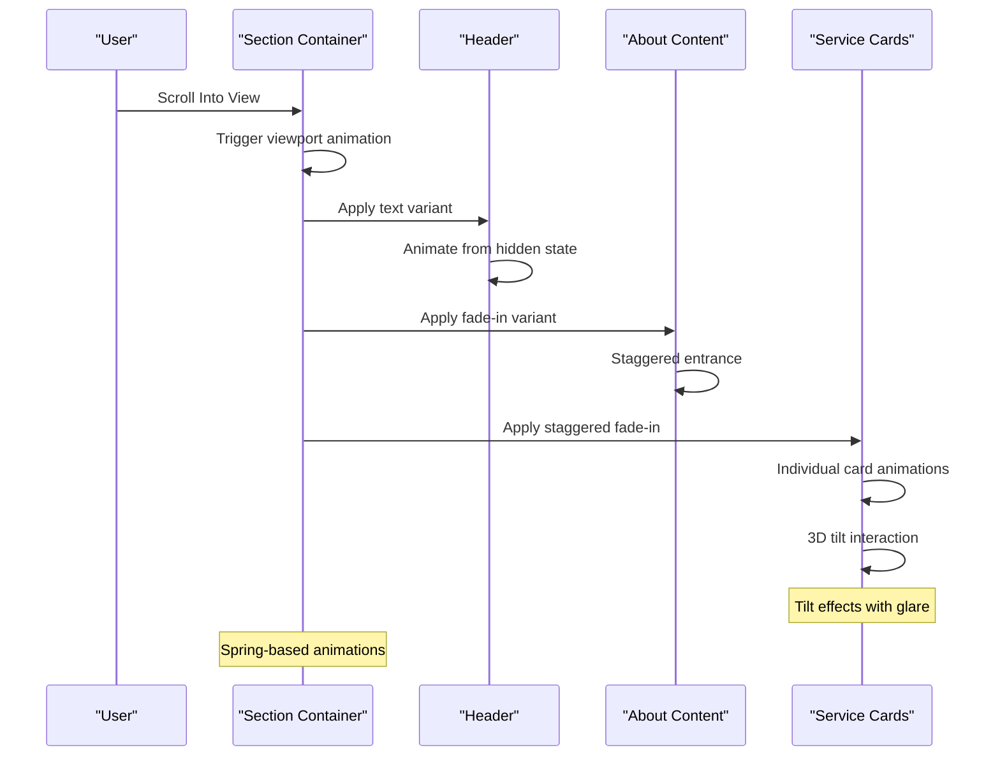
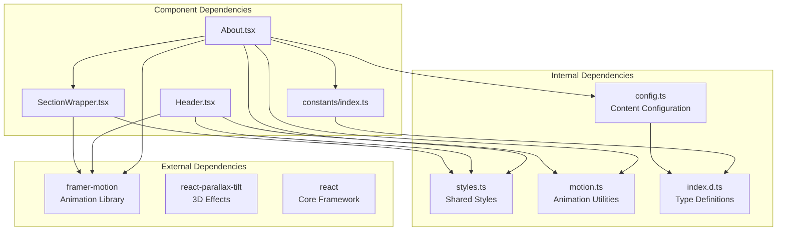

# About Section

<cite>
**Referenced Files in This Document**
- [About.tsx](file://src/components/sections/About.tsx)
- [config.ts](file://src/constants/config.ts)
- [styles.ts](file://src/constants/styles.ts)
- [SectionWrapper.tsx](file://src/hoc/SectionWrapper.tsx)
- [Header.tsx](file://src/components/atoms/Header.tsx)
- [motion.ts](file://src/utils/motion.ts)
- [index.ts](file://src/constants/index.ts)
- [tailwind.config.cjs](file://tailwind.config.cjs)
- [globals.css](file://src/globals.css)
- [index.d.ts](file://src/types/index.d.ts)
</cite>

## Table of Contents
1. [Introduction](#introduction)
2. [Project Structure](#project-structure)
3. [Core Components](#core-components)
4. [Architecture Overview](#architecture-overview)
5. [Detailed Component Analysis](#detailed-component-analysis)
6. [Dependency Analysis](#dependency-analysis)
7. [Performance Considerations](#performance-considerations)
8. [Accessibility and SEO](#accessibility-and-seo)
9. [Troubleshooting Guide](#troubleshooting-guide)
10. [Conclusion](#conclusion)

## Introduction
This document provides comprehensive documentation for the About section component, focusing on the personal introduction section implementation. It covers text content management through configuration data, responsive layout design, styling integration, typography scales, color schemes, responsive breakpoints, and accessibility/SEO considerations. Practical examples demonstrate how to modify content, adjust spacing, and customize visual presentation.

## Project Structure
The About section is organized as a dedicated section component that integrates with shared utilities and configuration. The structure follows a modular approach with clear separation of concerns:
- Section wrapper for consistent layout and animations
- Header component for section titles with optional motion effects
- Service cards for showcasing capabilities with interactive 3D tilt effects
- Configuration-driven content management for easy customization



**Diagram sources**
- [About.tsx:1-68](file://src/components/sections/About.tsx#L1-L68)
- [config.ts:33-38](file://src/constants/config.ts#L33-L38)
- [styles.ts:1-16](file://src/constants/styles.ts#L1-L16)
- [SectionWrapper.tsx:10-28](file://src/hoc/SectionWrapper.tsx#L10-L28)

**Section sources**
- [About.tsx:1-68](file://src/components/sections/About.tsx#L1-L68)
- [config.ts:1-87](file://src/constants/config.ts#L1-L87)
- [styles.ts:1-16](file://src/constants/styles.ts#L1-L16)

## Core Components
The About section consists of several interconnected components that work together to deliver a cohesive user experience:

### Main Section Component
The primary About component serves as the container for the entire section, orchestrating content presentation and layout. It integrates with the SectionWrapper HOC for consistent spacing and animation behavior.

### Header Component
The Header component renders section titles with configurable typography and optional motion effects. It accepts props for subtitle text and main heading, applying consistent styling from the shared styles module.

### Service Cards
Interactive service cards showcase professional capabilities with 3D tilt effects and animated transitions. Each card displays an icon and title, creating an engaging visual representation of skills and expertise.

**Section sources**
- [About.tsx:46-67](file://src/components/sections/About.tsx#L46-L67)
- [Header.tsx:13-28](file://src/components/atoms/Header.tsx#L13-L28)
- [index.ts:51-68](file://src/constants/index.ts#L51-L68)

## Architecture Overview
The About section follows a layered architecture pattern that separates concerns and enables easy customization:



**Diagram sources**
- [About.tsx:46-67](file://src/components/sections/About.tsx#L46-L67)
- [Header.tsx:13-28](file://src/components/atoms/Header.tsx#L13-L28)
- [config.ts:67-71](file://src/constants/config.ts#L67-L71)
- [SectionWrapper.tsx:10-28](file://src/hoc/SectionWrapper.tsx#L10-L28)

The architecture emphasizes:
- Configuration-driven content management
- Reusable motion utilities for consistent animations
- Modular component composition
- Responsive design through Tailwind CSS
- Theme-aware styling with dark/light mode support

## Detailed Component Analysis

### About Component Implementation
The About component serves as the central orchestrator, managing content rendering and layout coordination. It leverages multiple utility modules to deliver a polished user experience.

```mermaid
classDiagram
class About {
+render() JSX.Element
+uses : Header
+uses : ServiceCard
+uses : config.sections.about
+uses : SectionWrapper
}
class ServiceCard {
+index : number
+title : string
+icon : string
+render() JSX.Element
+uses : Tilt
+uses : motion.fadeIn
}
class Header {
+useMotion : boolean
+p : string
+h2 : string
+render() JSX.Element
+uses : textVariant
}
class Config {
+sections : {
about : TSection
experience : TSection
feedbacks : TSection
works : TSection
}
}
About --> Header : "renders"
About --> ServiceCard : "maps services"
About --> Config : "consumes"
ServiceCard --> Tilt : "uses"
ServiceCard --> motion : "uses"
Header --> motion : "uses"
```

**Diagram sources**
- [About.tsx:11-44](file://src/components/sections/About.tsx#L11-L44)
- [Header.tsx:7-11](file://src/components/atoms/Header.tsx#L7-L11)
- [config.ts:33-38](file://src/constants/config.ts#L33-L38)

Key implementation characteristics:
- **Configuration Integration**: Pulls content from `config.sections.about` for dynamic content management
- **Responsive Layout**: Utilizes Tailwind classes for adaptive design across screen sizes
- **Animation System**: Implements staggered fade-in effects for content elements
- **Interactive Elements**: Incorporates 3D tilt effects for enhanced user engagement

**Section sources**
- [About.tsx:46-67](file://src/components/sections/About.tsx#L46-L67)
- [config.ts:67-71](file://src/constants/config.ts#L67-L71)

### Typography Scale and Color Scheme
The About section employs a carefully designed typography scale and color scheme that adapts to both dark and light themes:



**Diagram sources**
- [styles.ts:6-14](file://src/constants/styles.ts#L6-L14)
- [tailwind.config.cjs:8-15](file://tailwind.config.cjs#L8-L15)
- [globals.css:15-108](file://src/globals.css#L15-L108)

Typography specifications:
- **Headings**: Responsive font sizes from 30px to 60px with proportional line heights
- **Subtitles**: Consistent uppercase styling with tracking adjustment
- **Body Text**: Optimized line height (30px) for readability at 17px font size

Color scheme characteristics:
- **Primary**: Deep blue-purple background (#050816) for dark mode
- **Secondary**: Light gray-purple accent (#aaa6c3) for text and highlights
- **Tertiary**: Darker purple (#151030) for card backgrounds
- **Gradient**: Green-to-pink gradient for visual interest and brand identity

**Section sources**
- [styles.ts:6-14](file://src/constants/styles.ts#L6-L14)
- [tailwind.config.cjs:8-15](file://tailwind.config.cjs#L8-L15)
- [globals.css:15-108](file://src/globals.css#L15-L108)

### Responsive Breakpoints and Layout Design
The About section implements a comprehensive responsive design system using Tailwind's breakpoint system:



**Diagram sources**
- [tailwind.config.cjs:19-21](file://tailwind.config.cjs#L19-L21)
- [About.tsx:58](file://src/components/sections/About.tsx#L58)
- [SectionWrapper.tsx:20](file://src/hoc/SectionWrapper.tsx#L20)

Responsive design features:
- **Mobile-First Approach**: Base styles optimized for small screens
- **Flexible Grid**: Service cards adapt from stacked to grid layouts
- **Centered Content**: Mobile-friendly center alignment for service cards
- **Adaptive Widths**: Maximum widths adjust based on screen size
- **Consistent Spacing**: Padding scales appropriately across breakpoints

**Section sources**
- [tailwind.config.cjs:19-21](file://tailwind.config.cjs#L19-L21)
- [About.tsx:58](file://src/components/sections/About.tsx#L58)
- [SectionWrapper.tsx:20](file://src/hoc/SectionWrapper.tsx#L20)

### Animation and Interaction System
The About section incorporates sophisticated animation and interaction patterns for enhanced user experience:



**Diagram sources**
- [SectionWrapper.tsx:16-19](file://src/hoc/SectionWrapper.tsx#L16-L19)
- [Header.tsx:21-27](file://src/components/atoms/Header.tsx#L21-L27)
- [About.tsx:51-56](file://src/components/sections/About.tsx#L51-L56)

Animation system components:
- **Viewport Trigger**: Section-level animation activation
- **Text Variants**: Spring-based entrance animations
- **Fade Effects**: Staggered entrance timing for content elements
- **3D Interactions**: Parallax tilt effects with glare
- **Spring Physics**: Natural movement with easing curves

**Section sources**
- [SectionWrapper.tsx:16-19](file://src/hoc/SectionWrapper.tsx#L16-L19)
- [Header.tsx:21-27](file://src/components/atoms/Header.tsx#L21-L27)
- [motion.ts:4-45](file://src/utils/motion.ts#L4-L45)

## Dependency Analysis
The About section maintains clean dependencies that enable modularity and maintainability:



**Diagram sources**
- [About.tsx:1-10](file://src/components/sections/About.tsx#L1-L10)
- [Header.tsx:1-6](file://src/components/atoms/Header.tsx#L1-L6)
- [SectionWrapper.tsx:1-4](file://src/hoc/SectionWrapper.tsx#L1-L4)

Dependency characteristics:
- **Minimal External Dependencies**: Only essential libraries for animations and effects
- **Type Safety**: Comprehensive TypeScript definitions for all components
- **Configuration-Driven**: Content and behavior primarily controlled through config files
- **Reusable Utilities**: Shared motion and styling utilities across components
- **Clean Imports**: Logical separation of concerns with focused import statements

**Section sources**
- [About.tsx:1-10](file://src/components/sections/About.tsx#L1-L10)
- [index.d.ts:1-45](file://src/types/index.d.ts#L1-L45)

## Performance Considerations
The About section is designed with performance optimization in mind:

### Rendering Optimization
- **Lazy Loading**: Content loads only when section becomes visible
- **Efficient Animations**: Hardware-accelerated transforms for smooth performance
- **Minimal Re-renders**: Pure functional components with focused responsibilities
- **Bundle Size**: Minimal external dependencies reduce bundle overhead

### Memory Management
- **Component Lifecycle**: Proper cleanup of animation listeners
- **Event Handling**: Efficient event binding with automatic cleanup
- **Resource Cleanup**: Automatic disposal of parallax effects when unmounted

### Accessibility Performance
- **Focus Management**: Proper keyboard navigation support
- **Screen Reader**: Semantic HTML structure with ARIA attributes
- **Reduced Motion**: Respect system preferences for motion sensitivity

## Accessibility and SEO

### Accessibility Features
The About section implements comprehensive accessibility standards:

**Keyboard Navigation**
- Full keyboard support for all interactive elements
- Logical tab order through the section content
- Focus indicators for interactive cards

**Screen Reader Support**
- Semantic HTML structure with proper heading hierarchy
- Descriptive alt text for all images and icons
- ARIA labels for interactive elements

**Motion Preferences**
- Respects reduced motion settings
- Provides alternative static presentations
- Smooth transitions with configurable timing

**Color Contrast**
- Maintains WCAG 2.1 AA contrast ratios
- Theme-aware color adjustments for light mode
- Sufficient color differentiation for all users

### SEO Optimization
The About section includes SEO best practices:

**Content Structure**
- Clear heading hierarchy (H2 for section titles)
- Descriptive meta content from configuration
- Semantic markup for content organization

**Technical SEO**
- Proper image optimization with responsive sizing
- Fast loading with minimal JavaScript
- Mobile-first indexing friendly design

**Structured Data**
- Potential for schema.org integration
- Semantic content structure for search engines
- Clear content categorization

**Section sources**
- [config.ts:42-46](file://src/constants/config.ts#L42-L46)
- [globals.css:15-108](file://src/globals.css#L15-L108)

## Troubleshooting Guide

### Common Issues and Solutions

**Content Not Displaying**
- Verify configuration data exists in `config.sections.about`
- Check that the section wrapper is properly applied
- Ensure service data is correctly imported from constants

**Animation Issues**
- Confirm framer-motion is properly installed
- Verify viewport intersection observer support
- Check browser compatibility for CSS transforms

**Responsive Layout Problems**
- Validate Tailwind CSS installation and configuration
- Check custom breakpoint definitions
- Ensure responsive class naming follows Tailwind conventions

**Styling Conflicts**
- Review theme-specific CSS overrides
- Verify color palette consistency
- Check for conflicting global styles

**Performance Issues**
- Monitor animation frame rates
- Optimize image assets
- Reduce unnecessary re-renders

### Debugging Tips
- Use browser developer tools to inspect element classes
- Check console for JavaScript errors
- Validate HTML structure with accessibility tools
- Test responsive behavior across device emulators

**Section sources**
- [About.tsx:46-67](file://src/components/sections/About.tsx#L46-L67)
- [config.ts:67-71](file://src/constants/config.ts#L67-L71)

## Conclusion
The About section component demonstrates a well-architected implementation that balances functionality, aesthetics, and maintainability. Through configuration-driven content management, responsive design principles, and thoughtful accessibility considerations, it provides an excellent foundation for personal introduction sections. The modular architecture enables easy customization while maintaining performance and user experience standards.

The implementation showcases best practices in modern React development, including:
- Clean separation of concerns
- Type-safe development
- Performance optimization
- Comprehensive accessibility support
- SEO-friendly structure

Future enhancements could include dynamic content loading, additional animation effects, and expanded customization options while maintaining the existing architectural strengths.