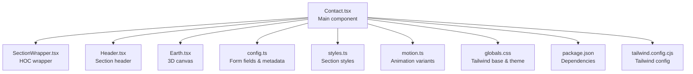
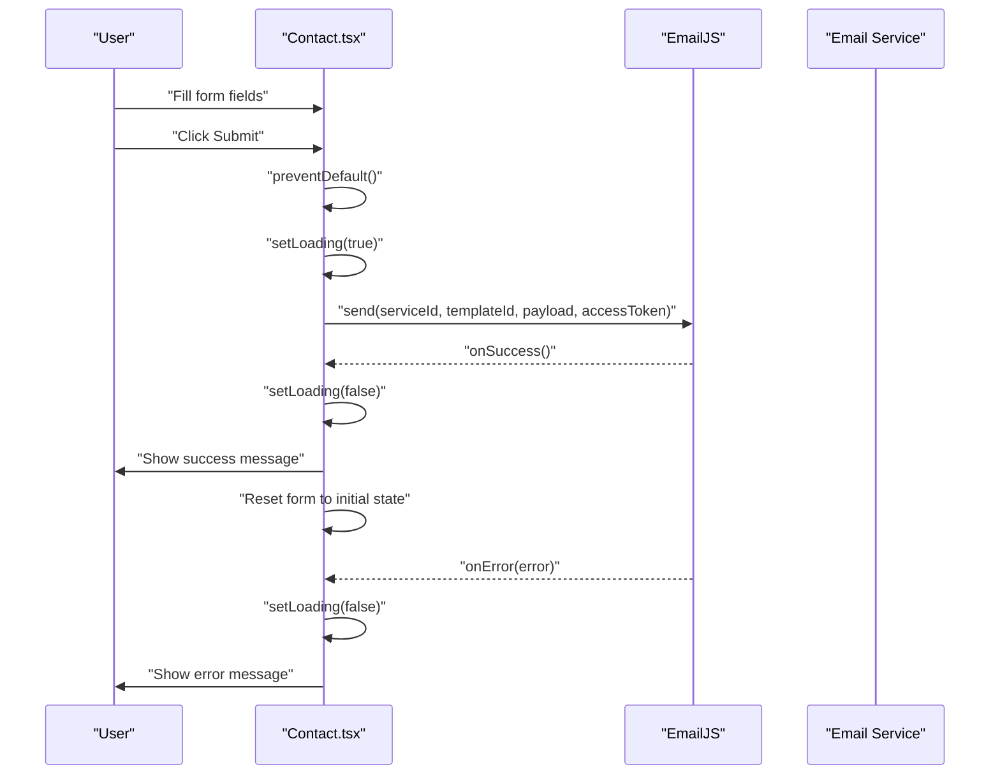
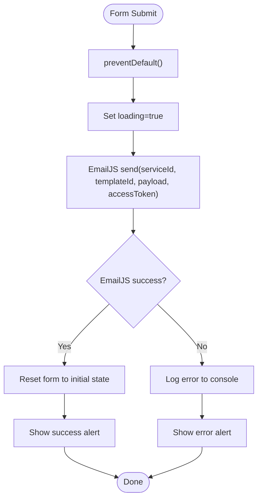
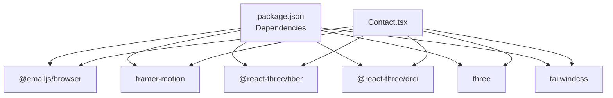

# Contact Section

<cite>
**Referenced Files in This Document**
- [Contact.tsx](file://src/components/sections/Contact.tsx)
- [config.ts](file://src/constants/config.ts)
- [SectionWrapper.tsx](file://src/hoc/SectionWrapper.tsx)
- [Header.tsx](file://src/components/atoms/Header.tsx)
- [Earth.tsx](file://src/components/canvas/Earth.tsx)
- [motion.ts](file://src/utils/motion.ts)
- [styles.ts](file://src/constants/styles.ts)
- [globals.css](file://src/globals.css)
- [package.json](file://package.json)
- [tailwind.config.cjs](file://tailwind.config.cjs)
</cite>

## Table of Contents
1. [Introduction](#introduction)
2. [Project Structure](#project-structure)
3. [Core Components](#core-components)
4. [Architecture Overview](#architecture-overview)
5. [Detailed Component Analysis](#detailed-component-analysis)
6. [Dependency Analysis](#dependency-analysis)
7. [Performance Considerations](#performance-considerations)
8. [Troubleshooting Guide](#troubleshooting-guide)
9. [Conclusion](#conclusion)

## Introduction
This document provides comprehensive documentation for the Contact section component. It explains the contact form implementation, including form state management, EmailJS integration, and submission handling. It documents the form field structure, validation rules, success/error messaging, styling approach using Tailwind CSS, and responsive layout. It also covers customization examples, EmailJS configuration, security considerations, spam protection, accessibility features, and troubleshooting common form issues.

## Project Structure
The Contact section is implemented as a standalone section component that integrates with reusable utilities and constants. The component uses:
- Framer Motion for animations
- EmailJS for sending emails
- Three.js canvas for a 3D Earth visualization
- Tailwind CSS for styling and responsive design
- Configuration-driven form fields

**Diagram sources**
- [Contact.tsx:1-124](file://src/components/sections/Contact.tsx#L1-L124)
- [SectionWrapper.tsx:1-31](file://src/hoc/SectionWrapper.tsx#L1-L31)
- [Header.tsx:1-29](file://src/components/atoms/Header.tsx#L1-L29)
- [Earth.tsx:1-46](file://src/components/canvas/Earth.tsx#L1-L46)
- [config.ts:1-87](file://src/constants/config.ts#L1-L87)
- [styles.ts:1-16](file://src/constants/styles.ts#L1-L16)
- [motion.ts:1-92](file://src/utils/motion.ts#L1-L92)
- [globals.css:1-369](file://src/globals.css#L1-L369)
- [package.json:1-45](file://package.json#L1-L45)
- [tailwind.config.cjs:1-29](file://tailwind.config.cjs#L1-L29)

**Section sources**
- [Contact.tsx:1-124](file://src/components/sections/Contact.tsx#L1-L124)
- [config.ts:1-87](file://src/constants/config.ts#L1-L87)

## Core Components
- Contact section component: Manages form state, handles input changes, submits via EmailJS, and renders a responsive layout with animated header and a 3D Earth visualization.
- Section wrapper HOC: Provides section-level animation and container styling.
- Header atom: Renders section subtitle and title with optional motion.
- Earth canvas: Displays a rotating 3D Earth model using Three.js and Drei.
- Configuration constants: Define form fields, labels, placeholders, and target recipient details.
- Styles and motion utilities: Provide Tailwind-based styling and animation variants.

Key responsibilities:
- Form state management and controlled inputs
- EmailJS integration and submission payload
- Responsive layout with Tailwind CSS
- Accessibility-friendly labels and placeholders
- Animation and visual presentation

**Section sources**
- [Contact.tsx:21-124](file://src/components/sections/Contact.tsx#L21-L124)
- [SectionWrapper.tsx:10-31](file://src/hoc/SectionWrapper.tsx#L10-L31)
- [Header.tsx:13-29](file://src/components/atoms/Header.tsx#L13-L29)
- [Earth.tsx:15-46](file://src/components/canvas/Earth.tsx#L15-L46)
- [config.ts:17-65](file://src/constants/config.ts#L17-L65)
- [styles.ts:1-16](file://src/constants/styles.ts#L1-L16)
- [motion.ts:69-91](file://src/utils/motion.ts#L69-L91)

## Architecture Overview
The Contact section follows a modular architecture:
- Presentation layer: Contact component renders the form and Earth canvas.
- State management: Controlled form inputs update local state.
- Integration layer: EmailJS sends the form payload to the configured service.
- Utility layer: Section wrapper, header, and motion utilities provide shared behavior.
- Configuration layer: Centralized form field definitions and metadata.

**Diagram sources**
- [Contact.tsx:34-66](file://src/components/sections/Contact.tsx#L34-L66)

## Detailed Component Analysis

### Contact Component
The Contact component encapsulates:
- Initial form state derived from configuration keys
- Controlled input handlers for text and textarea
- EmailJS submission with dynamic payload mapping
- Loading state during submission
- Responsive layout with Tailwind classes and motion variants

Implementation highlights:
- Controlled inputs: Each field updates a single state object keyed by field name.
- Dynamic rendering: Form fields are generated from configuration, with special handling for textarea vs input.
- EmailJS payload: Maps form values to template variables for the email service.
- Success and error handling: Uses alerts and resets form state upon completion.

**Diagram sources**
- [Contact.tsx:34-66](file://src/components/sections/Contact.tsx#L34-L66)

**Section sources**
- [Contact.tsx:11-13](file://src/components/sections/Contact.tsx#L11-L13)
- [Contact.tsx:15-19](file://src/components/sections/Contact.tsx#L15-L19)
- [Contact.tsx:26-32](file://src/components/sections/Contact.tsx#L26-L32)
- [Contact.tsx:34-66](file://src/components/sections/Contact.tsx#L34-L66)
- [Contact.tsx:78-110](file://src/components/sections/Contact.tsx#L78-L110)

### Form Field Structure and Validation
Form fields are defined centrally and rendered dynamically:
- Fields: name, email, message
- Labels and placeholders: Provided via configuration
- Special rendering: message uses textarea; others use input with type text or email
- Controlled inputs: onChange updates state by field name

Validation behavior:
- No client-side validation is implemented in the component.
- EmailJS validation is handled server-side by the EmailJS service.
- The component relies on the EmailJS template to enforce required fields and formatting.

Customization examples:
- Add new fields: Extend the configuration object with new keys under contact.form.
- Change labels/placeholders: Modify the span and placeholder values in config.
- Adjust rendering: Modify the dynamic component selection logic for special cases.

**Section sources**
- [config.ts:17-65](file://src/constants/config.ts#L17-L65)
- [Contact.tsx:84-103](file://src/components/sections/Contact.tsx#L84-L103)

### EmailJS Integration
Integration details:
- Environment variables: serviceId, templateId, accessToken are loaded from Vite environment variables.
- Payload mapping: The component constructs a payload object with keys aligned to the EmailJS template variables.
- Submission: The send method is invoked with serviceId, templateId, payload, and accessToken.
- Error handling: On failure, logs the error and shows a generic error message.

Security considerations:
- Access token is stored in environment variables to prevent exposure in client-side code.
- Template variables should match the payload keys to avoid mismatches.
- Consider adding rate limiting or CAPTCHA at the EmailJS template level for spam protection.

Configuration steps:
- Set VITE_EMAILJS_SERVICE_ID, VITE_EMAILJS_TEMPLATE_ID, and VITE_EMAILJS_ACCESS_TOKEN in your environment.
- Ensure the EmailJS template variables match the payload keys used in the component.

**Section sources**
- [Contact.tsx:15-19](file://src/components/sections/Contact.tsx#L15-L19)
- [Contact.tsx:39-51](file://src/components/sections/Contact.tsx#L39-L51)
- [config.ts:42-46](file://src/constants/config.ts#L42-L46)

### Styling Approach and Responsive Layout
Styling and responsiveness:
- Tailwind CSS classes define input backgrounds, text colors, spacing, and button styles.
- Dark/light theme support: CSS overrides adjust colors for light mode.
- Responsive layout: Flexbox and grid utilities adapt the layout for different screen sizes.
- Motion: Framer Motion variants animate the header and section containers.

Accessibility:
- Labels are associated with inputs via the label element and span content.
- Placeholders provide hints for input fields.
- Focus states are managed by Tailwind outline-none; consider adding focus-visible styles for keyboard navigation.

**Section sources**
- [Contact.tsx:78-110](file://src/components/sections/Contact.tsx#L78-L110)
- [globals.css:53-72](file://src/globals.css#L53-L72)
- [globals.css:16-36](file://src/globals.css#L16-L36)
- [tailwind.config.cjs:1-29](file://tailwind.config.cjs#L1-L29)

### Animation and Visual Presentation
- Section wrapper: Applies motion section container with viewport-based animations.
- Header animation: Optional motion variant for the section header.
- Earth canvas: 3D visualization with orbit controls and preloading.

**Section sources**
- [SectionWrapper.tsx:10-28](file://src/hoc/SectionWrapper.tsx#L10-L28)
- [Header.tsx:13-28](file://src/components/atoms/Header.tsx#L13-L28)
- [Earth.tsx:15-46](file://src/components/canvas/Earth.tsx#L15-L46)
- [motion.ts:69-91](file://src/utils/motion.ts#L69-L91)

## Dependency Analysis
External dependencies and integrations:
- @emailjs/browser: EmailJS SDK for browser-based email sending.
- framer-motion: Animation library for section and header transitions.
- @react-three/fiber and @react-three/drei: 3D rendering and controls.
- three: Core 3D engine for the Earth model.
- Tailwind CSS: Utility-first CSS framework for styling and responsive design.

**Diagram sources**
- [package.json:13-24](file://package.json#L13-L24)
- [Contact.tsx:2-3](file://src/components/sections/Contact.tsx#L2-L3)

**Section sources**
- [package.json:13-24](file://package.json#L13-L24)
- [Contact.tsx:2-3](file://src/components/sections/Contact.tsx#L2-L3)

## Performance Considerations
- Controlled inputs: Updates state incrementally; minimal re-renders due to small state shape.
- EmailJS: Network requests occur only on submit; loading state prevents multiple submissions.
- Canvas: Lazy loading via Suspense and preload reduce initial load impact.
- Tailwind: JIT compilation and purging optimize CSS bundle size.

## Troubleshooting Guide
Common issues and resolutions:
- Environment variables not set:
  - Ensure VITE_EMAILJS_SERVICE_ID, VITE_EMAILJS_TEMPLATE_ID, and VITE_EMAILJS_ACCESS_TOKEN are defined in your environment.
  - Verify the values match your EmailJS service configuration.
- EmailJS template mismatch:
  - Confirm payload keys align with EmailJS template variables.
  - Check that required fields are present in the template.
- Form not resetting after submission:
  - The component resets to initial state after success; verify that the initial state is correctly derived from configuration keys.
- Styling inconsistencies:
  - Check Tailwind theme configuration and CSS overrides for light/dark modes.
  - Ensure Tailwind classes are applied consistently across components.
- Canvas rendering issues:
  - Verify Three.js and Drei versions are compatible.
  - Check for Suspense fallback rendering and preload completion.

**Section sources**
- [Contact.tsx:11-13](file://src/components/sections/Contact.tsx#L11-L13)
- [Contact.tsx:15-19](file://src/components/sections/Contact.tsx#L15-L19)
- [Contact.tsx:52-65](file://src/components/sections/Contact.tsx#L52-L65)
- [globals.css:53-72](file://src/globals.css#L53-L72)
- [tailwind.config.cjs:1-29](file://tailwind.config.cjs#L1-L29)

## Conclusion
The Contact section component provides a clean, configurable, and accessible contact form integrated with EmailJS. Its modular design, centralized configuration, and Tailwind-based styling enable easy customization and responsive layouts. By following the configuration and environment setup guidelines, developers can tailor the form fields, validation behavior, and styling to meet project requirements while maintaining security and performance best practices.