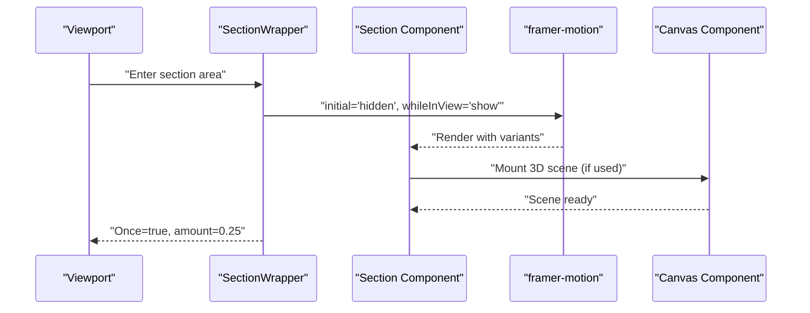
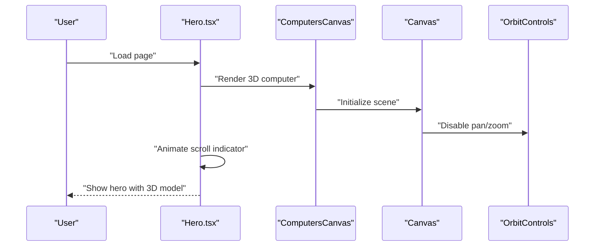
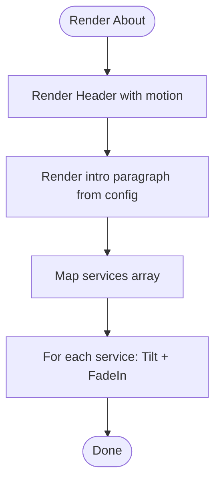
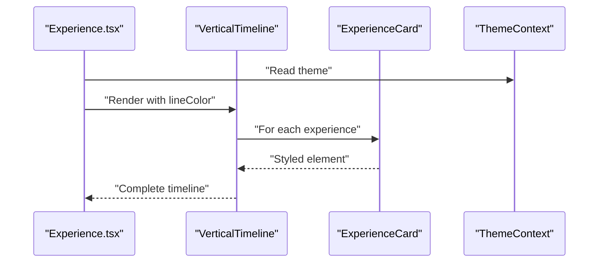
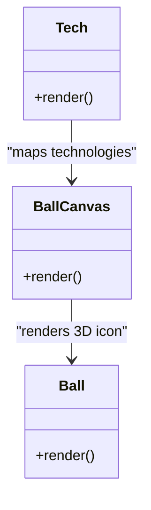
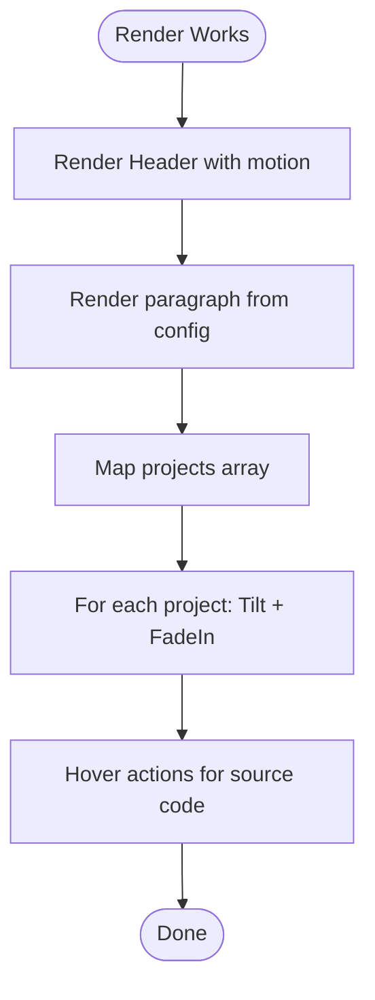
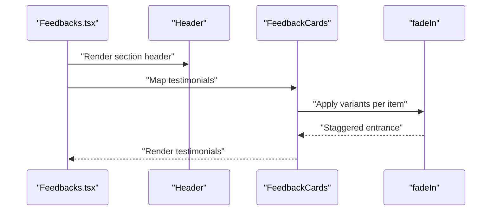
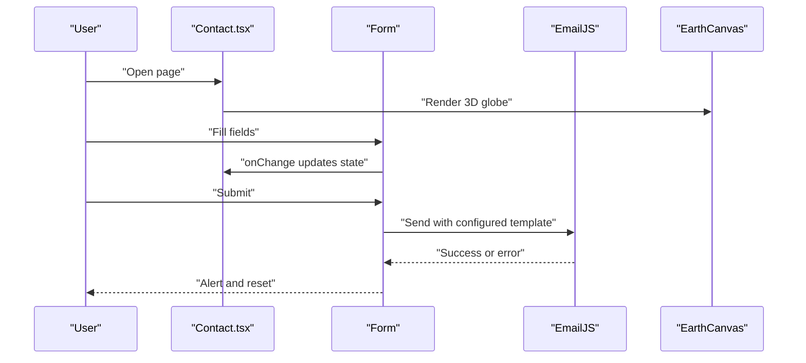
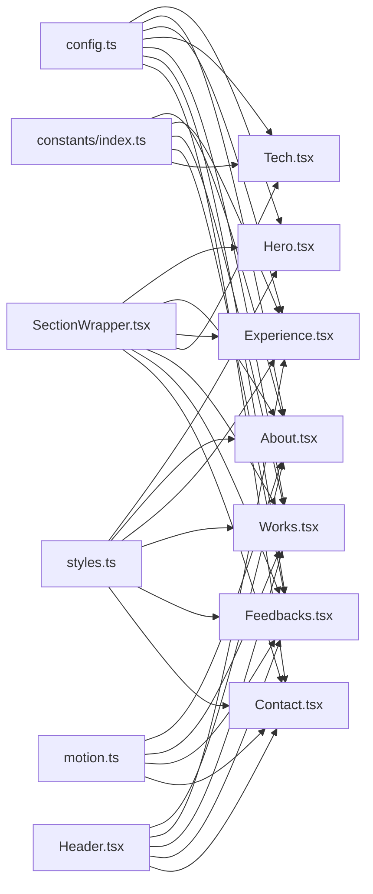

# Content Sections

<cite>
**Referenced Files in This Document**
- [Hero.tsx](file://src/components/sections/Hero.tsx)
- [About.tsx](file://src/components/sections/About.tsx)
- [Experience.tsx](file://src/components/sections/Experience.tsx)
- [Tech.tsx](file://src/components/sections/Tech.tsx)
- [Works.tsx](file://src/components/sections/Works.tsx)
- [Feedbacks.tsx](file://src/components/sections/Feedbacks.tsx)
- [Contact.tsx](file://src/components/sections/Contact.tsx)
- [Computers.tsx](file://src/components/canvas/Computers.tsx)
- [Ball.tsx](file://src/components/canvas/Ball.tsx)
- [SectionWrapper.tsx](file://src/hoc/SectionWrapper.tsx)
- [Header.tsx](file://src/components/atoms/Header.tsx)
- [config.ts](file://src/constants/config.ts)
- [index.ts](file://src/constants/index.ts)
- [motion.ts](file://src/utils/motion.ts)
- [styles.ts](file://src/constants/styles.ts)
- [index.d.ts](file://src/types/index.d.ts)
</cite>

## Table of Contents
1. [Introduction](#introduction)
2. [Project Structure](#project-structure)
3. [Core Components](#core-components)
4. [Architecture Overview](#architecture-overview)
5. [Detailed Component Analysis](#detailed-component-analysis)
6. [Dependency Analysis](#dependency-analysis)
7. [Performance Considerations](#performance-considerations)
8. [Troubleshooting Guide](#troubleshooting-guide)
9. [Conclusion](#conclusion)
10. [Appendices](#appendices)

## Introduction
This document explains the content sections of the 3D Portfolio application. It covers the Hero, About, Experience, Tech, Works, Feedbacks, and Contact sections. For each section, we describe implementation patterns, data structures, animation techniques, scroll-triggered behaviors, responsive behavior, and customization options. The goal is to help you modify content, adjust styling, and tailor animations to your needs.

## Project Structure
The content sections are organized under src/components/sections and are composed of:
- Atomic UI elements (Header)
- Canvas-based 3D components (Computers, Ball)
- Motion utilities (framer-motion variants)
- Configuration and constants for content and styling
- A Higher-Order Component (SectionWrapper) that standardizes section layout and scroll-triggered animations

```mermaid
graph TB
subgraph "Sections"
Hero["Hero.tsx"]
About["About.tsx"]
Experience["Experience.tsx"]
Tech["Tech.tsx"]
Works["Works.tsx"]
Feedbacks["Feedbacks.tsx"]
Contact["Contact.tsx"]
end
subgraph "Atoms"
Header["Header.tsx"]
end
subgraph "Canvas"
Computers["Computers.tsx"]
Ball["Ball.tsx"]
end
subgraph "Motion"
SW["SectionWrapper.tsx"]
Motion["motion.ts"]
end
subgraph "Config"
Config["config.ts"]
Const["index.ts"]
Styles["styles.ts"]
Types["index.d.ts"]
end
Hero --> Computers
Tech --> Ball
About --> Header
Experience --> Header
Works --> Header
Feedbacks --> Header
Contact --> Header
Hero --> SW
About --> SW
Experience --> SW
Tech --> SW
Works --> SW
Feedbacks --> SW
Contact --> SW
About --> Motion
Works --> Motion
Feedbacks --> Motion
Contact --> Motion
Hero --> Config
About --> Const
Experience --> Const
Works --> Const
Feedbacks --> Const
Contact --> Config
Hero --> Styles
About --> Styles
Experience --> Styles
Works --> Styles
Feedbacks --> Styles
Contact --> Styles
About --> Types
Experience --> Types
Works --> Types
Feedbacks --> Types
Contact --> Types
```

**Diagram sources**
- [Hero.tsx:1-53](file://src/components/sections/Hero.tsx#L1-L53)
- [About.tsx:1-68](file://src/components/sections/About.tsx#L1-L68)
- [Experience.tsx:1-83](file://src/components/sections/Experience.tsx#L1-L83)
- [Tech.tsx:1-20](file://src/components/sections/Tech.tsx#L1-L20)
- [Works.tsx:1-90](file://src/components/sections/Works.tsx#L1-L90)
- [Feedbacks.tsx:1-67](file://src/components/sections/Feedbacks.tsx#L1-L67)
- [Contact.tsx:1-124](file://src/components/sections/Contact.tsx#L1-L124)
- [Computers.tsx:1-85](file://src/components/canvas/Computers.tsx#L1-L85)
- [Ball.tsx:1-59](file://src/components/canvas/Ball.tsx#L1-L59)
- [SectionWrapper.tsx:1-31](file://src/hoc/SectionWrapper.tsx#L1-L31)
- [Header.tsx:1-29](file://src/components/atoms/Header.tsx#L1-L29)
- [config.ts:1-87](file://src/constants/config.ts#L1-L87)
- [index.ts:1-258](file://src/constants/index.ts#L1-L258)
- [motion.ts:1-92](file://src/utils/motion.ts#L1-L92)
- [styles.ts:1-16](file://src/constants/styles.ts#L1-L16)
- [index.d.ts:1-45](file://src/types/index.d.ts#L1-L45)

**Section sources**
- [Hero.tsx:1-53](file://src/components/sections/Hero.tsx#L1-L53)
- [SectionWrapper.tsx:1-31](file://src/hoc/SectionWrapper.tsx#L1-L31)
- [Header.tsx:1-29](file://src/components/atoms/Header.tsx#L1-L29)
- [Computers.tsx:1-85](file://src/components/canvas/Computers.tsx#L1-L85)
- [Ball.tsx:1-59](file://src/components/canvas/Ball.tsx#L1-L59)
- [config.ts:1-87](file://src/constants/config.ts#L1-L87)
- [index.ts:1-258](file://src/constants/index.ts#L1-L258)
- [motion.ts:1-92](file://src/utils/motion.ts#L1-L92)
- [styles.ts:1-16](file://src/constants/styles.ts#L1-L16)
- [index.d.ts:1-45](file://src/types/index.d.ts#L1-L45)

## Core Components
- SectionWrapper: Wraps each section with scroll-triggered animation and anchor spacing. It sets viewport thresholds and ensures animations play once.
- Header: Renders section headers with optional motion variant for entrance effects.
- Canvas components: Provide 3D scenes for Hero and Tech sections using Three.js via @react-three/fiber and @react-three/drei.
- Motion utilities: Provide reusable variants for fade-in, slide-in, zoom-in, and text entrance.

Key responsibilities:
- Hero: Presents a hero headline and animated scroll indicator; embeds a 3D computer model via ComputersCanvas.
- About: Introduces personal overview and service cards with parallax tilt and staggered fade-in.
- Experience: Timeline of professional experience with theme-aware styling.
- Tech: Animated technology icons rendered inside 3D balls.
- Works: Project showcase with interactive cards and hover actions.
- Feedbacks: Testimonials with staggered fade-in and quote styling.
- Contact: Form with controlled inputs, submission via EmailJS, and animated layout split.

**Section sources**
- [SectionWrapper.tsx:10-28](file://src/hoc/SectionWrapper.tsx#L10-L28)
- [Header.tsx:13-28](file://src/components/atoms/Header.tsx#L13-L28)
- [Computers.tsx:32-82](file://src/components/canvas/Computers.tsx#L32-L82)
- [Ball.tsx:41-56](file://src/components/canvas/Ball.tsx#L41-L56)
- [motion.ts:21-45](file://src/utils/motion.ts#L21-L45)

## Architecture Overview
The sections share a consistent pattern:
- Wrapped by SectionWrapper for scroll-triggered animations and layout.
- Styled via shared constants and Tailwind classes.
- Data-driven through constants and configuration files.
- 3D visuals provided by dedicated canvas components.



**Diagram sources**
- [SectionWrapper.tsx:16-22](file://src/hoc/SectionWrapper.tsx#L16-L22)
- [Hero.tsx:29-29](file://src/components/sections/Hero.tsx#L29-L29)
- [Tech.tsx:10-12](file://src/components/sections/Tech.tsx#L10-L12)

## Detailed Component Analysis

### Hero Section
- Purpose: Hero headline, animated scroll indicator, and a 3D computer model.
- Implementation highlights:
  - Uses ComputersCanvas to render a 3D scene with orbit controls disabled and preloaded assets.
  - Includes a vertical animated indicator that repeats infinitely with framer-motion.
  - Responsive typography and spacing via shared styles.
- Animation techniques:
  - Scroll-triggered section container via SectionWrapper.
  - Repeating vertical bounce motion for the scroll indicator.
- Responsive behavior:
  - ComputersCanvas hides the 3D scene on small screens to optimize performance.
- Customization tips:
  - Modify headline and subtitle via config.hero.p entries.
  - Adjust styles for typography and spacing using styles constants.
  - Tune the scroll indicator animation parameters (duration, repeat type).



**Diagram sources**
- [Hero.tsx:29-29](file://src/components/sections/Hero.tsx#L29-L29)
- [Computers.tsx:32-82](file://src/components/canvas/Computers.tsx#L32-L82)

**Section sources**
- [Hero.tsx:1-53](file://src/components/sections/Hero.tsx#L1-L53)
- [Computers.tsx:1-85](file://src/components/canvas/Computers.tsx#L1-L85)
- [styles.ts:6-15](file://src/constants/styles.ts#L6-L15)
- [config.ts:47-50](file://src/constants/config.ts#L47-L50)

### About Section
- Purpose: Personal introduction and service cards.
- Implementation highlights:
  - Uses Header with motion variant for entrance.
  - Displays a paragraph from config.sections.about.content.
  - Renders service cards with parallax tilt and staggered fade-in.
- Animation techniques:
  - fadeIn variant with spring easing and per-item delays.
  - Parallax tilt for interactive depth effect.
- Responsive behavior:
  - Cards wrap responsively and center on small screens.
- Customization tips:
  - Edit content in config.sections.about.content.
  - Add or remove services in constants/services.
  - Adjust card layout and tilt parameters.



**Diagram sources**
- [About.tsx:46-67](file://src/components/sections/About.tsx#L46-L67)
- [Header.tsx:13-28](file://src/components/atoms/Header.tsx#L13-L28)
- [motion.ts:21-45](file://src/utils/motion.ts#L21-L45)

**Section sources**
- [About.tsx:1-68](file://src/components/sections/About.tsx#L1-L68)
- [index.ts:51-68](file://src/constants/index.ts#L51-L68)
- [config.ts:66-71](file://src/constants/config.ts#L66-L71)
- [motion.ts:21-45](file://src/utils/motion.ts#L21-L45)

### Experience Section
- Purpose: Professional timeline with theme-aware styling.
- Implementation highlights:
  - Uses react-vertical-timeline for a responsive vertical timeline.
  - Each experience item renders company, role, date, and bullet points.
  - Theme-aware colors and arrow styling via context.
- Animation techniques:
  - SectionWrapper handles scroll-triggered entrance.
- Responsive behavior:
  - Timeline adapts to dark/light themes.
- Customization tips:
  - Extend or edit experiences in constants/experiences.
  - Adjust timeline line color and element styling.



**Diagram sources**
- [Experience.tsx:63-82](file://src/components/sections/Experience.tsx#L63-L82)

**Section sources**
- [Experience.tsx:1-83](file://src/components/sections/Experience.tsx#L1-L83)
- [index.ts:125-162](file://src/constants/index.ts#L125-L162)

### Tech Section
- Purpose: Skills showcase using animated 3D balls.
- Implementation highlights:
  - Renders a grid of 3D balls, each displaying a technology icon.
  - Uses BallCanvas to render an interactive icosahedron with a decal.
- Animation techniques:
  - Floating and subtle rotation via Float.
  - Canvas preloading and orbit controls disabled for static presentation.
- Responsive behavior:
  - Grid layout centers and wraps on smaller screens.
- Customization tips:
  - Add or remove technologies in constants/technologies.
  - Adjust ball sizing and layout spacing.



**Diagram sources**
- [Tech.tsx:5-17](file://src/components/sections/Tech.tsx#L5-L17)
- [Ball.tsx:41-56](file://src/components/canvas/Ball.tsx#L41-L56)

**Section sources**
- [Tech.tsx:1-20](file://src/components/sections/Tech.tsx#L1-L20)
- [Ball.tsx:1-59](file://src/components/canvas/Ball.tsx#L1-L59)
- [index.ts:70-123](file://src/constants/index.ts#L70-L123)

### Works Section
- Purpose: Project portfolio with interactive cards.
- Implementation highlights:
  - Uses Header with motion variant.
  - Displays a paragraph from config.sections.works.content.
  - Project cards with image, tags, and source code link action.
  - Staggered fade-in per card and parallax tilt.
- Animation techniques:
  - fadeIn variant with spring easing and per-item delays.
  - Parallax tilt for depth perception.
- Responsive behavior:
  - Flex wrap and centered alignment on small screens.
- Customization tips:
  - Edit content in config.sections.works.content.
  - Add or modify projects in constants/projects.



**Diagram sources**
- [Works.tsx:66-90](file://src/components/sections/Works.tsx#L66-L90)
- [Header.tsx:13-28](file://src/components/atoms/Header.tsx#L13-L28)
- [motion.ts:21-45](file://src/utils/motion.ts#L21-L45)

**Section sources**
- [Works.tsx:1-90](file://src/components/sections/Works.tsx#L1-L90)
- [index.ts:191-255](file://src/constants/index.ts#L191-L255)
- [config.ts:80-84](file://src/constants/config.ts#L80-L84)
- [motion.ts:21-45](file://src/utils/motion.ts#L21-L45)

### Feedbacks Section
- Purpose: Testimonials with quote styling and staggered entrance.
- Implementation highlights:
  - Header inside a styled container.
  - Testimonial cards with quote punctuation, author info, and avatar.
  - Staggered fade-in per testimonial.
- Animation techniques:
  - fadeIn variant with spring easing and per-item delays.
- Responsive behavior:
  - Cards wrap and center on small screens.
- Customization tips:
  - Edit testimonials in constants/testimonials.
  - Adjust padding and container styling via styles constants.



**Diagram sources**
- [Feedbacks.tsx:47-67](file://src/components/sections/Feedbacks.tsx#L47-L67)
- [Header.tsx:13-28](file://src/components/atoms/Header.tsx#L13-L28)
- [motion.ts:21-45](file://src/utils/motion.ts#L21-L45)

**Section sources**
- [Feedbacks.tsx:1-67](file://src/components/sections/Feedbacks.tsx#L1-L67)
- [index.ts:164-189](file://src/constants/index.ts#L164-L189)
- [motion.ts:21-45](file://src/utils/motion.ts#L21-L45)

### Contact Section
- Purpose: Contact form with EmailJS integration and animated layout.
- Implementation highlights:
  - Controlled form state derived from config.contact.form keys.
  - Submission payload constructed from form state and config.html.
  - Animated layout split with slide-in variants for content and 3D earth canvas.
  - EarthCanvas embedded for visual context.
- Animation techniques:
  - slideIn variants for left/right entrance.
  - SectionWrapper for scroll-triggered entrance.
- Responsive behavior:
  - Stacked layout on extra-small screens, side-by-side on larger screens.
- Customization tips:
  - Update form field labels and placeholders in config.contact.form.
  - Configure EmailJS credentials via environment variables.
  - Adjust button and input styling via Tailwind classes.



**Diagram sources**
- [Contact.tsx:21-66](file://src/components/sections/Contact.tsx#L21-L66)
- [Contact.tsx:68-121](file://src/components/sections/Contact.tsx#L68-L121)

**Section sources**
- [Contact.tsx:1-124](file://src/components/sections/Contact.tsx#L1-L124)
- [config.ts:51-65](file://src/constants/config.ts#L51-L65)

## Dependency Analysis
- Data dependencies:
  - Sections consume constants for services, technologies, experiences, testimonials, and projects.
  - Content is driven by config.ts for headings, paragraphs, and form fields.
- Motion dependencies:
  - fadeIn, slideIn, and textVariant are reused across sections.
- Canvas dependencies:
  - Hero uses ComputersCanvas; Tech uses BallCanvas.
- Wrapper dependencies:
  - SectionWrapper standardizes viewport triggers and layout.



**Diagram sources**
- [config.ts:1-87](file://src/constants/config.ts#L1-L87)
- [index.ts:1-258](file://src/constants/index.ts#L1-L258)
- [motion.ts:1-92](file://src/utils/motion.ts#L1-L92)
- [SectionWrapper.tsx:1-31](file://src/hoc/SectionWrapper.tsx#L1-L31)
- [Header.tsx:1-29](file://src/components/atoms/Header.tsx#L1-L29)
- [styles.ts:1-16](file://src/constants/styles.ts#L1-L16)

**Section sources**
- [config.ts:1-87](file://src/constants/config.ts#L1-L87)
- [index.ts:1-258](file://src/constants/index.ts#L1-L258)
- [motion.ts:1-92](file://src/utils/motion.ts#L1-L92)
- [SectionWrapper.tsx:1-31](file://src/hoc/SectionWrapper.tsx#L1-L31)
- [Header.tsx:1-29](file://src/components/atoms/Header.tsx#L1-L29)
- [styles.ts:1-16](file://src/constants/styles.ts#L1-L16)

## Performance Considerations
- Hero 3D rendering:
  - ComputersCanvas disables pan/zoom and hides the scene on small screens to reduce overhead.
- Tech 3D rendering:
  - BallCanvas disables pan/zoom and uses demand frame loop to optimize rendering.
- Animations:
  - SectionWrapper uses viewport once and partial visibility threshold to avoid repeated triggering.
  - Motion variants use efficient easing and durations.
- Recommendations:
  - Keep 3D scenes minimal and preloaded.
  - Prefer static 3D presentations for skill icons (as in Tech).
  - Avoid heavy animations on low-powered devices.

[No sources needed since this section provides general guidance]

## Troubleshooting Guide
- Scroll-triggered animations not firing:
  - Verify SectionWrapper’s viewport settings and ensure the section is visible.
  - Confirm the section has sufficient height and is not clipped.
- 3D scene not appearing:
  - Check that the device is not considered mobile by ComputersCanvas.
  - Ensure asset paths and environment variables are correct.
- Form submission errors:
  - Confirm EmailJS credentials and template ID are set in environment variables.
  - Inspect browser console for error logs during submission.
- Styling inconsistencies:
  - Review shared styles constants and Tailwind utility classes.
  - Ensure responsive breakpoints align with your design targets.

**Section sources**
- [SectionWrapper.tsx:16-22](file://src/hoc/SectionWrapper.tsx#L16-L22)
- [Computers.tsx:32-82](file://src/components/canvas/Computers.tsx#L32-L82)
- [Contact.tsx:15-19](file://src/components/sections/Contact.tsx#L15-L19)
- [Contact.tsx:39-66](file://src/components/sections/Contact.tsx#L39-L66)

## Conclusion
Each content section follows a consistent, data-driven, and motion-rich pattern. Scroll-triggered animations, responsive layouts, and optional 3D enhancements create an engaging user experience. By adjusting configuration and constants, you can easily customize content, styling, and presentation without altering core logic.

[No sources needed since this section summarizes without analyzing specific files]

## Appendices

### Configuration Options by Section
- Hero
  - Headline and subtitle: config.hero.p[]
  - Styles: styles.heroHeadText, styles.heroSubText
- About
  - Paragraph content: config.sections.about.content
  - Services: constants/services
- Experience
  - Timeline entries: constants/experiences
  - Theme-aware colors: context/theme
- Tech
  - Technologies: constants/technologies
  - Ball rendering: BallCanvas props
- Works
  - Paragraph content: config.sections.works.content
  - Projects: constants/projects
- Feedbacks
  - Testimonials: constants/testimonials
- Contact
  - Form fields: config.contact.form
  - EmailJS settings: environment variables

**Section sources**
- [config.ts:41-87](file://src/constants/config.ts#L41-L87)
- [index.ts:51-255](file://src/constants/index.ts#L51-L255)
- [styles.ts:6-15](file://src/constants/styles.ts#L6-L15)

### Animation Reference
- fadeIn(direction, type, delay, duration): Used widely for staggered entrances.
- slideIn(direction, type, delay, duration): Used for Contact layout.
- textVariant(): Used for Header entrance.
- zoomIn(delay, duration): Available for emphasis.

**Section sources**
- [motion.ts:4-91](file://src/utils/motion.ts#L4-L91)