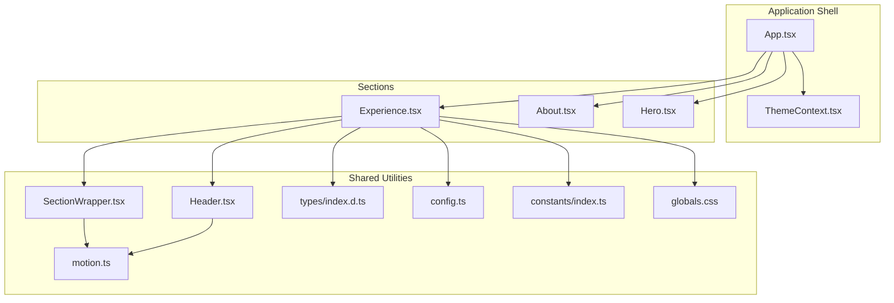
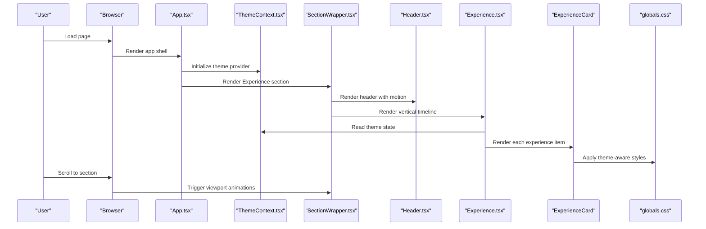
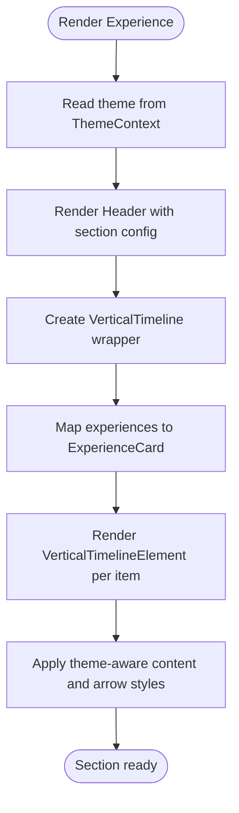
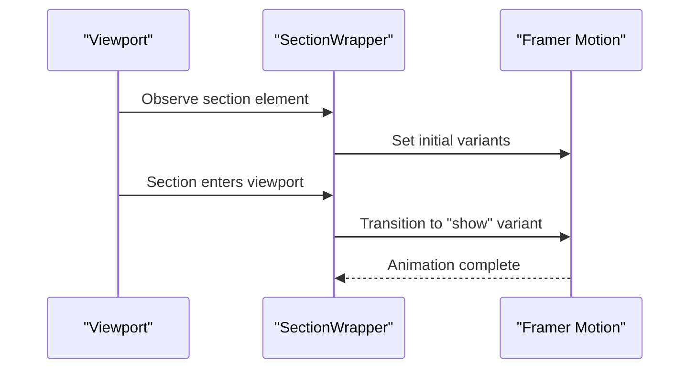
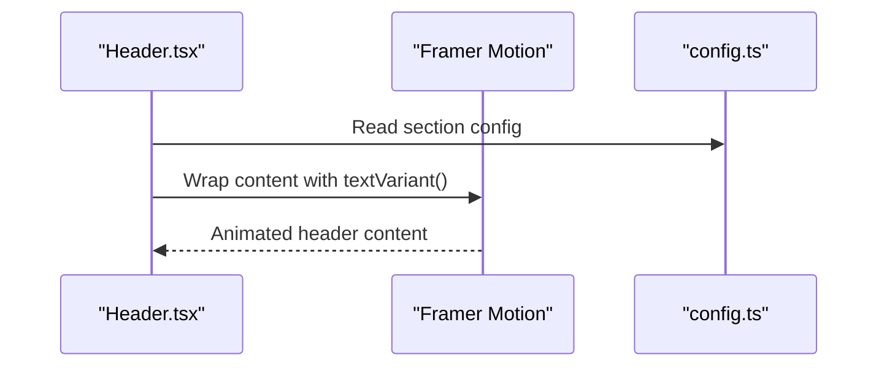
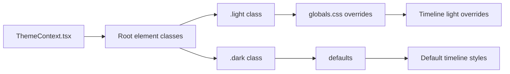
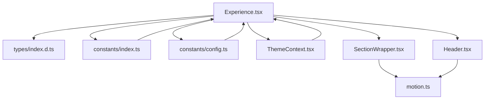
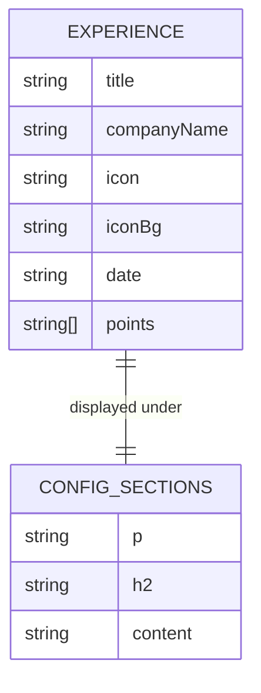

# Experience Section

<cite>
**Referenced Files in This Document**
- [Experience.tsx](file://src/components/sections/Experience.tsx)
- [config.ts](file://src/constants/config.ts)
- [index.ts](file://src/constants/index.ts)
- [types/index.d.ts](file://src/types/index.d.ts)
- [SectionWrapper.tsx](file://src/hoc/SectionWrapper.tsx)
- [Header.tsx](file://src/components/atoms/Header.tsx)
- [motion.ts](file://src/utils/motion.ts)
- [ThemeContext.tsx](file://src/context/ThemeContext.tsx)
- [globals.css](file://src/globals.css)
- [App.tsx](file://src/App.tsx)
</cite>

## Table of Contents
1. [Introduction](#introduction)
2. [Project Structure](#project-structure)
3. [Core Components](#core-components)
4. [Architecture Overview](#architecture-overview)
5. [Detailed Component Analysis](#detailed-component-analysis)
6. [Dependency Analysis](#dependency-analysis)
7. [Performance Considerations](#performance-considerations)
8. [Troubleshooting Guide](#troubleshooting-guide)
9. [Conclusion](#conclusion)
10. [Appendices](#appendices)

## Introduction
This document explains the Experience section component that renders a professional timeline of work and educational experiences. It covers the data model, responsive timeline layout, styling via Tailwind CSS and theme-aware overrides, scroll-triggered animations, and accessibility considerations. It also provides practical guidance for adding new entries, customizing the timeline appearance, and adjusting animation behaviors.

## Project Structure
The Experience section is implemented as a dedicated section component integrated into the application routing and theming system. It leverages shared utilities for motion, configuration, and types.



**Diagram sources**
- [App.tsx:19-47](file://src/App.tsx#L19-L47)
- [Experience.tsx:63-82](file://src/components/sections/Experience.tsx#L63-L82)
- [SectionWrapper.tsx:10-28](file://src/hoc/SectionWrapper.tsx#L10-L28)
- [Header.tsx:13-28](file://src/components/atoms/Header.tsx#L13-L28)
- [motion.ts:4-19](file://src/utils/motion.ts#L4-L19)
- [config.ts:41-86](file://src/constants/config.ts#L41-L86)
- [index.ts:125-162](file://src/constants/index.ts#L125-L162)
- [globals.css:74-88](file://src/globals.css#L74-L88)

**Section sources**
- [App.tsx:19-47](file://src/App.tsx#L19-L47)
- [Experience.tsx:63-82](file://src/components/sections/Experience.tsx#L63-L82)
- [SectionWrapper.tsx:10-28](file://src/hoc/SectionWrapper.tsx#L10-L28)
- [Header.tsx:13-28](file://src/components/atoms/Header.tsx#L13-L28)
- [motion.ts:4-19](file://src/utils/motion.ts#L4-L19)
- [config.ts:41-86](file://src/constants/config.ts#L41-L86)
- [index.ts:125-162](file://src/constants/index.ts#L125-L162)
- [globals.css:74-88](file://src/globals.css#L74-L88)

## Core Components
- Experience section: Renders a vertical timeline of experiences using a third-party library and a custom card component.
- ExperienceCard: A reusable card renderer for each experience item with theme-aware styling.
- SectionWrapper: A higher-order component that adds scroll-triggered animations to the section.
- Header: A themed header component with optional motion variants.
- ThemeContext: Provides theme state and persistence for dark/light modes.
- Global CSS: Defines theme-specific overrides for the timeline and other UI elements.

Key responsibilities:
- Data binding: The experiences array from constants drives the timeline entries.
- Theming: The current theme determines card backgrounds, arrows, and timeline colors.
- Animation: The section animates into view on scroll; the header supports text variants.

**Section sources**
- [Experience.tsx:16-61](file://src/components/sections/Experience.tsx#L16-L61)
- [Experience.tsx:63-82](file://src/components/sections/Experience.tsx#L63-L82)
- [SectionWrapper.tsx:10-28](file://src/hoc/SectionWrapper.tsx#L10-L28)
- [Header.tsx:13-28](file://src/components/atoms/Header.tsx#L13-L28)
- [ThemeContext.tsx:17-44](file://src/context/ThemeContext.tsx#L17-L44)
- [globals.css:74-88](file://src/globals.css#L74-L88)

## Architecture Overview
The Experience section composes a header, a vertical timeline, and individual experience cards. Theming influences both the timeline visuals and card styling. Scroll-triggered animations are applied at the section level.



**Diagram sources**
- [App.tsx:26-47](file://src/App.tsx#L26-L47)
- [ThemeContext.tsx:17-44](file://src/context/ThemeContext.tsx#L17-L44)
- [SectionWrapper.tsx:16-27](file://src/hoc/SectionWrapper.tsx#L16-L27)
- [Header.tsx:13-28](file://src/components/atoms/Header.tsx#L13-L28)
- [Experience.tsx:63-82](file://src/components/sections/Experience.tsx#L63-L82)
- [globals.css:74-88](file://src/globals.css#L74-L88)

## Detailed Component Analysis

### Experience Section Component
- Purpose: Renders a vertical timeline of experiences with a themed header.
- Data source: The experiences array supplies the timeline entries.
- Theming: Uses the current theme to adjust timeline line color and card backgrounds/arrows.
- Layout: Responsive flex container wraps the timeline; Tailwind utilities define spacing and alignment.
- Accessibility: Uses semantic headings and lists; images include descriptive alt attributes.



**Diagram sources**
- [Experience.tsx:63-82](file://src/components/sections/Experience.tsx#L63-L82)
- [Experience.tsx:16-61](file://src/components/sections/Experience.tsx#L16-L61)
- [ThemeContext.tsx:17-44](file://src/context/ThemeContext.tsx#L17-L44)

**Section sources**
- [Experience.tsx:63-82](file://src/components/sections/Experience.tsx#L63-L82)
- [config.ts:72-75](file://src/constants/config.ts#L72-L75)

### ExperienceCard Component
- Purpose: Renders a single experience entry inside the timeline element.
- Styling: Uses inline styles for dynamic theme-aware backgrounds and arrows; Tailwind classes for typography and spacing.
- Content: Displays title, company name, date, icon, and a bullet list of accomplishments.
- Responsiveness: Relies on Tailwind utilities for font sizes and spacing across breakpoints.

```mermaid
classDiagram
class ExperienceCard {
+props : TExperience & { isDark : boolean }
+render() VerticalTimelineElement
}
class TExperience {
+string title
+string companyName
+string icon
+string iconBg
+string date
+string[] points
}
ExperienceCard --> TExperience : "uses"
```

**Diagram sources**
- [Experience.tsx:16-61](file://src/components/sections/Experience.tsx#L16-L61)
- [types/index.d.ts:7-12](file://src/types/index.d.ts#L7-L12)

**Section sources**
- [Experience.tsx:16-61](file://src/components/sections/Experience.tsx#L16-L61)
- [types/index.d.ts:7-12](file://src/types/index.d.ts#L7-L12)

### SectionWrapper (Scroll-Triggered Animations)
- Purpose: Wraps a section with scroll-triggered animations using Framer Motion.
- Behavior: Animates the section into view when it enters the viewport; runs once and requires partial visibility.
- Integration: Applied to the Experience component to enable entrance animations.



**Diagram sources**
- [SectionWrapper.tsx:16-27](file://src/hoc/SectionWrapper.tsx#L16-L27)

**Section sources**
- [SectionWrapper.tsx:10-28](file://src/hoc/SectionWrapper.tsx#L10-L28)

### Header Component (Optional Motion)
- Purpose: Renders section headers with optional motion variants.
- Motion: Uses a text variant that animates text into place with spring easing.
- Integration: Used by the Experience section to animate the header alongside the timeline.



**Diagram sources**
- [Header.tsx:13-28](file://src/components/atoms/Header.tsx#L13-L28)
- [motion.ts:4-19](file://src/utils/motion.ts#L4-L19)
- [config.ts:72-75](file://src/constants/config.ts#L72-L75)

**Section sources**
- [Header.tsx:13-28](file://src/components/atoms/Header.tsx#L13-L28)
- [motion.ts:4-19](file://src/utils/motion.ts#L4-L19)
- [config.ts:72-75](file://src/constants/config.ts#L72-L75)

### Theme System and Styling
- ThemeContext: Manages theme state, persists preference in local storage, and toggles CSS classes on the root element.
- Global CSS: Provides theme-specific overrides for the vertical timeline and other components.
- Timeline theming: The timeline line color adapts to the current theme; card content and arrows reflect dark/light backgrounds.



**Diagram sources**
- [ThemeContext.tsx:17-44](file://src/context/ThemeContext.tsx#L17-L44)
- [globals.css:74-88](file://src/globals.css#L74-L88)

**Section sources**
- [ThemeContext.tsx:17-44](file://src/context/ThemeContext.tsx#L17-L44)
- [globals.css:74-88](file://src/globals.css#L74-L88)

## Dependency Analysis
The Experience section depends on shared configuration, types, constants, and utilities. Theming and motion utilities influence rendering and animation behavior.



**Diagram sources**
- [Experience.tsx:9-14](file://src/components/sections/Experience.tsx#L9-L14)
- [types/index.d.ts:7-12](file://src/types/index.d.ts#L7-L12)
- [index.ts:125-162](file://src/constants/index.ts#L125-L162)
- [config.ts:72-75](file://src/constants/config.ts#L72-L75)
- [ThemeContext.tsx:17-44](file://src/context/ThemeContext.tsx#L17-L44)
- [SectionWrapper.tsx:10-28](file://src/hoc/SectionWrapper.tsx#L10-L28)
- [Header.tsx:13-28](file://src/components/atoms/Header.tsx#L13-L28)
- [motion.ts:4-19](file://src/utils/motion.ts#L4-L19)

**Section sources**
- [Experience.tsx:9-14](file://src/components/sections/Experience.tsx#L9-L14)
- [types/index.d.ts:7-12](file://src/types/index.d.ts#L7-L12)
- [index.ts:125-162](file://src/constants/index.ts#L125-L162)
- [config.ts:72-75](file://src/constants/config.ts#L72-L75)
- [ThemeContext.tsx:17-44](file://src/context/ThemeContext.tsx#L17-L44)
- [SectionWrapper.tsx:10-28](file://src/hoc/SectionWrapper.tsx#L10-L28)
- [Header.tsx:13-28](file://src/components/atoms/Header.tsx#L13-L28)
- [motion.ts:4-19](file://src/utils/motion.ts#L4-L19)

## Performance Considerations
- Scroll animations: The section-level animation runs once when entering the viewport, minimizing repeated computations.
- Theme switching: CSS class toggling avoids heavy re-renders; timeline overrides are minimal and scoped.
- Image loading: Experience icons are rendered as images with object-fit containment; ensure appropriate sizing to avoid layout shifts.
- List rendering: The experience points list uses a simple map; keep the list concise for readability.

[No sources needed since this section provides general guidance]

## Troubleshooting Guide
- Timeline not visible: Verify the timeline CSS import and ensure theme classes are applied to the root element.
- Cards not styled: Confirm theme state is correctly read and that card content/background styles match the current theme.
- Animations not triggering: Check viewport options in the section wrapper and ensure the section is placed within the main app shell.
- Header text not animated: Ensure the header receives the motion prop and the text variant is configured.

**Section sources**
- [Experience.tsx:7-7](file://src/components/sections/Experience.tsx#L7-L7)
- [ThemeContext.tsx:17-44](file://src/context/ThemeContext.tsx#L17-L44)
- [SectionWrapper.tsx:16-27](file://src/hoc/SectionWrapper.tsx#L16-L27)
- [Header.tsx:13-28](file://src/components/atoms/Header.tsx#L13-L28)

## Conclusion
The Experience section integrates a vertical timeline with theme-aware styling, scroll-triggered animations, and responsive design. Its modular structure allows easy maintenance and extension. By following the guidelines below, you can add new experiences, customize the timeline, and refine animation behaviors while preserving accessibility and responsiveness.

[No sources needed since this section summarizes without analyzing specific files]

## Appendices

### Data Model and Configuration
- Experience data structure: The experiences array defines each entry’s metadata and accomplishments.
- Section configuration: The config object provides the header copy for the Experience section.



**Diagram sources**
- [index.ts:125-162](file://src/constants/index.ts#L125-L162)
- [config.ts:72-75](file://src/constants/config.ts#L72-L75)

**Section sources**
- [index.ts:125-162](file://src/constants/index.ts#L125-L162)
- [config.ts:72-75](file://src/constants/config.ts#L72-L75)

### Adding a New Experience Entry
Steps:
- Extend the experiences array with a new object conforming to the experience data model.
- Provide a unique icon asset and a contrasting icon background color.
- Add descriptive points summarizing responsibilities and achievements.

Guidance:
- Keep point text concise and scannable.
- Use consistent date formatting for readability.

**Section sources**
- [index.ts:125-162](file://src/constants/index.ts#L125-L162)
- [types/index.d.ts:7-12](file://src/types/index.d.ts#L7-L12)

### Customizing Timeline Appearance
Options:
- Timeline line color: Controlled by the theme; dark mode uses default, light mode overrides the line color.
- Card backgrounds and arrows: Dynamically set based on theme; ensure sufficient contrast for readability.
- Typography and spacing: Adjust Tailwind classes on the card content and lists for visual hierarchy.

Implementation notes:
- Timeline overrides are defined in the global CSS for light mode.
- Dark mode relies on defaults; customize as needed.

**Section sources**
- [Experience.tsx:18-26](file://src/components/sections/Experience.tsx#L18-L26)
- [globals.css:74-88](file://src/globals.css#L74-L88)

### Modifying Animation Behaviors
Options:
- Section animation: Adjust viewport settings and variants in the section wrapper.
- Header animation: Modify the text variant parameters for different easing or timing.
- Entrance timing: Tune delays and durations for staggered animations if desired.

**Section sources**
- [SectionWrapper.tsx:16-27](file://src/hoc/SectionWrapper.tsx#L16-L27)
- [motion.ts:4-19](file://src/utils/motion.ts#L4-L19)

### Mobile Responsiveness
- Flex layout: The section uses a flex column layout suitable for stacked timelines on small screens.
- Typography scales: Tailwind utilities provide responsive font sizes and spacing.
- Timeline behavior: The third-party timeline component handles responsive layout adjustments automatically.

**Section sources**
- [Experience.tsx:71-77](file://src/components/sections/Experience.tsx#L71-L77)
- [globals.css:74-88](file://src/globals.css#L74-L88)

### Accessibility Features
- Semantic structure: Headings and lists are used to organize content.
- Images: Icons include descriptive alt attributes for screen readers.
- Contrast: Theme-aware styles maintain readable text and backgrounds across modes.
- Focus and navigation: Ensure keyboard navigability within the timeline and surrounding content.

**Section sources**
- [Experience.tsx:31-36](file://src/components/sections/Experience.tsx#L31-L36)
- [ThemeContext.tsx:17-44](file://src/context/ThemeContext.tsx#L17-L44)