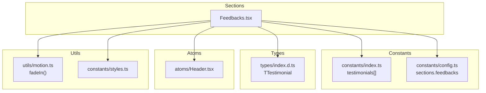
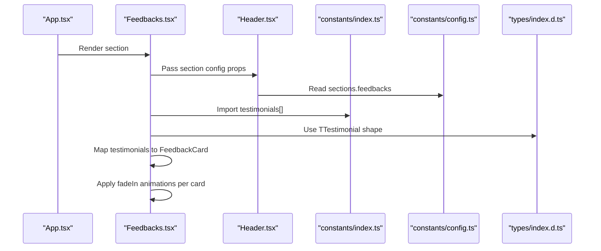
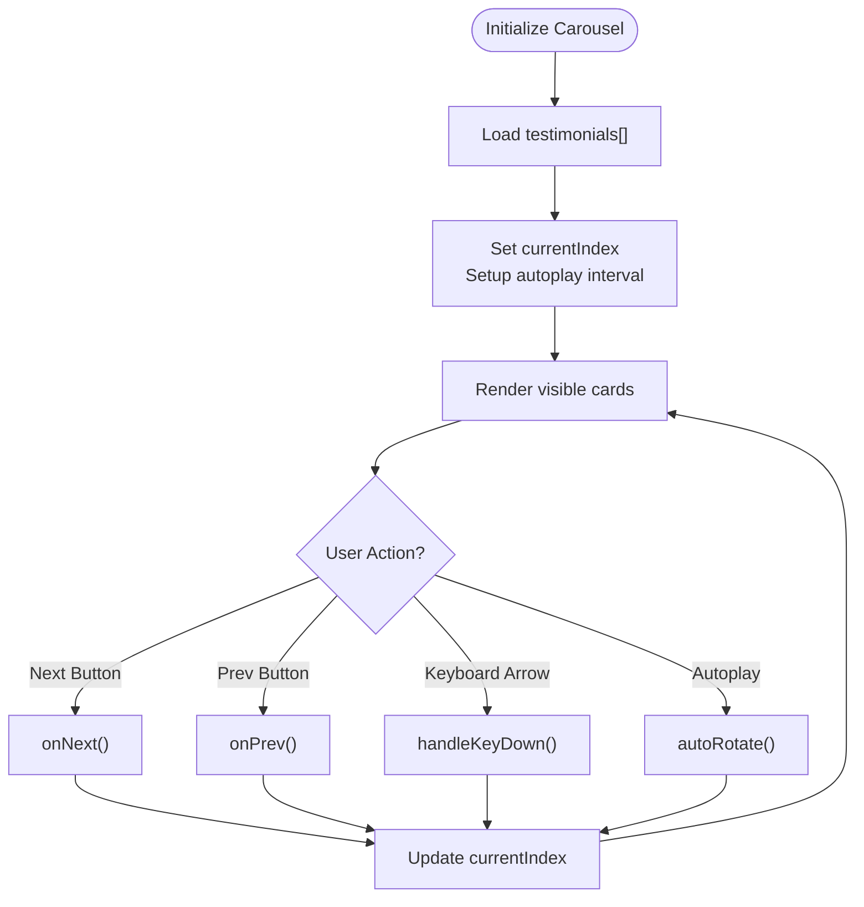
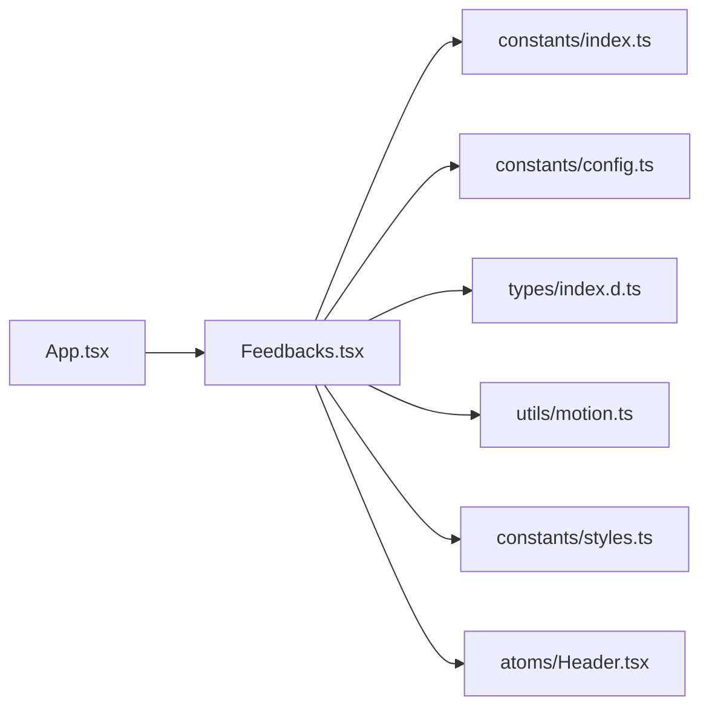

# Feedbacks Section

<cite>
**Referenced Files in This Document**
- [Feedbacks.tsx](file://src/components/sections/Feedbacks.tsx)
- [index.ts](file://src/constants/index.ts)
- [config.ts](file://src/constants/config.ts)
- [index.d.ts](file://src/types/index.d.ts)
- [motion.ts](file://src/utils/motion.ts)
- [styles.ts](file://src/constants/styles.ts)
- [Header.tsx](file://src/components/atoms/Header.tsx)
- [App.tsx](file://src/App.tsx)
</cite>

## Table of Contents
1. [Introduction](#introduction)
2. [Project Structure](#project-structure)
3. [Core Components](#core-components)
4. [Architecture Overview](#architecture-overview)
5. [Detailed Component Analysis](#detailed-component-analysis)
6. [Dependency Analysis](#dependency-analysis)
7. [Performance Considerations](#performance-considerations)
8. [Troubleshooting Guide](#troubleshooting-guide)
9. [Conclusion](#conclusion)
10. [Appendices](#appendices)

## Introduction
This document explains the Feedbacks section component that renders testimonials as static cards. It covers how testimonials are defined and consumed, the card layout and animation, responsive design patterns, and how the section integrates into the application via configuration. The current implementation does not include a carousel, autoplay, or navigation controls; instead, it displays all testimonials as individual cards in a horizontally scrollable container. Guidance is included for extending the component to add carousel behavior, customization, and accessibility enhancements.

## Project Structure
The Feedbacks section is part of the sections module and integrates with shared utilities and constants:
- Section component: Feedbacks.tsx
- Testimonial data: constants/index.ts
- Section configuration: constants/config.ts
- Type definitions: types/index.d.ts
- Motion utilities: utils/motion.ts
- Shared styles: constants/styles.ts
- Section header: atoms/Header.tsx
- Application integration: App.tsx

**Diagram sources**
- [Feedbacks.tsx:47-64](file://src/components/sections/Feedbacks.tsx#L47-L64)
- [index.ts:164-189](file://src/constants/index.ts#L164-L189)
- [config.ts:76-79](file://src/constants/config.ts#L76-L79)
- [index.d.ts:14-19](file://src/types/index.d.ts#L14-L19)
- [Header.tsx:13-28](file://src/components/atoms/Header.tsx#L13-L28)
- [motion.ts:21-45](file://src/utils/motion.ts#L21-L45)
- [styles.ts:1-16](file://src/constants/styles.ts#L1-L16)

**Section sources**
- [Feedbacks.tsx:1-67](file://src/components/sections/Feedbacks.tsx#L1-L67)
- [index.ts:164-189](file://src/constants/index.ts#L164-L189)
- [config.ts:76-79](file://src/constants/config.ts#L76-L79)
- [index.d.ts:14-19](file://src/types/index.d.ts#L14-L19)
- [Header.tsx:13-28](file://src/components/atoms/Header.tsx#L13-L28)
- [motion.ts:21-45](file://src/utils/motion.ts#L21-L45)
- [styles.ts:1-16](file://src/constants/styles.ts#L1-L16)

## Core Components
- Feedbacks: Renders a section with a header and a horizontal list of testimonial cards. Cards are animated on view and sized responsively.
- FeedbackCard: Presentational card component that displays a testimonial quote, author name, designation/company, and avatar.
- Header: Reusable section header that optionally animates text content.
- Testimonials data: Array of TTestimonial objects imported from constants/index.ts.
- Configuration: Section metadata (subtitle and heading) sourced from constants/config.ts.

Key behaviors:
- Static rendering: All testimonials are rendered as individual cards.
- Responsive sizing: Cards adapt width on small screens.
- Animation: Each card applies a staggered fade-in animation.
- Layout: Cards are arranged in a flex container with wrapping and centering on small screens.

**Section sources**
- [Feedbacks.tsx:10-45](file://src/components/sections/Feedbacks.tsx#L10-L45)
- [Feedbacks.tsx:47-64](file://src/components/sections/Feedbacks.tsx#L47-L64)
- [Header.tsx:13-28](file://src/components/atoms/Header.tsx#L13-L28)
- [index.ts:164-189](file://src/constants/index.ts#L164-L189)
- [config.ts:76-79](file://src/constants/config.ts#L76-L79)

## Architecture Overview
The Feedbacks section composes reusable parts and data:
- Data source: constants/index.ts exports testimonials[].
- Types: types/index.d.ts defines TTestimonial.
- Motion: utils/motion.ts provides fadeIn() for staggered entrance.
- Styles: constants/styles.ts centralizes padding and typography classes.
- Header: atoms/Header.tsx renders section title and subtitle with optional animation.
- Integration: App.tsx includes Feedbacks as a top-level route section.

**Diagram sources**
- [App.tsx:39](file://src/App.tsx#L39)
- [Feedbacks.tsx:53](file://src/components/sections/Feedbacks.tsx#L53)
- [Header.tsx:13-28](file://src/components/atoms/Header.tsx#L13-L28)
- [index.ts:164-189](file://src/constants/index.ts#L164-L189)
- [config.ts:76-79](file://src/constants/config.ts#L76-L79)
- [index.d.ts:14-19](file://src/types/index.d.ts#L14-L19)

## Detailed Component Analysis

### Feedbacks Component
Responsibilities:
- Render section header using configuration.
- Map testimonials to FeedbackCard instances.
- Apply responsive layout and spacing.
- Trigger staggered animations for cards.

Implementation highlights:
- Uses fadeIn variants for each card with index-based delay.
- Applies shared padding and section styles.
- Displays cards in a flex container with wrap and centering on small screens.

Extensibility points:
- To add a carousel, introduce state for current index, optional autoplay timer, and navigation handlers.
- Add left/right buttons and indicators for accessibility.

**Section sources**
- [Feedbacks.tsx:47-64](file://src/components/sections/Feedbacks.tsx#L47-L64)
- [motion.ts:21-45](file://src/utils/motion.ts#L21-L45)
- [styles.ts:1-16](file://src/constants/styles.ts#L1-L16)
- [config.ts:76-79](file://src/constants/config.ts#L76-L79)

### FeedbackCard Component
Responsibilities:
- Display a single testimonial with quote punctuation.
- Show author name, designation, and company.
- Render an avatar image.
- Apply consistent card styling and spacing.

Accessibility considerations:
- Alt text is set for the avatar image.
- Consider adding role and aria attributes if transforming into interactive elements (e.g., carousel item).

Customization hooks:
- Adjust paddings, widths, and typography classes.
- Modify image sizing and avatar fallback behavior.

**Section sources**
- [Feedbacks.tsx:10-45](file://src/components/sections/Feedbacks.tsx#L10-L45)

### Header Component
Responsibilities:
- Render section subtitle and heading.
- Optionally animate content using textVariant.

Integration:
- Receives props from config.sections.feedbacks.

**Section sources**
- [Header.tsx:13-28](file://src/components/atoms/Header.tsx#L13-L28)
- [config.ts:76-79](file://src/constants/config.ts#L76-L79)

### Testimonials Data Model
Responsibilities:
- Define the shape of each testimonial.
- Provide the array of testimonials used by the section.

Data model:
- TTestimonial requires name and includes testimonial text, designation, company, and image.

Usage:
- Imported by Feedbacks.tsx and mapped to FeedbackCard.

**Section sources**
- [index.d.ts:14-19](file://src/types/index.d.ts#L14-L19)
- [index.ts:164-189](file://src/constants/index.ts#L164-L189)

### Carousel Functionality (Planned Extension)
Current state:
- No carousel, autoplay, or navigation controls.

Proposed implementation outline:
- State: Track currentIndex and optional autoplay interval.
- Handlers: onNext, onPrev, goToIndex.
- Controls: Left/right buttons with aria-labels and keyboard shortcuts.
- Indicators: Dot indicators reflecting current index.
- Accessibility: ARIA attributes for roles, labels, and live regions.

[No sources needed since this diagram shows conceptual workflow, not actual code structure]

### Testimonial Card Design (Static)
Current design characteristics:
- Quote punctuation precedes the testimonial text.
- Author name with optional gradient styling.
- Designation and company displayed below the name.
- Circular avatar image with rounded corners and object-cover scaling.
- Staggered fade-in animation per card.

Responsive patterns:
- Container uses flex wrap and centering on small screens.
- Card width adapts with xs/sm breakpoints.

**Section sources**
- [Feedbacks.tsx:18-44](file://src/components/sections/Feedbacks.tsx#L18-L44)
- [Feedbacks.tsx:55-61](file://src/components/sections/Feedbacks.tsx#L55-L61)

### Autoplay Configuration (Planned Extension)
Proposed configuration:
- Interval duration (milliseconds).
- Pause on hover or focus.
- Option to disable autoplay via configuration flag.

Behavior:
- Automatically advance to the next testimonial after the interval.
- Reset timer on user interaction or navigation.

**Section sources**
- [Feedbacks.tsx:47-64](file://src/components/sections/Feedbacks.tsx#L47-L64)

### Adding New Testimonials
Steps:
- Extend testimonials[] in constants/index.ts with a new TTestimonial object.
- Ensure required fields: name, testimonial, and optional designation, company, image.
- Verify that the section header text is configured in constants/config.ts under sections.feedbacks.

Example reference:
- See existing entries in testimonials[] for field structure and content style.

**Section sources**
- [index.ts:164-189](file://src/constants/index.ts#L164-L189)
- [config.ts:76-79](file://src/constants/config.ts#L76-L79)

### Customizing Card Appearance
Options:
- Modify padding and spacing classes applied to the card container.
- Adjust typography classes for quote, testimonial text, and author details.
- Change image dimensions and avatar styling.
- Update animation timing and easing via fadeIn parameters.

**Section sources**
- [Feedbacks.tsx:18-44](file://src/components/sections/Feedbacks.tsx#L18-L44)
- [motion.ts:21-45](file://src/utils/motion.ts#L21-L45)
- [styles.ts:1-16](file://src/constants/styles.ts#L1-L16)

### Modifying Carousel Behavior
Proposed changes:
- Introduce state for currentIndex and autoplay interval.
- Add handlers for navigation and keyboard events.
- Implement indicators and controls with proper ARIA labeling.
- Respect user preferences by pausing on hover/focus.

[No sources needed since this section provides general guidance]

### Accessibility Features
Current state:
- Avatar images include alt text.
- No carousel controls or ARIA roles are present.

Recommendations:
- Keyboard navigation: Support arrow keys for navigation and Enter/Space for actions.
- Screen reader: Add role="region" and aria-label for the carousel container; use aria-live for dynamic updates.
- Focus management: Ensure focus moves to the active card and trap focus within the carousel when open.
- Controls: Provide skip links to navigate to the section or carousel.

**Section sources**
- [Feedbacks.tsx:37-41](file://src/components/sections/Feedbacks.tsx#L37-L41)

## Dependency Analysis
Relationships among core files:
- Feedbacks.tsx depends on constants/index.ts for testimonials[], constants/config.ts for section metadata, types/index.d.ts for TTestimonial, utils/motion.ts for animations, and constants/styles.ts for shared classes.
- Header.tsx consumes config data and optionally applies motion.
- App.tsx includes Feedbacks as a top-level section.

**Diagram sources**
- [Feedbacks.tsx:5-8](file://src/components/sections/Feedbacks.tsx#L5-L8)
- [index.ts:164-189](file://src/constants/index.ts#L164-L189)
- [config.ts:76-79](file://src/constants/config.ts#L76-L79)
- [index.d.ts:14-19](file://src/types/index.d.ts#L14-L19)
- [motion.ts:21-45](file://src/utils/motion.ts#L21-L45)
- [styles.ts:1-16](file://src/constants/styles.ts#L1-L16)
- [Header.tsx:13-28](file://src/components/atoms/Header.tsx#L13-L28)
- [App.tsx:39](file://src/App.tsx#L39)

**Section sources**
- [Feedbacks.tsx:5-8](file://src/components/sections/Feedbacks.tsx#L5-L8)
- [index.ts:164-189](file://src/constants/index.ts#L164-L189)
- [config.ts:76-79](file://src/constants/config.ts#L76-L79)
- [index.d.ts:14-19](file://src/types/index.d.ts#L14-L19)
- [motion.ts:21-45](file://src/utils/motion.ts#L21-L45)
- [styles.ts:1-16](file://src/constants/styles.ts#L1-L16)
- [Header.tsx:13-28](file://src/components/atoms/Header.tsx#L13-L28)
- [App.tsx:39](file://src/App.tsx#L39)

## Performance Considerations
- Rendering cost: Each card applies a motion variant; staggering increases render overhead. Keep the number of testimonials reasonable.
- Image loading: Lazy-load avatar images if the dataset grows large.
- CSS classes: Prefer shared Tailwind utilities to minimize CSS bloat.
- Animations: Tune delay and duration to balance perceived performance and smoothness.

[No sources needed since this section provides general guidance]

## Troubleshooting Guide
- Missing testimonials: Ensure testimonials[] is exported and imported correctly.
- Incorrect prop types: Verify TTestimonial fields match the card’s expectations.
- Animation not triggering: Confirm viewport intersection settings and that the section is in view.
- Styling inconsistencies: Check shared styles and responsive breakpoints.

**Section sources**
- [index.ts:164-189](file://src/constants/index.ts#L164-L189)
- [index.d.ts:14-19](file://src/types/index.d.ts#L14-L19)
- [Feedbacks.tsx:18-44](file://src/components/sections/Feedbacks.tsx#L18-L44)

## Conclusion
The Feedbacks section currently renders a responsive grid of animated testimonial cards sourced from configuration and data. It provides a clean foundation for showcasing testimonials with motion and responsive design. Extending it to include a carousel, autoplay, navigation controls, and robust accessibility features would elevate the user experience while maintaining the existing data model and styling patterns.

## Appendices

### How to Add a New Testimonial
- Add a new TTestimonial object to testimonials[] in constants/index.ts.
- Keep the name unique and ensure the testimonial text is concise and impactful.
- Optionally provide designation and company; leave image empty if not applicable.

**Section sources**
- [index.ts:164-189](file://src/constants/index.ts#L164-L189)

### How to Customize Card Appearance
- Adjust container padding and spacing classes.
- Modify typography classes for quote and testimonial text.
- Change avatar size and styling.
- Fine-tune animation delay and duration.

**Section sources**
- [Feedbacks.tsx:18-44](file://src/components/sections/Feedbacks.tsx#L18-L44)
- [motion.ts:21-45](file://src/utils/motion.ts#L21-L45)
- [styles.ts:1-16](file://src/constants/styles.ts#L1-L16)

### How to Enable Autoplay (Planned)
- Introduce autoplay state and interval.
- Pause autoplay on hover/focus.
- Allow user control via keyboard and buttons.

**Section sources**
- [Feedbacks.tsx:47-64](file://src/components/sections/Feedbacks.tsx#L47-L64)