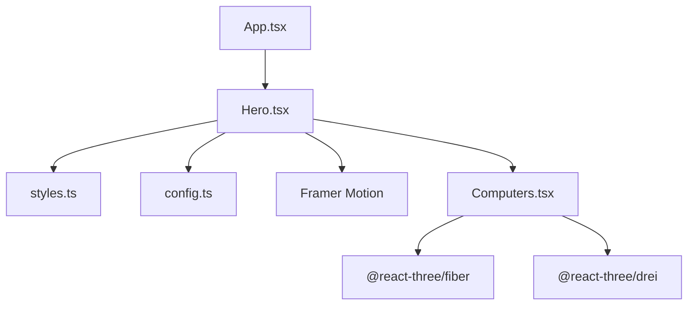
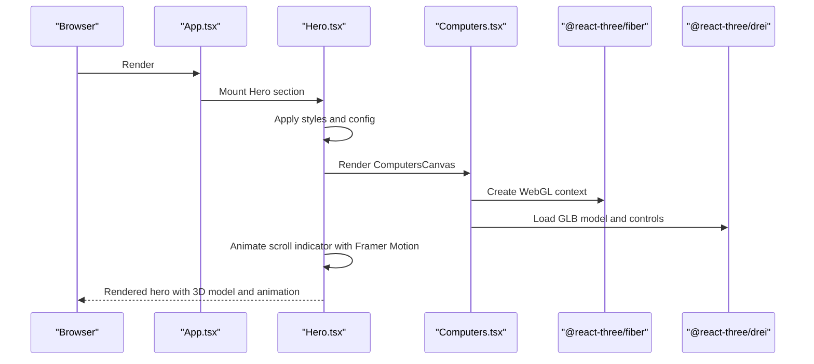
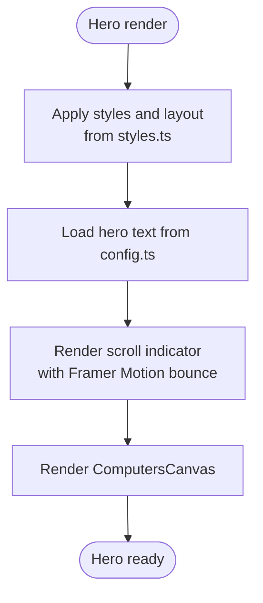
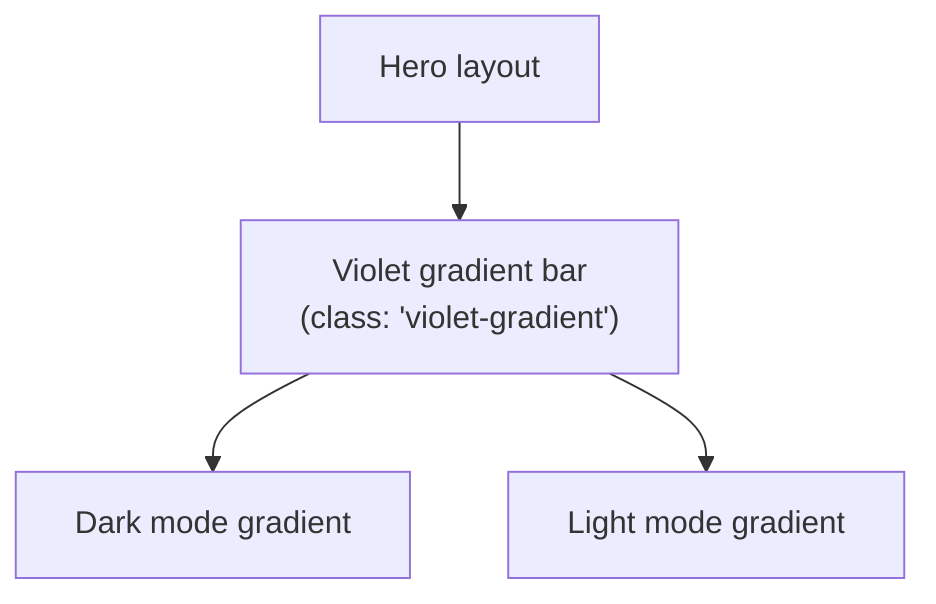
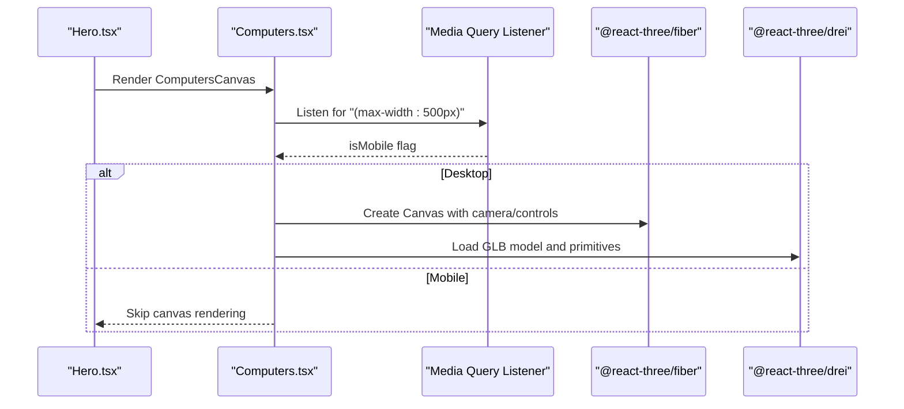
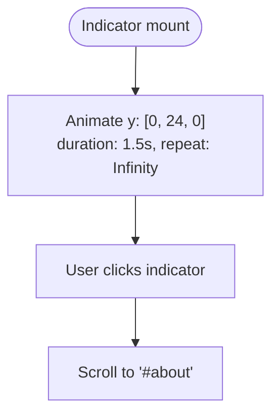
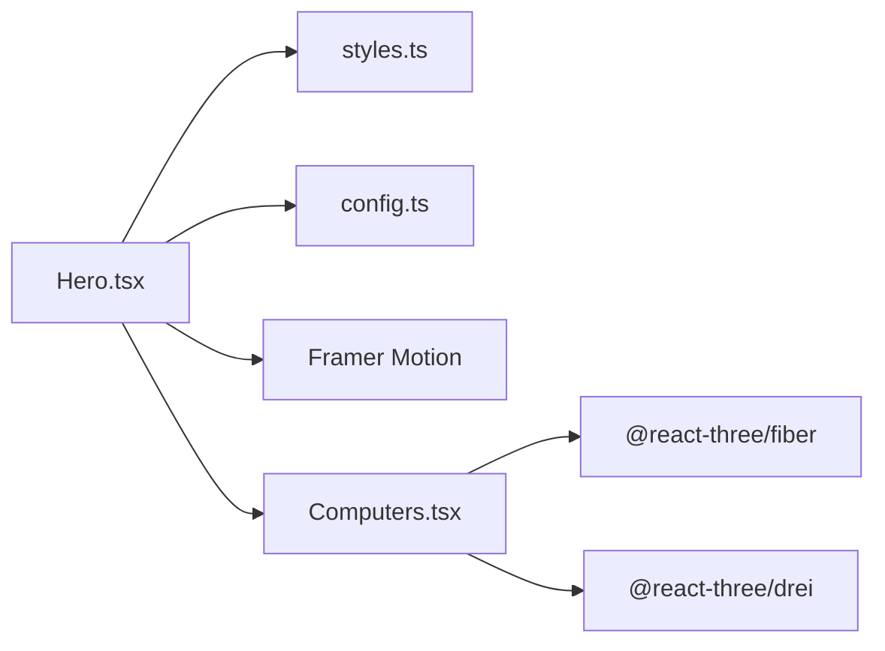

# Hero Section

<cite>
**Referenced Files in This Document**
- [Hero.tsx](file://src/components/sections/Hero.tsx)
- [Computers.tsx](file://src/components/canvas/Computers.tsx)
- [config.ts](file://src/constants/config.ts)
- [styles.ts](file://src/constants/styles.ts)
- [motion.ts](file://src/utils/motion.ts)
- [SectionWrapper.tsx](file://src/hoc/SectionWrapper.tsx)
- [App.tsx](file://src/App.tsx)
- [globals.css](file://src/globals.css)
</cite>

## Table of Contents
1. [Introduction](#introduction)
2. [Project Structure](#project-structure)
3. [Core Components](#core-components)
4. [Architecture Overview](#architecture-overview)
5. [Detailed Component Analysis](#detailed-component-analysis)
6. [Dependency Analysis](#dependency-analysis)
7. [Performance Considerations](#performance-considerations)
8. [Troubleshooting Guide](#troubleshooting-guide)
9. [Conclusion](#conclusion)
10. [Appendices](#appendices)

## Introduction
This document explains the Hero section component, focusing on its animated gradient elements, floating computer model integration, scroll indicator animation, responsive design patterns, and integration with the Computers canvas component. It also documents how configuration data from config.ts drives the hero copy, how Framer Motion is used for animations, and how to customize text, animation timing, and styling. Finally, it covers the scroll-to-about functionality and responsive behavior across screen sizes.

## Project Structure
The Hero section is implemented as a standalone section component that composes:
- Tailwind-based responsive layout and typography from styles.ts
- Configuration-driven text from config.ts
- Animated scroll indicator using Framer Motion
- Floating computer model rendered via @react-three/fiber in Computers.tsx
- Optional wrapper HOC for viewport-triggered animations

**Diagram sources**
- [App.tsx:19-48](file://src/App.tsx#L19-L48)
- [Hero.tsx:7-52](file://src/components/sections/Hero.tsx#L7-L52)
- [styles.ts:1-16](file://src/constants/styles.ts#L1-L16)
- [config.ts:41-86](file://src/constants/config.ts#L41-L86)
- [Computers.tsx:1-85](file://src/components/canvas/Computers.tsx#L1-L85)

**Section sources**
- [App.tsx:19-48](file://src/App.tsx#L19-L48)
- [Hero.tsx:7-52](file://src/components/sections/Hero.tsx#L7-L52)
- [styles.ts:1-16](file://src/constants/styles.ts#L1-L16)
- [config.ts:41-86](file://src/constants/config.ts#L41-L86)
- [Computers.tsx:1-85](file://src/components/canvas/Computers.tsx#L1-L85)

## Core Components
- Hero.tsx: Renders the hero layout, animated scroll indicator, and integrates the Computers canvas component.
- styles.ts: Provides responsive typography and spacing classes for the hero headline and subtitle.
- config.ts: Supplies hero text content and metadata used in the hero copy.
- Computers.tsx: Renders a 3D desktop computer model using @react-three/fiber and @react-three/drei, conditionally on larger screens.
- motion.ts: Utility variants for Framer Motion animations (used elsewhere in the app).
- SectionWrapper.tsx: Higher-order component that adds viewport-triggered animations to sections.
- globals.css: Defines theme-aware gradients and responsive utilities used by the hero.

**Section sources**
- [Hero.tsx:7-52](file://src/components/sections/Hero.tsx#L7-L52)
- [styles.ts:6-15](file://src/constants/styles.ts#L6-L15)
- [config.ts:41-86](file://src/constants/config.ts#L41-L86)
- [Computers.tsx:32-82](file://src/components/canvas/Computers.tsx#L32-L82)
- [motion.ts:4-19](file://src/utils/motion.ts#L4-L19)
- [SectionWrapper.tsx:10-28](file://src/hoc/SectionWrapper.tsx#L10-L28)
- [globals.css:200-208](file://src/globals.css#L200-L208)

## Architecture Overview
The Hero section orchestrates:
- Static hero content driven by config.ts
- Responsive typography from styles.ts
- Animated scroll indicator powered by Framer Motion
- Conditional 3D rendering via Computers.tsx
- Theme-aware gradients and utilities from globals.css

**Diagram sources**
- [App.tsx:26-44](file://src/App.tsx#L26-L44)
- [Hero.tsx:7-52](file://src/components/sections/Hero.tsx#L7-L52)
- [Computers.tsx:32-82](file://src/components/canvas/Computers.tsx#L32-L82)

## Detailed Component Analysis

### Hero.tsx: Layout, Animations, and Integration
- Layout and typography:
  - Uses responsive classes from styles.ts for headline and subtitle.
  - Reads hero paragraph content from config.hero.p.
- Animated scroll indicator:
  - A small dot inside a vertical track bounces vertically using Framer Motion’s animate with y keyframes and looped transitions.
  - The anchor tag links to the About section via id.
- Floating computer model:
  - Renders the ComputersCanvas component, which conditionally mounts the 3D canvas on non-mobile devices.

**Diagram sources**
- [Hero.tsx:10-47](file://src/components/sections/Hero.tsx#L10-L47)
- [styles.ts:6-15](file://src/constants/styles.ts#L6-L15)
- [config.ts:47-50](file://src/constants/config.ts#L47-L50)

**Section sources**
- [Hero.tsx:7-52](file://src/components/sections/Hero.tsx#L7-L52)
- [styles.ts:6-15](file://src/constants/styles.ts#L6-L15)
- [config.ts:47-50](file://src/constants/config.ts#L47-L50)

### Animated Gradient Elements
- The hero features a vertical gradient bar element with a violet gradient class.
- Theme-aware gradient definitions are provided in globals.css for both dark and light modes.
- The gradient is applied to a thin vertical bar adjacent to the hero headline.

**Diagram sources**
- [Hero.tsx:15](file://src/components/sections/Hero.tsx#L15)
- [globals.css:200-208](file://src/globals.css#L200-L208)
- [globals.css:104-108](file://src/globals.css#L104-L108)

**Section sources**
- [Hero.tsx:15](file://src/components/sections/Hero.tsx#L15)
- [globals.css:200-208](file://src/globals.css#L200-L208)
- [globals.css:104-108](file://src/globals.css#L104-L108)

### Floating Computer Model Integration
- The Hero renders ComputersCanvas, which:
  - Detects mobile vs. desktop via a media query listener.
  - Conditionally renders the 3D canvas only on non-mobile devices.
  - Loads a desktop PC GLB model and applies lighting and positioning.
  - Uses OrbitControls to disable pan/zoom and fix polar angles for a static view.
- The model is scaled and positioned differently for mobile vs. desktop to fit the hero layout.

**Diagram sources**
- [Hero.tsx:29](file://src/components/sections/Hero.tsx#L29)
- [Computers.tsx:32-82](file://src/components/canvas/Computers.tsx#L32-L82)

**Section sources**
- [Hero.tsx:29](file://src/components/sections/Hero.tsx#L29)
- [Computers.tsx:32-82](file://src/components/canvas/Computers.tsx#L32-L82)

### Scroll Indicator Animation
- The scroll indicator is a small dot inside a vertical track.
- Framer Motion animates the dot’s vertical position using y keyframes [0, 24, 0] with a 1.5-second duration and infinite looping.
- The anchor tag targets the About section by id, enabling smooth scrolling.

**Diagram sources**
- [Hero.tsx:34-46](file://src/components/sections/Hero.tsx#L34-L46)

**Section sources**
- [Hero.tsx:34-46](file://src/components/sections/Hero.tsx#L34-L46)

### Responsive Design Patterns
- Typography scales responsively using Tailwind utilities from styles.ts:
  - Headline classes adapt across xs/sm/lg breakpoints.
  - Subtitle classes adjust font size and line height for different screens.
- The hero layout uses responsive padding and container widths from styles.ts.
- The gradient bar and indicator positions are responsive via Tailwind spacing and visibility utilities.
- The 3D canvas is hidden on mobile devices to optimize performance and layout.

**Section sources**
- [styles.ts:6-15](file://src/constants/styles.ts#L6-L15)
- [Hero.tsx:10-27](file://src/components/sections/Hero.tsx#L10-L27)
- [Computers.tsx:56-81](file://src/components/canvas/Computers.tsx#L56-L81)

### Integration with Configuration Data
- Hero text content is sourced from config.ts under the hero section.
- The hero paragraphs are rendered as two lines, with a line break applied conditionally for smaller screens.

**Section sources**
- [config.ts:47-50](file://src/constants/config.ts#L47-L50)
- [Hero.tsx:22-25](file://src/components/sections/Hero.tsx#L22-L25)

### Framer Motion Usage
- The Hero uses Framer Motion for the scroll indicator bounce animation.
- Other motion utilities exist in motion.ts for text, fade, zoom, and slide animations, but the Hero specifically uses inline animate/transition props for the indicator.
- The SectionWrapper HOC demonstrates viewport-triggered animations for sections, which could be combined with the Hero if desired.

**Section sources**
- [Hero.tsx:34-46](file://src/components/sections/Hero.tsx#L34-L46)
- [motion.ts:4-19](file://src/utils/motion.ts#L4-L19)
- [SectionWrapper.tsx:10-28](file://src/hoc/SectionWrapper.tsx#L10-L28)

## Dependency Analysis
- Hero depends on:
  - styles.ts for responsive typography and spacing
  - config.ts for hero text content
  - Framer Motion for the scroll indicator animation
  - Computers.tsx for 3D rendering
- Computers.tsx depends on:
  - @react-three/fiber for the WebGL canvas
  - @react-three/drei for GLTF loading and controls
  - Tailwind utilities for layout and responsive behavior

**Diagram sources**
- [Hero.tsx:3-5](file://src/components/sections/Hero.tsx#L3-L5)
- [styles.ts:1-16](file://src/constants/styles.ts#L1-L16)
- [config.ts:41-86](file://src/constants/config.ts#L41-L86)
- [Computers.tsx:1-85](file://src/components/canvas/Computers.tsx#L1-L85)

**Section sources**
- [Hero.tsx:3-5](file://src/components/sections/Hero.tsx#L3-L5)
- [Computers.tsx:1-85](file://src/components/canvas/Computers.tsx#L1-L85)

## Performance Considerations
- The 3D canvas is only mounted on non-mobile devices to reduce resource usage on smaller screens.
- The canvas uses demand frame loop and optimized DPR settings to balance quality and performance.
- The scroll indicator animation uses a simple bounce loop with a short duration to minimize heavy computations.

**Section sources**
- [Computers.tsx:32-82](file://src/components/canvas/Computers.tsx#L32-L82)
- [Hero.tsx:34-46](file://src/components/sections/Hero.tsx#L34-L46)

## Troubleshooting Guide
- If the 3D model does not appear:
  - Verify the GLB path and ensure the model loads without errors.
  - Confirm the media query logic hides the canvas on mobile as intended.
- If the scroll indicator does not animate:
  - Ensure Framer Motion is installed and imported.
  - Check the animate and transition props for typos or invalid values.
- If text or layout looks incorrect on small screens:
  - Review the responsive classes from styles.ts and globals.css.
  - Confirm the line break is applied appropriately for small screens.

**Section sources**
- [Computers.tsx:32-82](file://src/components/canvas/Computers.tsx#L32-L82)
- [Hero.tsx:34-46](file://src/components/sections/Hero.tsx#L34-L46)
- [styles.ts:6-15](file://src/constants/styles.ts#L6-L15)
- [globals.css:200-208](file://src/globals.css#L200-L208)

## Conclusion
The Hero section combines configuration-driven content, responsive typography, a themed gradient, and a subtle scroll indicator animation to deliver a visually engaging landing experience. The floating computer model is integrated via a dedicated canvas component that respects device capabilities. Together, these elements provide a cohesive, performant, and customizable hero area suitable for portfolio or landing pages.

## Appendices

### Customization Examples
- Customize hero text:
  - Edit the hero paragraph entries in config.ts to change the displayed copy.
  - Reference: [config.ts:47-50](file://src/constants/config.ts#L47-L50)
- Adjust animation timing:
  - Modify the duration and repeat settings in the scroll indicator’s transition prop.
  - Reference: [Hero.tsx:38-42](file://src/components/sections/Hero.tsx#L38-L42)
- Change styling:
  - Update headline and subtitle classes in styles.ts for different typography.
  - Reference: [styles.ts:6-15](file://src/constants/styles.ts#L6-L15)
- Theme-aware gradients:
  - Adjust the violet gradient definitions in globals.css for dark/light modes.
  - Reference: [globals.css:200-208](file://src/globals.css#L200-L208), [globals.css:104-108](file://src/globals.css#L104-L108)
- Scroll-to-about behavior:
  - Ensure the About section has the correct id so the anchor target resolves.
  - Reference: [SectionWrapper.tsx:21](file://src/hoc/SectionWrapper.tsx#L21)