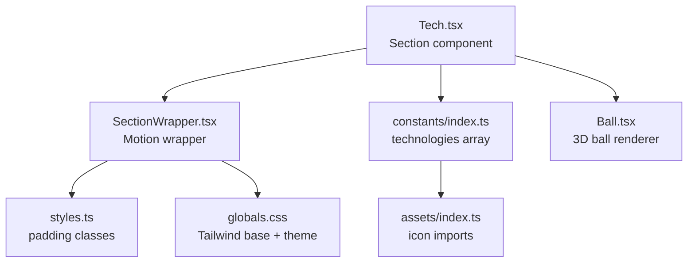
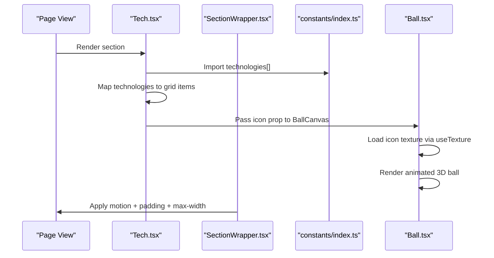
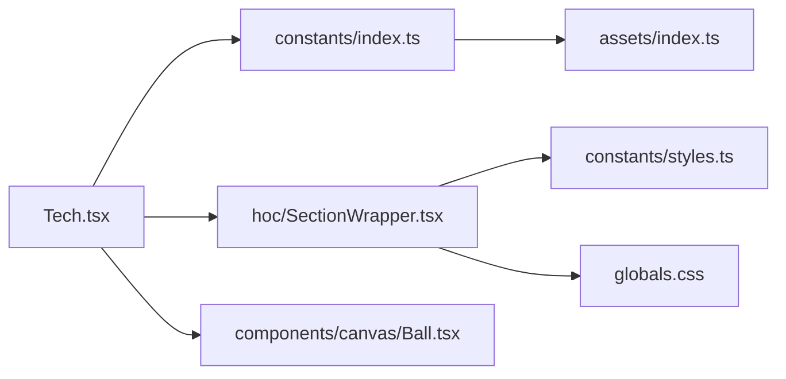

# Tech Section

<cite>
**Referenced Files in This Document**
- [Tech.tsx](file://src/components/sections/Tech.tsx)
- [index.ts](file://src/constants/index.ts)
- [index.ts](file://src/assets/index.ts)
- [SectionWrapper.tsx](file://src/hoc/SectionWrapper.tsx)
- [styles.ts](file://src/constants/styles.ts)
- [globals.css](file://src/globals.css)
- [Ball.tsx](file://src/components/canvas/Ball.tsx)
- [index.d.ts](file://src/types/index.d.ts)
</cite>

## Table of Contents
1. [Introduction](#introduction)
2. [Project Structure](#project-structure)
3. [Core Components](#core-components)
4. [Architecture Overview](#architecture-overview)
5. [Detailed Component Analysis](#detailed-component-analysis)
6. [Dependency Analysis](#dependency-analysis)
7. [Performance Considerations](#performance-considerations)
8. [Accessibility Features](#accessibility-features)
9. [Troubleshooting Guide](#troubleshooting-guide)
10. [Conclusion](#conclusion)

## Introduction
This document explains the Tech section component that showcases technical skills using animated 3D balls displaying technology icons. It covers how the section processes technology data from configuration, renders interactive visuals with Three.js via React Three Fiber, and applies Tailwind CSS for responsive layout. It also provides guidance on extending the technology list, customizing displays, adjusting the grid, optimizing for large lists, and ensuring accessibility.

## Project Structure
The Tech section is organized as a dedicated section component that integrates with higher-order wrappers for animations and spacing, consumes a centralized technology list, and renders animated 3D balls for each technology.

**Diagram sources**
- [Tech.tsx:1-20](file://src/components/sections/Tech.tsx#L1-L20)
- [SectionWrapper.tsx:1-31](file://src/hoc/SectionWrapper.tsx#L1-L31)
- [index.ts:70-123](file://src/constants/index.ts#L70-L123)
- [index.ts:10-62](file://src/assets/index.ts#L10-L62)
- [Ball.tsx:1-59](file://src/components/canvas/Ball.tsx#L1-L59)
- [styles.ts:1-16](file://src/constants/styles.ts#L1-L16)
- [globals.css:1-369](file://src/globals.css#L1-L369)

**Section sources**
- [Tech.tsx:1-20](file://src/components/sections/Tech.tsx#L1-L20)
- [index.ts:70-123](file://src/constants/index.ts#L70-L123)
- [index.ts:10-62](file://src/assets/index.ts#L10-L62)
- [SectionWrapper.tsx:1-31](file://src/hoc/SectionWrapper.tsx#L1-L31)
- [styles.ts:1-16](file://src/constants/styles.ts#L1-L16)
- [globals.css:1-369](file://src/globals.css#L1-L369)

## Core Components
- Tech section component: Renders a responsive grid of animated 3D balls, one per technology, using a mapped array.
- Technology data: Centralized list of technologies with name and icon fields.
- Asset imports: Technology icons imported and exported for reuse.
- Ball canvas: A reusable 3D rendering component that accepts an icon texture and animates a floating ball.
- Section wrapper: Applies motion animations and consistent padding with a max-width container.

Key implementation references:
- Tech grid rendering and mapping: [Tech.tsx:8-14](file://src/components/sections/Tech.tsx#L8-L14)
- Technology list definition: [index.ts:70-123](file://src/constants/index.ts#L70-L123)
- Icon imports: [index.ts:10-62](file://src/assets/index.ts#L10-L62)
- Ball canvas props and rendering: [Ball.tsx:41-56](file://src/components/canvas/Ball.tsx#L41-L56)
- Section wrapper animation and padding: [SectionWrapper.tsx:16-22](file://src/hoc/SectionWrapper.tsx#L16-L22)

**Section sources**
- [Tech.tsx:5-17](file://src/components/sections/Tech.tsx#L5-L17)
- [index.ts:70-123](file://src/constants/index.ts#L70-L123)
- [index.ts:10-62](file://src/assets/index.ts#L10-L62)
- [Ball.tsx:41-56](file://src/components/canvas/Ball.tsx#L41-L56)
- [SectionWrapper.tsx:10-28](file://src/hoc/SectionWrapper.tsx#L10-L28)

## Architecture Overview
The Tech section composes a responsive grid of animated 3D balls. Each ball is rendered by a shared canvas component that loads an icon texture and applies subtle floating animation. The section is wrapped with a motion-enabled container that handles viewport-triggered animations and consistent spacing.

**Diagram sources**
- [Tech.tsx:1-20](file://src/components/sections/Tech.tsx#L1-L20)
- [SectionWrapper.tsx:1-31](file://src/hoc/SectionWrapper.tsx#L1-L31)
- [index.ts:70-123](file://src/constants/index.ts#L70-L123)
- [Ball.tsx:13-56](file://src/components/canvas/Ball.tsx#L13-L56)

## Detailed Component Analysis

### Tech Section Component
Responsibilities:
- Build a centered, wrapable grid of technology items.
- Render each item as a square container holding a 3D animated ball.
- Use a consistent item size and spacing for visual rhythm.

Implementation highlights:
- Grid layout: Flex row with wrapping and horizontal gaps.
- Item sizing: Fixed square dimensions for uniformity.
- Mapping: Iterates over the technology list and passes each icon to the ball renderer.

References:
- Grid container and mapping: [Tech.tsx:8-14](file://src/components/sections/Tech.tsx#L8-L14)
- Exported wrapper usage: [Tech.tsx:19](file://src/components/sections/Tech.tsx#L19)

**Section sources**
- [Tech.tsx:5-17](file://src/components/sections/Tech.tsx#L5-L17)

### Technology Data Model
The technology list is typed and imported centrally:
- Type: A minimal interface requiring name and icon.
- Source: Centralized array of technology entries.
- Imports: Icons are imported and re-exported for use across the app.

References:
- Technology type definition: [index.d.ts:31](file://src/types/index.d.ts#L31)
- Technology list: [index.ts:70-123](file://src/constants/index.ts#L70-L123)
- Icon imports: [index.ts:10-62](file://src/assets/index.ts#L10-L62)

**Section sources**
- [index.d.ts:31](file://src/types/index.d.ts#L31)
- [index.ts:70-123](file://src/constants/index.ts#L70-L123)
- [index.ts:10-62](file://src/assets/index.ts#L10-L62)

### Ball Canvas Component
Responsibilities:
- Accept an icon image URL via props.
- Load the icon texture and render a floating 3D ball with decal mapping.
- Provide a controlled canvas environment with orbit controls and preloading.

Implementation highlights:
- Texture loading: Uses a hook to load the provided icon.
- Animation: Floating and subtle rotation for visual interest.
- Controls: Disables pan/zoom for a fixed focal view.

References:
- Prop interface and canvas: [Ball.tsx:41-56](file://src/components/canvas/Ball.tsx#L41-L56)
- Ball geometry and material: [Ball.tsx:13-39](file://src/components/canvas/Ball.tsx#L13-L39)

**Section sources**
- [Ball.tsx:13-56](file://src/components/canvas/Ball.tsx#L13-L56)

### Section Wrapper
Responsibilities:
- Provide viewport-triggered animations for section entrance.
- Apply consistent padding and constrain width.
- Anchor navigation via an internal hash span element.

Implementation highlights:
- Motion configuration: Initial hidden state, show on viewport visibility.
- Layout: Max-width container with responsive padding classes.

References:
- Motion and container: [SectionWrapper.tsx:16-22](file://src/hoc/SectionWrapper.tsx#L16-L22)
- Padding constants: [styles.ts:1-16](file://src/constants/styles.ts#L1-L16)

**Section sources**
- [SectionWrapper.tsx:10-28](file://src/hoc/SectionWrapper.tsx#L10-L28)
- [styles.ts:1-16](file://src/constants/styles.ts#L1-L16)

### Responsive Grid Layout
The Tech section uses Tailwind utilities to achieve a responsive grid:
- Flex row with wrapping enables dynamic column count.
- Horizontal gap creates consistent spacing between items.
- Square containers maintain uniform aspect ratios.

References:
- Grid container: [Tech.tsx:8](file://src/components/sections/Tech.tsx#L8)
- Item sizing: [Tech.tsx:10](file://src/components/sections/Tech.tsx#L10)

**Section sources**
- [Tech.tsx:8-14](file://src/components/sections/Tech.tsx#L8-L14)

### Styling Approach with Tailwind CSS
Styling is applied through utility classes:
- Container: Max-width and padding classes from shared constants.
- Grid: Flex utilities for alignment and wrapping.
- Items: Fixed dimensions for consistent sizing.
- Theme: Global dark/light mode overrides and gradients defined in global CSS.

References:
- Section padding and max-width: [SectionWrapper.tsx:20](file://src/hoc/SectionWrapper.tsx#L20)
- Global theme and gradients: [globals.css:1-369](file://src/globals.css#L1-L369)

**Section sources**
- [SectionWrapper.tsx:20](file://src/hoc/SectionWrapper.tsx#L20)
- [globals.css:1-369](file://src/globals.css#L1-L369)

### Adding New Technologies
Steps to add a new technology:
1. Import the icon in the assets index.
2. Extend the technology list with a new entry containing name and icon.
3. Ensure the icon is properly exported and referenced.

References:
- Icon import and export: [index.ts:10-62](file://src/assets/index.ts#L10-L62)
- Technology list extension point: [index.ts:123](file://src/constants/index.ts#L123)

**Section sources**
- [index.ts:10-62](file://src/assets/index.ts#L10-L62)
- [index.ts:123](file://src/constants/index.ts#L123)

### Customizing Skill Displays
Options to customize:
- Adjust item size by changing the square dimensions on the grid item container.
- Modify spacing by altering the gap utility on the grid container.
- Change animation intensity by tuning the floating parameters in the ball component.

References:
- Item container sizing: [Tech.tsx:10](file://src/components/sections/Tech.tsx#L10)
- Grid gap: [Tech.tsx:8](file://src/components/sections/Tech.tsx#L8)
- Ball animation parameters: [Ball.tsx:17-18](file://src/components/canvas/Ball.tsx#L17-L18)

**Section sources**
- [Tech.tsx:8-14](file://src/components/sections/Tech.tsx#L8-L14)
- [Ball.tsx:17-18](file://src/components/canvas/Ball.tsx#L17-L18)

### Modifying the Grid Layout
To change the grid behavior:
- Adjust the flex wrap and gap utilities to alter density and alignment.
- Use responsive variants to control breakpoints for different screen sizes.

References:
- Grid container utilities: [Tech.tsx:8](file://src/components/sections/Tech.tsx#L8)

**Section sources**
- [Tech.tsx:8](file://src/components/sections/Tech.tsx#L8)

## Dependency Analysis
The Tech section depends on:
- constants/index.ts for the technology list.
- assets/index.ts for icon imports.
- hoc/SectionWrapper.tsx for animation and layout.
- components/canvas/Ball.tsx for 3D rendering.
- constants/styles.ts for padding classes.
- globals.css for global theme and utilities.

**Diagram sources**
- [Tech.tsx:1-20](file://src/components/sections/Tech.tsx#L1-L20)
- [index.ts:70-123](file://src/constants/index.ts#L70-L123)
- [index.ts:10-62](file://src/assets/index.ts#L10-L62)
- [SectionWrapper.tsx:1-31](file://src/hoc/SectionWrapper.tsx#L1-L31)
- [styles.ts:1-16](file://src/constants/styles.ts#L1-L16)
- [globals.css:1-369](file://src/globals.css#L1-L369)

**Section sources**
- [Tech.tsx:1-20](file://src/components/sections/Tech.tsx#L1-L20)
- [index.ts:70-123](file://src/constants/index.ts#L70-L123)
- [index.ts:10-62](file://src/assets/index.ts#L10-L62)
- [SectionWrapper.tsx:1-31](file://src/hoc/SectionWrapper.tsx#L1-L31)
- [styles.ts:1-16](file://src/constants/styles.ts#L1-L16)
- [globals.css:1-369](file://src/globals.css#L1-L369)

## Performance Considerations
- Canvas rendering cost: Each technology renders a separate canvas with a 3D scene. For large lists, consider virtualization or lazy loading to reduce DOM and GPU overhead.
- Texture loading: Ensure icons are optimized and sized appropriately to minimize memory usage.
- Animation loop: The canvas uses a demand-driven frame loop; keep geometry and materials lightweight to maintain smooth performance.
- Grid density: Excessive grid items can increase layout and paint costs; adjust spacing and breakpoints to balance density and performance.

[No sources needed since this section provides general guidance]

## Accessibility Features
- Focus and interaction: The 3D balls disable pan/zoom and orbit controls, simplifying interaction for assistive technologies.
- Semantic anchors: The section wrapper includes an anchor span for navigation targeting.
- Text alternatives: Consider adding aria-labels to grid items if text labels are desired for screen readers.

[No sources needed since this section provides general guidance]

## Troubleshooting Guide
- Icons not appearing: Verify the icon is imported and exported correctly in the assets index and referenced in the technology list.
- Canvas rendering issues: Confirm the icon URL is valid and the canvas environment is mounted without errors.
- Layout anomalies: Check Tailwind utilities and responsive variants applied to the grid container and items.

**Section sources**
- [index.ts:10-62](file://src/assets/index.ts#L10-L62)
- [index.ts:70-123](file://src/constants/index.ts#L70-L123)
- [Ball.tsx:41-56](file://src/components/canvas/Ball.tsx#L41-L56)
- [Tech.tsx:8-14](file://src/components/sections/Tech.tsx#L8-L14)

## Conclusion
The Tech section delivers a visually engaging, responsive showcase of technologies using a clean separation of concerns: a simple grid renderer, a reusable 3D ball component, and a motion-enabled section wrapper. By centralizing technology data and leveraging Tailwind utilities, customization and maintenance remain straightforward. For large technology lists, consider virtualization and performance optimizations to sustain smooth interactions.