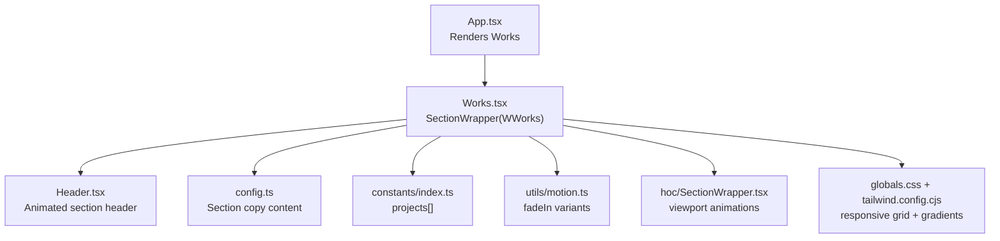
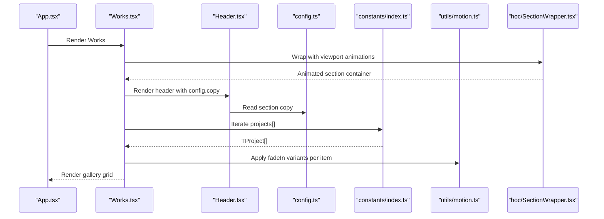
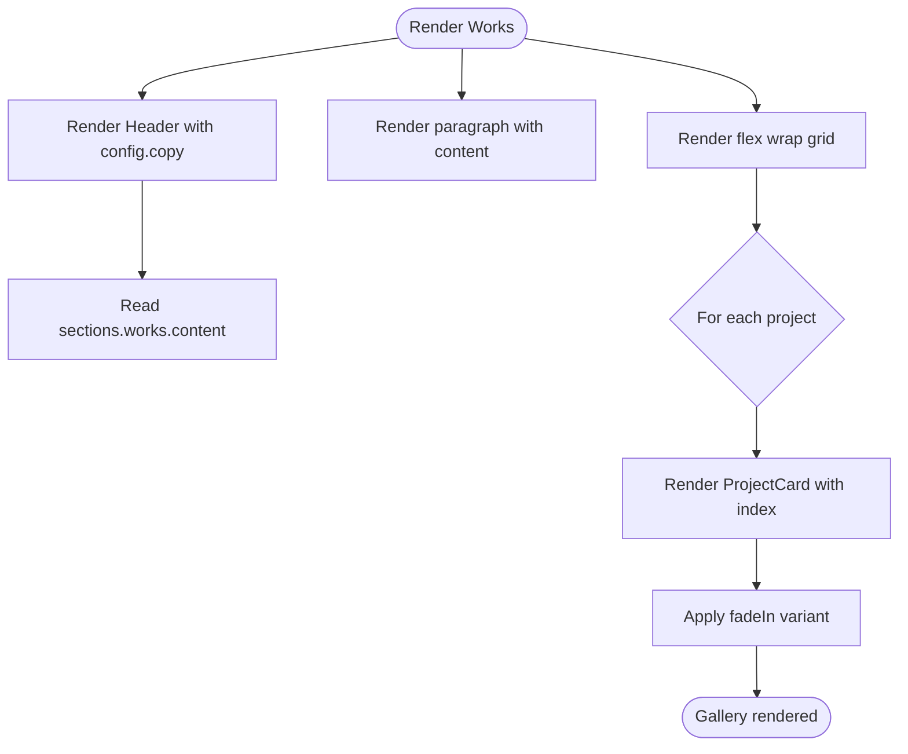
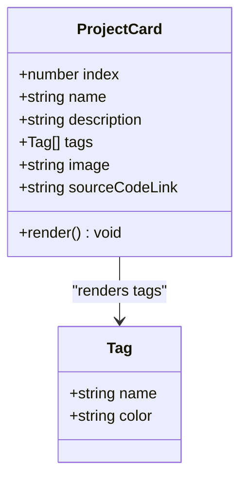
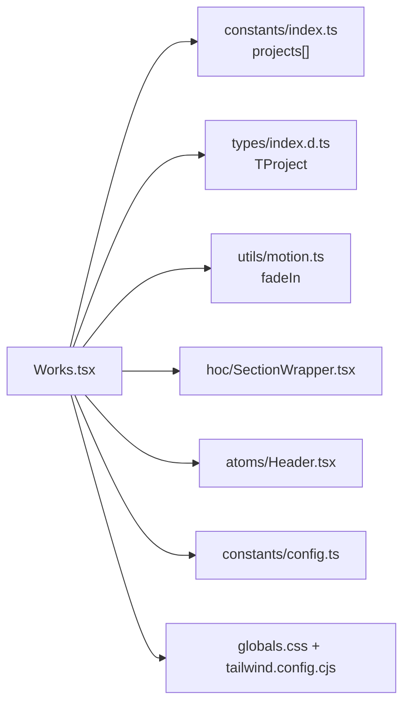

# Works Section

<cite>
**Referenced Files in This Document**
- [Works.tsx](file://src/components/sections/Works.tsx)
- [config.ts](file://src/constants/config.ts)
- [index.d.ts](file://src/types/index.d.ts)
- [index.ts](file://src/constants/index.ts)
- [motion.ts](file://src/utils/motion.ts)
- [SectionWrapper.tsx](file://src/hoc/SectionWrapper.tsx)
- [Header.tsx](file://src/components/atoms/Header.tsx)
- [globals.css](file://src/globals.css)
- [tailwind.config.cjs](file://tailwind.config.cjs)
- [App.tsx](file://src/App.tsx)
</cite>

## Table of Contents
1. [Introduction](#introduction)
2. [Project Structure](#project-structure)
3. [Core Components](#core-components)
4. [Architecture Overview](#architecture-overview)
5. [Detailed Component Analysis](#detailed-component-analysis)
6. [Dependency Analysis](#dependency-analysis)
7. [Performance Considerations](#performance-considerations)
8. [Troubleshooting Guide](#troubleshooting-guide)
9. [Conclusion](#conclusion)

## Introduction
This document explains the Works section component that renders a project portfolio gallery. It covers the gallery layout, project card design, how project data flows from configuration and constants into the UI, and how interactive elements are implemented. It also provides guidance on extending the gallery with new projects, customizing cards, and optimizing images for performance.

## Project Structure
The Works section is implemented as a dedicated section component that composes smaller parts:
- A header component with animated text
- A paragraph with section content from configuration
- A responsive grid of project cards generated from a constant array of projects
- A higher-order wrapper that adds viewport-triggered animations and section layout

**Diagram sources**
- [App.tsx:38](file://src/App.tsx#L38)
- [Works.tsx:66-89](file://src/components/sections/Works.tsx#L66-L89)
- [Header.tsx:13-28](file://src/components/atoms/Header.tsx#L13-L28)
- [config.ts:80-84](file://src/constants/config.ts#L80-L84)
- [index.ts:191-255](file://src/constants/index.ts#L191-L255)
- [motion.ts:21-45](file://src/utils/motion.ts#L21-L45)
- [SectionWrapper.tsx:10-28](file://src/hoc/SectionWrapper.tsx#L10-L28)
- [globals.css:1-369](file://src/globals.css#L1-L369)
- [tailwind.config.cjs:1-29](file://tailwind.config.cjs#L1-L29)

**Section sources**
- [App.tsx:38](file://src/App.tsx#L38)
- [Works.tsx:66-89](file://src/components/sections/Works.tsx#L66-L89)
- [Header.tsx:13-28](file://src/components/atoms/Header.tsx#L13-L28)
- [config.ts:80-84](file://src/constants/config.ts#L80-L84)
- [index.ts:191-255](file://src/constants/index.ts#L191-L255)
- [motion.ts:21-45](file://src/utils/motion.ts#L21-L45)
- [SectionWrapper.tsx:10-28](file://src/hoc/SectionWrapper.tsx#L10-L28)
- [globals.css:1-369](file://src/globals.css#L1-L369)
- [tailwind.config.cjs:1-29](file://tailwind.config.cjs#L1-L29)

## Core Components
- Works section: Renders the header, description, and project cards grid.
- ProjectCard: A reusable card component that displays a project’s image, title, description, tags, and a GitHub link button.
- Header: Renders section headings with optional motion animation.
- SectionWrapper: Wraps the section with viewport-triggered animations and consistent padding.
- Projects data: Typed array of projects imported from constants.
- Configuration: Section copy content and metadata loaded from config.

Key responsibilities:
- Gallery layout: Responsive flex wrap with gap spacing.
- Hover effect: Parallax tilt and a GitHub icon overlay on the project image.
- Filtering: Not implemented in the current code; can be extended via props/state.
- Modal: Not implemented; can be added by wrapping ProjectCard with a modal container.

**Section sources**
- [Works.tsx:12-64](file://src/components/sections/Works.tsx#L12-L64)
- [Works.tsx:66-89](file://src/components/sections/Works.tsx#L66-L89)
- [Header.tsx:13-28](file://src/components/atoms/Header.tsx#L13-L28)
- [SectionWrapper.tsx:10-28](file://src/hoc/SectionWrapper.tsx#L10-L28)
- [index.ts:191-255](file://src/constants/index.ts#L191-L255)
- [config.ts:80-84](file://src/constants/config.ts#L80-L84)

## Architecture Overview
The Works section composes several layers:
- Presentation layer: Works.tsx renders the UI.
- Data layer: constants/index.ts provides typed project data.
- Animation layer: utils/motion.ts supplies variants for Framer Motion.
- Layout layer: hoc/SectionWrapper.tsx applies viewport-triggered animations and spacing.
- Typography and visuals: globals.css and tailwind.config.cjs define responsive breakpoints, colors, and gradients.

**Diagram sources**
- [App.tsx:38](file://src/App.tsx#L38)
- [Works.tsx:66-89](file://src/components/sections/Works.tsx#L66-L89)
- [Header.tsx:13-28](file://src/components/atoms/Header.tsx#L13-L28)
- [config.ts:80-84](file://src/constants/config.ts#L80-L84)
- [index.ts:191-255](file://src/constants/index.ts#L191-L255)
- [motion.ts:21-45](file://src/utils/motion.ts#L21-L45)
- [SectionWrapper.tsx:10-28](file://src/hoc/SectionWrapper.tsx#L10-L28)

## Detailed Component Analysis

### Works Section
- Purpose: Render a portfolio gallery with animated entries.
- Data flow: Reads section copy from config and project list from constants.
- Layout: Uses flex wrap with gap spacing to create a responsive grid.
- Animations: Each card uses a staggered fade-in variant keyed by index.

**Diagram sources**
- [Works.tsx:66-89](file://src/components/sections/Works.tsx#L66-L89)
- [config.ts:80-84](file://src/constants/config.ts#L80-L84)
- [motion.ts:21-45](file://src/utils/motion.ts#L21-L45)

**Section sources**
- [Works.tsx:66-89](file://src/components/sections/Works.tsx#L66-L89)
- [config.ts:80-84](file://src/constants/config.ts#L80-L84)
- [motion.ts:21-45](file://src/utils/motion.ts#L21-L45)

### ProjectCard Component
- Purpose: Display a single project with image, title, description, tags, and a GitHub link button.
- Interactions:
  - Clicking the GitHub icon opens the source code link in a new tab.
  - Parallax tilt effect enhances depth perception.
- Styling: Uses Tailwind classes for responsive sizing, rounded corners, and gradient overlays.

**Diagram sources**
- [Works.tsx:12-64](file://src/components/sections/Works.tsx#L12-L64)
- [index.d.ts:21-29](file://src/types/index.d.ts#L21-L29)

**Section sources**
- [Works.tsx:12-64](file://src/components/sections/Works.tsx#L12-L64)
- [index.d.ts:21-29](file://src/types/index.d.ts#L21-L29)

### Header Component
- Purpose: Render section headings with optional motion animation.
- Behavior: When enabled, wraps content in a motion div using a predefined text variant.

**Section sources**
- [Header.tsx:13-28](file://src/components/atoms/Header.tsx#L13-L28)

### SectionWrapper Higher-Order Component
- Purpose: Adds viewport-triggered animations and consistent section padding.
- Behavior: Applies initial and whileInView variants and sets an ID for navigation.

**Section sources**
- [SectionWrapper.tsx:10-28](file://src/hoc/SectionWrapper.tsx#L10-L28)

### Projects Data Model and Source
- Type: TProject defines the shape of each project entry.
- Source: projects array in constants/index.ts provides the dataset.
- Usage: Works.tsx maps over projects to render cards.

**Section sources**
- [index.d.ts:21-29](file://src/types/index.d.ts#L21-L29)
- [index.ts:191-255](file://src/constants/index.ts#L191-L255)

### Configuration and Content
- Sections: config.ts defines section copy for “works” including paragraph and heading content.
- Usage: Works.tsx reads the content to render below the header.

**Section sources**
- [config.ts:80-84](file://src/constants/config.ts#L80-L84)

## Dependency Analysis
The Works section depends on:
- Constants for data (projects)
- Types for typing
- Motion utilities for animations
- Layout wrappers for viewport animations
- Global styles for responsive grid and gradients

**Diagram sources**
- [Works.tsx:6-10](file://src/components/sections/Works.tsx#L6-L10)
- [index.ts:191-255](file://src/constants/index.ts#L191-L255)
- [index.d.ts:21-29](file://src/types/index.d.ts#L21-L29)
- [motion.ts:21-45](file://src/utils/motion.ts#L21-L45)
- [SectionWrapper.tsx:10-28](file://src/hoc/SectionWrapper.tsx#L10-L28)
- [Header.tsx:13-28](file://src/components/atoms/Header.tsx#L13-L28)
- [config.ts:80-84](file://src/constants/config.ts#L80-L84)
- [globals.css:1-369](file://src/globals.css#L1-L369)
- [tailwind.config.cjs:1-29](file://tailwind.config.cjs#L1-L29)

**Section sources**
- [Works.tsx:6-10](file://src/components/sections/Works.tsx#L6-L10)
- [index.ts:191-255](file://src/constants/index.ts#L191-L255)
- [index.d.ts:21-29](file://src/types/index.d.ts#L21-L29)
- [motion.ts:21-45](file://src/utils/motion.ts#L21-L45)
- [SectionWrapper.tsx:10-28](file://src/hoc/SectionWrapper.tsx#L10-L28)
- [Header.tsx:13-28](file://src/components/atoms/Header.tsx#L13-L28)
- [config.ts:80-84](file://src/constants/config.ts#L80-L84)
- [globals.css:1-369](file://src/globals.css#L1-L369)
- [tailwind.config.cjs:1-29](file://tailwind.config.cjs#L1-L29)

## Performance Considerations
- Image optimization and lazy loading:
  - Current implementation loads images immediately. To optimize, replace static  with a lazy-loading-capable component or library and serve appropriately sized images.
  - Consider using WebP or AVIF formats and responsive image attributes to reduce bandwidth.
- Rendering many images:
  - Virtualization is not implemented; for very large galleries, consider a virtualized list to limit DOM nodes.
- Animations:
  - Staggered fade-in is lightweight but can still impact initial render on low-end devices. Consider disabling animations on first load or using prefers-reduced-motion.
- Bundle size:
  - Ensure assets are bundled efficiently; avoid importing large images unnecessarily.

[No sources needed since this section provides general guidance]

## Troubleshooting Guide
- Projects not rendering:
  - Verify the projects array exists and is exported from constants/index.ts.
  - Confirm Works.tsx imports projects correctly.
- Missing section content:
  - Ensure config.sections.works.content is defined and passed to Header.
- Animation not triggering:
  - Check that SectionWrapper is applied to Works and that viewport options are appropriate.
- Hover effect not visible:
  - Confirm the GitHub icon click handler is attached and that the overlay is positioned absolutely over the image.

**Section sources**
- [index.ts:191-255](file://src/constants/index.ts#L191-L255)
- [config.ts:80-84](file://src/constants/config.ts#L80-L84)
- [SectionWrapper.tsx:10-28](file://src/hoc/SectionWrapper.tsx#L10-L28)
- [Works.tsx:36-47](file://src/components/sections/Works.tsx#L36-L47)

## Conclusion
The Works section provides a clean, animated project gallery with a responsive grid and interactive project cards. Its modular design makes it easy to add new projects, customize cards, and extend functionality such as filtering or modals. For production, prioritize image optimization and consider virtualization and reduced-motion support to improve performance and accessibility.