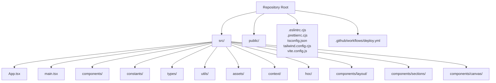
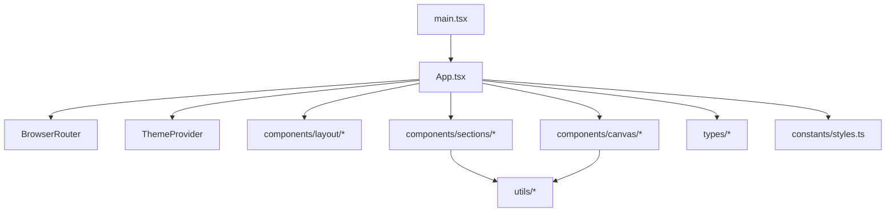
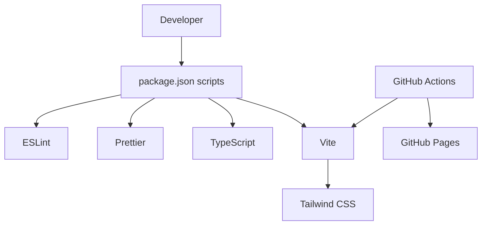

# Contributing Guidelines

<cite>
**Referenced Files in This Document**
- [README.md](file://README.md)
- [package.json](file://package.json)
- [.eslintrc.cjs](file://.eslintrc.cjs)
- [.prettierrc.cjs](file://.prettierrc.cjs)
- [.github/workflows/deploy.yml](file://.github/workflows/deploy.yml)
- [tsconfig.json](file://tsconfig.json)
- [vite.config.js](file://vite.config.js)
- [tailwind.config.cjs](file://tailwind.config.cjs)
- [src/components/index.ts](file://src/components/index.ts)
- [src/App.tsx](file://src/App.tsx)
- [src/main.tsx](file://src/main.tsx)
- [src/constants/styles.ts](file://src/constants/styles.ts)
- [src/types/index.d.ts](file://src/types/index.d.ts)
- [src/utils/motion.ts](file://src/utils/motion.ts)
</cite>

## Table of Contents
1. [Introduction](#introduction)
2. [Project Structure](#project-structure)
3. [Core Components](#core-components)
4. [Architecture Overview](#architecture-overview)
5. [Detailed Component Analysis](#detailed-component-analysis)
6. [Dependency Analysis](#dependency-analysis)
7. [Performance Considerations](#performance-considerations)
8. [Troubleshooting Guide](#troubleshooting-guide)
9. [Conclusion](#conclusion)
10. [Appendices](#appendices)

## Introduction
Thank you for considering a contribution to the 3D Portfolio project. This document provides a comprehensive guide to setting up your development environment, adhering to code standards, understanding the contribution workflow, and ensuring high-quality submissions. The project is a React and Three.js powered portfolio site with TypeScript, Vite, Tailwind CSS, ESLint, and Prettier integrated for a smooth developer experience.

## Project Structure
The repository follows a feature-based and layer-based organization:
- src: Contains all source code organized into components, constants, context, HOCs, types, utils, and assets.
- public: Static assets such as 3D scenes and textures.
- Configuration files at the root define linting, formatting, TypeScript, Tailwind, and Vite behavior.

Key conventions observed:
- Components are grouped by domain: atoms, layout, sections, and canvas.
- Constants and styles are centralized for reusability.
- Types are defined in a dedicated module for shared interfaces.
- Utilities encapsulate reusable logic like motion variants.

**Diagram sources**
- [src/App.tsx:1-51](file://src/App.tsx#L1-L51)
- [src/main.tsx:1-12](file://src/main.tsx#L1-L12)
- [src/components/index.ts:1-33](file://src/components/index.ts#L1-L33)
- [tsconfig.json:1-26](file://tsconfig.json#L1-L26)
- [vite.config.js:1-9](file://vite.config.js#L1-L9)
- [tailwind.config.cjs:1-29](file://tailwind.config.cjs#L1-L29)
- [.eslintrc.cjs:1-38](file://.eslintrc.cjs#L1-L38)
- [.prettierrc.cjs:1-16](file://.prettierrc.cjs#L1-L16)
- [.github/workflows/deploy.yml:1-44](file://.github/workflows/deploy.yml#L1-L44)

**Section sources**
- [README.md:32-109](file://README.md#L32-L109)
- [src/App.tsx:1-51](file://src/App.tsx#L1-L51)
- [src/main.tsx:1-12](file://src/main.tsx#L1-L12)
- [src/components/index.ts:1-33](file://src/components/index.ts#L1-L33)

## Core Components
This section outlines the essential development setup and standards enforced by the project.

- Development scripts and tooling
  - Use the provided scripts to develop, build, preview, lint, and type-check the project.
  - Linting enforces style and correctness via ESLint with TypeScript and React Hooks plugins, and integrates Prettier to prevent conflicts.
  - Type-checking ensures strict TypeScript semantics during development.

- ESLint configuration
  - Extends recommended configurations for ESLint, TypeScript, React Hooks, and Prettier.
  - Uses a TypeScript parser and resolver to support modern imports and path mapping.
  - Includes overrides to adjust severity for specific rules as configured.

- Prettier formatting rules
  - Formatting preferences include print width, quote style, semicolons, trailing commas, and indentation.
  - Integrates with ESLint to avoid conflicts.

- TypeScript configuration
  - Strict compiler options including unused locals/parameters checks and fallthrough switch detection.
  - Bundler module resolution and JSX runtime align with Vite and React.

- Tailwind CSS configuration
  - JIT mode with dark mode enabled and custom theme tokens.
  - Content paths scoped to src to optimize rebuilds.

- Vite configuration
  - React plugin enabled and base path configured for deployment.

**Section sources**
- [package.json:6-12](file://package.json#L6-L12)
- [.eslintrc.cjs:1-38](file://.eslintrc.cjs#L1-L38)
- [.prettierrc.cjs:1-16](file://.prettierrc.cjs#L1-L16)
- [tsconfig.json:1-26](file://tsconfig.json#L1-L26)
- [tailwind.config.cjs:1-29](file://tailwind.config.cjs#L1-L29)
- [vite.config.js:1-9](file://vite.config.js#L1-L9)

## Architecture Overview
The application bootstraps via main.tsx, renders App.tsx inside React.StrictMode, and orchestrates routing and theming. Components are organized by domain and exported via a central index for easy consumption.

**Diagram sources**
- [src/main.tsx:1-12](file://src/main.tsx#L1-L12)
- [src/App.tsx:1-51](file://src/App.tsx#L1-L51)
- [src/components/index.ts:1-33](file://src/components/index.ts#L1-L33)
- [src/constants/styles.ts:1-16](file://src/constants/styles.ts#L1-L16)
- [src/types/index.d.ts:1-45](file://src/types/index.d.ts#L1-L45)
- [src/utils/motion.ts:1-92](file://src/utils/motion.ts#L1-L92)

## Detailed Component Analysis

### Code Standards and Formatting
- ESLint and Prettier integration
  - ESLint extends recommended configurations and integrates with Prettier to enforce consistent formatting.
  - The resolver is configured to recognize src as the root and resolve TS/TSX imports.
  - Overrides demonstrate how to adjust rule severity for specific cases.

- TypeScript strictness
  - Strict mode, unused locals/parameters, and switch fallthrough checks are enabled to catch potential issues early.

- Tailwind customization
  - Custom colors, shadows, breakpoints, and backgrounds are defined for consistent UI.

- Vite base path
  - Base path is set for proper asset resolution in deployments.

**Section sources**
- [.eslintrc.cjs:1-38](file://.eslintrc.cjs#L1-L38)
- [.prettierrc.cjs:1-16](file://.prettierrc.cjs#L1-L16)
- [tsconfig.json:17-22](file://tsconfig.json#L17-L22)
- [tailwind.config.cjs:6-25](file://tailwind.config.cjs#L6-L25)
- [vite.config.js:7-8](file://vite.config.js#L7-L8)

### Component Organization and Naming Conventions
- Domain-based grouping
  - layout: reusable UI scaffolding (e.g., Navbar, Loader).
  - sections: page-level content areas (e.g., Hero, About, Experience).
  - canvas: 3D scene components (e.g., Earth, Stars, Computers).
  - atoms: minimal reusable elements (e.g., Header).

- Central exports
  - A single index file aggregates and re-exports components for convenient imports.

- Consistent naming
  - PascalCase for components and files.
  - Canvas suffixed components indicate 3D scenes.

**Section sources**
- [src/components/index.ts:1-33](file://src/components/index.ts#L1-L33)
- [README.md:40-62](file://README.md#L40-L62)

### Motion and Animation Utilities
- Shared animation primitives
  - Motion utilities encapsulate Framer Motion variants for text, fade, zoom, and slide transitions.
  - Strongly typed motion parameters ensure consistent usage across components.

**Section sources**
- [src/utils/motion.ts:1-92](file://src/utils/motion.ts#L1-L92)
- [src/types/index.d.ts:39-45](file://src/types/index.d.ts#L39-L45)

### Application Bootstrap
- Entry point
  - main.tsx creates the root and renders App within React.StrictMode.
- Routing and theming
  - App wraps children in BrowserRouter and ThemeProvider.
- Composition
  - App composes layout, sections, and canvas components to render the full page.

**Section sources**
- [src/main.tsx:1-12](file://src/main.tsx#L1-L12)
- [src/App.tsx:1-51](file://src/App.tsx#L1-L51)

## Dependency Analysis
The project’s toolchain and CI pipeline form a cohesive development and deployment ecosystem.

**Diagram sources**
- [package.json:6-12](file://package.json#L6-L12)
- [.eslintrc.cjs:1-38](file://.eslintrc.cjs#L1-L38)
- [.prettierrc.cjs:1-16](file://.prettierrc.cjs#L1-L16)
- [tsconfig.json:1-26](file://tsconfig.json#L1-L26)
- [vite.config.js:1-9](file://vite.config.js#L1-L9)
- [tailwind.config.cjs:1-29](file://tailwind.config.cjs#L1-L29)
- [.github/workflows/deploy.yml:1-44](file://.github/workflows/deploy.yml#L1-L44)

**Section sources**
- [package.json:13-43](file://package.json#L13-L43)
- [.github/workflows/deploy.yml:1-44](file://.github/workflows/deploy.yml#L1-L44)

## Performance Considerations
- Use Tailwind utilities judiciously to avoid bloating the CSS bundle.
- Keep 3D assets optimized; leverage lazy loading for heavy scenes.
- Minimize unnecessary re-renders by structuring components and applying memoization where appropriate.
- Run type-checking and linting locally before committing to catch regressions early.

## Troubleshooting Guide
- Lint failures
  - Run the lint script to identify and fix issues flagged by ESLint.
  - Review the resolver and parser settings if import-related errors occur.
- Formatting inconsistencies
  - Apply Prettier formatting to align with the configured rules.
- Type errors
  - Use the type-check script to validate TypeScript semantics prior to submission.
- CI deployment issues
  - Verify Node.js version and dependency installation steps in the workflow.
  - Confirm build artifacts are generated and uploaded correctly.

**Section sources**
- [package.json:10-11](file://package.json#L10-L11)
- [.eslintrc.cjs:1-38](file://.eslintrc.cjs#L1-L38)
- [.prettierrc.cjs:1-16](file://.prettierrc.cjs#L1-L16)
- [.github/workflows/deploy.yml:26-34](file://.github/workflows/deploy.yml#L26-L34)

## Conclusion
By following these guidelines, contributors can ensure their changes integrate smoothly with the existing architecture and toolchain. Adhering to code standards, maintaining component organization, and leveraging the provided scripts and CI pipeline will help keep the project maintainable and performant.

## Appendices

### Contribution Workflow
- Fork the repository and create a feature branch.
- Implement changes with adherence to code standards and component conventions.
- Run linting and type-checking locally.
- Commit and push your branch, then open a Pull Request with a clear description.

**Section sources**
- [README.md:274-289](file://README.md#L274-L289)

### Reporting Bugs and Feature Requests
- Open an issue with a clear title and description for bugs.
- For feature requests, include context and desired outcomes.

**Section sources**
- [README.md:290-299](file://README.md#L290-L299)

### Communication Channels
- Engage via the listed channels for discussions and support.

**Section sources**
- [README.md:317-323](file://README.md#L317-L323)

### Examples of Good Contributions
- Refactor a component to improve readability while preserving behavior.
- Add a new canvas scene with consistent naming and export patterns.
- Enhance motion utilities with additional variants aligned with the existing type definitions.

### Common Pitfalls to Avoid
- Introducing unused variables or unreachable code.
- Bypassing lint rules without justification.
- Neglecting to update the central component index when adding new exports.
- Ignoring type errors or disabling strict mode settings.