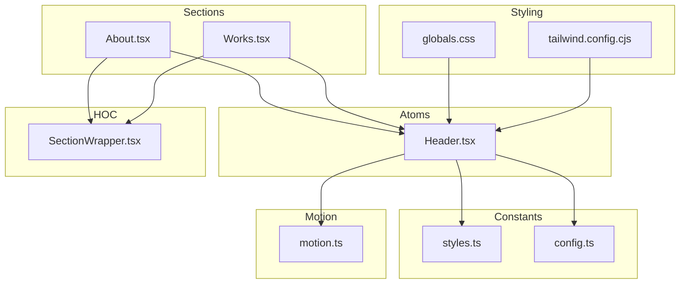
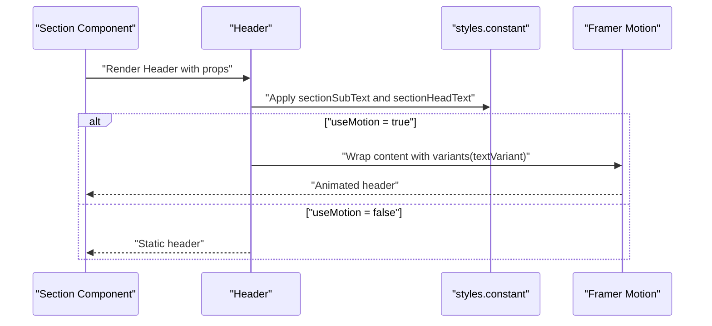
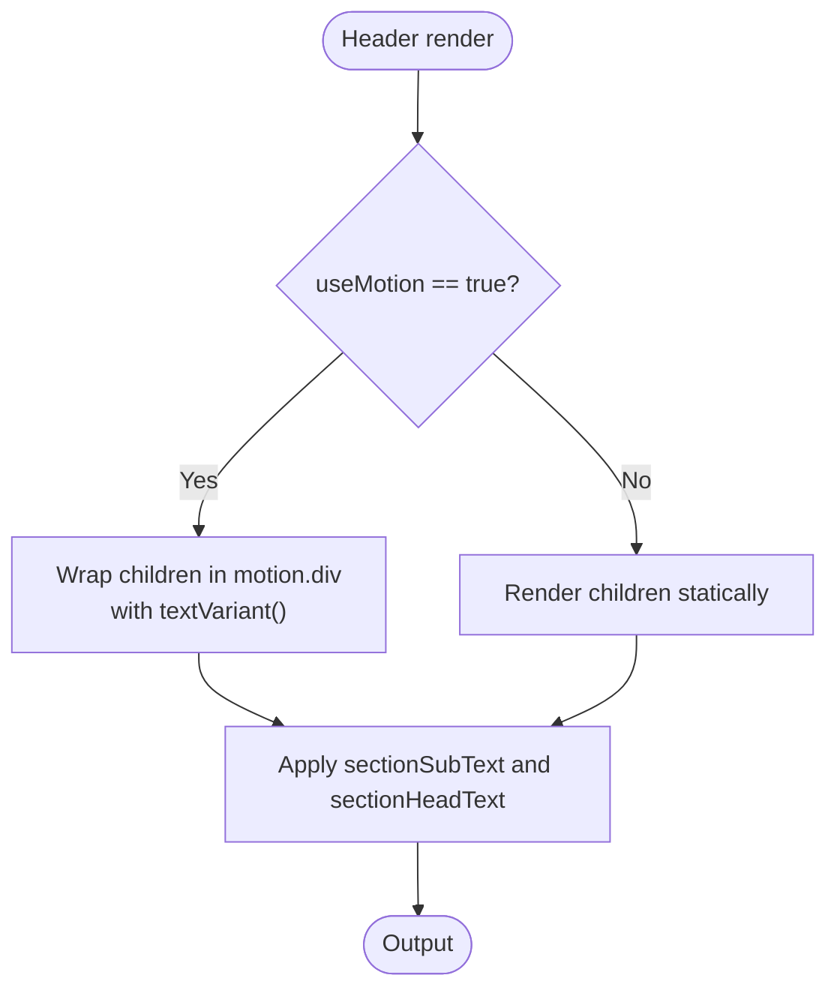
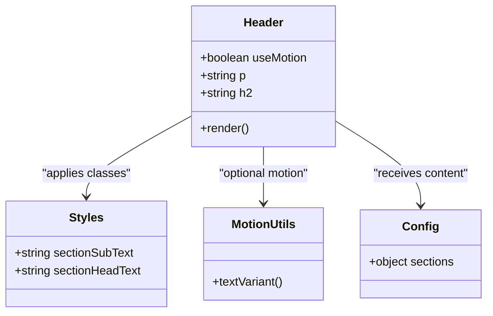
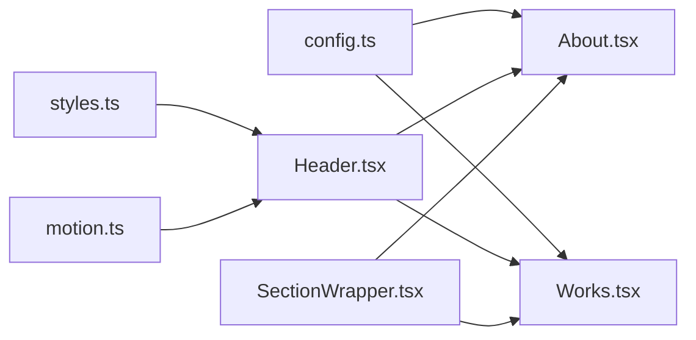

# Atomic Components

<cite>
**Referenced Files in This Document**
- [Header.tsx](file://src/components/atoms/Header.tsx)
- [styles.ts](file://src/constants/styles.ts)
- [motion.ts](file://src/utils/motion.ts)
- [globals.css](file://src/globals.css)
- [tailwind.config.cjs](file://tailwind.config.cjs)
- [About.tsx](file://src/components/sections/About.tsx)
- [Works.tsx](file://src/components/sections/Works.tsx)
- [SectionWrapper.tsx](file://src/hoc/SectionWrapper.tsx)
- [config.ts](file://src/constants/config.ts)
- [index.ts](file://src/components/index.ts)
- [package.json](file://package.json)
</cite>

## Table of Contents
1. [Introduction](#introduction)
2. [Project Structure](#project-structure)
3. [Core Components](#core-components)
4. [Architecture Overview](#architecture-overview)
5. [Detailed Component Analysis](#detailed-component-analysis)
6. [Dependency Analysis](#dependency-analysis)
7. [Performance Considerations](#performance-considerations)
8. [Accessibility and Responsive Behavior](#accessibility-and-responsive-behavior)
9. [Troubleshooting Guide](#troubleshooting-guide)
10. [Conclusion](#conclusion)

## Introduction
This document explains the atomic components in the 3D Portfolio application with a focus on the Header.tsx component. As an atomic element, Header encapsulates typography and text presentation, serving as the foundational building block for consistent, reusable text headers across sections. It integrates with the design system via Tailwind CSS utility classes and the shared styles constant, and supports optional motion behavior through Framer Motion. The atomic design pattern ensures small, single-purpose components that compose into larger, more complex layouts.

## Project Structure
The atomic components live under src/components/atoms and are consumed by higher-level sections and HOCs. The design system is centralized in constants and Tailwind configuration, while motion utilities provide reusable animation variants.

**Diagram sources**
- [Header.tsx:1-29](file://src/components/atoms/Header.tsx#L1-L29)
- [styles.ts:1-16](file://src/constants/styles.ts#L1-L16)
- [motion.ts:1-92](file://src/utils/motion.ts#L1-L92)
- [About.tsx:1-68](file://src/components/sections/About.tsx#L1-L68)
- [Works.tsx:1-90](file://src/components/sections/Works.tsx#L1-L90)
- [SectionWrapper.tsx:1-30](file://src/hoc/SectionWrapper.tsx#L1-L30)
- [config.ts:1-87](file://src/constants/config.ts#L1-L87)
- [globals.css:1-369](file://src/globals.css#L1-L369)
- [tailwind.config.cjs:1-29](file://tailwind.config.cjs#L1-L29)

**Section sources**
- [Header.tsx:1-29](file://src/components/atoms/Header.tsx#L1-L29)
- [styles.ts:1-16](file://src/constants/styles.ts#L1-L16)
- [motion.ts:1-92](file://src/utils/motion.ts#L1-L92)
- [About.tsx:1-68](file://src/components/sections/About.tsx#L1-L68)
- [Works.tsx:1-90](file://src/components/sections/Works.tsx#L1-L90)
- [SectionWrapper.tsx:1-30](file://src/hoc/SectionWrapper.tsx#L1-L30)
- [config.ts:1-87](file://src/constants/config.ts#L1-L87)
- [globals.css:1-369](file://src/globals.css#L1-L369)
- [tailwind.config.cjs:1-29](file://tailwind.config.cjs#L1-L29)

## Core Components
Header is a minimal, presentational atomic component responsible for rendering a paragraph subtitle and an h2 headline. It exposes a boolean prop to toggle motion behavior and accepts the text content as string props. Its styling is applied via shared Tailwind utility classes from the central styles constant, ensuring consistent typography across the app.

Key characteristics:
- Single responsibility: render a section header pair (subtitle + headline)
- Optional motion integration via Framer Motion
- Centralized styling via styles.constant
- Lightweight and composable

**Section sources**
- [Header.tsx:7-28](file://src/components/atoms/Header.tsx#L7-L28)
- [styles.ts:11-14](file://src/constants/styles.ts#L11-L14)

## Architecture Overview
Header participates in a layered architecture:
- Atoms define low-level UI primitives (typography, buttons, inputs)
- Sections assemble atoms and molecules into page areas
- HOCs provide cross-cutting concerns like animations and layout wrappers
- Constants and utilities supply shared design tokens and motion presets
- Tailwind and global CSS enforce responsive and theme-aware styles

**Diagram sources**
- [Header.tsx:13-28](file://src/components/atoms/Header.tsx#L13-L28)
- [styles.ts:11-14](file://src/constants/styles.ts#L11-L14)
- [motion.ts:4-19](file://src/utils/motion.ts#L4-L19)

**Section sources**
- [Header.tsx:13-28](file://src/components/atoms/Header.tsx#L13-L28)
- [styles.ts:11-14](file://src/constants/styles.ts#L11-L14)
- [motion.ts:4-19](file://src/utils/motion.ts#L4-L19)

## Detailed Component Analysis

### Header.tsx
Header is a functional component with a straightforward contract:
- Props:
  - useMotion: boolean to enable/disable motion wrapper
  - p: string for the subtitle paragraph
  - h2: string for the headline
- Rendering:
  - Renders a paragraph with the section subtitle class
  - Renders an h2 headline with the section headline class
  - Conditionally wraps content in a motion div when useMotion is true
- Styling:
  - Uses styles.sectionSubText and styles.sectionHeadText
- Motion:
  - Consumes textVariant() to configure entrance animation

**Diagram sources**
- [Header.tsx:13-28](file://src/components/atoms/Header.tsx#L13-L28)
- [styles.ts:11-14](file://src/constants/styles.ts#L11-L14)
- [motion.ts:4-19](file://src/utils/motion.ts#L4-L19)

**Section sources**
- [Header.tsx:7-28](file://src/components/atoms/Header.tsx#L7-L28)
- [styles.ts:11-14](file://src/constants/styles.ts#L11-L14)
- [motion.ts:4-19](file://src/utils/motion.ts#L4-L19)

### Usage Examples
Header is used consistently across sections to maintain uniformity. Typical usage patterns:
- Passing content from config sections
- Enabling motion for animated entrances
- Composing with other layout utilities (padding, max-width, etc.)

Examples in context:
- About section passes the about section’s subtitle and headline from config and enables motion
- Works section similarly uses the works section’s content and motion

**Section sources**
- [About.tsx:49](file://src/components/sections/About.tsx#L49)
- [Works.tsx:69](file://src/components/sections/Works.tsx#L69)
- [config.ts:66-85](file://src/constants/config.ts#L66-L85)

### Integration with Design System
- Centralized styles: styles.constant defines typography classes for section headers and subtitles
- Tailwind configuration extends theme colors, shadows, and responsive breakpoints
- Global CSS sets base fonts, dark/light mode overrides, and gradients
- Motion utilities provide reusable animation presets

**Diagram sources**
- [Header.tsx:13-28](file://src/components/atoms/Header.tsx#L13-L28)
- [styles.ts:11-14](file://src/constants/styles.ts#L11-L14)
- [motion.ts:4-19](file://src/utils/motion.ts#L4-L19)
- [config.ts:66-85](file://src/constants/config.ts#L66-L85)

**Section sources**
- [styles.ts:11-14](file://src/constants/styles.ts#L11-L14)
- [tailwind.config.cjs:6-25](file://tailwind.config.cjs#L6-L25)
- [globals.css:1-369](file://src/globals.css#L1-L369)
- [motion.ts:4-19](file://src/utils/motion.ts#L4-L19)

## Dependency Analysis
Header depends on:
- styles.constant for typography classes
- motion.ts for animation variants
- config.ts for content composition in sections

It is consumed by:
- About and Works sections
- Wrapped by SectionWrapper HOC for section-level layout and viewport-triggered animations

**Diagram sources**
- [Header.tsx:4-5](file://src/components/atoms/Header.tsx#L4-L5)
- [styles.ts:1-16](file://src/constants/styles.ts#L1-L16)
- [motion.ts:1-2](file://src/utils/motion.ts#L1-L2)
- [config.ts:41-87](file://src/constants/config.ts#L41-L87)
- [About.tsx:9](file://src/components/sections/About.tsx#L9)
- [Works.tsx:9](file://src/components/sections/Works.tsx#L9)
- [SectionWrapper.tsx:10-28](file://src/hoc/SectionWrapper.tsx#L10-L28)

**Section sources**
- [Header.tsx:4-5](file://src/components/atoms/Header.tsx#L4-L5)
- [styles.ts:1-16](file://src/constants/styles.ts#L1-L16)
- [motion.ts:1-2](file://src/utils/motion.ts#L1-L2)
- [config.ts:41-87](file://src/constants/config.ts#L41-L87)
- [About.tsx:9](file://src/components/sections/About.tsx#L9)
- [Works.tsx:9](file://src/components/sections/Works.tsx#L9)
- [SectionWrapper.tsx:10-28](file://src/hoc/SectionWrapper.tsx#L10-L28)

## Performance Considerations
- Keep Header lightweight: it renders only two elements and conditionally wraps with motion
- Prefer static rendering when motion is not required to reduce layout thrashing
- Centralize class names in styles.constant to minimize duplication and improve cache hits
- Use viewport-triggered animations via SectionWrapper to avoid unnecessary motion on initial load
- Tailwind JIT mode improves build performance by purging unused styles

[No sources needed since this section provides general guidance]

## Accessibility and Responsive Behavior
Responsiveness:
- Typography classes use responsive prefixes (e.g., md:, sm:, xs:) to adapt font sizes and spacing across breakpoints
- Tailwind screens include a custom xs breakpoint for fine-grained control
- Global CSS establishes consistent font stacks and smooth scrolling behavior

Accessibility:
- Semantic HTML: uses 
 and <h2> for proper heading hierarchy
- Color contrast: theme-aware overrides ensure readable text in both light and dark modes
- Focus and interaction: while Header itself is static, motion and layout utilities support accessible transitions

**Section sources**
- [styles.ts:11-14](file://src/constants/styles.ts#L11-L14)
- [tailwind.config.cjs:19-21](file://tailwind.config.cjs#L19-L21)
- [globals.css:1-13](file://src/globals.css#L1-L13)
- [globals.css:16-127](file://src/globals.css#L16-L127)

## Troubleshooting Guide
Common issues and resolutions:
- Missing motion animation:
  - Ensure useMotion is true and textVariant is imported and passed correctly
  - Verify Framer Motion is installed and configured
- Incorrect typography:
  - Confirm styles.sectionSubText and styles.sectionHeadText are applied
  - Check Tailwind configuration for custom colors and breakpoints
- Content not aligning with design:
  - Validate that section content comes from config.sections.* and is spread into Header
  - Ensure SectionWrapper is used to apply consistent padding and layout

**Section sources**
- [Header.tsx:21-27](file://src/components/atoms/Header.tsx#L21-L27)
- [motion.ts:4-19](file://src/utils/motion.ts#L4-L19)
- [styles.ts:11-14](file://src/constants/styles.ts#L11-L14)
- [tailwind.config.cjs:6-25](file://tailwind.config.cjs#L6-L25)
- [config.ts:66-85](file://src/constants/config.ts#L66-L85)
- [SectionWrapper.tsx:16-22](file://src/hoc/SectionWrapper.tsx#L16-L22)

## Conclusion
Header exemplifies atomic design by encapsulating a single responsibility—presenting a section header—with consistent styling and optional motion. By composing Header across sections and integrating with the shared design system, the application maintains visual coherence, scalability, and accessibility. Extending this pattern to other atomic elements further strengthens the foundation for complex layouts and consistent user experiences.