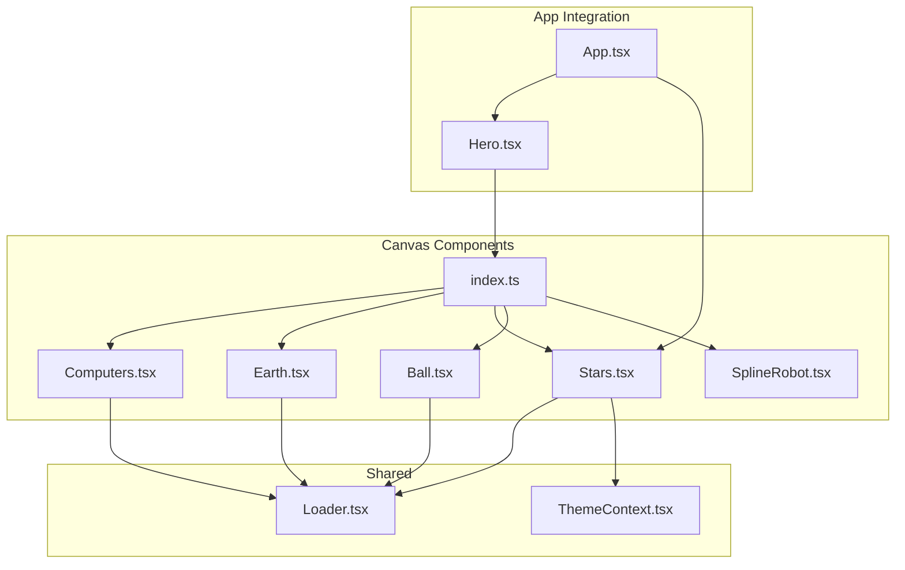
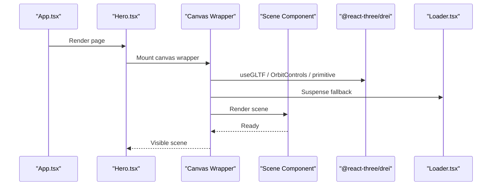
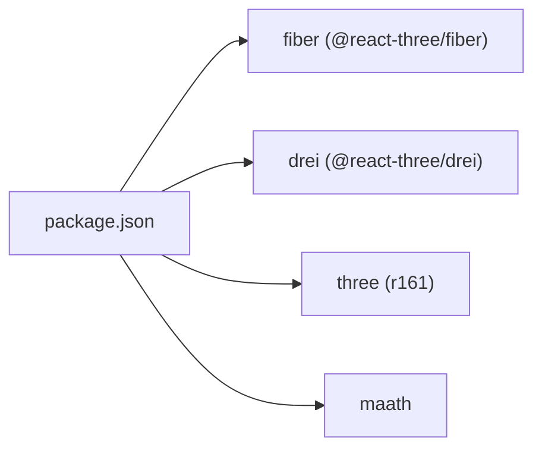

# Canvas Components

<cite>
**Referenced Files in This Document**
- [Computers.tsx](file://src/components/canvas/Computers.tsx)
- [Earth.tsx](file://src/components/canvas/Earth.tsx)
- [Stars.tsx](file://src/components/canvas/Stars.tsx)
- [Ball.tsx](file://src/components/canvas/Ball.tsx)
- [SplineRobot.tsx](file://src/components/canvas/SplineRobot.tsx)
- [index.ts](file://src/components/canvas/index.ts)
- [Loader.tsx](file://src/components/layout/Loader.tsx)
- [ThemeContext.tsx](file://src/context/ThemeContext.tsx)
- [App.tsx](file://src/App.tsx)
- [Hero.tsx](file://src/components/sections/Hero.tsx)
- [package.json](file://package.json)
- [license.txt (desktop_pc)](file://public/desktop_pc/license.txt)
- [license.txt (planet)](file://public/planet/license.txt)
</cite>

## Table of Contents
1. [Introduction](#introduction)
2. [Project Structure](#project-structure)
3. [Core Components](#core-components)
4. [Architecture Overview](#architecture-overview)
5. [Detailed Component Analysis](#detailed-component-analysis)
6. [Dependency Analysis](#dependency-analysis)
7. [Performance Considerations](#performance-considerations)
8. [Troubleshooting Guide](#troubleshooting-guide)
9. [Conclusion](#conclusion)
10. [Appendices](#appendices)

## Introduction
This document explains the 3D canvas components that render interactive scenes using Three.js via @react-three/fiber and @react-three/drei. It covers five components:
- Computers.tsx: Renders a desktop PC model with responsive scaling and orbit controls.
- Earth.tsx: Renders a stylized planet model with auto-rotation and camera framing.
- Stars.tsx: Renders a dynamic starfield using instanced particle geometry with theme-aware coloring.
- Ball.tsx: Renders a floating, decal-textured icosahedron with subtle lighting and shadows.
- SplineRobot.tsx: Embeds a Spline Viewer element for animated robot scenes.

It documents Three.js integration patterns, GLTF model loading, responsive scaling, performance optimization, component props, scene setup, lighting configurations, interaction handlers, and guidance for adding new models and customizing visual effects. Browser compatibility and mobile performance considerations are included.

## Project Structure
The canvas components are organized under src/components/canvas and exported via a barrel index. They integrate with shared loaders, themes, and app layout.

**Diagram sources**
- [index.ts:1-7](file://src/components/canvas/index.ts#L1-L7)
- [Computers.tsx:1-85](file://src/components/canvas/Computers.tsx#L1-L85)
- [Earth.tsx:1-46](file://src/components/canvas/Earth.tsx#L1-L46)
- [Stars.tsx:1-52](file://src/components/canvas/Stars.tsx#L1-L52)
- [Ball.tsx:1-59](file://src/components/canvas/Ball.tsx#L1-L59)
- [SplineRobot.tsx:1-36](file://src/components/canvas/SplineRobot.tsx#L1-L36)
- [Loader.tsx:1-24](file://src/components/layout/Loader.tsx#L1-L24)
- [ThemeContext.tsx:1-45](file://src/context/ThemeContext.tsx#L1-L45)
- [App.tsx:1-51](file://src/App.tsx#L1-L51)
- [Hero.tsx:1-53](file://src/components/sections/Hero.tsx#L1-L53)

**Section sources**
- [index.ts:1-7](file://src/components/canvas/index.ts#L1-L7)
- [Computers.tsx:1-85](file://src/components/canvas/Computers.tsx#L1-L85)
- [Earth.tsx:1-46](file://src/components/canvas/Earth.tsx#L1-L46)
- [Stars.tsx:1-52](file://src/components/canvas/Stars.tsx#L1-L52)
- [Ball.tsx:1-59](file://src/components/canvas/Ball.tsx#L1-L59)
- [SplineRobot.tsx:1-36](file://src/components/canvas/SplineRobot.tsx#L1-L36)
- [Loader.tsx:1-24](file://src/components/layout/Loader.tsx#L1-L24)
- [ThemeContext.tsx:1-45](file://src/context/ThemeContext.tsx#L1-L45)
- [App.tsx:1-51](file://src/App.tsx#L1-L51)
- [Hero.tsx:1-53](file://src/components/sections/Hero.tsx#L1-L53)

## Core Components
- ComputersCanvas: Hosts the desktop PC scene with responsive sizing and orbit controls. Uses a media query to disable rendering on small screens and sets camera position and field-of-view. Includes preload and suspense fallback.
- EarthCanvas: Hosts a rotating planet scene with auto-rotation and camera framing optimized for the model.
- StarsCanvas: Renders a starfield background with theme-aware colors and slow rotation.
- BallCanvas: Renders a floating, decal-textured icosahedron with directional lighting and shadow casting materials.
- SplineRobot: Dynamically injects a Spline Viewer element for animated robot scenes.

Props and integration:
- ComputersCanvas: Exposes isMobile internally; props are not passed to the inner component.
- BallCanvas: Accepts an icon prop for the decal texture.
- Stars: Receives arbitrary props via the wrapper; internally manages rotation and theme-dependent material color.
- SplineRobot: No props; mounts/unmounts a Spline Viewer element.

**Section sources**
- [Computers.tsx:32-82](file://src/components/canvas/Computers.tsx#L32-L82)
- [Earth.tsx:15-43](file://src/components/canvas/Earth.tsx#L15-L43)
- [Stars.tsx:37-49](file://src/components/canvas/Stars.tsx#L37-L49)
- [Ball.tsx:41-56](file://src/components/canvas/Ball.tsx#L41-L56)
- [SplineRobot.tsx:3-33](file://src/components/canvas/SplineRobot.tsx#L3-L33)

## Architecture Overview
The canvas components follow a consistent pattern:
- Wrap a scene component inside a Canvas with @react-three/fiber.
- Use Suspense with a loader while resources load.
- Preload assets for faster subsequent loads.
- Configure camera, shadows, and device pixel ratio for quality/performance balance.
- Use @react-three/drei helpers for GLTF loading, orbit controls, and primitives.

**Diagram sources**
- [App.tsx:19-47](file://src/App.tsx#L19-L47)
- [Hero.tsx:29-29](file://src/components/sections/Hero.tsx#L29-L29)
- [Computers.tsx:61-78](file://src/components/canvas/Computers.tsx#L61-L78)
- [Earth.tsx:17-42](file://src/components/canvas/Earth.tsx#L17-L42)
- [Stars.tsx:40-48](file://src/components/canvas/Stars.tsx#L40-L48)
- [Ball.tsx:43-55](file://src/components/canvas/Ball.tsx#L43-L55)
- [Loader.tsx:3-21](file://src/components/layout/Loader.tsx#L3-L21)

## Detailed Component Analysis

### Computers.tsx
Responsibilities:
- Load a GLTF model of a desktop PC.
- Provide responsive scaling and positioning based on viewport size.
- Configure hemisphere, spot, and point lights for realistic shading.
- Disable pan/zoom and lock polar angle for a fixed view.
- Preload assets and show a loader during suspense.

Key patterns:
- useGLTF for model loading.
- primitive to attach the loaded scene with scale, position, and rotation.
- OrbitControls configured to prevent panning and zooming, and to lock vertical angle.
- Responsive behavior via a media query listener toggling rendering.

Performance and optimization:
- demand frame loop reduces CPU/GPU usage when idle.
- Shadows enabled; adjust shadow map size and quality as needed.
- dpr capped for higher pixel density on capable devices.

Integration:
- Exported via the canvas index and consumed by Hero.

**Section sources**
- [Computers.tsx:1-85](file://src/components/canvas/Computers.tsx#L1-L85)
- [index.ts:1-7](file://src/components/canvas/index.ts#L1-L7)
- [Hero.tsx:29-29](file://src/components/sections/Hero.tsx#L29-L29)

### Earth.tsx
Responsibilities:
- Load a GLTF planet model.
- Auto-rotate the camera around the model for a continuous view.
- Configure camera near/far planes and FOV for optimal framing.

Key patterns:
- useGLTF for model loading.
- primitive to scale and position the model.
- OrbitControls with autoRotate and disabled pan/zoom.

Performance and optimization:
- demand frame loop and dpr tuning.
- Camera near/far tuned to avoid clipping and z-fighting.

**Section sources**
- [Earth.tsx:1-46](file://src/components/canvas/Earth.tsx#L1-L46)

### Stars.tsx
Responsibilities:
- Generate a sphere cloud of random points for a starfield.
- Rotate slowly to create a starry night effect.
- Use theme-aware material color for dark/light modes.

Key patterns:
- maath.random.inSphere to generate positions.
- useFrame to update rotation each frame.
- PointMaterial with transparency and size attenuation.
- ThemeContext determines star color.

Performance and optimization:
- depthWrite disabled to blend overlapping points efficiently.
- sizeAttenuation enabled for perspective-correct sizing.
- Rotation deltas tuned to keep motion subtle.

**Section sources**
- [Stars.tsx:1-52](file://src/components/canvas/Stars.tsx#L1-L52)
- [ThemeContext.tsx:1-45](file://src/context/ThemeContext.tsx#L1-L45)

### Ball.tsx
Responsibilities:
- Render a small floating icosahedron with a decal texture.
- Use ambient and directional lighting.
- Enable casting and receiving shadows for realism.

Key patterns:
- useTexture to load the decal image.
- Float for gentle bobbing and rotation.
- Decal mapped to the front face of the sphere.
- meshStandardMaterial with flatShading and polygon offset.

Performance and optimization:
- demand frame loop.
- dpr capped.
- Shadow casting enabled; consider disabling for mobile if needed.

**Section sources**
- [Ball.tsx:1-59](file://src/components/canvas/Ball.tsx#L1-L59)

### SplineRobot.tsx
Responsibilities:
- Dynamically create and append a Spline Viewer element to the DOM.
- Load an external animated robot scene from a Spline URL.
- Clean up the element on unmount.

Notes:
- This component does not use @react-three/fiber; it integrates a third-party viewer.
- Ensure the Spline Viewer script is available in the environment.

**Section sources**
- [SplineRobot.tsx:1-36](file://src/components/canvas/SplineRobot.tsx#L1-L36)

## Dependency Analysis
External libraries and versions:
- @react-three/fiber: v8.x
- @react-three/drei: v9.x
- three: v0.161.x
- maath: v0.10.x

These dependencies power GLTF loading, scene orchestration, helpers, and math utilities.

**Diagram sources**
- [package.json:13-24](file://package.json#L13-L24)

**Section sources**
- [package.json:13-24](file://package.json#L13-L24)

## Performance Considerations
- Frame loop: All canvas wrappers use demand frame loop to reduce idle CPU/GPU usage.
- Device pixel ratio: dpr capped at [1, 2] to balance visual fidelity and performance.
- Shadows: Enabled in several canvases; consider disabling on low-power devices or mobile.
- Preloading: Preload all assets to minimize stutter after initial load.
- Geometry complexity: Keep models optimized; use appropriate LODs for mobile.
- Lighting: Limit the number of dynamic lights; use cached shadows where possible.
- Textures: Compress textures and use appropriate sizes for target devices.
- Mobile responsiveness: Some canvases adapt by disabling rendering on small screens or reducing complexity.

[No sources needed since this section provides general guidance]

## Troubleshooting Guide
Common issues and resolutions:
- Model not visible:
  - Verify GLTF path exists and is served correctly.
  - Ensure Suspense fallback is shown until resources load.
  - Confirm Preload is present.
- Poor mobile performance:
  - Reduce shadows or disable them on mobile.
  - Lower dpr or simplify geometry.
  - Use demand frame loop consistently.
- Starfield looks clipped or too bright:
  - Adjust PointMaterial size and color.
  - Verify theme context is applied and colors are correct.
- Spline Viewer not rendering:
  - Ensure the Spline Viewer script is available in the environment.
  - Confirm the URL is accessible and the element is appended to the DOM.

**Section sources**
- [Computers.tsx:61-78](file://src/components/canvas/Computers.tsx#L61-L78)
- [Earth.tsx:17-42](file://src/components/canvas/Earth.tsx#L17-L42)
- [Stars.tsx:25-32](file://src/components/canvas/Stars.tsx#L25-L32)
- [Ball.tsx:49-50](file://src/components/canvas/Ball.tsx#L49-L50)
- [SplineRobot.tsx:10-19](file://src/components/canvas/SplineRobot.tsx#L10-L19)

## Conclusion
The canvas components demonstrate robust integration of Three.js with React using @react-three/fiber and @react-three/drei. They showcase responsive scaling, efficient resource loading, and performance-conscious defaults. Each component follows a consistent structure, enabling easy extension and customization. For new models, reuse the established patterns: load via useGLTF, wrap in a Canvas with Suspense and Preload, configure camera and controls, and apply lighting and materials thoughtfully.

[No sources needed since this section summarizes without analyzing specific files]

## Appendices

### Adding a New 3D Model
Steps:
- Place the GLTF model and textures in public/.
- Import the model using useGLTF in a new scene component.
- Wrap the scene component in a Canvas with Suspense and Preload.
- Configure camera, controls, and lighting as needed.
- Export via the canvas index and integrate into a page component.

References:
- Model loading pattern: [useGLTF:8-8](file://src/components/canvas/Computers.tsx#L8-L8)
- Canvas wrapper pattern: [Canvas usage:17-42](file://src/components/canvas/Earth.tsx#L17-L42)
- Loader fallback: [Suspense and Loader:41-41](file://src/components/canvas/Stars.tsx#L41-L41)

**Section sources**
- [Computers.tsx:8-8](file://src/components/canvas/Computers.tsx#L8-L8)
- [Earth.tsx:17-42](file://src/components/canvas/Earth.tsx#L17-L42)
- [Stars.tsx:41-41](file://src/components/canvas/Stars.tsx#L41-L41)

### Customizing Visual Effects
Examples:
- Change star color based on theme: [Theme-aware material:27-27](file://src/components/canvas/Stars.tsx#L27-L27)
- Adjust ball decal: [Decal mapping:28-35](file://src/components/canvas/Ball.tsx#L28-L35)
- Control auto-rotation: [Auto-rotate:31-31](file://src/components/canvas/Earth.tsx#L31-L31)
- Responsive scaling: [Scale and position:24-26](file://src/components/canvas/Computers.tsx#L24-L26)

**Section sources**
- [Stars.tsx:27-27](file://src/components/canvas/Stars.tsx#L27-L27)
- [Ball.tsx:28-35](file://src/components/canvas/Ball.tsx#L28-L35)
- [Earth.tsx:31-31](file://src/components/canvas/Earth.tsx#L31-L31)
- [Computers.tsx:24-26](file://src/components/canvas/Computers.tsx#L24-L26)

### Browser Compatibility and Mobile Performance
- Dependencies: Ensure supported browsers for Three.js r161 and @react-three/fiber v8.x.
- Mobile: Prefer demand frame loop and capped dpr. Disable shadows on lower-end devices.
- Assets: Optimize GLB/GLTF and textures; consider compressed formats.
- Licensing: Respect model licenses for commercial use.

**Section sources**
- [package.json:13-24](file://package.json#L13-L24)
- [license.txt (desktop_pc):1-11](file://public/desktop_pc/license.txt#L1-L11)
- [license.txt (planet):1-11](file://public/planet/license.txt#L1-L11)