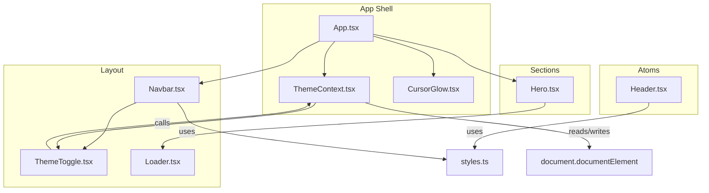
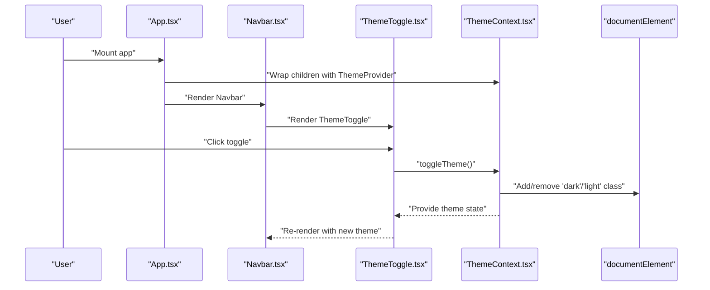
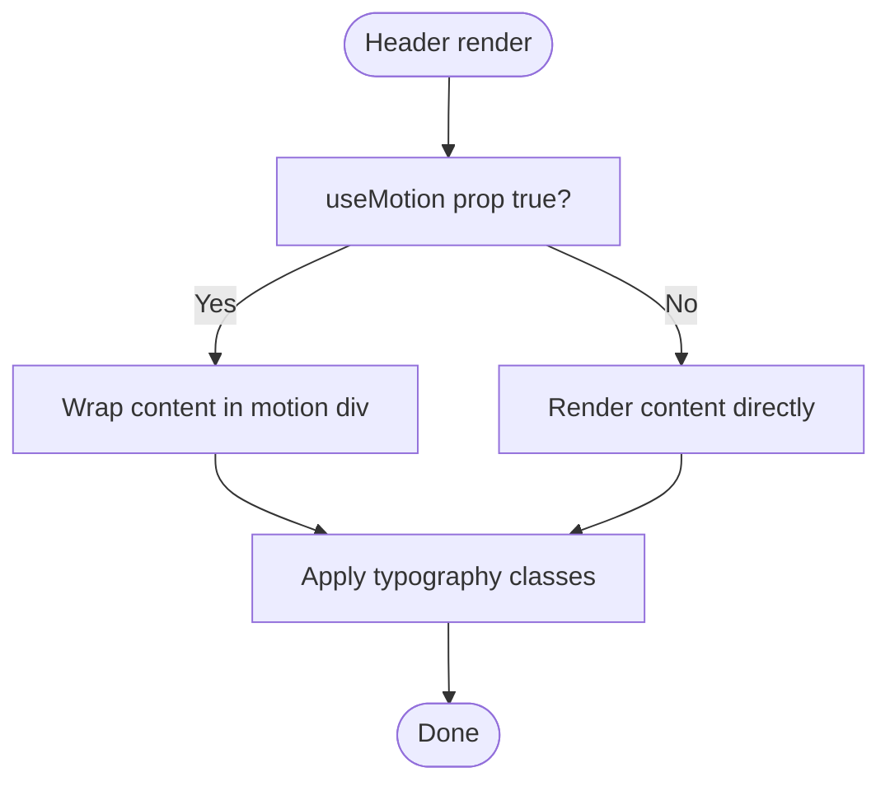
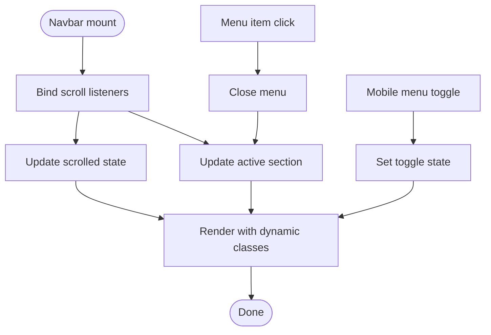
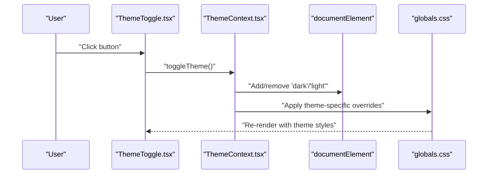
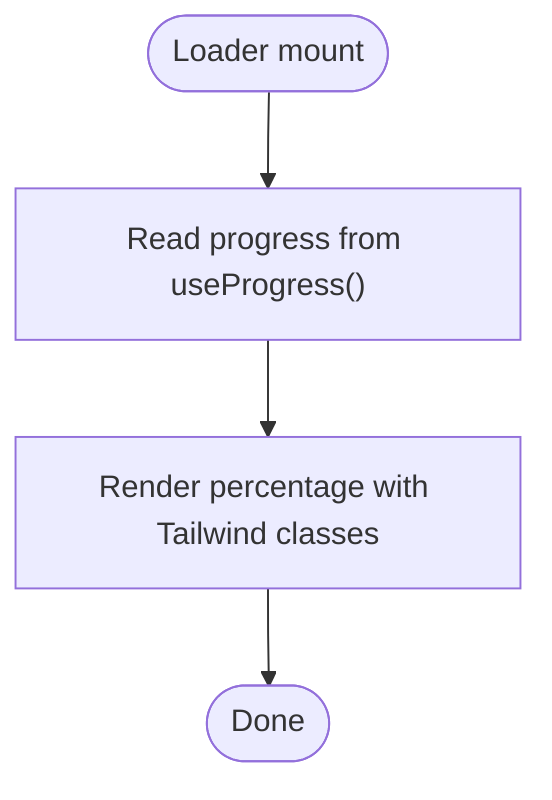
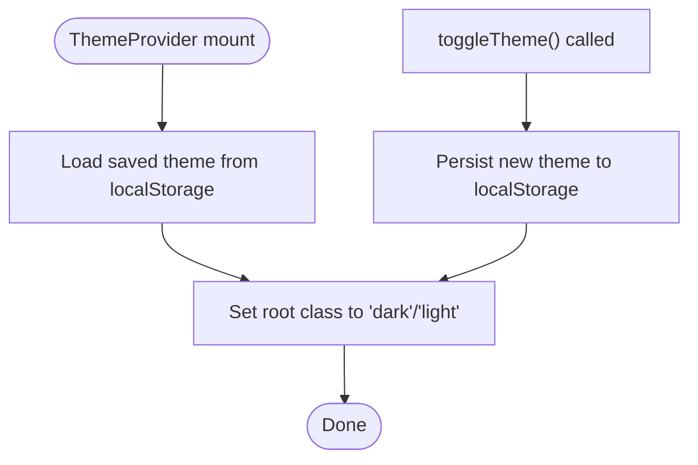
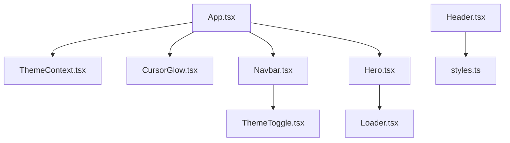
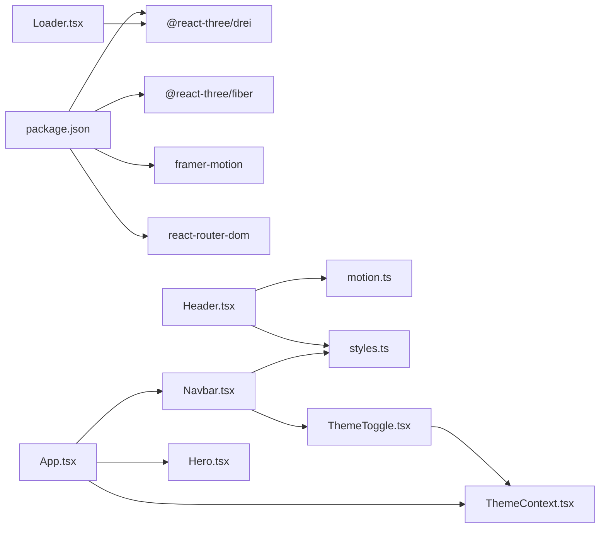

# Core Components

<cite>
**Referenced Files in This Document**
- [Header.tsx](file://src/components/atoms/Header.tsx)
- [Navbar.tsx](file://src/components/layout/Navbar.tsx)
- [ThemeToggle.tsx](file://src/components/layout/ThemeToggle.tsx)
- [Loader.tsx](file://src/components/layout/Loader.tsx)
- [ThemeContext.tsx](file://src/context/ThemeContext.tsx)
- [App.tsx](file://src/App.tsx)
- [styles.ts](file://src/constants/styles.ts)
- [motion.ts](file://src/utils/motion.ts)
- [globals.css](file://src/globals.css)
- [tailwind.config.cjs](file://src/tailwind.config.cjs)
- [Hero.tsx](file://src/components/sections/Hero.tsx)
- [CursorGlow.tsx](file://src/components/layout/CursorGlow.tsx)
- [package.json](file://package.json)
</cite>

## Table of Contents
1. [Introduction](#introduction)
2. [Project Structure](#project-structure)
3. [Core Components](#core-components)
4. [Architecture Overview](#architecture-overview)
5. [Detailed Component Analysis](#detailed-component-analysis)
6. [Dependency Analysis](#dependency-analysis)
7. [Performance Considerations](#performance-considerations)
8. [Troubleshooting Guide](#troubleshooting-guide)
9. [Conclusion](#conclusion)

## Introduction
This document explains the core components that form the foundation of the 3D Portfolio application. It focuses on atomic components such as Header.tsx and layout components like Navbar.tsx, ThemeToggle.tsx, and Loader.tsx. It details their props, state management, interaction patterns, styling via Tailwind CSS, responsive design, and composition strategies. It also illustrates how these components integrate with higher-level sections to deliver a cohesive user experience.

## Project Structure
The application is organized around a clear separation of concerns:
- Atoms: Reusable, single-purpose components (e.g., Header).
- Layout: Structural components that orchestrate navigation, theming, and loaders (e.g., Navbar, ThemeToggle, Loader).
- Sections: Feature-specific pages (e.g., Hero, About, Experience).
- Canvas: 3D scenes powered by React Three Fiber and Drei.
- Context: Global theme state management.
- Styles: Shared Tailwind-based design tokens and global CSS.

**Diagram sources**
- [App.tsx:19-47](file://src/App.tsx#L19-L47)
- [ThemeContext.tsx:17-43](file://src/context/ThemeContext.tsx#L17-L43)
- [Navbar.tsx:9-123](file://src/components/layout/Navbar.tsx#L9-L123)
- [ThemeToggle.tsx:3-60](file://src/components/layout/ThemeToggle.tsx#L3-L60)
- [Loader.tsx:3-21](file://src/components/layout/Loader.tsx#L3-L21)
- [Header.tsx:13-28](file://src/components/atoms/Header.tsx#L13-L28)
- [Hero.tsx:7-49](file://src/components/sections/Hero.tsx#L7-L49)
- [styles.ts:1-16](file://src/constants/styles.ts#L1-L16)

**Section sources**
- [App.tsx:19-47](file://src/App.tsx#L19-L47)
- [globals.css:1-369](file://src/globals.css#L1-L369)
- [tailwind.config.cjs:1-29](file://src/tailwind.config.cjs#L1-L29)

## Core Components
This section documents the atomic and layout components that define the application’s interface.

- Header.tsx
  - Purpose: Render a section header with optional motion animation.
  - Props:
    - useMotion: boolean — whether to wrap content in a motion container.
    - p: string — subtitle text.
    - h2: string — headline text.
  - State: None.
  - Interactions: Uses motion variants via a utility function and applies shared typography classes.
  - Composition: Intended for reuse across sections; integrates with shared styles.
  - Example usage: Used within higher-level sections to present headings consistently.

- Navbar.tsx
  - Purpose: Navigation bar with scroll-aware highlighting and responsive mobile menu.
  - Props: None.
  - State:
    - active: string | null — currently active section ID.
    - toggle: boolean — mobile menu visibility.
    - scrolled: boolean — background change on scroll.
  - Interactions:
    - Scroll listener updates active section and background.
    - Click handlers manage mobile menu and route navigation.
    - Integrates ThemeToggle and nav links from constants.
  - Composition: Renders desktop and mobile layouts conditionally; includes ThemeToggle and logo.

- ThemeToggle.tsx
  - Purpose: Switch between light and dark themes with animated icons.
  - Props: None.
  - State: None.
  - Interactions: Calls context-provided toggle function; renders sun/moon icons with transitions.
  - Composition: Consumes ThemeContext; styled with Tailwind and theme-aware CSS.

- Loader.tsx
  - Purpose: Display 3D scene loading progress using @react-three/drei.
  - Props: None.
  - State: None.
  - Interactions: Reads progress from Drei’s useProgress hook and renders percentage.
  - Composition: Used within 3D scenes to indicate load status.

**Section sources**
- [Header.tsx:7-28](file://src/components/atoms/Header.tsx#L7-L28)
- [Navbar.tsx:9-123](file://src/components/layout/Navbar.tsx#L9-L123)
- [ThemeToggle.tsx:3-60](file://src/components/layout/ThemeToggle.tsx#L3-L60)
- [Loader.tsx:3-21](file://src/components/layout/Loader.tsx#L3-L21)

## Architecture Overview
The core components collaborate as follows:
- App.tsx composes the page shell, wraps children in ThemeProvider, and mounts layout and section components.
- Navbar orchestrates navigation and integrates ThemeToggle.
- ThemeToggle reads and updates theme via ThemeContext, persisting preferences in localStorage and applying class-based theme to the root element.
- Header uses shared styles and optional motion animations.
- Loader appears within 3D scenes to reflect asset loading progress.

**Diagram sources**
- [App.tsx:27-46](file://src/App.tsx#L27-L46)
- [Navbar.tsx:86-86](file://src/components/layout/Navbar.tsx#L86-L86)
- [ThemeToggle.tsx:7-58](file://src/components/layout/ThemeToggle.tsx#L7-L58)
- [ThemeContext.tsx:35-37](file://src/context/ThemeContext.tsx#L35-L37)
- [ThemeContext.tsx:23-33](file://src/context/ThemeContext.tsx#L23-L33)

## Detailed Component Analysis

### Header.tsx
- Implementation highlights:
  - Accepts useMotion, p, h2 props.
  - Conditionally wraps content in a motion container using a motion variant utility.
  - Applies shared typography classes from styles.
- Props and behavior:
  - useMotion toggles animation; p and h2 supply text content.
- Styling:
  - Uses styles.sectionHeadText and styles.sectionSubText for consistent typography.
- Interaction patterns:
  - Stateless functional component; relies on parent for data passing.

**Diagram sources**
- [Header.tsx:13-28](file://src/components/atoms/Header.tsx#L13-L28)
- [styles.ts:11-14](file://src/constants/styles.ts#L11-L14)
- [motion.ts:4-19](file://src/utils/motion.ts#L4-L19)

**Section sources**
- [Header.tsx:7-28](file://src/components/atoms/Header.tsx#L7-L28)
- [styles.ts:11-14](file://src/constants/styles.ts#L11-L14)
- [motion.ts:4-19](file://src/utils/motion.ts#L4-L19)

### Navbar.tsx
- Implementation highlights:
  - Manages active section via scroll listeners and DOM queries.
  - Controls mobile menu visibility with a state flag.
  - Dynamically adjusts background based on scroll position.
  - Integrates ThemeToggle and nav links from constants.
- Props: None.
- State:
  - active: Tracks current section ID.
  - toggle: Controls mobile menu visibility.
  - scrolled: Controls background class on scroll.
- Interactions:
  - Scroll events update active section and background.
  - Mobile menu toggles visibility and routes on click.
- Responsive design:
  - Desktop: Hidden on small screens; shows links and ThemeToggle.
  - Mobile: Shows ThemeToggle and a collapsible menu with links.

**Diagram sources**
- [Navbar.tsx:14-49](file://src/components/layout/Navbar.tsx#L14-L49)
- [Navbar.tsx:73-118](file://src/components/layout/Navbar.tsx#L73-L118)

**Section sources**
- [Navbar.tsx:9-123](file://src/components/layout/Navbar.tsx#L9-L123)
- [styles.ts:1-16](file://src/constants/styles.ts#L1-L16)

### ThemeToggle.tsx
- Implementation highlights:
  - Consumes theme and toggleTheme from ThemeContext.
  - Renders sun and moon icons with CSS transforms and opacity transitions.
  - Uses Tailwind classes and theme-aware styles.
- Props: None.
- State: None.
- Interactions:
  - onClick triggers toggleTheme, flipping between dark and light modes.
- Styling:
  - Uses Tailwind utilities and theme-specific CSS classes applied by ThemeContext.

**Diagram sources**
- [ThemeToggle.tsx:7-58](file://src/components/layout/ThemeToggle.tsx#L7-L58)
- [ThemeContext.tsx:35-37](file://src/context/ThemeContext.tsx#L35-L37)
- [ThemeContext.tsx:23-33](file://src/context/ThemeContext.tsx#L23-L33)
- [globals.css:15-178](file://src/globals.css#L15-L178)

**Section sources**
- [ThemeToggle.tsx:3-60](file://src/components/layout/ThemeToggle.tsx#L3-L60)
- [ThemeContext.tsx:17-43](file://src/context/ThemeContext.tsx#L17-L43)
- [globals.css:15-178](file://src/globals.css#L15-L178)

### Loader.tsx
- Implementation highlights:
  - Reads progress from @react-three/drei’s useProgress hook.
  - Renders a centered progress percentage inside a 3D Html overlay.
- Props: None.
- State: None.
- Interactions:
  - Updates dynamically while 3D assets load.
- Styling:
  - Uses Tailwind utilities and theme-aware canvas loader styles.

**Diagram sources**
- [Loader.tsx:3-21](file://src/components/layout/Loader.tsx#L3-L21)

**Section sources**
- [Loader.tsx:3-21](file://src/components/layout/Loader.tsx#L3-L21)
- [globals.css:114-123](file://src/globals.css#L114-L123)

### ThemeContext.tsx
- Implementation highlights:
  - Provides theme state and toggle function.
  - Persists theme preference in localStorage.
  - Applies 'dark' or 'light' class to document root for CSS targeting.
- Props: children.
- State:
  - theme: 'dark' | 'light', initialized from localStorage or defaults to 'dark'.
- Interactions:
  - toggleTheme flips between themes.
  - Effects sync theme to localStorage and root class.

**Diagram sources**
- [ThemeContext.tsx:17-43](file://src/context/ThemeContext.tsx#L17-L43)
- [ThemeContext.tsx:35-37](file://src/context/ThemeContext.tsx#L35-L37)

**Section sources**
- [ThemeContext.tsx:1-45](file://src/context/ThemeContext.tsx#L1-L45)

### Integration with Higher-Level Sections
- Hero.tsx demonstrates composition with layout and canvas:
  - Uses shared styles for typography.
  - Includes a 3D canvas component and a scroll indicator.
  - Integrates with Loader within the 3D scene.
- App.tsx composes the entire page:
  - Wraps everything in ThemeProvider and BrowserRouter.
  - Mounts CursorGlow, Navbar, Hero, and other sections.

**Diagram sources**
- [App.tsx:26-44](file://src/App.tsx#L26-L44)
- [Hero.tsx:29-29](file://src/components/sections/Hero.tsx#L29-L29)
- [Navbar.tsx:86-86](file://src/components/layout/Navbar.tsx#L86-L86)
- [ThemeToggle.tsx:7-58](file://src/components/layout/ThemeToggle.tsx#L7-L58)
- [Header.tsx:16-17](file://src/components/atoms/Header.tsx#L16-L17)
- [styles.ts:6-15](file://src/constants/styles.ts#L6-L15)

**Section sources**
- [Hero.tsx:7-49](file://src/components/sections/Hero.tsx#L7-L49)
- [App.tsx:19-47](file://src/App.tsx#L19-L47)

## Dependency Analysis
- External libraries:
  - @react-three/drei and @react-three/fiber power 3D rendering and loaders.
  - framer-motion enables animations for headers and interactive elements.
  - react-router-dom handles routing and navigation.
- Internal dependencies:
  - ThemeContext provides theme state to ThemeToggle and other components.
  - styles.ts centralizes Tailwind class groups for typography and spacing.
  - motion.ts defines reusable animation variants.

**Diagram sources**
- [package.json:13-24](file://package.json#L13-L24)
- [Header.tsx:4-5](file://src/components/atoms/Header.tsx#L4-L5)
- [motion.ts:1-2](file://src/utils/motion.ts#L1-L2)
- [styles.ts:1-16](file://src/constants/styles.ts#L1-L16)
- [Navbar.tsx:4-7](file://src/components/layout/Navbar.tsx#L4-L7)
- [ThemeToggle.tsx:1-1](file://src/components/layout/ThemeToggle.tsx#L1-L1)
- [ThemeContext.tsx:1-1](file://src/context/ThemeContext.tsx#L1-L1)
- [Loader.tsx:1-1](file://src/components/layout/Loader.tsx#L1-L1)
- [App.tsx:16-17](file://src/App.tsx#L16-L17)

**Section sources**
- [package.json:13-24](file://package.json#L13-L24)

## Performance Considerations
- Motion and animations:
  - Prefer lightweight variants and avoid excessive nested motion wrappers.
  - Use requestAnimationFrame-based effects sparingly (e.g., cursor glow) and clean up on unmount.
- Scroll handling:
  - Debounce or throttle scroll listeners if extending Navbar behavior.
- Theme switching:
  - Persisting to localStorage avoids repeated reads; ensure minimal re-renders by keeping theme state local to the provider.
- 3D loading:
  - Loader updates are handled internally by Drei; keep asset sizes optimized to reduce load time.

## Troubleshooting Guide
- Theme not persisting:
  - Verify localStorage key and ThemeProvider wrapping the app.
  - Confirm root class toggling between 'dark' and 'light'.
- Navbar active section not updating:
  - Ensure sections have proper IDs and are measured in the DOM.
  - Check scroll thresholds and section heights used for highlighting.
- Loader not visible:
  - Confirm Loader is rendered within a Canvas component and useProgress hook is active.
- Cursor glow not appearing:
  - Ensure ThemeContext is available and mousemove events are firing; verify z-index and opacity transitions.

**Section sources**
- [ThemeContext.tsx:18-33](file://src/context/ThemeContext.tsx#L18-L33)
- [Navbar.tsx:27-41](file://src/components/layout/Navbar.tsx#L27-L41)
- [Loader.tsx:4-4](file://src/components/layout/Loader.tsx#L4-L4)
- [CursorGlow.tsx:13-49](file://src/components/layout/CursorGlow.tsx#L13-L49)

## Conclusion
The core components—Header, Navbar, ThemeToggle, and Loader—form a cohesive foundation for the 3D Portfolio application. They leverage shared styles, context-based theme management, and Tailwind CSS for responsive design. Their composition patterns promote reusability and maintainability, enabling consistent presentation and interaction across sections. By understanding their props, state, and interactions, developers can confidently extend and customize the interface while preserving performance and accessibility.