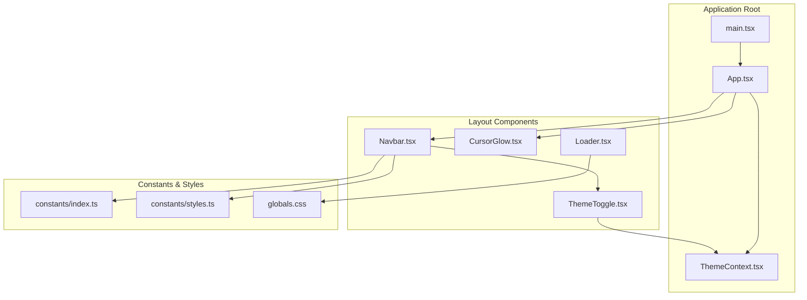
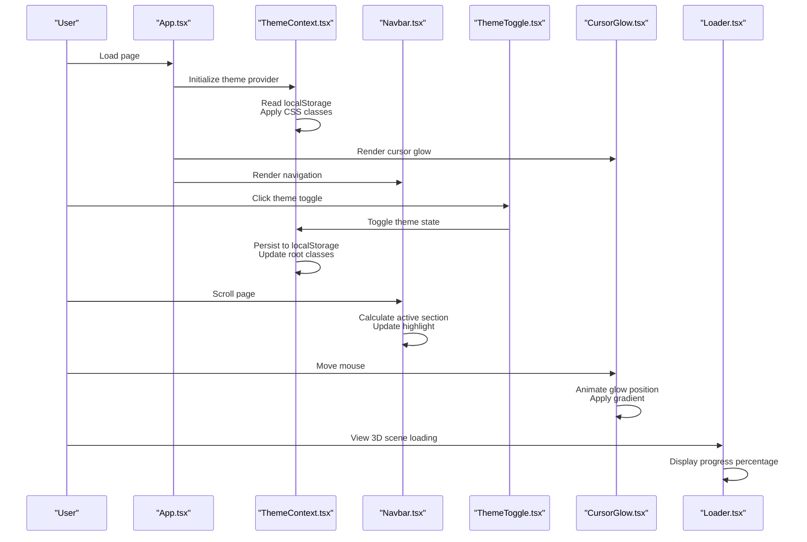
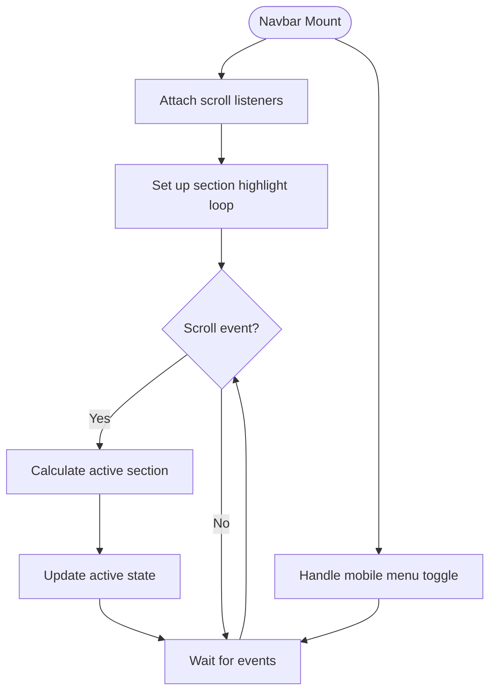
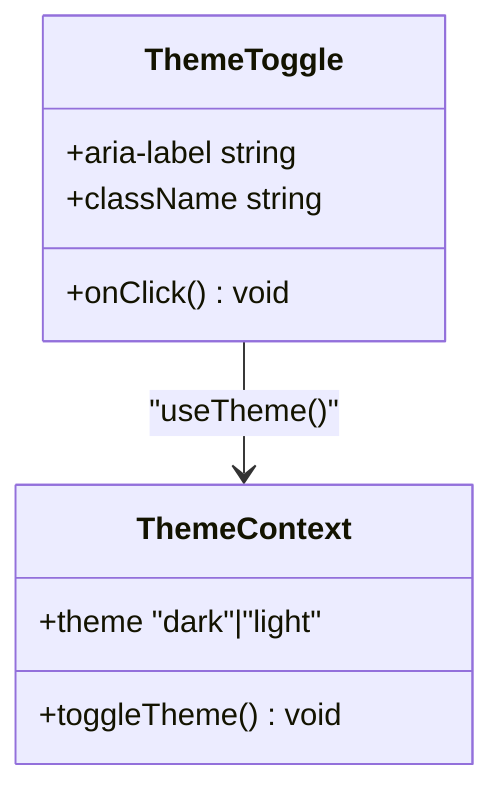
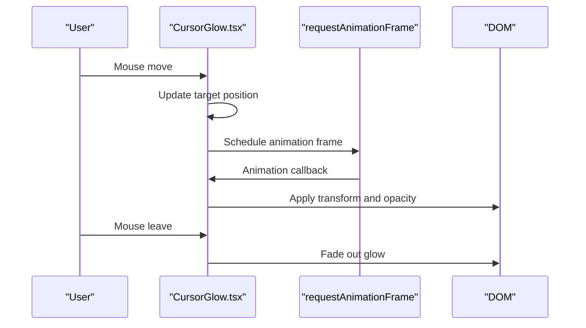
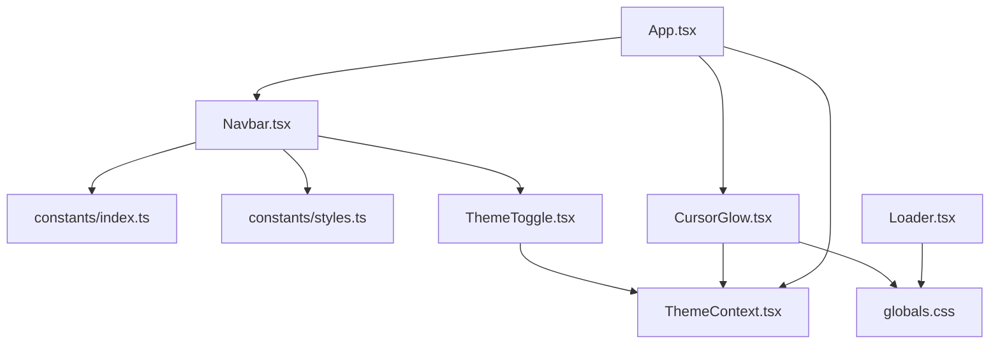

# Layout Components

<cite>
**Referenced Files in This Document**
- [Navbar.tsx](file://src/components/layout/Navbar.tsx)
- [ThemeToggle.tsx](file://src/components/layout/ThemeToggle.tsx)
- [Loader.tsx](file://src/components/layout/Loader.tsx)
- [CursorGlow.tsx](file://src/components/layout/CursorGlow.tsx)
- [ThemeContext.tsx](file://src/context/ThemeContext.tsx)
- [App.tsx](file://src/App.tsx)
- [index.ts](file://src/components/index.ts)
- [index.ts](file://src/constants/index.ts)
- [styles.ts](file://src/constants/styles.ts)
- [globals.css](file://src/globals.css)
- [main.tsx](file://src/main.tsx)
</cite>

## Table of Contents
1. [Introduction](#introduction)
2. [Project Structure](#project-structure)
3. [Core Components](#core-components)
4. [Architecture Overview](#architecture-overview)
5. [Detailed Component Analysis](#detailed-component-analysis)
6. [Dependency Analysis](#dependency-analysis)
7. [Performance Considerations](#performance-considerations)
8. [Accessibility Features](#accessibility-features)
9. [Customization and Styling](#customization-and-styling)
10. [Troubleshooting Guide](#troubleshooting-guide)
11. [Conclusion](#conclusion)

## Introduction
This document provides comprehensive documentation for the layout components that form the structural foundation and enhance user experience in the portfolio application. It covers the Navbar navigation system with scroll highlighting and responsive behavior, the ThemeToggle component for dark/light mode switching with localStorage persistence, the Loader component for 3D canvas loading states, and the CursorGlow component for interactive cursor effects. The guide explains component integration patterns, prop interfaces, state management approaches, customization options, performance considerations, and built-in accessibility features.

## Project Structure
The layout components are organized under the layout folder and integrate with the global theme context and styling system. The Navbar coordinates navigation, scroll highlighting, and responsive behavior, while ThemeToggle manages theme switching. CursorGlow provides interactive cursor effects, and Loader displays 3D canvas loading progress.

**Diagram sources**
- [App.tsx:19-47](file://src/App.tsx#L19-L47)
- [ThemeContext.tsx:17-44](file://src/context/ThemeContext.tsx#L17-L44)
- [Navbar.tsx:9-125](file://src/components/layout/Navbar.tsx#L9-L125)
- [ThemeToggle.tsx:3-62](file://src/components/layout/ThemeToggle.tsx#L3-L62)
- [CursorGlow.tsx:4-77](file://src/components/layout/CursorGlow.tsx#L4-L77)
- [Loader.tsx:3-23](file://src/components/layout/Loader.tsx#L3-L23)
- [index.ts:36-49](file://src/constants/index.ts#L36-L49)
- [styles.ts:1-16](file://src/constants/styles.ts#L1-L16)
- [globals.css:1-369](file://src/globals.css#L1-L369)

**Section sources**
- [App.tsx:19-47](file://src/App.tsx#L19-L47)
- [index.ts:36-49](file://src/constants/index.ts#L36-L49)
- [styles.ts:1-16](file://src/constants/styles.ts#L1-L16)
- [globals.css:1-369](file://src/globals.css#L1-L369)

## Core Components
This section introduces the four layout components and their primary responsibilities:
- Navbar: Provides navigation links, scroll highlighting, and responsive behavior.
- ThemeToggle: Switches between dark and light themes with persistent storage.
- Loader: Displays 3D canvas loading progress using Three.js Drei.
- CursorGlow: Creates a smooth, animated cursor glow effect with theme-aware styling.

Key integration points:
- Navbar depends on navigation constants and styling utilities.
- ThemeToggle relies on ThemeContext for theme state and persistence.
- CursorGlow integrates with ThemeContext for dynamic styling.
- Loader uses Three.js Drei to render progress indicators.

**Section sources**
- [Navbar.tsx:9-125](file://src/components/layout/Navbar.tsx#L9-L125)
- [ThemeToggle.tsx:3-62](file://src/components/layout/ThemeToggle.tsx#L3-L62)
- [Loader.tsx:3-23](file://src/components/layout/Loader.tsx#L3-L23)
- [CursorGlow.tsx:4-77](file://src/components/layout/CursorGlow.tsx#L4-L77)
- [ThemeContext.tsx:17-44](file://src/context/ThemeContext.tsx#L17-L44)

## Architecture Overview
The layout components operate within a theme-aware environment. The ThemeProvider initializes theme state from localStorage and applies CSS classes to the root element. Navbar listens to scroll events to highlight active sections and toggles visibility of the mobile menu. ThemeToggle updates the theme state and persists it to localStorage. CursorGlow animates a radial gradient behind the cursor, adapting to the current theme. Loader displays a percentage-based progress indicator during 3D scene loading.

**Diagram sources**
- [App.tsx:27-46](file://src/App.tsx#L27-L46)
- [ThemeContext.tsx:18-37](file://src/context/ThemeContext.tsx#L18-L37)
- [Navbar.tsx:14-49](file://src/components/layout/Navbar.tsx#L14-L49)
- [ThemeToggle.tsx:8-9](file://src/components/layout/ThemeToggle.tsx#L8-L9)
- [CursorGlow.tsx:13-49](file://src/components/layout/CursorGlow.tsx#L13-L49)
- [Loader.tsx:4-21](file://src/components/layout/Loader.tsx#L4-L21)

## Detailed Component Analysis

### Navbar Component
The Navbar component manages navigation, scroll highlighting, and responsive behavior. It maintains three pieces of state: active section, mobile menu toggle, and scroll state. On mount, it attaches scroll listeners to update the active section based on viewport position and adjust the navbar background on scroll. The component renders desktop and mobile navigation lists, integrates ThemeToggle, and handles smooth scrolling to the top on logo click.

Key behaviors:
- Scroll listener updates active section when a section enters the viewport.
- Background color transitions based on scroll position.
- Mobile menu toggles visibility and highlights active item on selection.
- Responsive design with hidden desktop/mobile views.

Integration patterns:
- Uses navigation constants for link definitions.
- Applies styling utilities for consistent padding and typography.
- Integrates ThemeToggle for theme switching within the navbar.

Prop interfaces:
- No props required; uses internal state and context.

State management:
- active: Tracks currently highlighted section ID.
- toggle: Controls mobile menu visibility.
- scrolled: Indicates navbar background change on scroll.

Performance considerations:
- Scroll event handlers are attached and cleaned up on mount/unmount.
- Highlight calculation uses DOM measurements; consider throttling for heavy pages.

Accessibility features:
- Semantic HTML structure with lists and anchors.
- Focusable elements for keyboard navigation.
- Proper contrast between active and inactive states.

**Diagram sources**
- [Navbar.tsx:14-49](file://src/components/layout/Navbar.tsx#L14-L49)

**Section sources**
- [Navbar.tsx:9-125](file://src/components/layout/Navbar.tsx#L9-L125)
- [index.ts:36-49](file://src/constants/index.ts#L36-L49)
- [styles.ts:1-16](file://src/constants/styles.ts#L1-L16)

### ThemeToggle Component
ThemeToggle provides a button to switch between dark and light modes. It reads the current theme from ThemeContext and renders sun/moon icons with transitions. The button triggers theme toggling and includes aria-label for accessibility.

Implementation details:
- Uses ThemeContext for theme state and toggle function.
- Renders SVG sun icon for dark mode and moon icon for light mode.
- Applies hover scaling and smooth transitions for visual feedback.
- Uses theme-aware CSS classes for styling.

Persistence:
- Theme state is persisted to localStorage via ThemeContext.
- Root element receives "dark" or "light" classes for global styling.

Accessibility:
- aria-label indicates the action and target theme.
- Keyboard navigable and focusable.
- Clear visual indicators for current theme.

**Diagram sources**
- [ThemeToggle.tsx:3-62](file://src/components/layout/ThemeToggle.tsx#L3-L62)
- [ThemeContext.tsx:17-44](file://src/context/ThemeContext.tsx#L17-L44)

**Section sources**
- [ThemeToggle.tsx:3-62](file://src/components/layout/ThemeToggle.tsx#L3-L62)
- [ThemeContext.tsx:17-44](file://src/context/ThemeContext.tsx#L17-L44)

### Loader Component
Loader displays a 3D canvas loading progress indicator using Three.js Drei. It reads the progress value and renders a styled percentage display.

Key aspects:
- Uses useProgress hook from @react-three/drei to get loading progress.
- Renders a centered HTML element with styled text.
- Lightweight overlay suitable for 3D scenes.

Styling:
- Uses CSS classes for consistent appearance.
- Theme-aware colors adapt to dark/light mode.

Integration:
- Typically rendered within a 3D scene wrapper.
- Should be positioned appropriately for the 3D viewport.

**Section sources**
- [Loader.tsx:3-23](file://src/components/layout/Loader.tsx#L3-L23)
- [globals.css:114-118](file://src/globals.css#L114-L118)

### CursorGlow Component
CursorGlow creates a smooth, animated radial gradient effect that follows the cursor. It uses requestAnimationFrame for efficient animation and adapts the gradient based on the current theme.

Behavior:
- Tracks mouse movement and animates glow position with easing.
- Shows/hides glow on mouse enter/leave.
- Uses theme-aware gradients for visual consistency.

Performance:
- requestAnimationFrame ensures smooth animation.
- Will-change property hints GPU acceleration.
- Cleanup of event listeners and animation frames on unmount.

Styling:
- Fixed positioning with high z-index.
- Radial gradient backgrounds for glow effect.
- Smooth opacity transitions for fade-in/out.

**Diagram sources**
- [CursorGlow.tsx:13-49](file://src/components/layout/CursorGlow.tsx#L13-L49)

**Section sources**
- [CursorGlow.tsx:4-77](file://src/components/layout/CursorGlow.tsx#L4-L77)
- [ThemeContext.tsx:17-44](file://src/context/ThemeContext.tsx#L17-L44)

## Dependency Analysis
The layout components share dependencies on constants, styles, and the theme context. Navbar depends on navigation constants and styling utilities. ThemeToggle depends on ThemeContext for state and persistence. CursorGlow depends on ThemeContext for theme-aware styling. Loader depends on Three.js Drei and global CSS for styling.

**Diagram sources**
- [Navbar.tsx:4-7](file://src/components/layout/Navbar.tsx#L4-L7)
- [index.ts:36-49](file://src/constants/index.ts#L36-L49)
- [styles.ts:1-16](file://src/constants/styles.ts#L1-L16)
- [ThemeToggle.tsx:1](file://src/components/layout/ThemeToggle.tsx#L1)
- [ThemeContext.tsx:17-44](file://src/context/ThemeContext.tsx#L17-L44)
- [CursorGlow.tsx:1-2](file://src/components/layout/CursorGlow.tsx#L1-L2)
- [Loader.tsx:1](file://src/components/layout/Loader.tsx#L1)
- [App.tsx:16-17](file://src/App.tsx#L16-L17)

**Section sources**
- [index.ts:36-49](file://src/constants/index.ts#L36-L49)
- [styles.ts:1-16](file://src/constants/styles.ts#L1-L16)
- [ThemeContext.tsx:17-44](file://src/context/ThemeContext.tsx#L17-L44)
- [App.tsx:16-17](file://src/App.tsx#L16-L17)

## Performance Considerations
- Event handling: Navbar attaches scroll listeners that should be removed on unmount to prevent memory leaks.
- Animation: CursorGlow uses requestAnimationFrame for smooth animation; ensure cleanup on component unmount.
- Rendering: ThemeToggle and Loader rely on minimal DOM manipulation; keep updates efficient.
- CSS: Global theme classes are applied to the root element; avoid excessive reflows by batching DOM changes.
- Accessibility: Ensure keyboard navigation and screen reader compatibility for interactive elements.

## Accessibility Features
- ThemeToggle includes aria-label indicating the current theme and action.
- Navbar uses semantic HTML lists and anchors for navigation.
- CursorGlow is disabled for users who prefer reduced motion (via system preferences).
- Color contrast is maintained across both dark and light themes.

## Customization and Styling
Customizing layout behavior and styling:
- Navigation links: Modify the navigation constant array to add or remove sections.
- Styling utilities: Adjust padding and typography constants for consistent spacing.
- Theme colors: Update CSS variables in globals.css for theme-specific overrides.
- Cursor glow: Adjust gradient colors and sizing in CursorGlow for brand alignment.
- Loader: Customize progress display styling in Loader component and CSS.

Examples of customization:
- Adding new navigation sections: Extend the navigation constant array with new entries.
- Changing navbar background: Modify the background classes applied conditionally on scroll.
- Adjusting theme transitions: Update transition durations and easing in theme-related components.
- Modifying cursor glow: Change gradient colors and size based on theme context.

**Section sources**
- [index.ts:36-49](file://src/constants/index.ts#L36-L49)
- [styles.ts:1-16](file://src/constants/styles.ts#L1-L16)
- [globals.css:15-178](file://src/globals.css#L15-L178)
- [CursorGlow.tsx:51-54](file://src/components/layout/CursorGlow.tsx#L51-L54)
- [Loader.tsx:7-18](file://src/components/layout/Loader.tsx#L7-L18)

## Troubleshooting Guide
Common issues and resolutions:
- Navbar not highlighting sections: Verify that section IDs match navigation IDs and that DOM measurements are accurate.
- ThemeToggle not persisting: Ensure localStorage is enabled and that ThemeContext is properly wrapped around the app.
- CursorGlow not animating: Check that requestAnimationFrame is supported and that event listeners are attached correctly.
- Loader not displaying: Confirm that the component is rendered within a 3D scene and that progress values are being updated.

Debugging tips:
- Use browser dev tools to inspect event listeners and DOM changes.
- Log state updates in ThemeContext to verify persistence.
- Test theme transitions across different browsers and devices.

**Section sources**
- [Navbar.tsx:27-41](file://src/components/layout/Navbar.tsx#L27-L41)
- [ThemeContext.tsx:18-37](file://src/context/ThemeContext.tsx#L18-L37)
- [CursorGlow.tsx:13-49](file://src/components/layout/CursorGlow.tsx#L13-L49)
- [Loader.tsx:4-21](file://src/components/layout/Loader.tsx#L4-L21)

## Conclusion
The layout components provide a robust foundation for navigation, theming, and interactive effects. They integrate seamlessly with the theme context, offer responsive behavior, and include performance-conscious implementations. By leveraging the provided interfaces and customization points, developers can tailor the layout to meet specific design and UX requirements while maintaining accessibility and performance standards.