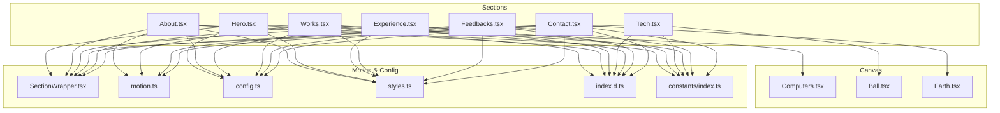
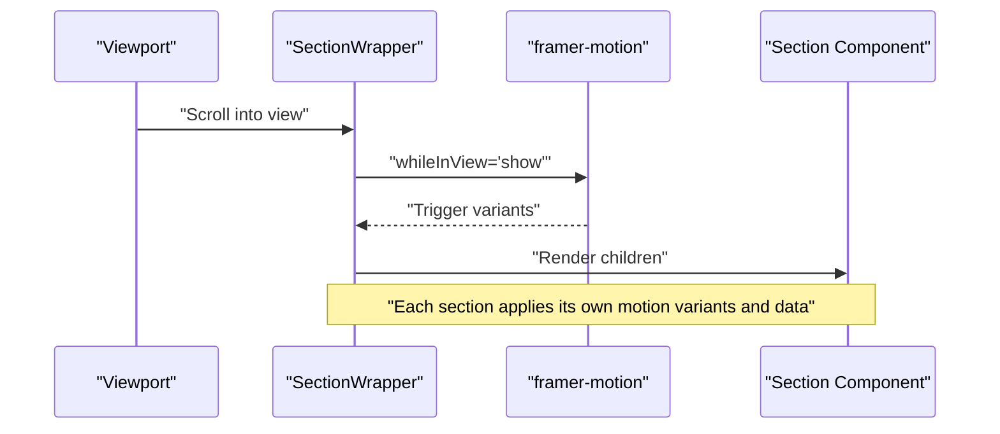
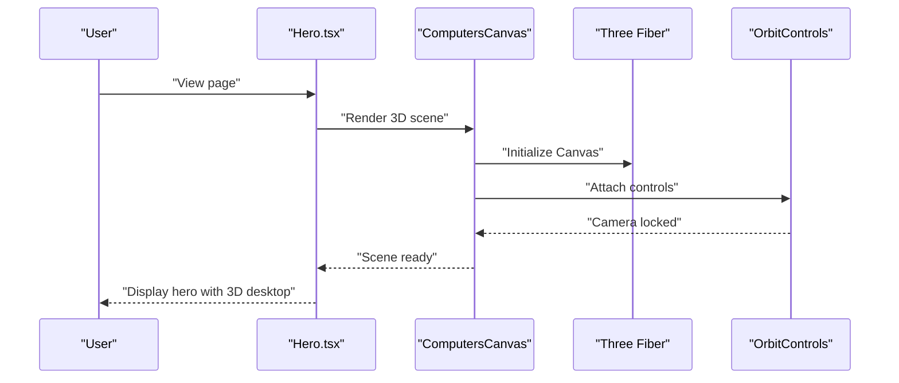
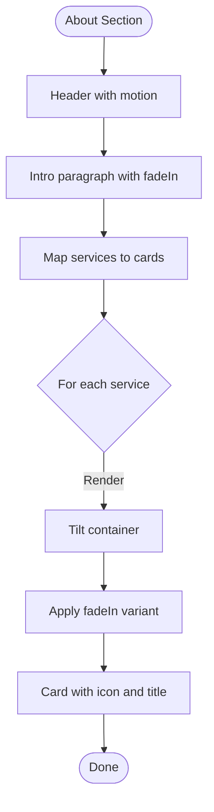
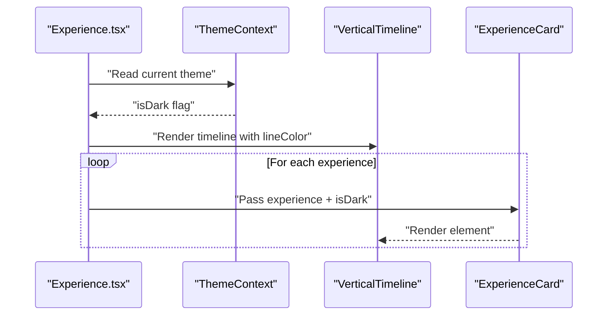
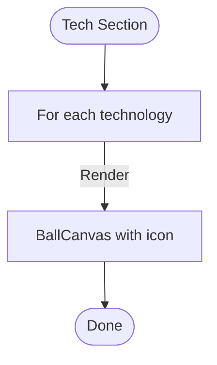
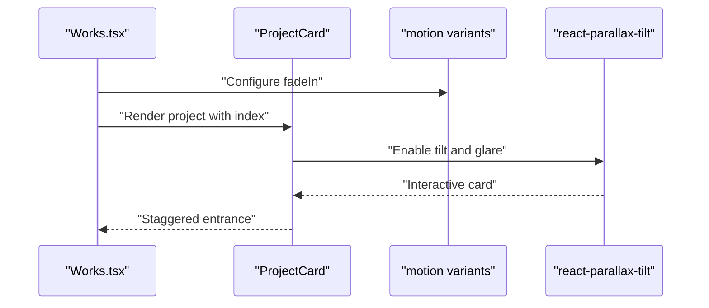
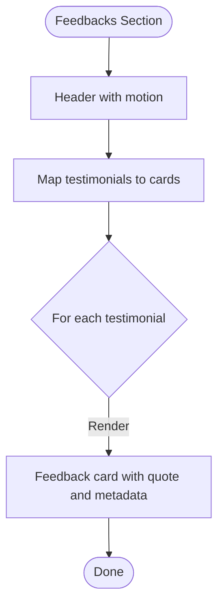
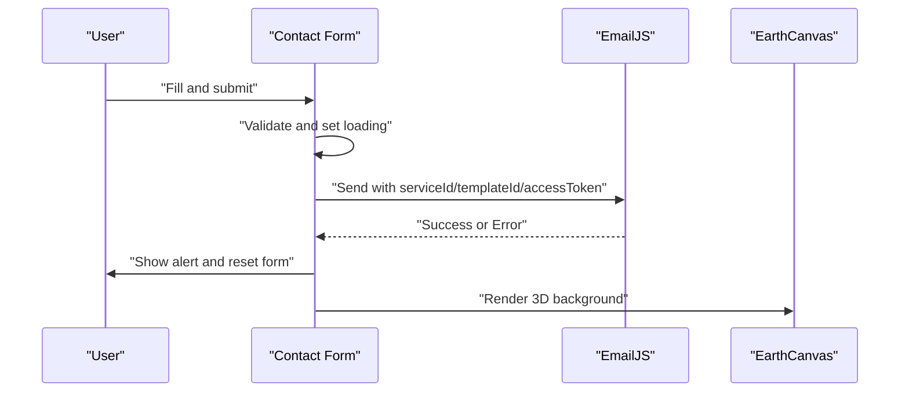
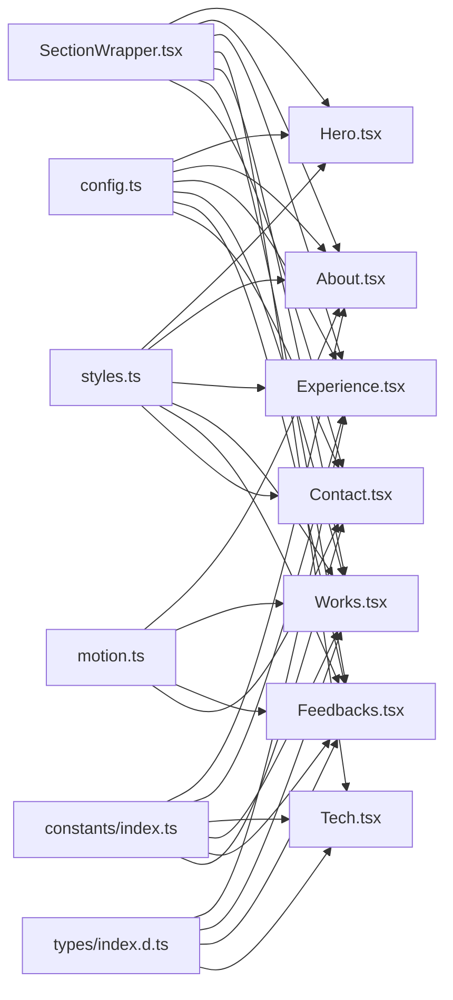

# Section Components

<cite>
**Referenced Files in This Document**
- [Hero.tsx](file://src/components/sections/Hero.tsx)
- [About.tsx](file://src/components/sections/About.tsx)
- [Experience.tsx](file://src/components/sections/Experience.tsx)
- [Tech.tsx](file://src/components/sections/Tech.tsx)
- [Works.tsx](file://src/components/sections/Works.tsx)
- [Feedbacks.tsx](file://src/components/sections/Feedbacks.tsx)
- [Contact.tsx](file://src/components/sections/Contact.tsx)
- [SectionWrapper.tsx](file://src/hoc/SectionWrapper.tsx)
- [motion.ts](file://src/utils/motion.ts)
- [index.ts](file://src/constants/index.ts)
- [config.ts](file://src/constants/config.ts)
- [styles.ts](file://src/constants/styles.ts)
- [index.ts](file://src/components/canvas/index.ts)
- [Computers.tsx](file://src/components/canvas/Computers.tsx)
- [Ball.tsx](file://src/components/canvas/Ball.tsx)
- [Earth.tsx](file://src/components/canvas/Earth.tsx)
- [index.d.ts](file://src/types/index.d.ts)
</cite>

## Table of Contents
1. [Introduction](#introduction)
2. [Project Structure](#project-structure)
3. [Core Components](#core-components)
4. [Architecture Overview](#architecture-overview)
5. [Detailed Component Analysis](#detailed-component-analysis)
6. [Dependency Analysis](#dependency-analysis)
7. [Performance Considerations](#performance-considerations)
8. [Troubleshooting Guide](#troubleshooting-guide)
9. [Conclusion](#conclusion)
10. [Appendices](#appendices)

## Introduction
This document explains the section components that compose the main content areas of the portfolio. It covers:
- Hero.tsx with its 3D desktop integration via Three.js
- About.tsx for personal introduction and service cards
- Experience.tsx for a timeline presentation of professional experience
- Tech.tsx for a rotating 3D skills visualization
- Works.tsx for a project showcase with interactive cards
- Feedbacks.tsx for testimonials
- Contact.tsx with EmailJS integration for messaging
It also documents the SectionWrapper higher-order component pattern used for scroll-triggered animations, component props, data structures, and integration with the animation system. Customization examples, responsive design patterns, SEO, and accessibility considerations are included.

## Project Structure
The sections are located under src/components/sections and are composed of:
- Atomic UI elements (e.g., Header.tsx in src/components/atoms)
- Canvas-based 3D integrations (src/components/canvas)
- Motion utilities (src/utils/motion.ts)
- Constants and configuration (src/constants)
- Types (src/types)

**Diagram sources**
- [Hero.tsx:1-53](file://src/components/sections/Hero.tsx#L1-L53)
- [About.tsx:1-68](file://src/components/sections/About.tsx#L1-L68)
- [Experience.tsx:1-83](file://src/components/sections/Experience.tsx#L1-L83)
- [Tech.tsx:1-20](file://src/components/sections/Tech.tsx#L1-L20)
- [Works.tsx:1-90](file://src/components/sections/Works.tsx#L1-L90)
- [Feedbacks.tsx:1-67](file://src/components/sections/Feedbacks.tsx#L1-L67)
- [Contact.tsx:1-124](file://src/components/sections/Contact.tsx#L1-L124)
- [SectionWrapper.tsx:1-31](file://src/hoc/SectionWrapper.tsx#L1-L31)
- [motion.ts:1-92](file://src/utils/motion.ts#L1-L92)
- [config.ts:1-87](file://src/constants/config.ts#L1-L87)
- [styles.ts:1-16](file://src/constants/styles.ts#L1-L16)
- [index.ts:1-258](file://src/constants/index.ts#L1-L258)
- [index.d.ts:1-45](file://src/types/index.d.ts#L1-L45)
- [Computers.tsx:1-85](file://src/components/canvas/Computers.tsx#L1-L85)
- [Ball.tsx:1-59](file://src/components/canvas/Ball.tsx#L1-L59)
- [Earth.tsx:1-46](file://src/components/canvas/Earth.tsx#L1-L46)

**Section sources**
- [Hero.tsx:1-53](file://src/components/sections/Hero.tsx#L1-L53)
- [SectionWrapper.tsx:1-31](file://src/hoc/SectionWrapper.tsx#L1-L31)
- [motion.ts:1-92](file://src/utils/motion.ts#L1-L92)
- [config.ts:1-87](file://src/constants/config.ts#L1-L87)
- [styles.ts:1-16](file://src/constants/styles.ts#L1-L16)
- [index.ts:1-258](file://src/constants/index.ts#L1-L258)
- [index.d.ts:1-45](file://src/types/index.d.ts#L1-L45)
- [Computers.tsx:1-85](file://src/components/canvas/Computers.tsx#L1-L85)
- [Ball.tsx:1-59](file://src/components/canvas/Ball.tsx#L1-L59)
- [Earth.tsx:1-46](file://src/components/canvas/Earth.tsx#L1-L46)

## Core Components
This section summarizes each section’s purpose, key props, and integration points.

- Hero.tsx
  - Purpose: Hero area with animated headline, subtitle, and a 3D desktop scene rendered via Canvas.
  - Key props: None (self-contained).
  - Integration: Uses ComputersCanvas for 3D rendering and motion utilities for scroll-triggered animations via SectionWrapper.
  - Responsive: Uses Tailwind utilities for spacing and typography scaling.
  - Accessibility: Ensure anchor link to “#about” is present for keyboard navigation.

- About.tsx
  - Purpose: Personal introduction and service cards with parallax tilt and fade-in animations.
  - Key props: None (renders from constants and config).
  - Integration: Uses SectionWrapper, Header, motion variants, and react-parallax-tilt.
  - Data: services array defines cards.

- Experience.tsx
  - Purpose: Timeline of experiences using react-vertical-timeline-component.
  - Key props: None (renders from constants and ThemeContext).
  - Integration: Uses SectionWrapper, Header, ThemeContext for dark/light styling.
  - Data: experiences array defines timeline entries.

- Tech.tsx
  - Purpose: Skills visualization using rotating 3D balls with icons.
  - Key props: None (renders from constants).
  - Integration: Uses SectionWrapper and BallCanvas for 3D rendering.

- Works.tsx
  - Purpose: Project showcase with interactive cards, hover actions, and tags.
  - Key props: None (renders from constants).
  - Integration: Uses SectionWrapper, Header, motion variants, react-parallax-tilt, and config content.

- Feedbacks.tsx
  - Purpose: Testimonials with quote styling and avatar images.
  - Key props: None (renders from constants).
  - Integration: Uses Header, motion variants, and config.

- Contact.tsx
  - Purpose: Contact form integrated with EmailJS; 3D Earth background.
  - Key props: None (form state managed internally).
  - Integration: Uses SectionWrapper, Header, motion variants, EmailJS SDK, and EarthCanvas.

**Section sources**
- [Hero.tsx:1-53](file://src/components/sections/Hero.tsx#L1-L53)
- [About.tsx:1-68](file://src/components/sections/About.tsx#L1-L68)
- [Experience.tsx:1-83](file://src/components/sections/Experience.tsx#L1-L83)
- [Tech.tsx:1-20](file://src/components/sections/Tech.tsx#L1-L20)
- [Works.tsx:1-90](file://src/components/sections/Works.tsx#L1-L90)
- [Feedbacks.tsx:1-67](file://src/components/sections/Feedbacks.tsx#L1-L67)
- [Contact.tsx:1-124](file://src/components/sections/Contact.tsx#L1-L124)

## Architecture Overview
The sections share a consistent animation and layout pattern:
- SectionWrapper wraps each section with scroll-triggered motion and a hash anchor for navigation.
- Motion utilities define reusable variants for fade-in, slide-in, and zoom effects.
- Constants and config provide data and content for sections.
- Canvas components integrate Three.js scenes for immersive visuals.

**Diagram sources**
- [SectionWrapper.tsx:10-28](file://src/hoc/SectionWrapper.tsx#L10-L28)
- [motion.ts:21-45](file://src/utils/motion.ts#L21-L45)

## Detailed Component Analysis

### Hero.tsx
- Layout and content
  - Absolute-positioned hero grid with vertical accent and headline/subtitle.
  - 3D desktop scene rendered via ComputersCanvas.
  - Scroll-down indicator with animated vertical bounce.
- 3D integration
  - Uses Canvas from @react-three/fiber with orbit controls and GLTF model loading.
  - Mobile detection disables the 3D scene to optimize performance.
- Animation
  - SectionWrapper handles scroll-triggered entrance; Hero itself does not define additional variants.
- Props and data
  - No props; reads hero copy from config.hero and styles from styles.ts.
- Accessibility and SEO
  - Headings and text are semantic; ensure anchor target “#about” exists for smooth scrolling.
  - Alt text for images should be descriptive; currently uses generic placeholders.

**Diagram sources**
- [Hero.tsx:1-53](file://src/components/sections/Hero.tsx#L1-L53)
- [Computers.tsx:32-82](file://src/components/canvas/Computers.tsx#L32-L82)

**Section sources**
- [Hero.tsx:1-53](file://src/components/sections/Hero.tsx#L1-L53)
- [Computers.tsx:1-85](file://src/components/canvas/Computers.tsx#L1-L85)
- [config.ts:41-50](file://src/constants/config.ts#L41-L50)
- [styles.ts:6-15](file://src/constants/styles.ts#L6-L15)

### About.tsx
- Layout and content
  - Header with motion, paragraph with fadeIn, and a grid of service cards.
  - Each card uses react-parallax-tilt for 3D tilt effect and motion variants for staggered fade-in.
- Props and data
  - ServiceCard accepts index, title, and icon; renders a Tilt container with gradient border and inner content.
  - Data comes from constants.services.
- Animation
  - fadeIn variants configured per card index for staggered entrance.
- Accessibility and SEO
  - Images inside cards should have descriptive alt attributes.
  - Ensure contrast for text on gradient backgrounds.

**Diagram sources**
- [About.tsx:17-44](file://src/components/sections/About.tsx#L17-L44)
- [motion.ts:21-45](file://src/utils/motion.ts#L21-L45)

**Section sources**
- [About.tsx:1-68](file://src/components/sections/About.tsx#L1-L68)
- [index.ts:51-68](file://src/constants/index.ts#L51-L68)
- [index.d.ts:14-19](file://src/types/index.d.ts#L14-L19)

### Experience.tsx
- Layout and content
  - Header with motion, then a VerticalTimeline with dynamic dark/light styling based on ThemeContext.
  - Each experience item is a VerticalTimelineElement with company icon, date, and bullet points.
- Props and data
  - ExperienceCard receives isDark and experience fields; styles adapt to theme.
  - Data from constants.experiences.
- Animation
  - SectionWrapper manages scroll-triggered entrance; individual items rely on timeline library styling.
- Accessibility and SEO
  - Ensure meaningful alt text for company icons.
  - Maintain readable color contrast in light/dark modes.

**Diagram sources**
- [Experience.tsx:16-61](file://src/components/sections/Experience.tsx#L16-L61)
- [Experience.tsx:63-82](file://src/components/sections/Experience.tsx#L63-L82)

**Section sources**
- [Experience.tsx:1-83](file://src/components/sections/Experience.tsx#L1-L83)
- [index.ts:125-162](file://src/constants/index.ts#L125-L162)
- [index.d.ts:7-12](file://src/types/index.d.ts#L7-L12)

### Tech.tsx
- Layout and content
  - Flex container with centered cards; each technology mapped to a BallCanvas rendering a 3D decal.
- Props and data
  - Receives no props; iterates constants.technologies.
- Animation
  - SectionWrapper provides scroll-triggered entrance; individual balls animate via floating physics.
- Accessibility and SEO
  - Icons are decorative; ensure surrounding text is descriptive.

**Diagram sources**
- [Tech.tsx:5-19](file://src/components/sections/Tech.tsx#L5-L19)
- [Ball.tsx:41-56](file://src/components/canvas/Ball.tsx#L41-L56)

**Section sources**
- [Tech.tsx:1-20](file://src/components/sections/Tech.tsx#L1-L20)
- [index.ts:70-123](file://src/constants/index.ts#L70-L123)
- [Ball.tsx:1-59](file://src/components/canvas/Ball.tsx#L1-L59)

### Works.tsx
- Layout and content
  - Header with motion, paragraph with fadeIn, and a grid of project cards.
  - Each card uses react-parallax-tilt and motion variants; clicking the GitHub icon opens the source link.
- Props and data
  - ProjectCard accepts index and project fields; tags are rendered as colored labels.
  - Data from constants.projects.
- Animation
  - fadeIn variants with spring easing and staggered delays.
- Accessibility and SEO
  - Ensure alt text for project images.
  - Button/link for GitHub should have clear focus states.

**Diagram sources**
- [Works.tsx:12-64](file://src/components/sections/Works.tsx#L12-L64)
- [motion.ts:21-45](file://src/utils/motion.ts#L21-L45)

**Section sources**
- [Works.tsx:1-90](file://src/components/sections/Works.tsx#L1-L90)
- [index.ts:191-255](file://src/constants/index.ts#L191-L255)
- [index.d.ts:21-29](file://src/types/index.d.ts#L21-L29)

### Feedbacks.tsx
- Layout and content
  - Dedicated testimonials section with a header and a row of feedback cards.
  - Each card uses motion variants for staggered entrance and displays a quote, author, designation, company, and avatar.
- Props and data
  - FeedbackCard accepts index and testimonial fields; data from constants.testimonials.
- Animation
  - fadeIn variants applied per card.
- Accessibility and SEO
  - Ensure avatar images have alt text.
  - Maintain sufficient contrast for quote punctuation and text.

**Diagram sources**
- [Feedbacks.tsx:10-45](file://src/components/sections/Feedbacks.tsx#L10-L45)

**Section sources**
- [Feedbacks.tsx:1-67](file://src/components/sections/Feedbacks.tsx#L1-L67)
- [index.ts:164-189](file://src/constants/index.ts#L164-L189)
- [index.d.ts:14-19](file://src/types/index.d.ts#L14-L19)

### Contact.tsx
- Form and EmailJS integration
  - Controlled form built from config.contact.form keys; supports input and textarea.
  - On submit, sends data via EmailJS using serviceId, templateId, and accessToken from environment variables.
  - Resets form after successful send and shows alerts for success/error.
- 3D integration
  - EarthCanvas provides a rotating 3D globe background.
- Animation
  - Left and right sections use slideIn variants for staggered entrance.
- Props and data
  - No props; reads form configuration from config.contact.
- Accessibility and SEO
  - Ensure labels and placeholders are descriptive.
  - Provide visible focus indicators for form fields.
  - Keep form submission feedback accessible (alerts are used).

**Diagram sources**
- [Contact.tsx:21-66](file://src/components/sections/Contact.tsx#L21-L66)
- [Contact.tsx:68-121](file://src/components/sections/Contact.tsx#L68-L121)
- [Earth.tsx:15-43](file://src/components/canvas/Earth.tsx#L15-L43)

**Section sources**
- [Contact.tsx:1-124](file://src/components/sections/Contact.tsx#L1-L124)
- [config.ts:51-64](file://src/constants/config.ts#L51-L64)
- [index.ts:164-189](file://src/constants/index.ts#L164-L189)

## Dependency Analysis
- SectionWrapper higher-order component
  - Wraps each section with motion triggers and a hash anchor for navigation.
  - Applies consistent padding and max width via styles.
- Motion utilities
  - fadeIn, slideIn, and zoomIn provide reusable variants for staggered and directional entrances.
- Data and types
  - constants/index.ts supplies arrays for services, technologies, experiences, testimonials, and projects.
  - types/index.d.ts defines shapes for experiences, testimonials, projects, technologies, and motion parameters.
- Canvas components
  - Three.js scenes are encapsulated in separate components and conditionally rendered based on device capabilities.

**Diagram sources**
- [SectionWrapper.tsx:10-28](file://src/hoc/SectionWrapper.tsx#L10-L28)
- [motion.ts:21-45](file://src/utils/motion.ts#L21-L45)
- [config.ts:1-87](file://src/constants/config.ts#L1-L87)
- [styles.ts:1-16](file://src/constants/styles.ts#L1-L16)
- [index.ts:1-258](file://src/constants/index.ts#L1-L258)
- [index.d.ts:1-45](file://src/types/index.d.ts#L1-L45)

**Section sources**
- [SectionWrapper.tsx:1-31](file://src/hoc/SectionWrapper.tsx#L1-L31)
- [motion.ts:1-92](file://src/utils/motion.ts#L1-L92)
- [config.ts:1-87](file://src/constants/config.ts#L1-L87)
- [styles.ts:1-16](file://src/constants/styles.ts#L1-L16)
- [index.ts:1-258](file://src/constants/index.ts#L1-L258)
- [index.d.ts:1-45](file://src/types/index.d.ts#L1-L45)

## Performance Considerations
- Canvas rendering
  - Hero’s 3D desktop scene is disabled on small screens to reduce resource usage.
  - Earth and Ball canvases use demand frame loops and optimized DPR settings.
- Motion
  - Variants use efficient easing and limited transforms to minimize layout thrashing.
- Data rendering
  - Lists are mapped over constant arrays; avoid unnecessary re-renders by keeping keys stable.
- Lazy loading
  - Canvas fallback loaders prevent blank states during asset load.

[No sources needed since this section provides general guidance]

## Troubleshooting Guide
- EmailJS errors
  - Verify VITE_EMAILJS_SERVICE_ID, VITE_EMAILJS_TEMPLATE_ID, and VITE_EMAILJS_ACCESS_TOKEN are set.
  - Check browser console for error logs and ensure form fields match template variables.
- 3D scenes not rendering
  - Confirm GLTF assets are present and paths are correct.
  - Ensure @react-three/* packages are installed and Canvas context is available.
- Scroll animations not triggering
  - Confirm viewport options in SectionWrapper meet visibility thresholds.
  - Ensure section IDs match anchor targets used in navigation.
- Form submission feedback
  - Alerts are used for simplicity; consider replacing with styled notifications for better UX.

**Section sources**
- [Contact.tsx:15-19](file://src/components/sections/Contact.tsx#L15-L19)
- [Contact.tsx:34-66](file://src/components/sections/Contact.tsx#L34-L66)
- [SectionWrapper.tsx:16-27](file://src/hoc/SectionWrapper.tsx#L16-L27)

## Conclusion
The section components implement a cohesive, animated, and data-driven portfolio layout. SectionWrapper standardizes scroll-triggered animations, while constants and config centralize content and data. The Three.js canvas integrations enhance visual appeal without compromising performance. Following the customization and accessibility guidelines ensures a polished, inclusive user experience.

[No sources needed since this section summarizes without analyzing specific files]

## Appendices

### Customization Examples
- Hero
  - Replace config.hero.p content and adjust styles.heroHeadText/styles.heroSubText for typography.
  - Swap the GLTF model path in Computers.tsx to another scene.
- About
  - Add or remove services in constants/services; update icons accordingly.
  - Adjust tilt parameters in ServiceCard for different depth perception.
- Experience
  - Modify experiences array in constants/experiences; change theme-dependent colors in ExperienceCard.
- Tech
  - Add/remove technologies in constants/technologies; ensure corresponding icons exist.
- Works
  - Extend projects array; add new tags with distinct colors.
- Feedbacks
  - Update testimonials array; customize card layout and gradients.
- Contact
  - Adjust form fields in config/contact; align EmailJS template fields accordingly.

**Section sources**
- [config.ts:41-86](file://src/constants/config.ts#L41-L86)
- [index.ts:51-255](file://src/constants/index.ts#L51-L255)
- [Computers.tsx:32-82](file://src/components/canvas/Computers.tsx#L32-L82)
- [Ball.tsx:41-56](file://src/components/canvas/Ball.tsx#L41-L56)
- [Earth.tsx:15-43](file://src/components/canvas/Earth.tsx#L15-L43)

### Responsive Design Patterns
- Hero
  - Uses max-width and centering utilities; mobile-friendly typography scales.
- About
  - Flex wrap for service cards; center alignment on small screens.
- Experience
  - Timeline adapts to dark/light mode; minimal layout adjustments for readability.
- Tech
  - Centered grid with fixed card sizes; responsive to container width.
- Works
  - Flex wrap for cards; consistent spacing and hover states.
- Feedbacks
  - Horizontal layout with centering on small screens.
- Contact
  - Stacked layout on small screens; two-column layout on larger screens.

**Section sources**
- [Hero.tsx:9-27](file://src/components/sections/Hero.tsx#L9-L27)
- [About.tsx:58-62](file://src/components/sections/About.tsx#L58-L62)
- [Experience.tsx:71-77](file://src/components/sections/Experience.tsx#L71-L77)
- [Tech.tsx:8-14](file://src/components/sections/Tech.tsx#L8-L14)
- [Works.tsx:80-84](file://src/components/sections/Works.tsx#L80-L84)
- [Feedbacks.tsx:55-62](file://src/components/sections/Feedbacks.tsx#L55-L62)
- [Contact.tsx:68-120](file://src/components/sections/Contact.tsx#L68-L120)

### Accessibility Features
- Landmarks and headings
  - Ensure each section has a clear heading hierarchy.
- Links and anchors
  - Verify anchor targets (e.g., “#about”) are present for smooth navigation.
- Images
  - Provide descriptive alt attributes for icons and project images.
- Forms
  - Associate labels with inputs; ensure focus visibility and keyboard operability.
- Color contrast
  - Maintain sufficient contrast for text on gradients and backgrounds.

**Section sources**
- [Hero.tsx:32-47](file://src/components/sections/Hero.tsx#L32-L47)
- [About.tsx:31-35](file://src/components/sections/About.tsx#L31-L35)
- [Works.tsx:31-47](file://src/components/sections/Works.tsx#L31-L47)
- [Feedbacks.tsx:37-41](file://src/components/sections/Feedbacks.tsx#L37-L41)
- [Contact.tsx:78-110](file://src/components/sections/Contact.tsx#L78-L110)

### SEO Considerations
- Titles and meta
  - Configure html.title in config.ts for page title.
- Headings
  - Use semantic headings (p, h2) consistently across sections.
- Descriptions
  - Populate section content in config.sections.* for meaningful text.
- Images
  - Provide descriptive alt attributes for visual assets.

**Section sources**
- [config.ts:42-46](file://src/constants/config.ts#L42-L46)
- [config.ts:66-85](file://src/constants/config.ts#L66-L85)