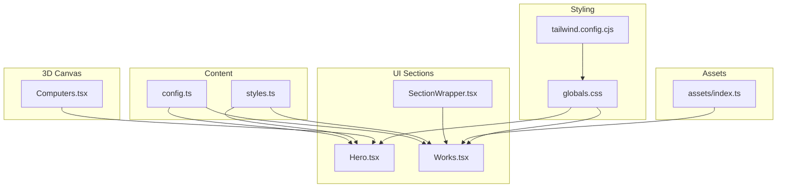
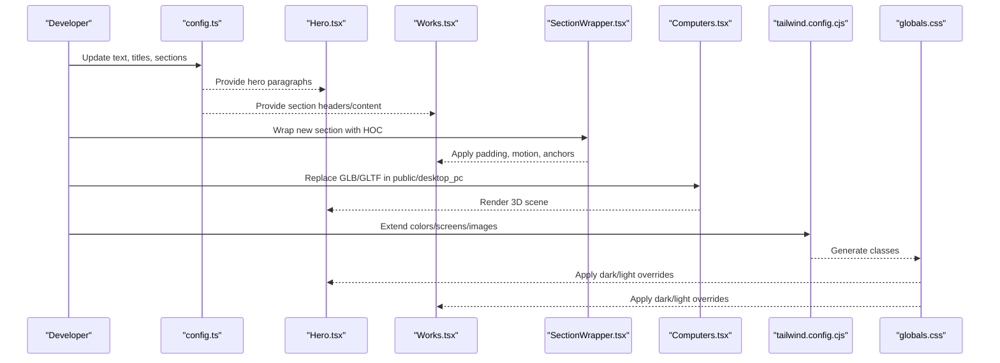
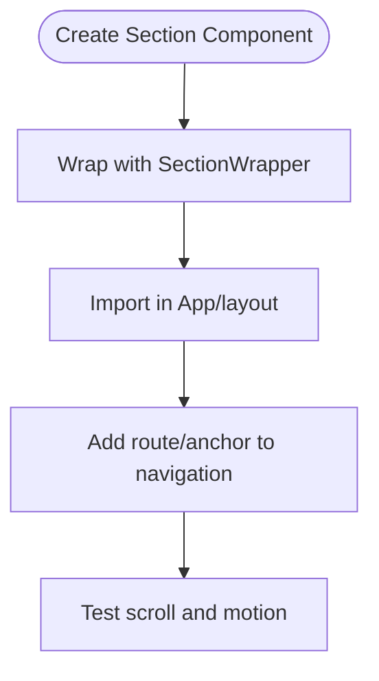
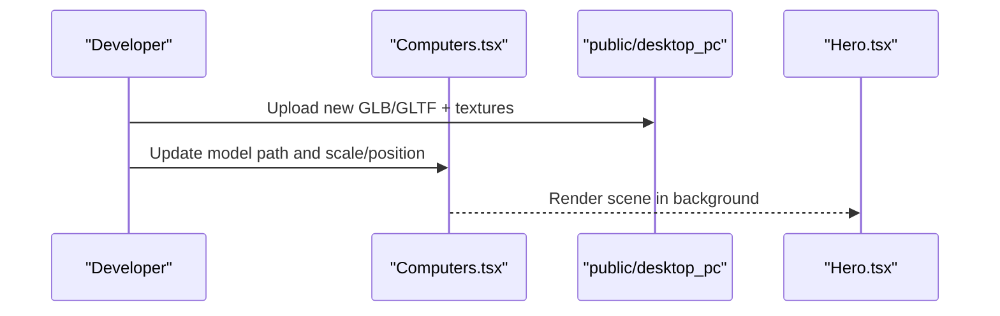
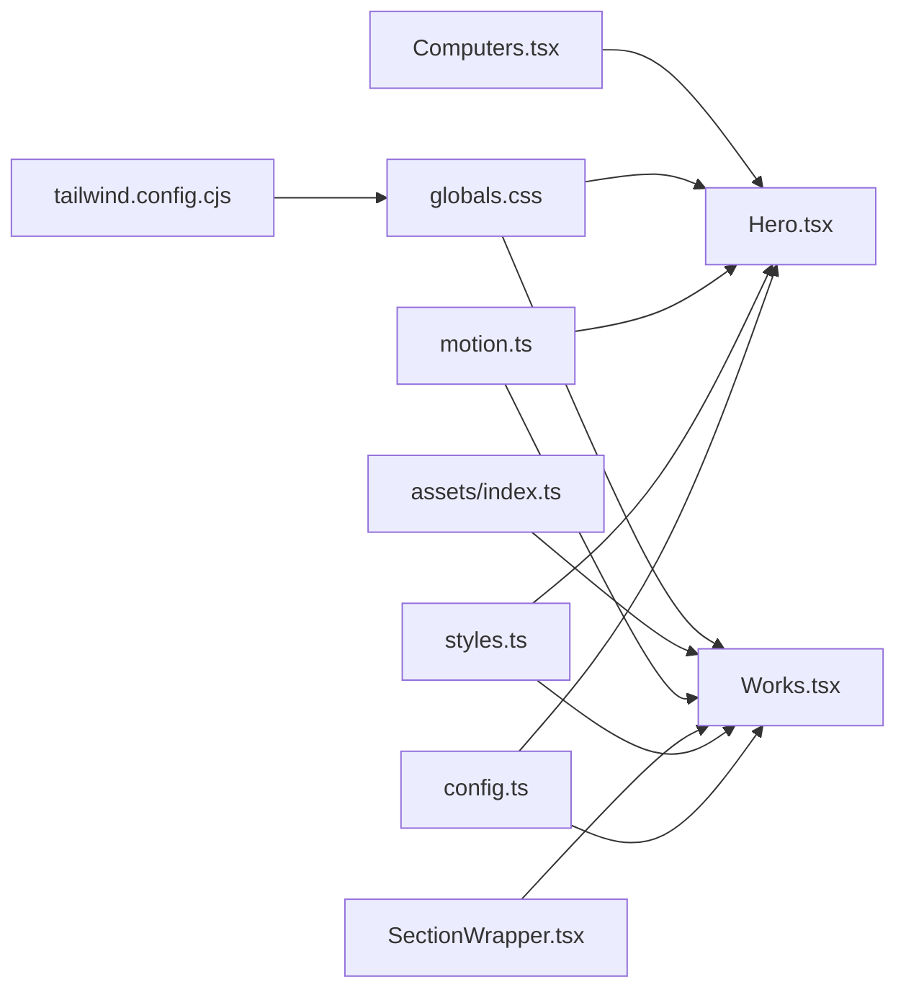

# Customization Guide

<cite>
**Referenced Files in This Document**
- [README.md](file://README.md)
- [package.json](file://package.json)
- [tailwind.config.cjs](file://tailwind.config.cjs)
- [src/globals.css](file://src/globals.css)
- [src/constants/config.ts](file://src/constants/config.ts)
- [src/constants/styles.ts](file://src/constants/styles.ts)
- [src/hoc/SectionWrapper.tsx](file://src/hoc/SectionWrapper.tsx)
- [src/utils/motion.ts](file://src/utils/motion.ts)
- [src/components/sections/Hero.tsx](file://src/components/sections/Hero.tsx)
- [src/components/sections/Works.tsx](file://src/components/sections/Works.tsx)
- [src/components/canvas/Computers.tsx](file://src/components/canvas/Computers.tsx)
- [src/assets/index.ts](file://src/assets/index.ts)
</cite>

## Table of Contents
1. [Introduction](#introduction)
2. [Project Structure](#project-structure)
3. [Core Components](#core-components)
4. [Architecture Overview](#architecture-overview)
5. [Detailed Component Analysis](#detailed-component-analysis)
6. [Dependency Analysis](#dependency-analysis)
7. [Performance Considerations](#performance-considerations)
8. [Troubleshooting Guide](#troubleshooting-guide)
9. [Conclusion](#conclusion)
10. [Appendices](#appendices)

## Introduction
This guide explains how to customize the 3D Portfolio application comprehensively. You will learn how to modify text content, replace images and logos, update project showcases, customize color schemes with Tailwind CSS and theme constants, manage assets (including 3D models and textures), add new sections following the SectionWrapper pattern, create custom animations, and extend the 3D component library. It also includes step-by-step customization tasks, best practices for maintaining customizations during updates, and notes on limitations and extension points.

## Project Structure
The project is organized around a clear separation of concerns:
- Content and configuration live under src/constants for centralized customization.
- UI sections are under src/components/sections and use shared HOCs and utilities.
- 3D scenes are under src/components/canvas and loaded via public assets.
- Styling is driven by Tailwind CSS with global overrides for light/dark themes.
- Assets are imported via a central index for reuse across components.

**Diagram sources**
- [src/constants/config.ts:1-87](file://src/constants/config.ts#L1-L87)
- [src/constants/styles.ts:1-16](file://src/constants/styles.ts#L1-L16)
- [src/components/sections/Hero.tsx:1-53](file://src/components/sections/Hero.tsx#L1-L53)
- [src/components/sections/Works.tsx:1-90](file://src/components/sections/Works.tsx#L1-L90)
- [src/hoc/SectionWrapper.tsx:1-31](file://src/hoc/SectionWrapper.tsx#L1-L31)
- [src/components/canvas/Computers.tsx:1-85](file://src/components/canvas/Computers.tsx#L1-L85)
- [tailwind.config.cjs:1-29](file://tailwind.config.cjs#L1-L29)
- [src/globals.css:1-369](file://src/globals.css#L1-L369)
- [src/assets/index.ts:1-63](file://src/assets/index.ts#L1-L63)

**Section sources**
- [README.md:32-111](file://README.md#L32-L111)
- [package.json:1-45](file://package.json#L1-L45)

## Core Components
This section highlights the key customization entry points and their roles.

- Content configuration: Centralized in config.ts for HTML metadata, hero copy, contact form labels, and section headers/content.
- Styles and typography: Centralized in styles.ts for consistent spacing and text classes.
- Section wrapper: SectionWrapper.tsx provides standardized motion, padding, and anchor behavior for all sections.
- Motion utilities: motion.ts defines reusable Framer Motion variants for text, fade-in, zoom, and slide-in effects.
- 3D canvas: Computers.tsx loads a GLTF scene from public assets and controls camera/controls.
- Global styles: globals.css defines dark/light theme overrides and gradients.

**Section sources**
- [src/constants/config.ts:1-87](file://src/constants/config.ts#L1-L87)
- [src/constants/styles.ts:1-16](file://src/constants/styles.ts#L1-L16)
- [src/hoc/SectionWrapper.tsx:1-31](file://src/hoc/SectionWrapper.tsx#L1-L31)
- [src/utils/motion.ts:1-92](file://src/utils/motion.ts#L1-L92)
- [src/components/canvas/Computers.tsx:1-85](file://src/components/canvas/Computers.tsx#L1-L85)
- [src/globals.css:1-369](file://src/globals.css#L1-L369)

## Architecture Overview
The customization architecture centers on configuration-driven content, shared styling, and modular sections. 3D scenes are decoupled from content via public assets and loaded dynamically.

**Diagram sources**
- [src/constants/config.ts:1-87](file://src/constants/config.ts#L1-L87)
- [src/components/sections/Hero.tsx:1-53](file://src/components/sections/Hero.tsx#L1-L53)
- [src/components/sections/Works.tsx:1-90](file://src/components/sections/Works.tsx#L1-L90)
- [src/hoc/SectionWrapper.tsx:1-31](file://src/hoc/SectionWrapper.tsx#L1-L31)
- [src/components/canvas/Computers.tsx:1-85](file://src/components/canvas/Computers.tsx#L1-L85)
- [tailwind.config.cjs:1-29](file://tailwind.config.cjs#L1-L29)
- [src/globals.css:1-369](file://src/globals.css#L1-L369)

## Detailed Component Analysis

### Content Customization (Text, Sections, Forms)
- Modify HTML metadata, hero copy, and section headers/content in config.ts.
- Update contact form labels and placeholders in the contact section.
- Adjust section content blocks (e.g., about, experience, feedbacks, works) to reflect your personal narrative.

Best practices:
- Keep content concise and aligned with your brand voice.
- Use semantic keys in config.ts to avoid scattered strings.
- Test responsiveness after changing long paragraphs.

**Section sources**
- [src/constants/config.ts:1-87](file://src/constants/config.ts#L1-L87)

### Typography and Spacing
- Centralize typography and spacing via styles.ts classes applied in sections.
- Override or extend utility classes in globals.css for consistent headings and subtitles.

Best practices:
- Prefer shared classes from styles.ts to maintain uniformity.
- Use Tailwind utilities sparingly for one-off tweaks.

**Section sources**
- [src/constants/styles.ts:1-16](file://src/constants/styles.ts#L1-L16)
- [src/globals.css:1-369](file://src/globals.css#L1-L369)

### Color Scheme Customization (Tailwind + Theme Constants)
- Extend or override Tailwind colors in tailwind.config.cjs.
- Use dark/light mode overrides in globals.css to adjust backgrounds, text, and gradients.
- Reference theme colors in components via Tailwind classes.

Limitations:
- Some gradients and theme-specific overrides are defined in CSS; ensure changes propagate to both modes.

**Section sources**
- [tailwind.config.cjs:1-29](file://tailwind.config.cjs#L1-L29)
- [src/globals.css:1-369](file://src/globals.css#L1-L369)

### Adding New Sections (SectionWrapper Pattern)
Steps:
1. Create a new component under src/components/sections.
2. Wrap it with SectionWrapper to inherit motion, padding, and anchors.
3. Import and render the new section in the main layout or App routing.

**Diagram sources**
- [src/hoc/SectionWrapper.tsx:1-31](file://src/hoc/SectionWrapper.tsx#L1-L31)

**Section sources**
- [src/hoc/SectionWrapper.tsx:1-31](file://src/hoc/SectionWrapper.tsx#L1-L31)

### Creating Custom Animations
- Use motion.ts variants to define reusable animations (text, fade, zoom, slide).
- Apply variants via Framer Motion’s variants prop in components.
- Chain delays and durations for staggered effects.

Best practices:
- Reuse variants from motion.ts to keep animations consistent.
- Keep viewport triggers minimal to preserve performance.

**Section sources**
- [src/utils/motion.ts:1-92](file://src/utils/motion.ts#L1-L92)

### Asset Management (Images, Logos, 3D Models)
- Images/logos: Import from src/assets/index.ts and use in components.
- 3D models: Place GLB/GLTF and textures under public/<model>/ and reference in canvas components.
- Texture customization: Replace PNG textures in public/<model>/textures.

Guidelines:
- Keep asset sizes optimized; compress images and reduce polygon counts for 3D models.
- Maintain consistent naming to avoid broken links.

**Section sources**
- [src/assets/index.ts:1-63](file://src/assets/index.ts#L1-L63)
- [src/components/canvas/Computers.tsx:1-85](file://src/components/canvas/Computers.tsx#L1-L85)

### Updating Project Showcases
- Edit project entries in constants and pass them to Works.tsx.
- Customize card visuals (hover, tags, links) in Works.tsx.
- Use SectionWrapper to wrap Works for consistent motion and padding.

**Section sources**
- [src/components/sections/Works.tsx:1-90](file://src/components/sections/Works.tsx#L1-L90)

### 3D Scene Replacement and Extension
- Replace the GLTF scene path in the canvas component to load a different model.
- Adjust lighting and camera parameters for optimal presentation.
- Add new canvas components for additional scenes and compose them in sections.

**Diagram sources**
- [src/components/canvas/Computers.tsx:1-85](file://src/components/canvas/Computers.tsx#L1-L85)

**Section sources**
- [src/components/canvas/Computers.tsx:1-85](file://src/components/canvas/Computers.tsx#L1-L85)

## Dependency Analysis
The customization surface interacts with several key modules. Understanding these dependencies helps prevent breaking changes when updating.

**Diagram sources**
- [src/constants/config.ts:1-87](file://src/constants/config.ts#L1-L87)
- [src/constants/styles.ts:1-16](file://src/constants/styles.ts#L1-L16)
- [src/hoc/SectionWrapper.tsx:1-31](file://src/hoc/SectionWrapper.tsx#L1-L31)
- [src/utils/motion.ts:1-92](file://src/utils/motion.ts#L1-L92)
- [src/assets/index.ts:1-63](file://src/assets/index.ts#L1-L63)
- [tailwind.config.cjs:1-29](file://tailwind.config.cjs#L1-L29)
- [src/globals.css:1-369](file://src/globals.css#L1-L369)
- [src/components/sections/Hero.tsx:1-53](file://src/components/sections/Hero.tsx#L1-L53)
- [src/components/sections/Works.tsx:1-90](file://src/components/sections/Works.tsx#L1-L90)
- [src/components/canvas/Computers.tsx:1-85](file://src/components/canvas/Computers.tsx#L1-L85)

**Section sources**
- [package.json:1-45](file://package.json#L1-L45)

## Performance Considerations
- Minimize heavy 3D assets; prefer optimized GLB/GLTF and compressed textures.
- Limit motion complexity; use viewport-triggered animations sparingly.
- Keep global CSS overrides focused to reduce repaint costs.
- Use lazy loading for images and defer non-critical resources.

## Troubleshooting Guide
Common issues and resolutions:
- Broken 3D model path: Verify the GLTF path in the canvas component matches the public folder structure.
- Missing assets: Ensure imports in assets/index.ts are correct and files exist in src/assets.
- Tailwind classes not applying: Confirm tailwind.config.cjs extends are present and rebuild the project.
- Light/dark theme inconsistencies: Check globals.css overrides for missing selectors in the current theme mode.
- Animation not triggering: Verify viewport thresholds and amount in SectionWrapper and ensure variants are passed correctly.

**Section sources**
- [src/components/canvas/Computers.tsx:1-85](file://src/components/canvas/Computers.tsx#L1-L85)
- [src/assets/index.ts:1-63](file://src/assets/index.ts#L1-L63)
- [tailwind.config.cjs:1-29](file://tailwind.config.cjs#L1-L29)
- [src/globals.css:1-369](file://src/globals.css#L1-L369)
- [src/hoc/SectionWrapper.tsx:1-31](file://src/hoc/SectionWrapper.tsx#L1-L31)
- [src/utils/motion.ts:1-92](file://src/utils/motion.ts#L1-L92)

## Conclusion
With the configuration-driven content model, shared styling, and modular sections, customizing the 3D Portfolio is straightforward. Focus on config.ts for text, styles.ts for typography, tailwind.config.cjs and globals.css for themes, and assets/index.ts for images/logos. Extend the 3D experience by swapping GLTF models and adjusting lighting/camera. Follow the SectionWrapper pattern and motion utilities to keep animations consistent and performant.

## Appendices

### Step-by-Step: Replace Logo and Navigation Branding
- Place logo.png/svg in public/.
- Update imports in assets/index.ts and reference the logo in header/navbar components.
- Ensure alt text and accessibility attributes remain descriptive.

**Section sources**
- [src/assets/index.ts:1-63](file://src/assets/index.ts#L1-L63)

### Step-by-Step: Swap Hero Background Model
- Put the new GLB/GLTF and textures under public/desktop_pc.
- Update the model path in the canvas component.
- Adjust scale, position, and lighting for optimal framing.

**Section sources**
- [src/components/canvas/Computers.tsx:1-85](file://src/components/canvas/Computers.tsx#L1-L85)

### Step-by-Step: Add a New Section
- Create a new component under src/components/sections.
- Wrap it with SectionWrapper.
- Import and render the section in the main layout.
- Add an anchor link in navigation to jump to the new section.

**Section sources**
- [src/hoc/SectionWrapper.tsx:1-31](file://src/hoc/SectionWrapper.tsx#L1-L31)

### Step-by-Step: Customize Contact Form Labels
- Edit the contact section in config.ts to change labels and placeholders.
- Ensure EmailJS environment variables are configured if enabling form submission.

**Section sources**
- [src/constants/config.ts:1-87](file://src/constants/config.ts#L1-L87)
- [README.md:230-247](file://README.md#L230-L247)

### Best Practices for Updates
- Back up config.ts and globals.css before major theme changes.
- Version-control public assets separately if collaborating.
- Test across devices after swapping 3D models or textures.
- Keep dependencies updated and rebuild after Tailwind changes.

**Section sources**
- [package.json:1-45](file://package.json#L1-L45)
- [tailwind.config.cjs:1-29](file://tailwind.config.cjs#L1-L29)
- [src/globals.css:1-369](file://src/globals.css#L1-L369)