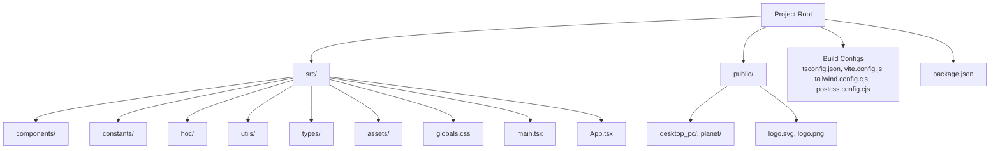
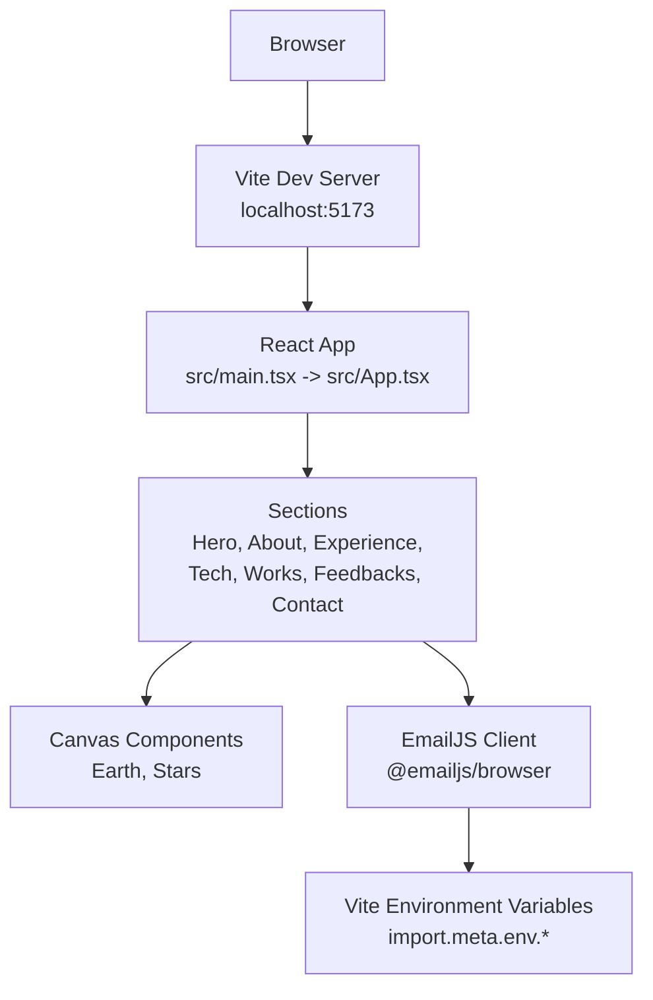
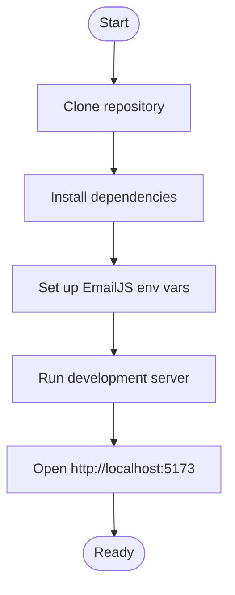
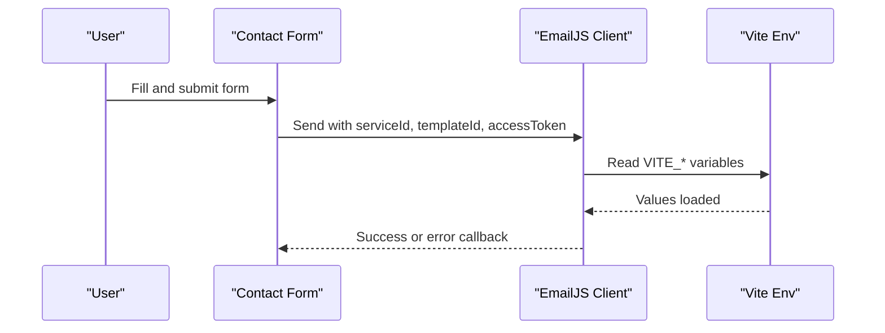
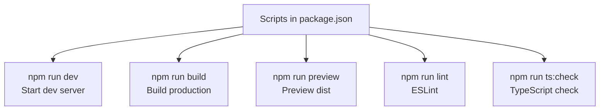
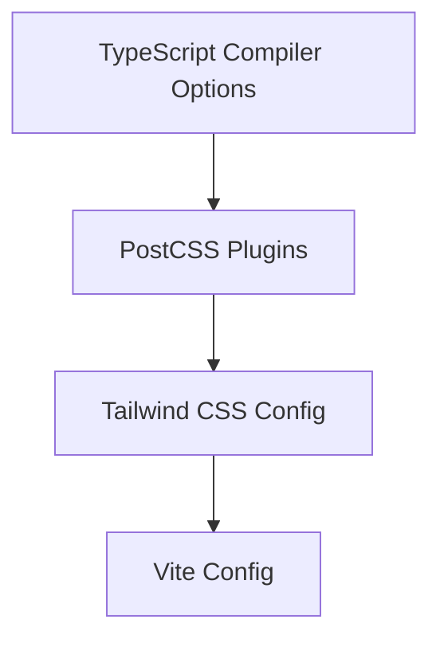
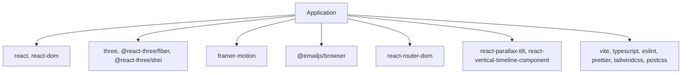

# Getting Started

<cite>
**Referenced Files in This Document**
- [README.md](file://README.md)
- [package.json](file://package.json)
- [vite.config.js](file://vite.config.js)
- [index.html](file://index.html)
- [src/main.tsx](file://src/main.tsx)
- [src/App.tsx](file://src/App.tsx)
- [src/components/sections/Contact.tsx](file://src/components/sections/Contact.tsx)
- [src/constants/config.ts](file://src/constants/config.ts)
- [tailwind.config.cjs](file://tailwind.config.cjs)
- [postcss.config.cjs](file://postcss.config.cjs)
- [tsconfig.json](file://tsconfig.json)
</cite>

## Table of Contents
1. [Introduction](#introduction)
2. [Project Structure](#project-structure)
3. [Core Components](#core-components)
4. [Architecture Overview](#architecture-overview)
5. [Detailed Component Analysis](#detailed-component-analysis)
6. [Dependency Analysis](#dependency-analysis)
7. [Performance Considerations](#performance-considerations)
8. [Troubleshooting Guide](#troubleshooting-guide)
9. [Conclusion](#conclusion)
10. [Appendices](#appendices)

## Introduction
This guide helps you set up and run the 3D Portfolio project locally. It covers prerequisites, installation, environment configuration for EmailJS, development server setup, verification steps, and available scripts. The project is a modern React application with TypeScript, Vite, Three.js, and Tailwind CSS, featuring interactive 3D scenes and a responsive layout.

## Project Structure
The project follows a conventional React + TypeScript + Vite setup with a clear separation of concerns:
- Source code under src/ includes components, constants, HOCs, utilities, and global styles.
- Public assets under public/ include 3D model files and images.
- Build-time configuration files define TypeScript, PostCSS, Tailwind CSS, and Vite behavior.
- The root README provides detailed instructions and environment variable setup.

**Diagram sources**
- [index.html:1-14](file://index.html#L1-L14)
- [src/main.tsx:1-12](file://src/main.tsx#L1-L12)
- [src/App.tsx:1-51](file://src/App.tsx#L1-L51)
- [vite.config.js:1-9](file://vite.config.js#L1-L9)
- [tsconfig.json:1-26](file://tsconfig.json#L1-L26)
- [tailwind.config.cjs:1-29](file://tailwind.config.cjs#L1-L29)
- [postcss.config.cjs:1-6](file://postcss.config.cjs#L1-L6)

**Section sources**
- [README.md:32-109](file://README.md#L32-L109)
- [index.html:1-14](file://index.html#L1-L14)
- [src/main.tsx:1-12](file://src/main.tsx#L1-L12)
- [src/App.tsx:1-51](file://src/App.tsx#L1-L51)
- [vite.config.js:1-9](file://vite.config.js#L1-L9)
- [tsconfig.json:1-26](file://tsconfig.json#L1-L26)
- [tailwind.config.cjs:1-29](file://tailwind.config.cjs#L1-L29)
- [postcss.config.cjs:1-6](file://postcss.config.cjs#L1-L6)

## Core Components
- Application bootstrap: The entry point initializes React DOM and mounts the root App component.
- Routing and layout: The App component wraps children in a router and theme provider, rendering navigation, hero, sections, and footer elements.
- 3D scenes: Canvas components render interactive 3D visuals (e.g., Earth and stars) integrated into sections.
- Contact form: A form that integrates with EmailJS for sending messages using Vite’s environment variables.

Key implementation references:
- Entry point and mount: [src/main.tsx:1-12](file://src/main.tsx#L1-L12)
- Application shell and routing: [src/App.tsx:1-51](file://src/App.tsx#L1-L51)
- Contact form and EmailJS integration: [src/components/sections/Contact.tsx:1-124](file://src/components/sections/Contact.tsx#L1-L124)
- Configuration for titles, sections, and defaults: [src/constants/config.ts:1-87](file://src/constants/config.ts#L1-L87)

**Section sources**
- [src/main.tsx:1-12](file://src/main.tsx#L1-L12)
- [src/App.tsx:1-51](file://src/App.tsx#L1-L51)
- [src/components/sections/Contact.tsx:1-124](file://src/components/sections/Contact.tsx#L1-L124)
- [src/constants/config.ts:1-87](file://src/constants/config.ts#L1-L87)

## Architecture Overview
The runtime architecture combines React rendering, Vite’s development server, and client-side EmailJS integration. The build pipeline uses Vite with TypeScript and PostCSS/Tailwind CSS.

**Diagram sources**
- [src/main.tsx:1-12](file://src/main.tsx#L1-L12)
- [src/App.tsx:1-51](file://src/App.tsx#L1-L51)
- [src/components/sections/Contact.tsx:1-124](file://src/components/sections/Contact.tsx#L1-L124)
- [vite.config.js:1-9](file://vite.config.js#L1-L9)

**Section sources**
- [src/main.tsx:1-12](file://src/main.tsx#L1-L12)
- [src/App.tsx:1-51](file://src/App.tsx#L1-L51)
- [src/components/sections/Contact.tsx:1-124](file://src/components/sections/Contact.tsx#L1-L124)
- [vite.config.js:1-9](file://vite.config.js#L1-L9)

## Detailed Component Analysis

### Prerequisites
Ensure the following tools are installed:
- Node.js and NPM: Required for dependency management and running scripts.
- Git: Required to clone the repository.
- A modern web browser: To access the development server.

Verification steps:
- Confirm Node.js and NPM versions by running the respective commands in your terminal.
- Verify Git installation by checking the version.

**Section sources**
- [README.md:170-178](file://README.md#L170-L178)

### Installation and Running Locally
Follow these steps to set up the project:

1. Clone the repository using Git.
2. Install dependencies with NPM.
3. Start the development server.
4. Open the application in your browser.

Environment variables for EmailJS:
- Create a .env file in the project root and add the required EmailJS variables as documented.

Access the local development environment:
- The development server runs on localhost at the port configured by Vite.

**Diagram sources**
- [README.md:179-216](file://README.md#L179-L216)
- [vite.config.js:1-9](file://vite.config.js#L1-L9)

**Section sources**
- [README.md:179-216](file://README.md#L179-L216)
- [vite.config.js:1-9](file://vite.config.js#L1-L9)

### Environment Variables for EmailJS
The project uses EmailJS to send contact form submissions. Configure the following variables in a .env file at the project root:
- VITE_EMAILJS_SERVICE_ID
- VITE_EMAILJS_TEMPLATE_ID
- VITE_EMAIL_JS_ACCESS_TOKEN

These variables are accessed client-side via Vite’s import.meta.env namespace.

**Diagram sources**
- [src/components/sections/Contact.tsx:15-19](file://src/components/sections/Contact.tsx#L15-L19)
- [README.md:240-247](file://README.md#L240-L247)

**Section sources**
- [src/components/sections/Contact.tsx:15-19](file://src/components/sections/Contact.tsx#L15-L19)
- [README.md:240-247](file://README.md#L240-L247)

### Available Scripts
The project defines the following scripts in package.json:
- npm install: Installs dependencies.
- npm run dev: Starts the Vite development server.
- npm run build: Builds the production site.
- npm run preview: Boots a local static server for the built site.
- npm run lint: Runs ESLint.
- npm run ts:check: Performs TypeScript type checking.

**Diagram sources**
- [package.json:6-12](file://package.json#L6-L12)

**Section sources**
- [package.json:6-12](file://package.json#L6-L12)
- [README.md:217-229](file://README.md#L217-L229)

### Build and Styling Configuration
- TypeScript: Configured for bundler mode with strict checks.
- PostCSS and Tailwind CSS: Integrated via PostCSS configuration and Tailwind plugin.
- Vite: React plugin enabled; base path configured.

**Diagram sources**
- [tsconfig.json:1-26](file://tsconfig.json#L1-L26)
- [postcss.config.cjs:1-6](file://postcss.config.cjs#L1-L6)
- [tailwind.config.cjs:1-29](file://tailwind.config.cjs#L1-L29)
- [vite.config.js:1-9](file://vite.config.js#L1-L9)

**Section sources**
- [tsconfig.json:1-26](file://tsconfig.json#L1-L26)
- [postcss.config.cjs:1-6](file://postcss.config.cjs#L1-L6)
- [tailwind.config.cjs:1-29](file://tailwind.config.cjs#L1-L29)
- [vite.config.js:1-9](file://vite.config.js#L1-L9)

## Dependency Analysis
High-level dependencies include React, Three.js ecosystem packages, Framer Motion, and EmailJS. Development dependencies include Vite, TypeScript, ESLint, Prettier, Tailwind CSS, and PostCSS.

**Diagram sources**
- [package.json:13-43](file://package.json#L13-L43)

**Section sources**
- [package.json:13-43](file://package.json#L13-L43)

## Performance Considerations
- Use the production build for performance comparisons and previews.
- Keep dependencies updated to benefit from performance improvements.
- Leverage Vite’s fast refresh during development.
- Optimize 3D assets and animations for smooth interactions.

[No sources needed since this section provides general guidance]

## Troubleshooting Guide
Common setup issues and resolutions:
- Node.js or NPM not installed: Install from the official website and verify versions.
- Git not found: Install Git and ensure it is available in PATH.
- Missing environment variables: Create a .env file with the required EmailJS variables.
- Port conflicts: Change the port in Vite configuration if 5173 is in use.
- Build errors: Run type checking and linting to identify issues; fix TypeScript errors and ESLint warnings.

Verification steps:
- Confirm the development server starts without errors.
- Test the contact form submission to ensure EmailJS integration is working.
- Check browser console for any runtime errors.

**Section sources**
- [README.md:170-178](file://README.md#L170-L178)
- [README.md:217-229](file://README.md#L217-L229)
- [src/components/sections/Contact.tsx:15-19](file://src/components/sections/Contact.tsx#L15-L19)

## Conclusion
You now have the essentials to install, configure, and run the 3D Portfolio project locally. Use the provided scripts, configure EmailJS, and explore the development server. Refer to the project’s README for deployment options and advanced customization.

[No sources needed since this section summarizes without analyzing specific files]

## Appendices

### Appendix A: Quick Reference
- Prerequisites: Node.js, NPM, Git
- Clone and install: git clone and npm install
- Run dev: npm run dev
- Access: http://localhost:5173
- Scripts: dev, build, preview, lint, ts:check
- EmailJS env vars: VITE_EMAILJS_SERVICE_ID, VITE_EMAILJS_TEMPLATE_ID, VITE_EMAIL_JS_ACCESS_TOKEN

**Section sources**
- [README.md:170-178](file://README.md#L170-L178)
- [README.md:179-216](file://README.md#L179-L216)
- [README.md:217-229](file://README.md#L217-L229)
- [README.md:240-247](file://README.md#L240-L247)