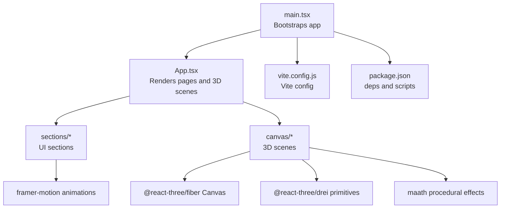
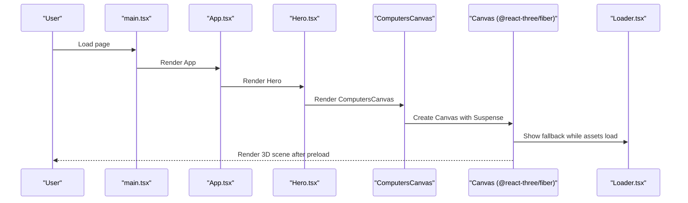
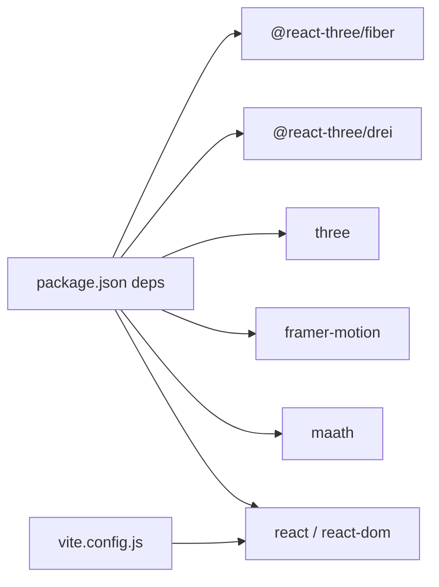

# Performance Optimization

<cite>
**Referenced Files in This Document**
- [package.json](file://package.json)
- [vite.config.js](file://vite.config.js)
- [src/main.tsx](file://src/main.tsx)
- [src/App.tsx](file://src/App.tsx)
- [src/components/canvas/index.ts](file://src/components/canvas/index.ts)
- [src/components/canvas/Earth.tsx](file://src/components/canvas/Earth.tsx)
- [src/components/canvas/Ball.tsx](file://src/components/canvas/Ball.tsx)
- [src/components/canvas/Computers.tsx](file://src/components/canvas/Computers.tsx)
- [src/components/canvas/Stars.tsx](file://src/components/canvas/Stars.tsx)
- [src/components/layout/Loader.tsx](file://src/components/layout/Loader.tsx)
- [src/utils/motion.ts](file://src/utils/motion.ts)
- [src/context/ThemeContext.tsx](file://src/context/ThemeContext.tsx)
- [src/components/sections/Hero.tsx](file://src/components/sections/Hero.tsx)
- [src/components/sections/Works.tsx](file://src/components/sections/Works.tsx)
</cite>

## Table of Contents
1. [Introduction](#introduction)
2. [Project Structure](#project-structure)
3. [Core Components](#core-components)
4. [Architecture Overview](#architecture-overview)
5. [Detailed Component Analysis](#detailed-component-analysis)
6. [Dependency Analysis](#dependency-analysis)
7. [Performance Considerations](#performance-considerations)
8. [Troubleshooting Guide](#troubleshooting-guide)
9. [Conclusion](#conclusion)
10. [Appendices](#appendices)

## Introduction
This document provides a comprehensive guide to performance optimization strategies for the 3D Portfolio application. It focuses on:
- Lazy loading with React Suspense and code splitting
- Three.js rendering and memory optimization
- Animation performance, scroll-triggered animation optimization, and responsive behavior
- Bundle size and asset optimization
- Monitoring, profiling, and common bottlenecks
- Mobile optimization and accessibility for motion sensitivity

## Project Structure
The application is a Vite + React + Three.js portfolio site. The 3D scenes are encapsulated in dedicated canvas components and rendered via @react-three/fiber and @react-three/drei. Animations leverage Framer Motion and maath for procedural effects. Build-time configuration is minimal, with Vite’s default React plugin and a base path configured.

**Diagram sources**
- [src/main.tsx:1-12](file://src/main.tsx#L1-L12)
- [src/App.tsx:1-51](file://src/App.tsx#L1-L51)
- [src/components/canvas/index.ts:1-7](file://src/components/canvas/index.ts#L1-L7)
- [vite.config.js:1-9](file://vite.config.js#L1-L9)
- [package.json:1-45](file://package.json#L1-L45)

**Section sources**
- [src/main.tsx:1-12](file://src/main.tsx#L1-L12)
- [src/App.tsx:1-51](file://src/App.tsx#L1-L51)
- [vite.config.js:1-9](file://vite.config.js#L1-L9)
- [package.json:1-45](file://package.json#L1-L45)

## Core Components
- Canvas wrappers: EarthCanvas, BallCanvas, ComputersCanvas, StarsCanvas
- Suspense fallback loader for long-running 3D assets
- Responsive 3D rendering with device pixel ratio and viewport scaling
- Lightweight animations via Framer Motion and maath

Key performance-relevant areas:
- Demand frame loop for interactive canvases
- Preloading assets to reduce runtime stalls
- Conditional rendering of heavy 3D scenes on small screens
- Minimal shadow and buffer settings to balance quality and performance

**Section sources**
- [src/components/canvas/Earth.tsx:1-46](file://src/components/canvas/Earth.tsx#L1-L46)
- [src/components/canvas/Ball.tsx:1-59](file://src/components/canvas/Ball.tsx#L1-L59)
- [src/components/canvas/Computers.tsx:1-85](file://src/components/canvas/Computers.tsx#L1-L85)
- [src/components/canvas/Stars.tsx:1-52](file://src/components/canvas/Stars.tsx#L1-L52)
- [src/components/layout/Loader.tsx:1-24](file://src/components/layout/Loader.tsx#L1-L24)

## Architecture Overview
The 3D scenes are isolated in their own components and lazily loaded behind Suspense boundaries. The main App composes sections and 3D canvases. Animations are layered on top of 3D content using Framer Motion.

**Diagram sources**
- [src/main.tsx:1-12](file://src/main.tsx#L1-L12)
- [src/App.tsx:1-51](file://src/App.tsx#L1-L51)
- [src/components/sections/Hero.tsx:1-53](file://src/components/sections/Hero.tsx#L1-L53)
- [src/components/canvas/Computers.tsx:1-85](file://src/components/canvas/Computers.tsx#L1-L85)
- [src/components/layout/Loader.tsx:1-24](file://src/components/layout/Loader.tsx#L1-L24)

## Detailed Component Analysis

### EarthCanvas
- Uses demand frame loop and DPR tuning for smoothness vs. battery life.
- Preloads assets to avoid runtime stalls.
- Suspense boundary ensures fallback while GLTF loads.
- Camera and controls configured for a fixed view.

Optimization opportunities:
- Consider dynamic DPR thresholds based on device class.
- Defer non-critical lights or materials if performance drops on low-end devices.

**Section sources**
- [src/components/canvas/Earth.tsx:1-46](file://src/components/canvas/Earth.tsx#L1-L46)

### BallCanvas
- Lightweight floating decal sphere with minimal geometry.
- Uses demand frame loop and texture preloading.
- Suspense fallback prevents blank screen during asset load.

Optimization opportunities:
- Reduce geometry segments for even lower cost on older devices.
- Consider disabling shadows for this small overlay element.

**Section sources**
- [src/components/canvas/Ball.tsx:1-59](file://src/components/canvas/Ball.tsx#L1-L59)

### ComputersCanvas
- Dynamically switches off on small screens to save resources.
- Uses demand frame loop and shadows for realism.
- Media query-driven responsiveness to adjust scale and position.

Optimization opportunities:
- Replace GLTF with simpler geometry for mobile if necessary.
- Tune shadow map size and light count for mobile.

**Section sources**
- [src/components/canvas/Computers.tsx:1-85](file://src/components/canvas/Computers.tsx#L1-L85)

### StarsCanvas
- Procedural starfield using maath.random.inSphere for efficient point clouds.
- Uses demand frame loop and disables depth writes for blending.
- Theme-aware color selection for dark/light modes.

Optimization opportunities:
- Reduce point count or use instanced rendering for very constrained devices.
- Consider frustum culling and rotation throttling.

**Section sources**
- [src/components/canvas/Stars.tsx:1-52](file://src/components/canvas/Stars.tsx#L1-L52)

### Loader (Canvas fallback)
- Progress reporting via @react-three/drei useProgress.
- Minimal UI to indicate loading state.

Optimization opportunities:
- Debounce progress updates to reduce re-renders.
- Provide static fallback for critical path if Suspense is not desired.

**Section sources**
- [src/components/layout/Loader.tsx:1-24](file://src/components/layout/Loader.tsx#L1-L24)

### Animation Utilities (Framer Motion)
- Reusable variants for fade, slide, zoom, and text animations.
- Spring and tween transitions tuned for smooth UX.

Optimization opportunities:
- Prefer transform-based animations and hardware acceleration.
- Avoid animating layout-affecting properties unnecessarily.

**Section sources**
- [src/utils/motion.ts:1-92](file://src/utils/motion.ts#L1-L92)

### Theme-aware Rendering
- ThemeContext persists and applies dark/light classes.
- Stars color adapts to theme for contrast and readability.

Optimization opportunities:
- Avoid forced reflows when toggling themes; ensure CSS variables minimize layout churn.

**Section sources**
- [src/context/ThemeContext.tsx:1-45](file://src/context/ThemeContext.tsx#L1-L45)

### Hero Section and Works Section
- Hero renders ComputersCanvas and includes a simple animated scroll indicator.
- Works uses Framer Motion variants and react-parallax-tilt for interactive cards.

Optimization opportunities:
- Defer rendering of non-visible sections until they enter the viewport.
- Use IntersectionObserver to lazy-mount 3D canvases.

**Section sources**
- [src/components/sections/Hero.tsx:1-53](file://src/components/sections/Hero.tsx#L1-L53)
- [src/components/sections/Works.tsx:1-90](file://src/components/sections/Works.tsx#L1-L90)

## Dependency Analysis
External libraries and their performance impact:
- @react-three/fiber: Core renderer; demand frame loop reduces CPU/GPU usage.
- @react-three/drei: Provides primitives, loaders, and helpers; use sparingly to avoid overhead.
- three: Engine; keep version aligned with fiber/drei for compatibility.
- framer-motion: Hardware-accelerated animations; tune easing and duration.
- maath: Efficient procedural math; keep arrays small for mobile.

Build tooling:
- Vite default React plugin; base path configured for GitHub Pages deployment.

**Diagram sources**
- [package.json:13-25](file://package.json#L13-L25)
- [vite.config.js:1-9](file://vite.config.js#L1-L9)

**Section sources**
- [package.json:13-25](file://package.json#L13-L25)
- [vite.config.js:1-9](file://vite.config.js#L1-L9)

## Performance Considerations

### Lazy Loading and Code Splitting
- Current state: 3D canvases are imported and rendered inline. There is no explicit dynamic import for code splitting.
- Recommended improvements:
  - Split 3D canvases into separate chunks and load on demand (e.g., when the section enters the viewport).
  - Use React.lazy with Suspense around 3D sections to defer mounting until needed.
  - Defer non-critical sections (e.g., Works) until user scrolls near them.

Benefits:
- Reduced initial bundle size and faster time-to-first-contentful-paint.
- Lower peak memory usage during initial load.

**Section sources**
- [src/App.tsx:1-51](file://src/App.tsx#L1-L51)
- [src/components/sections/Hero.tsx:1-53](file://src/components/sections/Hero.tsx#L1-L53)
- [src/components/sections/Works.tsx:1-90](file://src/components/sections/Works.tsx#L1-L90)

### Three.js Rendering and Memory Optimization
- Frame loop: Demand mode is used across canvases to render only when needed.
- DPR: Device pixel ratio limits are set to balance crispness and performance.
- Shadows: Enabled selectively; disable on mobile or low-end devices.
- Preload: Assets are preloaded to avoid runtime stalls.
- Geometry: Use lower segment counts and fewer lights on mobile.
- Materials: Prefer simpler shaders; disable unnecessary features (e.g., shadows) when not visible.

Memory management tips:
- Dispose geometries and textures when components unmount.
- Avoid retaining references to scene objects outside lifecycle.
- Use instancing for repeated objects (e.g., stars).

**Section sources**
- [src/components/canvas/Earth.tsx:17-28](file://src/components/canvas/Earth.tsx#L17-L28)
- [src/components/canvas/Ball.tsx:43-55](file://src/components/canvas/Ball.tsx#L43-L55)
- [src/components/canvas/Computers.tsx:61-79](file://src/components/canvas/Computers.tsx#L61-L79)
- [src/components/canvas/Stars.tsx:37-49](file://src/components/canvas/Stars.tsx#L37-L49)

### Animation Performance
- Framer Motion variants are used for UI animations; keep durations reasonable.
- Stars rotation uses per-frame updates; throttle delta or cap rotation speed on low devices.
- Parallax tilt on project cards can be disabled for motion-sensitive users.

Best practices:
- Prefer transform and opacity; avoid layout-affecting properties.
- Use will-change or transform3d where appropriate.
- Limit the number of concurrent animations.

**Section sources**
- [src/utils/motion.ts:1-92](file://src/utils/motion.ts#L1-L92)
- [src/components/canvas/Stars.tsx:15-20](file://src/components/canvas/Stars.tsx#L15-L20)
- [src/components/sections/Works.tsx:21-28](file://src/components/sections/Works.tsx#L21-L28)

### Scroll-Triggered Animation Optimization
- Use IntersectionObserver to mount/unmount 3D canvases when entering the viewport.
- Defer expensive animations until the user interacts or scrolls into view.
- Consider pausing animations when off-screen and resuming on visibility.

**Section sources**
- [src/components/canvas/Computers.tsx:32-54](file://src/components/canvas/Computers.tsx#L32-L54)

### Responsive Behavior Optimization
- Media queries toggle rendering of heavy 3D scenes on small screens.
- Adjust scale and camera settings per device size.
- Keep DPR thresholds conservative on mobile to preserve battery life.

**Section sources**
- [src/components/canvas/Computers.tsx:32-54](file://src/components/canvas/Computers.tsx#L32-L54)

### Bundle Size and Asset Optimization
- Dependencies: Keep @react-three/* and three at compatible versions.
- Assets: Compress GLB/GLTF and textures; consider Draco compression.
- Build: Use Vite’s default minification; consider manual chunking for 3D-heavy routes.

**Section sources**
- [package.json:13-25](file://package.json#L13-L25)
- [vite.config.js:1-9](file://vite.config.js#L1-L9)

### Performance Monitoring and Profiling
- Use browser DevTools:
  - Rendering tab to check FPS and dropped frames.
  - Performance tab to record interactions and analyze long tasks.
  - Memory tab to track allocations and leaks.
- Three.js-specific:
  - Use @react-three/rapier or stats helpers to monitor draw calls and triangles.
  - Profile with Chrome’s WebGL Inspector if needed.
- React:
  - Use React DevTools Profiler to identify slow components.

[No sources needed since this section provides general guidance]

### Common Performance Bottlenecks and Solutions
- Overdraw and lighting cost: Reduce lights and disable shadows on mobile.
- Excessive geometry: Simplify models and use lower poly versions on small screens.
- Too many concurrent animations: Batch or stagger animations.
- Heavy Suspense fallbacks: Keep loaders lightweight and avoid heavy computations inside.

[No sources needed since this section provides general guidance]

### Mobile Optimization
- Disable heavy 3D scenes on small screens or reduce quality settings.
- Use lower DPR and smaller shadow maps.
- Prefer demand frame loop and avoid continuous auto-rotation on mobile.

**Section sources**
- [src/components/canvas/Computers.tsx:32-54](file://src/components/canvas/Computers.tsx#L32-L54)

### Accessibility for Motion Sensitivity
- Provide a “reduce motion” preference and disable parallax and continuous rotations.
- Allow users to pause or remove automatic animations.
- Respect prefers-reduced-motion at the CSS and JS level.

[No sources needed since this section provides general guidance]

## Troubleshooting Guide
- Blank canvas or long load times:
  - Verify Suspense fallback is present and assets are reachable.
  - Check console for GLTF/texture fetch errors.
- Low FPS on mobile:
  - Switch to demand frame loop and reduce DPR.
  - Disable shadows and simplify materials.
- Stuttering animations:
  - Reduce animation count or increase timing buffers.
  - Use requestAnimationFrame-friendly loops and avoid layout thrashing.

**Section sources**
- [src/components/layout/Loader.tsx:1-24](file://src/components/layout/Loader.tsx#L1-L24)
- [src/components/canvas/Earth.tsx:17-28](file://src/components/canvas/Earth.tsx#L17-L28)
- [src/components/canvas/Stars.tsx:15-20](file://src/components/canvas/Stars.tsx#L15-L20)

## Conclusion
By combining lazy loading, selective code splitting, optimized Three.js rendering, and thoughtful animation strategies, the 3D Portfolio can deliver a smooth, responsive experience across devices. Prioritize progressive enhancement: start with minimal 3D content, defer heavy assets, and tailor quality to device capabilities. Monitor performance continuously and adapt based on user metrics and device analytics.

[No sources needed since this section summarizes without analyzing specific files]

## Appendices

### Quick Checklist
- Enable demand frame loop for all 3D canvases
- Preload assets and show a lightweight Suspense fallback
- Disable shadows and reduce lights on mobile
- Simplify geometry and textures for small screens
- Defer non-critical sections and 3D mounts until viewport
- Use Framer Motion variants judiciously
- Respect reduced-motion preferences
- Profile regularly with browser devtools

[No sources needed since this section provides general guidance]