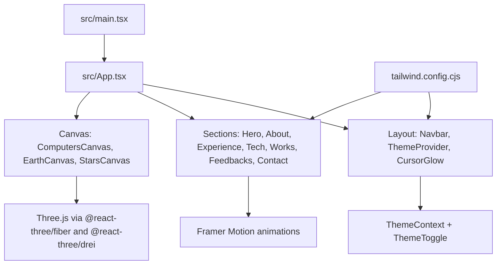
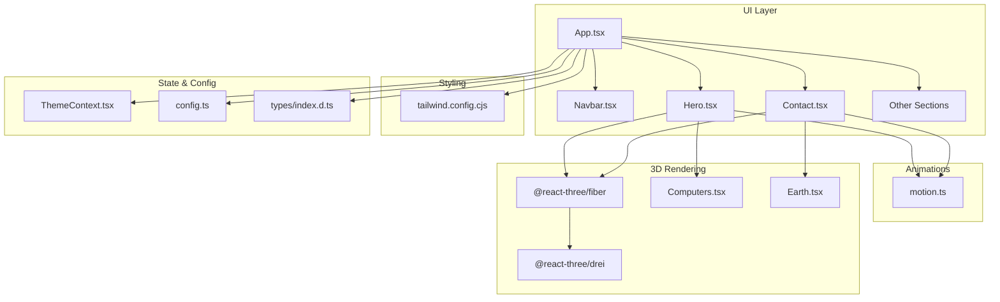
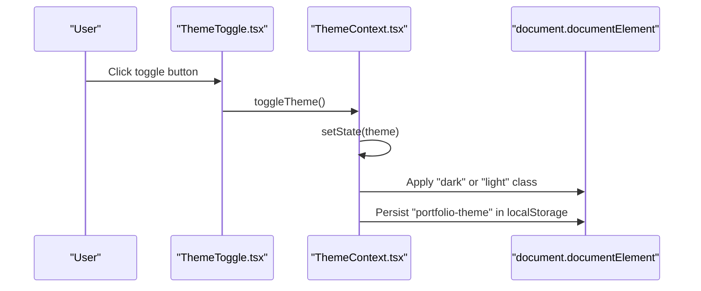
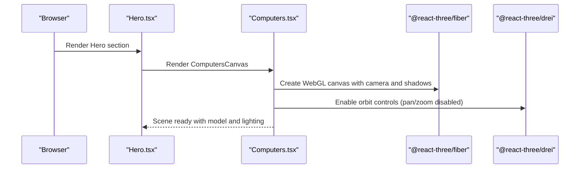
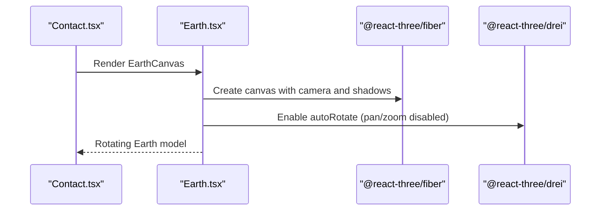
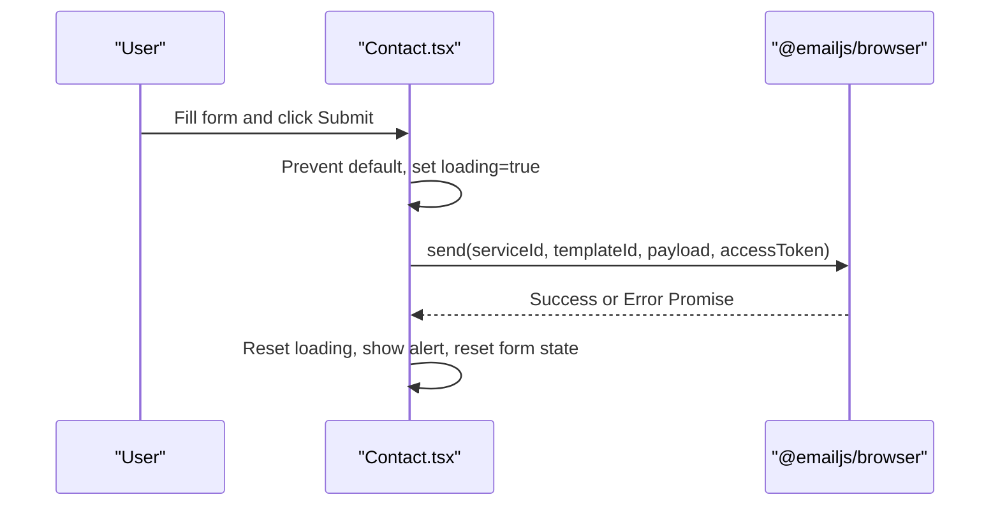
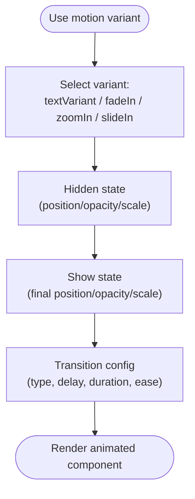
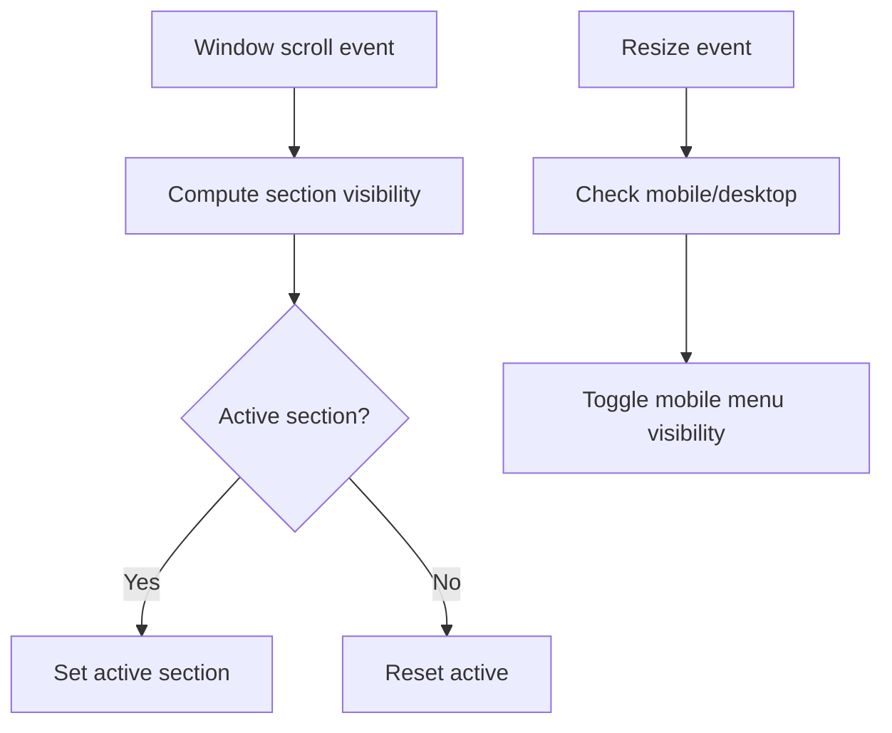
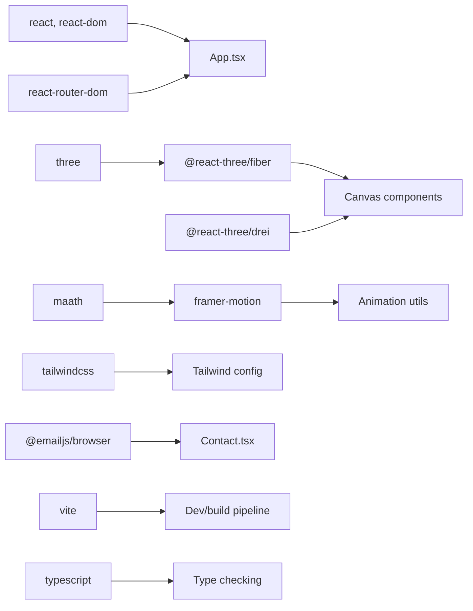

# Project Overview

<cite>
**Referenced Files in This Document**
- [README.md](file://README.md)
- [package.json](file://package.json)
- [src/App.tsx](file://src/App.tsx)
- [src/main.tsx](file://src/main.tsx)
- [tailwind.config.cjs](file://tailwind.config.cjs)
- [src/components/canvas/Computers.tsx](file://src/components/canvas/Computers.tsx)
- [src/components/canvas/Earth.tsx](file://src/components/canvas/Earth.tsx)
- [src/context/ThemeContext.tsx](file://src/context/ThemeContext.tsx)
- [src/components/layout/ThemeToggle.tsx](file://src/components/layout/ThemeToggle.tsx)
- [src/utils/motion.ts](file://src/utils/motion.ts)
- [src/components/sections/Hero.tsx](file://src/components/sections/Hero.tsx)
- [src/components/sections/Contact.tsx](file://src/components/sections/Contact.tsx)
- [src/components/layout/Navbar.tsx](file://src/components/layout/Navbar.tsx)
- [src/constants/config.ts](file://src/constants/config.ts)
- [src/types/index.d.ts](file://src/types/index.d.ts)
</cite>

## Table of Contents
1. [Introduction](#introduction)
2. [Project Structure](#project-structure)
3. [Core Components](#core-components)
4. [Architecture Overview](#architecture-overview)
5. [Detailed Component Analysis](#detailed-component-analysis)
6. [Dependency Analysis](#dependency-analysis)
7. [Performance Considerations](#performance-considerations)
8. [Troubleshooting Guide](#troubleshooting-guide)
9. [Conclusion](#conclusion)
10. [Appendices](#appendices)

## Introduction
This 3D Portfolio project is a modern, interactive showcase of cybersecurity expertise delivered through immersive web experiences. Built with contemporary web technologies, it combines 3D graphics, smooth animations, and a polished UI to create an engaging visitor journey. The portfolio highlights professional sections such as About, Experience, Tech, Works, Feedbacks, and Contact, all while maintaining a responsive design and a seamless dark/light theme toggle.

Key goals:
- Demonstrate cybersecurity knowledge via interactive 3D models and animations.
- Provide a fast, accessible, and visually appealing portfolio experience.
- Offer a functional contact mechanism powered by EmailJS.

Live demo and repository:
- Live Demo: https://reactjs18-3d-portfolio.vercel.app/
- GitHub Repository: https://github.com/ladunjexa/reactjs18-3d-portfolio

## Project Structure
The project follows a feature-based organization under src/, with clear separation of concerns:
- Entry points: src/main.tsx and src/App.tsx bootstrap the React application and define routing and global layout.
- Components: organized into atoms, layout, sections, and canvas for 3D scenes.
- Utilities: motion helpers for animations and constants for configuration.
- Styling: Tailwind CSS configured for responsive design and dark mode support.

**Diagram sources**
- [src/main.tsx:1-12](file://src/main.tsx#L1-L12)
- [src/App.tsx:1-51](file://src/App.tsx#L1-L51)
- [tailwind.config.cjs:1-29](file://tailwind.config.cjs#L1-L29)

**Section sources**
- [README.md:32-111](file://README.md#L32-L111)
- [src/main.tsx:1-12](file://src/main.tsx#L1-L12)
- [src/App.tsx:1-51](file://src/App.tsx#L1-L51)
- [tailwind.config.cjs:1-29](file://tailwind.config.cjs#L1-L29)

## Core Components
- Theme system: ThemeProvider manages dark/light mode persisted in localStorage and applies class-based toggling for Tailwind.
- Navigation: Navbar handles scroll highlighting and responsive mobile menu.
- Hero section: Presents personal branding with animated elements and integrates the 3D desktop model.
- Contact section: Implements a form with EmailJS integration and responsive layout.
- 3D canvases: ComputersCanvas and EarthCanvas render immersive 3D scenes with lighting, controls, and preloading.
- Animations: Framer Motion utilities provide reusable variants for text, fade-in, zoom, and slide effects.

Practical examples of capabilities:
- Interactive 3D computer model with orbit controls and responsive scaling.
- Auto-rotating Earth with controlled camera and shadows.
- Smooth entrance animations for text and section content.
- Dark/light theme toggle with persistent preference.
- Fully responsive navigation with scroll-aware highlighting.
- Contact form submission using EmailJS with loading states and alerts.

**Section sources**
- [src/context/ThemeContext.tsx:1-45](file://src/context/ThemeContext.tsx#L1-L45)
- [src/components/layout/ThemeToggle.tsx:1-63](file://src/components/layout/ThemeToggle.tsx#L1-L63)
- [src/components/layout/Navbar.tsx:1-126](file://src/components/layout/Navbar.tsx#L1-L126)
- [src/components/sections/Hero.tsx:1-53](file://src/components/sections/Hero.tsx#L1-L53)
- [src/components/sections/Contact.tsx:1-124](file://src/components/sections/Contact.tsx#L1-L124)
- [src/components/canvas/Computers.tsx:1-85](file://src/components/canvas/Computers.tsx#L1-L85)
- [src/components/canvas/Earth.tsx:1-46](file://src/components/canvas/Earth.tsx#L1-L46)
- [src/utils/motion.ts:1-92](file://src/utils/motion.ts#L1-L92)

## Architecture Overview
The architecture blends React UI composition with Three.js-powered 3D rendering and Framer Motion for animations. Tailwind CSS ensures responsive design and theming. The ThemeProvider wraps the app to centralize theme state and persistence. Routing is handled by react-router-dom, and EmailJS powers the contact form.

**Diagram sources**
- [src/App.tsx:1-51](file://src/App.tsx#L1-L51)
- [src/components/layout/Navbar.tsx:1-126](file://src/components/layout/Navbar.tsx#L1-L126)
- [src/components/sections/Hero.tsx:1-53](file://src/components/sections/Hero.tsx#L1-L53)
- [src/components/sections/Contact.tsx:1-124](file://src/components/sections/Contact.tsx#L1-L124)
- [src/components/canvas/Computers.tsx:1-85](file://src/components/canvas/Computers.tsx#L1-L85)
- [src/components/canvas/Earth.tsx:1-46](file://src/components/canvas/Earth.tsx#L1-L46)
- [src/utils/motion.ts:1-92](file://src/utils/motion.ts#L1-L92)
- [tailwind.config.cjs:1-29](file://tailwind.config.cjs#L1-L29)
- [src/context/ThemeContext.tsx:1-45](file://src/context/ThemeContext.tsx#L1-L45)
- [src/constants/config.ts:1-87](file://src/constants/config.ts#L1-L87)
- [src/types/index.d.ts:1-45](file://src/types/index.d.ts#L1-L45)

## Detailed Component Analysis

### Theme System
The theme system provides a centralized provider that reads and writes the user’s preferred theme to localStorage and applies a class to the root element for Tailwind to switch styles.

**Diagram sources**
- [src/components/layout/ThemeToggle.tsx:1-63](file://src/components/layout/ThemeToggle.tsx#L1-L63)
- [src/context/ThemeContext.tsx:1-45](file://src/context/ThemeContext.tsx#L1-L45)

**Section sources**
- [src/context/ThemeContext.tsx:1-45](file://src/context/ThemeContext.tsx#L1-L45)
- [src/components/layout/ThemeToggle.tsx:1-63](file://src/components/layout/ThemeToggle.tsx#L1-L63)
- [tailwind.config.cjs:1-29](file://tailwind.config.cjs#L1-L29)

### Hero Section and 3D Desktop Model
The Hero section displays a welcoming headline and tagline, integrates the 3D desktop model via ComputersCanvas, and includes a subtle animated scroll indicator.

**Diagram sources**
- [src/components/sections/Hero.tsx:1-53](file://src/components/sections/Hero.tsx#L1-L53)
- [src/components/canvas/Computers.tsx:1-85](file://src/components/canvas/Computers.tsx#L1-L85)

**Section sources**
- [src/components/sections/Hero.tsx:1-53](file://src/components/sections/Hero.tsx#L1-L53)
- [src/components/canvas/Computers.tsx:1-85](file://src/components/canvas/Computers.tsx#L1-L85)

### Earth 3D Model in Contact Section
The Contact section embeds an animated rotating Earth rendered in a responsive canvas with auto-rotation and controlled camera.

**Diagram sources**
- [src/components/sections/Contact.tsx:1-124](file://src/components/sections/Contact.tsx#L1-L124)
- [src/components/canvas/Earth.tsx:1-46](file://src/components/canvas/Earth.tsx#L1-L46)

**Section sources**
- [src/components/sections/Contact.tsx:1-124](file://src/components/sections/Contact.tsx#L1-L124)
- [src/components/canvas/Earth.tsx:1-46](file://src/components/canvas/Earth.tsx#L1-L46)

### Contact Form and EmailJS Integration
The Contact section implements a form bound to configuration-driven inputs, validates submission, and sends emails via EmailJS using environment variables.

**Diagram sources**
- [src/components/sections/Contact.tsx:1-124](file://src/components/sections/Contact.tsx#L1-L124)

**Section sources**
- [src/components/sections/Contact.tsx:1-124](file://src/components/sections/Contact.tsx#L1-L124)
- [README.md:230-247](file://README.md#L230-L247)

### Animation Utilities with Framer Motion
Reusable animation variants encapsulate common entrance patterns for text, fade-in, zoom, and sliding transitions.

**Diagram sources**
- [src/utils/motion.ts:1-92](file://src/utils/motion.ts#L1-L92)

**Section sources**
- [src/utils/motion.ts:1-92](file://src/utils/motion.ts#L1-L92)
- [src/components/sections/Hero.tsx:1-53](file://src/components/sections/Hero.tsx#L1-L53)
- [src/components/sections/Contact.tsx:1-124](file://src/components/sections/Contact.tsx#L1-L124)

### Responsive Design and Navigation
The Navbar adapts across breakpoints, highlights the active section based on scroll position, and integrates the theme toggle. Tailwind CSS extends spacing, colors, and responsive screens.

**Diagram sources**
- [src/components/layout/Navbar.tsx:1-126](file://src/components/layout/Navbar.tsx#L1-L126)
- [tailwind.config.cjs:1-29](file://tailwind.config.cjs#L1-L29)

**Section sources**
- [src/components/layout/Navbar.tsx:1-126](file://src/components/layout/Navbar.tsx#L1-L126)
- [tailwind.config.cjs:1-29](file://tailwind.config.cjs#L1-L29)

## Dependency Analysis
The project relies on a focused set of libraries:
- React and ecosystem: react, react-dom, react-router-dom.
- 3D rendering: three, @react-three/fiber, @react-three/drei.
- Animations: framer-motion, maath.
- Styling: tailwindcss, autoprefixer, postcss.
- Tooling and quality: vite, typescript, eslint, prettier.
- Email delivery: @emailjs/browser.
- Additional UI helpers: react-vertical-timeline-component, react-parallax-tilt.

**Diagram sources**
- [package.json:13-43](file://package.json#L13-L43)
- [src/App.tsx:1-51](file://src/App.tsx#L1-L51)
- [src/components/sections/Contact.tsx:1-124](file://src/components/sections/Contact.tsx#L1-L124)
- [tailwind.config.cjs:1-29](file://tailwind.config.cjs#L1-L29)

**Section sources**
- [package.json:13-43](file://package.json#L13-L43)

## Performance Considerations
- 3D rendering optimization:
  - Demand frame loop and shadow configuration are tuned for performance-sensitive scenes.
  - Preloading assets reduces runtime stalls.
  - Mobile-specific adjustments (scaling and conditional rendering) improve responsiveness.
- Animations:
  - Spring and tween variants balance fluidity and cost.
  - Controlled easing and durations prevent heavy computations during rapid transitions.
- Styling:
  - JIT compilation and scoped content paths minimize CSS bundle size.
  - Utility-first approach avoids unnecessary abstractions.
- Build and tooling:
  - Vite provides fast dev server and optimized production builds.
  - Type checking and linting catch regressions early.

[No sources needed since this section provides general guidance]

## Troubleshooting Guide
- Theme toggle not persisting:
  - Verify localStorage availability and absence of content security policy restrictions.
  - Confirm the root class updates on theme change.
- 3D canvas not rendering:
  - Ensure GLTF assets are served and paths match the public folder structure.
  - Check for WebGL support and console errors related to shader compilation.
- Contact form not sending:
  - Validate EmailJS environment variables are present and correct.
  - Inspect network tab for failed requests and console logs for thrown errors.
- Responsive layout issues:
  - Review Tailwind breakpoints and ensure content paths align with the configured content globs.
  - Confirm media queries and mobile menu logic in Navbar.

**Section sources**
- [src/context/ThemeContext.tsx:17-37](file://src/context/ThemeContext.tsx#L17-L37)
- [src/components/canvas/Computers.tsx:32-82](file://src/components/canvas/Computers.tsx#L32-L82)
- [src/components/sections/Contact.tsx:15-66](file://src/components/sections/Contact.tsx#L15-L66)
- [tailwind.config.cjs:3](file://tailwind.config.cjs#L3)

## Conclusion
This 3D Portfolio demonstrates a cohesive blend of modern web technologies to deliver an immersive, responsive, and accessible portfolio. The integration of Three.js for 3D scenes, Framer Motion for animations, and Tailwind CSS for styling creates a polished user experience. The theme system and contact form further elevate usability and professionalism, aligning with the goal of showcasing cybersecurity expertise through cutting-edge web practices.

[No sources needed since this section summarizes without analyzing specific files]

## Appendices

### Technology Stack Summary
- Frontend framework: React.js
- 3D graphics: Three.js with @react-three/fiber and @react-three/drei
- Animations: Framer Motion and maath
- Styling: Tailwind CSS
- Routing: react-router-dom
- Build tooling: Vite
- Type checking: TypeScript
- Quality: ESLint and Prettier
- Email delivery: EmailJS

**Section sources**
- [README.md:138-163](file://README.md#L138-L163)
- [package.json:13-43](file://package.json#L13-L43)

### Live Demo and Repository
- Live Demo: https://reactjs18-3d-portfolio.vercel.app/
- GitHub Repository: https://github.com/ladunjexa/reactjs18-3d-portfolio

**Section sources**
- [README.md:22-25](file://README.md#L22-L25)