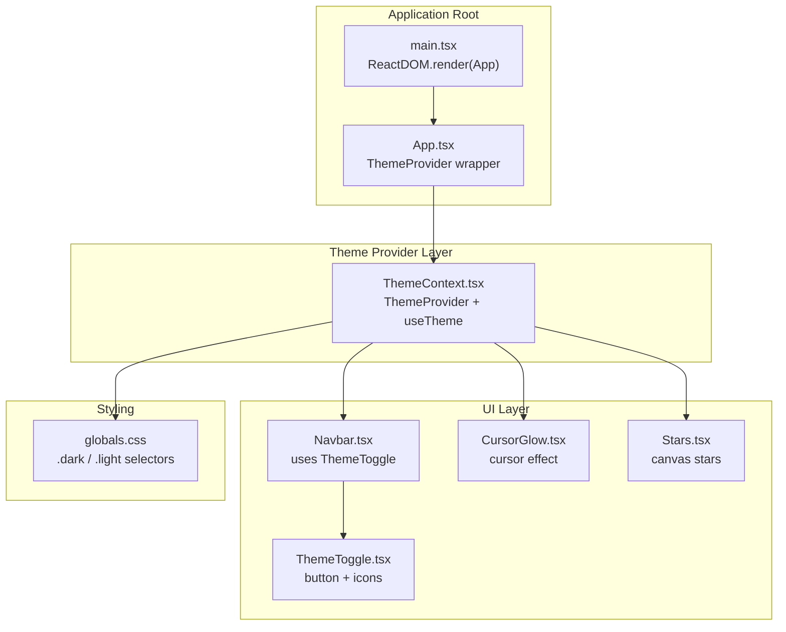
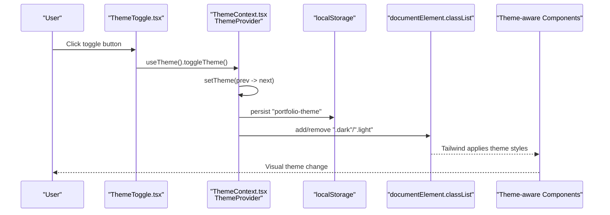
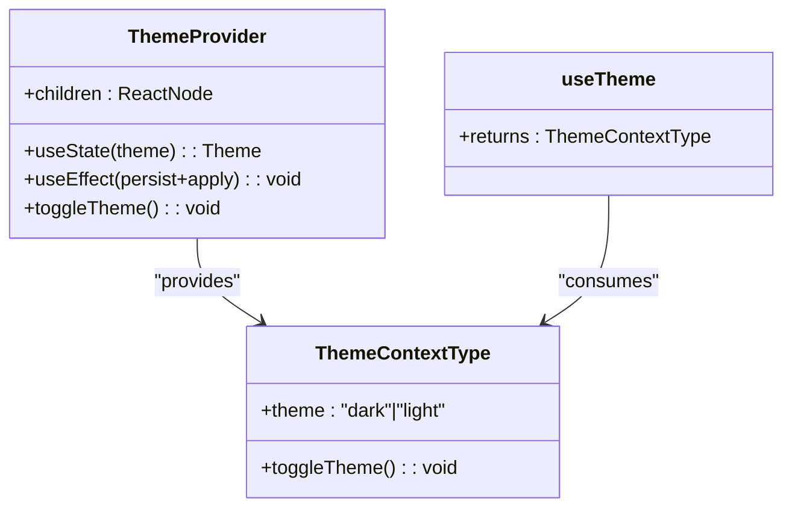
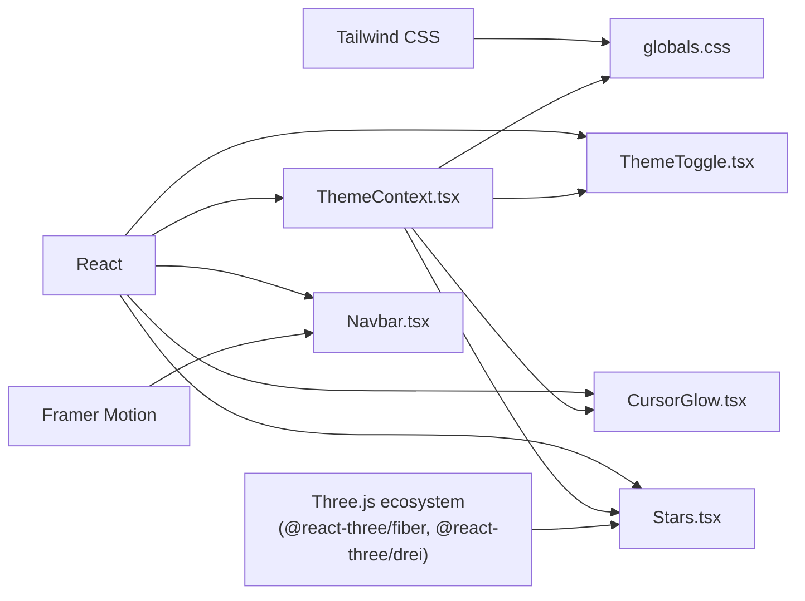

# State Management

<cite>
**Referenced Files in This Document**
- [ThemeContext.tsx](file://src/context/ThemeContext.tsx)
- [App.tsx](file://src/App.tsx)
- [main.tsx](file://src/main.tsx)
- [ThemeToggle.tsx](file://src/components/layout/ThemeToggle.tsx)
- [Navbar.tsx](file://src/components/layout/Navbar.tsx)
- [CursorGlow.tsx](file://src/components/layout/CursorGlow.tsx)
- [Stars.tsx](file://src/components/canvas/Stars.tsx)
- [globals.css](file://src/globals.css)
- [motion.ts](file://src/utils/motion.ts)
- [package.json](file://package.json)
</cite>

## Table of Contents
1. [Introduction](#introduction)
2. [Project Structure](#project-structure)
3. [Core Components](#core-components)
4. [Architecture Overview](#architecture-overview)
5. [Detailed Component Analysis](#detailed-component-analysis)
6. [Dependency Analysis](#dependency-analysis)
7. [Performance Considerations](#performance-considerations)
8. [Troubleshooting Guide](#troubleshooting-guide)
9. [Conclusion](#conclusion)
10. [Appendices](#appendices)

## Introduction
This document explains the state management system for the 3D Portfolio application with a focus on the ThemeContext implementation. It covers theme state management, provider composition, state persistence using localStorage, Context API usage patterns, state flow through the component hierarchy, state update mechanisms, subscription patterns, performance optimizations, integration with theme-aware components and animations, and guidance for extending the context system. Hydration and server-side rendering considerations are addressed where applicable.

## Project Structure
The theme system is centered around a single-purpose React Context that manages theme state and exposes a toggle function. The provider wraps the application, enabling any component to subscribe to theme changes. Theme-aware components consume the context to adjust visuals and behavior accordingly.

**Diagram sources**
- [main.tsx:7-11](file://src/main.tsx#L7-L11)
- [App.tsx:26-47](file://src/App.tsx#L26-L47)
- [ThemeContext.tsx:17-44](file://src/context/ThemeContext.tsx#L17-L44)
- [ThemeToggle.tsx:1-63](file://src/components/layout/ThemeToggle.tsx#L1-L63)
- [Navbar.tsx:7-87](file://src/components/layout/Navbar.tsx#L7-L87)
- [CursorGlow.tsx:1-78](file://src/components/layout/CursorGlow.tsx#L1-L78)
- [Stars.tsx:1-51](file://src/components/canvas/Stars.tsx#L1-L51)
- [globals.css:15-178](file://src/globals.css#L15-L178)

**Section sources**
- [main.tsx:7-11](file://src/main.tsx#L7-L11)
- [App.tsx:26-47](file://src/App.tsx#L26-L47)
- [ThemeContext.tsx:17-44](file://src/context/ThemeContext.tsx#L17-L44)

## Core Components
- ThemeContext.tsx: Defines the theme type, context interface, default context value, custom hook useTheme, and the ThemeProvider. The provider initializes theme from localStorage, persists updates to localStorage, and applies CSS classes to the root element for Tailwind dark/light variants.
- ThemeToggle.tsx: A small interactive button that reads the current theme and toggles it via the context hook.
- Navbar.tsx: Integrates ThemeToggle into the navigation bar and handles scroll effects.
- CursorGlow.tsx: Consumes theme to compute a dynamic radial gradient for a custom animated cursor effect.
- Stars.tsx: Uses theme to select star colors in a 3D canvas scene.
- globals.css: Provides .dark and .light class-based overrides for colors, backgrounds, gradients, and other UI tokens.

Key responsibilities:
- Centralized theme state management and persistence
- Context-based subscription for components
- CSS-driven theme application via root class toggling
- Animation and visual customization based on theme

**Section sources**
- [ThemeContext.tsx:1-45](file://src/context/ThemeContext.tsx#L1-L45)
- [ThemeToggle.tsx:1-63](file://src/components/layout/ThemeToggle.tsx#L1-L63)
- [Navbar.tsx:1-126](file://src/components/layout/Navbar.tsx#L1-L126)
- [CursorGlow.tsx:1-78](file://src/components/layout/CursorGlow.tsx#L1-L78)
- [Stars.tsx:1-51](file://src/components/canvas/Stars.tsx#L1-L51)
- [globals.css:15-178](file://src/globals.css#L15-L178)

## Architecture Overview
The theme system follows a classic React Context pattern:
- A Context is created with a default value
- A Provider component holds state and exposes it to descendants
- Consumers use a custom hook to subscribe to context changes
- Side effects persist state and apply UI changes

**Diagram sources**
- [ThemeToggle.tsx:4-5](file://src/components/layout/ThemeToggle.tsx#L4-L5)
- [ThemeContext.tsx:35-37](file://src/context/ThemeContext.tsx#L35-L37)
- [ThemeContext.tsx:23-33](file://src/context/ThemeContext.tsx#L23-L33)
- [globals.css:15-23](file://src/globals.css#L15-L23)

## Detailed Component Analysis

### ThemeContext.tsx
Implementation highlights:
- Type and interface definitions for theme state and context contract
- Default context value to prevent errors when not wrapped
- Provider initialization from localStorage with safe defaults
- Side effect to persist theme and toggle root CSS classes
- Toggle function that flips between "dark" and "light"
- Export of useTheme hook for consumer components

**Diagram sources**
- [ThemeContext.tsx:3-8](file://src/context/ThemeContext.tsx#L3-L8)
- [ThemeContext.tsx:17-44](file://src/context/ThemeContext.tsx#L17-L44)
- [ThemeContext.tsx:15](file://src/context/ThemeContext.tsx#L15)

State lifecycle:
- Initialization: Reads "portfolio-theme" from localStorage; falls back to "dark" if invalid
- Persistence: Writes theme to localStorage on every change
- Application: Adds/removes ".dark"/".light" on document.documentElement to drive Tailwind variants

Subscription pattern:
- Components call useTheme() to receive the current theme and toggle function
- Updates trigger re-renders only for subscribed components

**Section sources**
- [ThemeContext.tsx:17-44](file://src/context/ThemeContext.tsx#L17-L44)

### ThemeToggle.tsx
Behavior:
- Uses useTheme() to read current theme and toggle function
- Renders sun/moon icons conditionally based on theme
- Applies transitions and hover scaling for UX polish
- Uses aria-label to communicate current mode

Integration:
- Placed inside Navbar for global access
- Triggers ThemeProvider.toggleTheme() on click

**Section sources**
- [ThemeToggle.tsx:1-63](file://src/components/layout/ThemeToggle.tsx#L1-L63)
- [Navbar.tsx:86-90](file://src/components/layout/Navbar.tsx#L86-L90)

### Navbar.tsx
Role:
- Manages local UI state (active section, mobile menu, scroll effects)
- Integrates ThemeToggle for theme switching
- Applies background transitions based on scroll position

Relevance to theme:
- ThemeToggle is rendered alongside other navigation elements
- Theme-aware styling is handled by CSS classes applied at root level

**Section sources**
- [Navbar.tsx:1-126](file://src/components/layout/Navbar.tsx#L1-L126)

### CursorGlow.tsx
Role:
- Implements a custom animated cursor glow
- Consumes theme to compute gradient intensity and color
- Uses requestAnimationFrame for smooth animation

Theme integration:
- Gradient values differ by theme to match visual palette
- No direct DOM class manipulation; relies on theme-aware CSS elsewhere

**Section sources**
- [CursorGlow.tsx:1-78](file://src/components/layout/CursorGlow.tsx#L1-L78)

### Stars.tsx
Role:
- Renders a starfield in a 3D canvas scene
- Consumes theme to select star color

Theme integration:
- Uses theme to pick star color (different per theme)
- Part of the immersive 3D experience

**Section sources**
- [Stars.tsx:1-51](file://src/components/canvas/Stars.tsx#L1-L51)

### globals.css
Role:
- Defines .dark and .light classes
- Provides theme-specific overrides for backgrounds, text, gradients, inputs, buttons, and other UI elements
- Includes theme-specific animations and loaders

Theme application:
- ThemeContext.tsx toggles .dark/.light on document.documentElement
- Tailwind utilities and custom classes react to these classes

**Section sources**
- [globals.css:15-178](file://src/globals.css#L15-L178)

### motion.ts
Role:
- Provides reusable Framer Motion variants for animations
- Not directly tied to theme but commonly used in theme-aware sections

**Section sources**
- [motion.ts:1-92](file://src/utils/motion.ts#L1-L92)

## Dependency Analysis
External libraries and their roles:
- React: Core hooks (useState, useEffect, createContext, useContext)
- Tailwind CSS: Utility classes and dark/light variant support via .dark/.light
- @react-three/fiber and @react-three/drei: 3D canvas rendering (used by Stars.tsx)
- framer-motion: Animation primitives (used by various sections)

**Diagram sources**
- [package.json:13-24](file://package.json#L13-L24)
- [ThemeContext.tsx:1](file://src/context/ThemeContext.tsx#L1)
- [ThemeToggle.tsx:1](file://src/components/layout/ThemeToggle.tsx#L1)
- [Navbar.tsx:1](file://src/components/layout/Navbar.tsx#L1)
- [CursorGlow.tsx:1](file://src/components/layout/CursorGlow.tsx#L1)
- [Stars.tsx:1](file://src/components/canvas/Stars.tsx#L1)
- [globals.css:15-178](file://src/globals.css#L15-L178)

**Section sources**
- [package.json:13-24](file://package.json#L13-L24)

## Performance Considerations
- Context granularity: ThemeContext.tsx is minimal and focused, reducing unnecessary re-renders for unrelated state
- Local storage persistence: Efficient and synchronous; ensures instant theme restoration on reload
- Root class toggling: Tailwind variant application is fast and avoids deep prop drilling
- Consumer selection: Only components that call useTheme() subscribe; others remain unaffected
- Animation efficiency: CursorGlow.tsx uses requestAnimationFrame and lightweight transforms; Star colors are computed once per theme change
- CSS overrides: globals.css defines targeted overrides; no heavy JS computations are required

Potential improvements:
- Memoization: If theme-aware components grow, consider memoizing derived values
- Debounced persistence: For frequent toggling, debouncing localStorage writes could reduce I/O
- CSS-in-JS alternatives: If needed, styled-components or Emotion could centralize theme logic, but Tailwind’s approach is simpler here

[No sources needed since this section provides general guidance]

## Troubleshooting Guide
Common issues and resolutions:
- Theme does not persist across reloads
  - Verify localStorage key "portfolio-theme" contains "dark" or "light"
  - Ensure ThemeProvider is wrapping the app root
  - Confirm useEffect runs and writes to localStorage

- Theme toggle has no effect
  - Check that ThemeToggle calls useTheme().toggleTheme()
  - Confirm ThemeProvider is present and not shadowed by another provider

- Visual mismatch after theme change
  - Ensure document.documentElement has either ".dark" or ".light"
  - Verify globals.css contains the expected .dark/.light overrides

- Cursor glow not visible
  - Confirm useTheme() is called in CursorGlow.tsx
  - Check that the gradient computation depends on theme

- Star colors not changing
  - Ensure Stars.tsx consumes theme and applies it to PointMaterial color

Hydration and SSR considerations:
- The current implementation reads localStorage during client initialization and sets root classes synchronously
- If server-rendering were introduced, ensure the server renders the same initial theme class on the HTML root element to avoid FOUC
- Alternatively, defer theme application until after hydration to prevent mismatches

**Section sources**
- [ThemeContext.tsx:17-44](file://src/context/ThemeContext.tsx#L17-L44)
- [ThemeToggle.tsx:4-5](file://src/components/layout/ThemeToggle.tsx#L4-L5)
- [globals.css:15-23](file://src/globals.css#L15-L23)
- [CursorGlow.tsx:11](file://src/components/layout/CursorGlow.tsx#L11)
- [Stars.tsx:10](file://src/components/canvas/Stars.tsx#L10)

## Conclusion
The ThemeContext implementation provides a clean, efficient, and extensible foundation for theme management. It leverages React Context for subscription, localStorage for persistence, and Tailwind’s dark/light variants for styling. Theme-aware components integrate seamlessly, and the system scales to additional state needs with minimal overhead. The approach balances simplicity with performance and offers clear extension points for future enhancements.

[No sources needed since this section summarizes without analyzing specific files]

## Appendices

### Extending the Context System
To add new state fields while preserving the existing theme system:
- Define a new interface combining existing and new state
- Create a new context and provider for the additional state
- Wrap the existing ThemeProvider with the new provider
- Export a custom hook for consumers
- Use the combined context in components that need both theme and new state

Benefits:
- Keeps concerns separated
- Maintains backward compatibility
- Allows incremental adoption

[No sources needed since this section provides general guidance]

### Hydration and SSR Notes
- Current client-only hydration: Theme is initialized after mount and applied immediately
- For SSR: Render the initial theme class on the server HTML root to avoid flash-of-unstyled-content
- If using a framework with SSR, ensure the server and client agree on the initial theme

[No sources needed since this section provides general guidance]