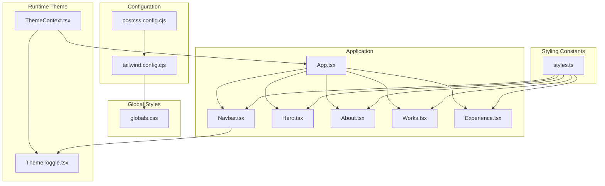
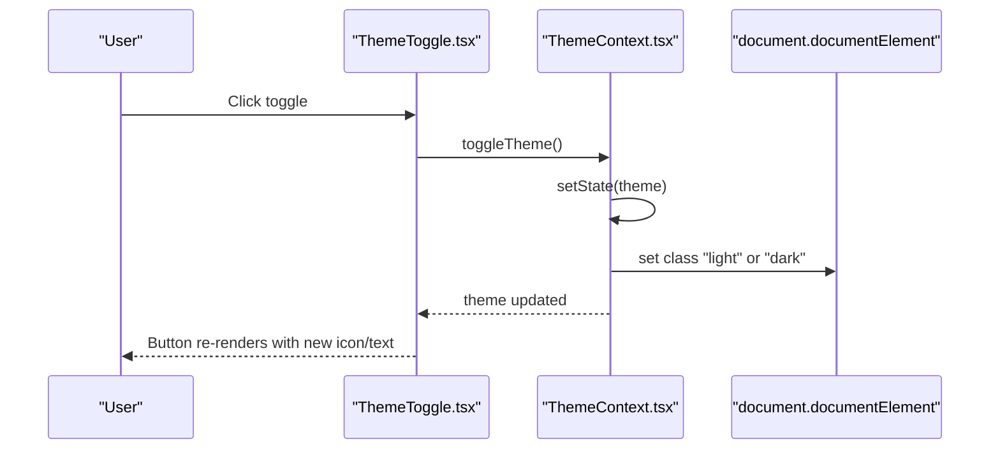
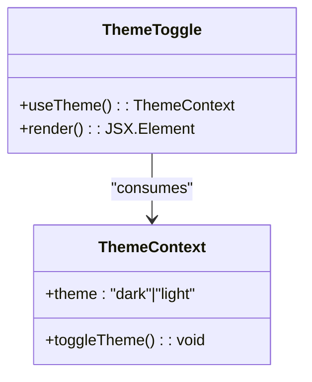
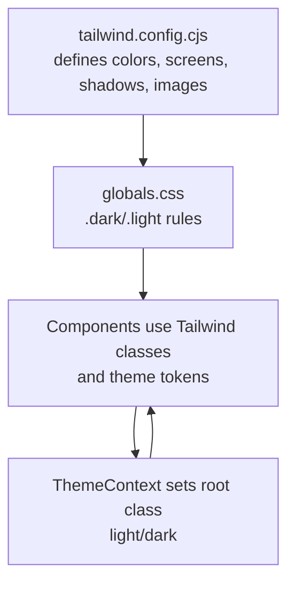
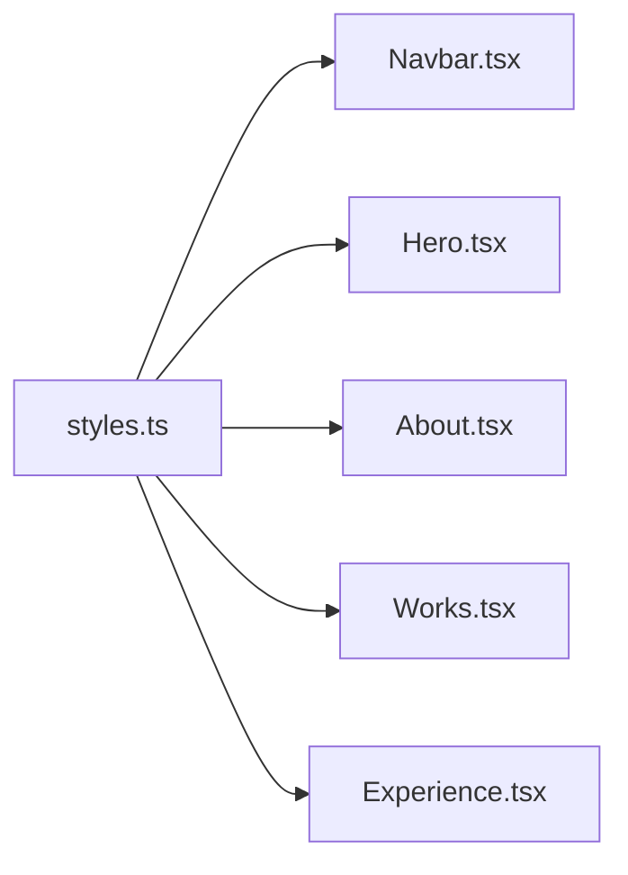
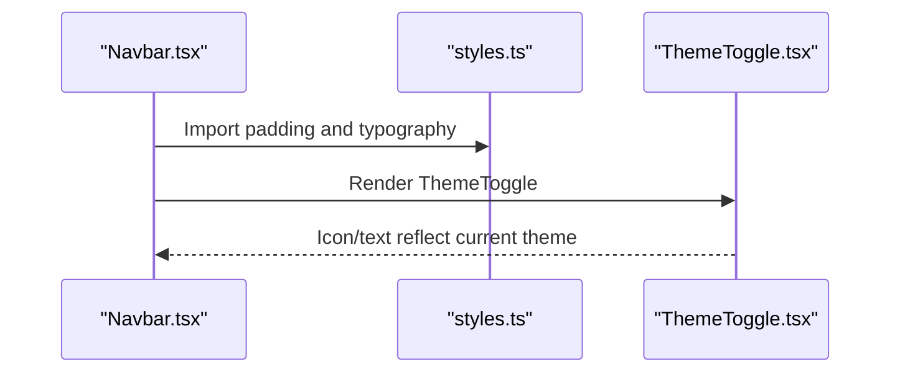
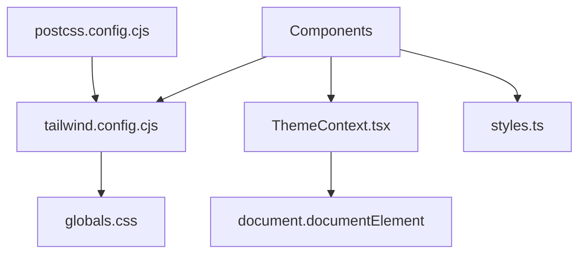

# Theme and Styling

<cite>
**Referenced Files in This Document**
- [ThemeContext.tsx](file://src/context/ThemeContext.tsx)
- [ThemeToggle.tsx](file://src/components/layout/ThemeToggle.tsx)
- [styles.ts](file://src/constants/styles.ts)
- [tailwind.config.cjs](file://tailwind.config.cjs)
- [postcss.config.cjs](file://postcss.config.cjs)
- [globals.css](file://src/globals.css)
- [App.tsx](file://src/App.tsx)
- [Navbar.tsx](file://src/components/layout/Navbar.tsx)
- [Hero.tsx](file://src/components/sections/Hero.tsx)
- [About.tsx](file://src/components/sections/About.tsx)
- [Works.tsx](file://src/components/sections/Works.tsx)
- [Experience.tsx](file://src/components/sections/Experience.tsx)
- [config.ts](file://src/constants/config.ts)
- [index.ts](file://src/constants/index.ts)
- [package.json](file://package.json)
</cite>

## Table of Contents
1. [Introduction](#introduction)
2. [Project Structure](#project-structure)
3. [Core Components](#core-components)
4. [Architecture Overview](#architecture-overview)
5. [Detailed Component Analysis](#detailed-component-analysis)
6. [Dependency Analysis](#dependency-analysis)
7. [Performance Considerations](#performance-considerations)
8. [Troubleshooting Guide](#troubleshooting-guide)
9. [Conclusion](#conclusion)
10. [Appendices](#appendices)

## Introduction
This document explains the theme and styling system of the 3D Portfolio application. It covers Tailwind CSS configuration (including dark mode via the class strategy, custom color tokens, and responsive breakpoints), the global theme provider and toggle implementation, styling constants, and how Tailwind utilities integrate with component-level styles. It also provides customization guides for colors, typography, spacing, and responsive behavior, along with persistence using localStorage and cross-browser compatibility considerations.

## Project Structure
The styling system spans configuration, global CSS, a React context provider, and components that consume Tailwind utilities and shared constants.

**Diagram sources**
- [tailwind.config.cjs:1-29](file://tailwind.config.cjs#L1-L29)
- [postcss.config.cjs:1-6](file://postcss.config.cjs#L1-L6)
- [ThemeContext.tsx:1-45](file://src/context/ThemeContext.tsx#L1-L45)
- [ThemeToggle.tsx:1-63](file://src/components/layout/ThemeToggle.tsx#L1-L63)
- [styles.ts:1-16](file://src/constants/styles.ts#L1-L16)
- [globals.css:1-369](file://src/globals.css#L1-L369)
- [App.tsx:1-51](file://src/App.tsx#L1-L51)
- [Navbar.tsx:1-126](file://src/components/layout/Navbar.tsx#L1-L126)
- [Hero.tsx:1-53](file://src/components/sections/Hero.tsx#L1-L53)
- [About.tsx:1-68](file://src/components/sections/About.tsx#L1-L68)
- [Works.tsx:1-90](file://src/components/sections/Works.tsx#L1-L90)
- [Experience.tsx:1-83](file://src/components/sections/Experience.tsx#L1-L83)

**Section sources**
- [tailwind.config.cjs:1-29](file://tailwind.config.cjs#L1-L29)
- [postcss.config.cjs:1-6](file://postcss.config.cjs#L1-L6)
- [globals.css:1-369](file://src/globals.css#L1-L369)
- [styles.ts:1-16](file://src/constants/styles.ts#L1-L16)
- [ThemeContext.tsx:1-45](file://src/context/ThemeContext.tsx#L1-L45)
- [ThemeToggle.tsx:1-63](file://src/components/layout/ThemeToggle.tsx#L1-L63)
- [App.tsx:1-51](file://src/App.tsx#L1-L51)
- [Navbar.tsx:1-126](file://src/components/layout/Navbar.tsx#L1-L126)
- [Hero.tsx:1-53](file://src/components/sections/Hero.tsx#L1-L53)
- [About.tsx:1-68](file://src/components/sections/About.tsx#L1-L68)
- [Works.tsx:1-90](file://src/components/sections/Works.tsx#L1-L90)
- [Experience.tsx:1-83](file://src/components/sections/Experience.tsx#L1-L83)

## Core Components
- Tailwind configuration defines custom colors, shadows, breakpoints, gradients, and background images. Dark mode is implemented via the class strategy.
- Global CSS sets base styles, resets, and theme-specific overrides for light and dark modes.
- ThemeContext manages the current theme and persists it to localStorage, applying a class to the root element.
- ThemeToggle renders a button that toggles the theme and reflects the current mode visually.
- styles.ts centralizes reusable spacing and typography utilities for consistent application across sections.
- Components compose Tailwind utilities, constants, and runtime theme state to render consistent visuals.

**Section sources**
- [tailwind.config.cjs:6-26](file://tailwind.config.cjs#L6-L26)
- [globals.css:15-178](file://src/globals.css#L15-L178)
- [ThemeContext.tsx:17-44](file://src/context/ThemeContext.tsx#L17-L44)
- [ThemeToggle.tsx:3-60](file://src/components/layout/ThemeToggle.tsx#L3-L60)
- [styles.ts:1-16](file://src/constants/styles.ts#L1-L16)

## Architecture Overview
The theme system follows a predictable flow: the provider initializes the theme from localStorage, updates the DOM class, and exposes a toggle function. Components read the current theme and apply Tailwind classes and constants. Global CSS ensures consistent light/dark overrides.

**Diagram sources**
- [ThemeToggle.tsx:3-60](file://src/components/layout/ThemeToggle.tsx#L3-L60)
- [ThemeContext.tsx:17-44](file://src/context/ThemeContext.tsx#L17-L44)

## Detailed Component Analysis

### ThemeContext and ThemeToggle
- ThemeContext
  - Initializes theme from localStorage with a sensible default.
  - Persists theme changes to localStorage.
  - Applies a class ("light" or "dark") to the root element to drive Tailwind’s dark mode.
  - Exposes a toggle function to flip between themes.
- ThemeToggle
  - Uses the theme context to determine current mode.
  - Renders sun/moon icons with transitions and applies background tokens.
  - Uses Tailwind utilities for sizing, spacing, transitions, and color tokens.

**Diagram sources**
- [ThemeContext.tsx:1-45](file://src/context/ThemeContext.tsx#L1-L45)
- [ThemeToggle.tsx:1-63](file://src/components/layout/ThemeToggle.tsx#L1-L63)

**Section sources**
- [ThemeContext.tsx:17-44](file://src/context/ThemeContext.tsx#L17-L44)
- [ThemeToggle.tsx:3-60](file://src/components/layout/ThemeToggle.tsx#L3-L60)

### Tailwind Configuration and Global Styles
- Tailwind configuration
  - Content scanning targets TypeScript/JSX sources.
  - JIT mode enabled.
  - Dark mode via class strategy.
  - Custom color palette (primary, secondary, tertiary, and shade variants).
  - Custom shadow and screen breakpoint (xs).
  - Background image token for hero pattern.
- Global CSS
  - Imports Poppins font and includes Tailwind base/components/utilities.
  - Defines .dark and .light classes and color-scheme hints.
  - Provides extensive light-mode overrides for backgrounds, text, gradients, forms, buttons, timelines, and UI elements.
  - Includes animations and scrollbar styles for both themes.

**Diagram sources**
- [tailwind.config.cjs:1-29](file://tailwind.config.cjs#L1-L29)
- [globals.css:15-178](file://src/globals.css#L15-L178)
- [ThemeContext.tsx:23-33](file://src/context/ThemeContext.tsx#L23-L33)

**Section sources**
- [tailwind.config.cjs:6-26](file://tailwind.config.cjs#L6-L26)
- [globals.css:15-178](file://src/globals.css#L15-L178)

### Styling Constants and Typography
- styles.ts
  - Defines paddingX, paddingY, padding, heroHeadText, heroSubText, sectionHeadText, sectionSubText.
  - Encapsulates responsive spacing and typography utilities for reuse across sections.
- Components
  - Navbar, Hero, About, Works, Experience consume these constants to maintain consistent spacing and typography.

**Diagram sources**
- [styles.ts:1-16](file://src/constants/styles.ts#L1-L16)
- [Navbar.tsx:53-57](file://src/components/layout/Navbar.tsx#L53-L57)
- [Hero.tsx:18-25](file://src/components/sections/Hero.tsx#L18-L25)
- [About.tsx:51-56](file://src/components/sections/About.tsx#L51-L56)
- [Works.tsx:71-77](file://src/components/sections/Works.tsx#L71-L77)
- [Experience.tsx:67-77](file://src/components/sections/Experience.tsx#L67-L77)

**Section sources**
- [styles.ts:1-16](file://src/constants/styles.ts#L1-L16)
- [Navbar.tsx:53-57](file://src/components/layout/Navbar.tsx#L53-L57)
- [Hero.tsx:18-25](file://src/components/sections/Hero.tsx#L18-L25)
- [About.tsx:51-56](file://src/components/sections/About.tsx#L51-L56)
- [Works.tsx:71-77](file://src/components/sections/Works.tsx#L71-L77)
- [Experience.tsx:67-77](file://src/components/sections/Experience.tsx#L67-L77)

### Component-Specific Styling Patterns
- Navbar
  - Uses styles.paddingX and conditional background classes based on scroll state.
  - Integrates ThemeToggle and navigation links with theme-aware text colors.
- Hero
  - Applies heroHeadText and heroSubText from styles.ts.
  - Uses custom gradient utilities and background tokens.
- About
  - Cards use green-pink gradient container and tertiary backgrounds.
  - Text colors and shadows rely on theme-aware tokens.
- Works
  - Project cards use gradient borders and tertiary backgrounds.
  - Tags leverage pre-defined gradient text utilities.
- Experience
  - Reads theme from context to compute inline styles for timeline elements and adjusts line color accordingly.

**Diagram sources**
- [Navbar.tsx:51-86](file://src/components/layout/Navbar.tsx#L51-L86)
- [styles.ts:1-16](file://src/constants/styles.ts#L1-L16)
- [ThemeToggle.tsx:3-60](file://src/components/layout/ThemeToggle.tsx#L3-L60)

**Section sources**
- [Navbar.tsx:51-122](file://src/components/layout/Navbar.tsx#L51-L122)
- [Hero.tsx:7-49](file://src/components/sections/Hero.tsx#L7-L49)
- [About.tsx:17-64](file://src/components/sections/About.tsx#L17-L64)
- [Works.tsx:12-84](file://src/components/sections/Works.tsx#L12-L84)
- [Experience.tsx:63-80](file://src/components/sections/Experience.tsx#L63-L80)

## Dependency Analysis
- Build pipeline
  - PostCSS compiles Tailwind and autoprefixes.
  - Tailwind scans TS/TSX sources for class usage.
- Runtime
  - ThemeContext depends on localStorage and DOM classes.
  - Components depend on Tailwind utilities and constants.
- Third-party integrations
  - react-vertical-timeline-component consumes theme to adjust colors and shadows.

**Diagram sources**
- [postcss.config.cjs:1-6](file://postcss.config.cjs#L1-L6)
- [tailwind.config.cjs:1-29](file://tailwind.config.cjs#L1-L29)
- [globals.css:1-369](file://src/globals.css#L1-L369)
- [ThemeContext.tsx:17-44](file://src/context/ThemeContext.tsx#L17-L44)
- [styles.ts:1-16](file://src/constants/styles.ts#L1-L16)

**Section sources**
- [postcss.config.cjs:1-6](file://postcss.config.cjs#L1-L6)
- [tailwind.config.cjs:1-29](file://tailwind.config.cjs#L1-L29)
- [globals.css:1-369](file://src/globals.css#L1-L369)
- [ThemeContext.tsx:17-44](file://src/context/ThemeContext.tsx#L17-L44)
- [styles.ts:1-16](file://src/constants/styles.ts#L1-L16)

## Performance Considerations
- Tailwind JIT compiles utilities on demand, minimizing CSS payload.
- Using a single source of truth for colors and typography reduces duplication and repaints.
- Theme switching is lightweight, relying on a root class and CSS overrides.

## Troubleshooting Guide
- Theme does not persist across reloads
  - Verify localStorage key and initialization logic in the provider.
  - Confirm the root class is applied on mount.
- Light mode colors look incorrect
  - Check .light overrides in global CSS for specific components (buttons, inputs, gradients).
- Icons appear inverted in light mode
  - Review light-mode image filters in global CSS.
- Timeline colors not adapting
  - Ensure components read the theme and compute inline styles accordingly.

**Section sources**
- [ThemeContext.tsx:18-33](file://src/context/ThemeContext.tsx#L18-L33)
- [globals.css:25-127](file://src/globals.css#L25-L127)
- [Experience.tsx:63-80](file://src/components/sections/Experience.tsx#L63-L80)

## Conclusion
The 3D Portfolio employs a clean, maintainable theme and styling system:
- Tailwind’s class-based dark mode with global CSS overrides provides consistent light/dark visuals.
- A React context manages theme state and persistence, while a dedicated toggle component offers user control.
- Centralized styling constants ensure uniform spacing and typography.
- Components compose utilities and constants to render cohesive layouts.

## Appendices

### Customization Guides

- Changing Color Schemes
  - Modify custom colors in Tailwind configuration to update tokens used across components.
  - Add or refine .light overrides in global CSS for targeted component adjustments.
  - Keep contrast ratios consistent for accessibility.

- Adjusting Typography
  - Update styles.ts typography utilities for headings/subtext.
  - Use Tailwind’s text utilities to fine-tune sizes and leading per breakpoint.

- Tweaking Spacing
  - Adjust styles.ts paddingX/paddingY/padding to change page-wide gutters.
  - Apply responsive spacing utilities consistently across components.

- Responsive Behavior
  - Extend xs breakpoint or add new ones in Tailwind configuration.
  - Use responsive modifiers in components to adapt layout and typography.

- Theme Persistence and Cross-Browser Compatibility
  - localStorage is used for persistence; ensure browser support is acceptable for your audience.
  - The class-based dark mode strategy is broadly supported; verify UA behavior if targeting legacy environments.

**Section sources**
- [tailwind.config.cjs:19-21](file://tailwind.config.cjs#L19-L21)
- [styles.ts:2-4](file://src/constants/styles.ts#L2-L4)
- [globals.css:15-178](file://src/globals.css#L15-L178)
- [ThemeContext.tsx:18-33](file://src/context/ThemeContext.tsx#L18-L33)