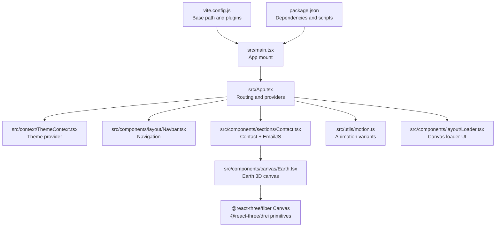
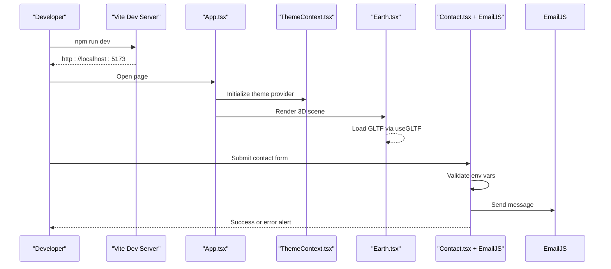
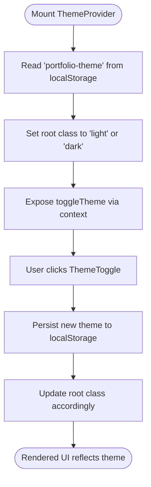
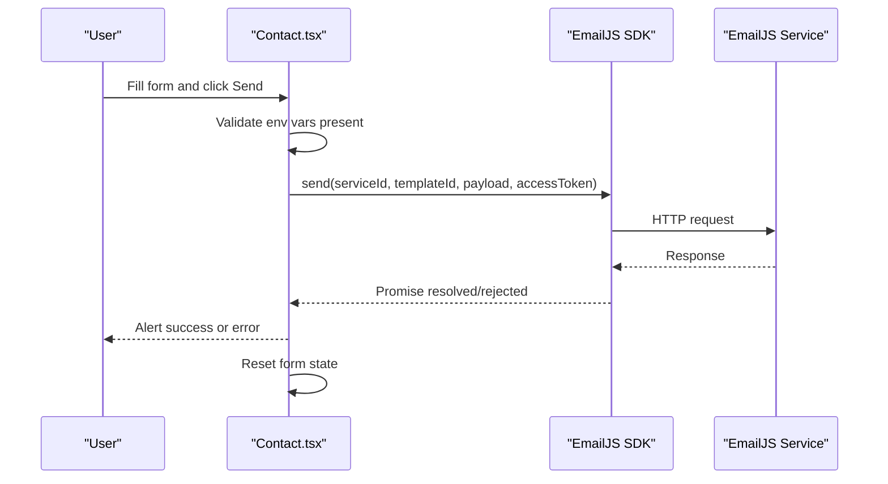
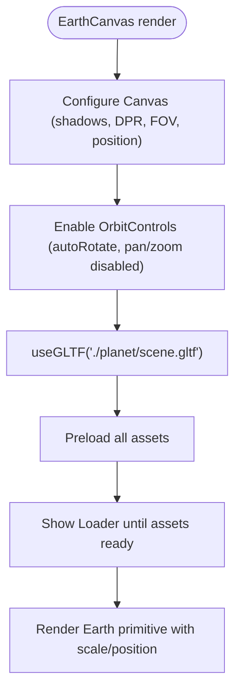
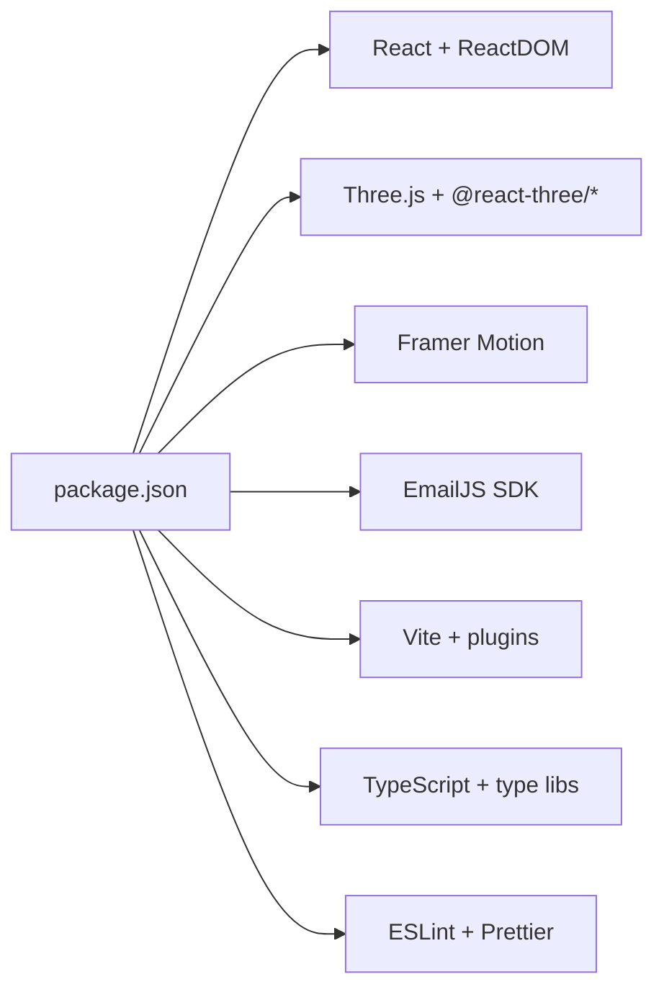

# Troubleshooting and FAQ

<cite>
**Referenced Files in This Document**
- [package.json](file://package.json)
- [README.md](file://README.md)
- [vite.config.js](file://vite.config.js)
- [src/main.tsx](file://src/main.tsx)
- [src/App.tsx](file://src/App.tsx)
- [src/components/canvas/index.ts](file://src/components/canvas/index.ts)
- [src/components/canvas/Earth.tsx](file://src/components/canvas/Earth.tsx)
- [src/components/sections/Contact.tsx](file://src/components/sections/Contact.tsx)
- [src/context/ThemeContext.tsx](file://src/context/ThemeContext.tsx)
- [src/components/layout/ThemeToggle.tsx](file://src/components/layout/ThemeToggle.tsx)
- [src/components/layout/Loader.tsx](file://src/components/layout/Loader.tsx)
- [src/utils/motion.ts](file://src/utils/motion.ts)
- [src/constants/config.ts](file://src/constants/config.ts)
- [src/types/index.d.ts](file://src/types/index.d.ts)
</cite>

## Table of Contents
1. [Introduction](#introduction)
2. [Project Structure](#project-structure)
3. [Core Components](#core-components)
4. [Architecture Overview](#architecture-overview)
5. [Detailed Component Analysis](#detailed-component-analysis)
6. [Dependency Analysis](#dependency-analysis)
7. [Performance Considerations](#performance-considerations)
8. [Troubleshooting Guide](#troubleshooting-guide)
9. [Conclusion](#conclusion)
10. [Appendices](#appendices)

## Introduction
This document provides a comprehensive troubleshooting guide and FAQ for the 3D Portfolio application. It focuses on diagnosing and resolving build errors, 3D rendering issues, animation glitches, deployment failures, EmailJS integration problems, theme switching inconsistencies, and asset-loading difficulties. It also includes debugging strategies, environment setup steps, and answers to frequently asked questions about customization, browser compatibility, and performance optimization.

## Project Structure
The application is a React + Three.js + Vite project with TypeScript. Key areas relevant to troubleshooting:
- Build and runtime: Vite configuration, environment variables, and entry points
- 3D rendering: Canvas components using @react-three/fiber and @react-three/drei
- Animations: Framer Motion variants and transitions
- Theming: Local storage-backed theme provider and toggle UI
- Forms: EmailJS integration in the Contact section
- Assets: GLTF/GLB models under public assets

**Diagram sources**
- [src/main.tsx:1-12](file://src/main.tsx#L1-L12)
- [src/App.tsx:1-51](file://src/App.tsx#L1-L51)
- [src/context/ThemeContext.tsx:1-45](file://src/context/ThemeContext.tsx#L1-L45)
- [src/components/layout/Navbar.tsx:1-126](file://src/components/layout/Navbar.tsx#L1-L126)
- [src/components/sections/Contact.tsx:1-124](file://src/components/sections/Contact.tsx#L1-L124)
- [src/components/canvas/Earth.tsx:1-46](file://src/components/canvas/Earth.tsx#L1-L46)
- [src/utils/motion.ts:1-92](file://src/utils/motion.ts#L1-L92)
- [src/components/layout/Loader.tsx:1-24](file://src/components/layout/Loader.tsx#L1-L24)
- [vite.config.js:1-9](file://vite.config.js#L1-L9)
- [package.json:1-45](file://package.json#L1-L45)

**Section sources**
- [vite.config.js:1-9](file://vite.config.js#L1-L9)
- [src/main.tsx:1-12](file://src/main.tsx#L1-L12)
- [src/App.tsx:1-51](file://src/App.tsx#L1-L51)
- [package.json:1-45](file://package.json#L1-L45)

## Core Components
- Theme provider and toggle: Manage theme persistence and DOM class toggles
- Contact form with EmailJS: Handles form submission and environment variable usage
- Earth canvas: Loads a GLTF model via useGLTF and renders with orbit controls
- Animation utilities: Reusable Framer Motion variants for entrance animations
- Loader UI: Progress indicator during asset preloading in the 3D canvas

**Section sources**
- [src/context/ThemeContext.tsx:1-45](file://src/context/ThemeContext.tsx#L1-L45)
- [src/components/layout/ThemeToggle.tsx:1-63](file://src/components/layout/ThemeToggle.tsx#L1-L63)
- [src/components/sections/Contact.tsx:1-124](file://src/components/sections/Contact.tsx#L1-L124)
- [src/components/canvas/Earth.tsx:1-46](file://src/components/canvas/Earth.tsx#L1-L46)
- [src/utils/motion.ts:1-92](file://src/utils/motion.ts#L1-L92)
- [src/components/layout/Loader.tsx:1-24](file://src/components/layout/Loader.tsx#L1-L24)

## Architecture Overview
High-level flow for common user journeys and where issues commonly arise:
- Development server startup and environment variables
- Build pipeline and base path configuration
- 3D rendering lifecycle and asset preloading
- Form submission and EmailJS configuration
- Theme switching and persistence

**Diagram sources**
- [vite.config.js:1-9](file://vite.config.js#L1-L9)
- [src/App.tsx:1-51](file://src/App.tsx#L1-L51)
- [src/context/ThemeContext.tsx:1-45](file://src/context/ThemeContext.tsx#L1-L45)
- [src/components/canvas/Earth.tsx:1-46](file://src/components/canvas/Earth.tsx#L1-L46)
- [src/components/sections/Contact.tsx:1-124](file://src/components/sections/Contact.tsx#L1-L124)

## Detailed Component Analysis

### Theme Provider and Toggle
- Persistence: Theme is saved to and loaded from localStorage
- DOM classes: Adds/removes "light"/"dark" on the root element
- Toggle button: Uses SVG icons and aria-label for accessibility

**Diagram sources**
- [src/context/ThemeContext.tsx:17-44](file://src/context/ThemeContext.tsx#L17-L44)
- [src/components/layout/ThemeToggle.tsx:1-63](file://src/components/layout/ThemeToggle.tsx#L1-L63)

**Section sources**
- [src/context/ThemeContext.tsx:1-45](file://src/context/ThemeContext.tsx#L1-L45)
- [src/components/layout/ThemeToggle.tsx:1-63](file://src/components/layout/ThemeToggle.tsx#L1-L63)

### Contact Form and EmailJS Integration
- Environment variables: Service ID, Template ID, Access Token are read from import.meta.env
- Submission flow: Validates inputs, disables button while sending, resets form on success
- Error handling: Logs error and shows a generic failure message

**Diagram sources**
- [src/components/sections/Contact.tsx:15-66](file://src/components/sections/Contact.tsx#L15-L66)

**Section sources**
- [src/components/sections/Contact.tsx:1-124](file://src/components/sections/Contact.tsx#L1-L124)

### 3D Canvas and Asset Loading
- Canvas configuration: Shadow support, demand frame loop, device pixel ratio tuning, camera settings
- Model loading: useGLTF loads a GLB/GLTF from public assets
- Controls: Auto-rotation with polar angle constraints
- Preload and fallback: Suspense with a loader component during asset fetch

**Diagram sources**
- [src/components/canvas/Earth.tsx:15-43](file://src/components/canvas/Earth.tsx#L15-L43)

**Section sources**
- [src/components/canvas/Earth.tsx:1-46](file://src/components/canvas/Earth.tsx#L1-L46)
- [src/components/layout/Loader.tsx:1-24](file://src/components/layout/Loader.tsx#L1-L24)

### Animation Utilities
- Variants: textVariant, fadeIn, zoomIn, slideIn with configurable direction/type/delay/duration
- Integration: Consumed by motion wrappers around sections

**Section sources**
- [src/utils/motion.ts:1-92](file://src/utils/motion.ts#L1-L92)

## Dependency Analysis
- Runtime dependencies include React, Three.js ecosystem (@react-three/fiber, @react-three/drei), Framer Motion, EmailJS SDK, and others
- Dev dependencies include Vite, TypeScript, ESLint/Prettier, Tailwind CSS tooling
- Scripts orchestrate dev/build/preview and type checking

**Diagram sources**
- [package.json:13-42](file://package.json#L13-L42)

**Section sources**
- [package.json:1-45](file://package.json#L1-L45)

## Performance Considerations
- Canvas performance
  - Demand frame loop reduces idle CPU/GPU usage
  - Device pixel ratio tuning balances quality and performance
  - Limit shadow complexity and camera near/far planes appropriately
- Asset loading
  - Use preload aggressively for large scenes
  - Consider compressing textures and quantizing animations
- Animations
  - Prefer transform-based animations (opacity/scale/translate)
  - Avoid layout thrashing; batch DOM reads/writes
- Build and delivery
  - Enable compression and minification via Vite/Tailwind
  - Use base path carefully to avoid broken asset URLs

## Troubleshooting Guide

### Environment Setup Issues
Symptoms
- Blank screen or missing 3D content
- Console errors about missing environment variables
- Build fails with unresolved env references

Checklist
- Verify environment variables are present in the runtime environment used by the bundler
- Confirm the .env file exists at the repository root and variables are prefixed with VITE_
- Ensure the base path in Vite matches your deployment path

Resolution steps
- Add the required EmailJS variables as described in the project documentation
- Reinstall dependencies after adding new environment variables
- If deploying behind a subpath, adjust the base path in the Vite configuration

**Section sources**
- [README.md:230-247](file://README.md#L230-L247)
- [vite.config.js:7-8](file://vite.config.js#L7-L8)
- [src/components/sections/Contact.tsx:15-19](file://src/components/sections/Contact.tsx#L15-L19)

### Build Errors
Common causes
- TypeScript errors blocking build
- Missing peer dependencies or incompatible versions
- Incorrect base path causing asset 404s during build

Diagnostic steps
- Run type checking to catch strict-mode issues
- Clear node_modules and reinstall dependencies
- Verify Vite base path aligns with hosting path

Resolution steps
- Fix reported TypeScript errors
- Align versions with those declared in devDependencies
- Adjust base path if hosting under a subpath

**Section sources**
- [package.json:11-12](file://package.json#L11-L12)
- [package.json:26-42](file://package.json#L26-L42)
- [vite.config.js:7-8](file://vite.config.js#L7-L8)

### 3D Rendering Problems
Symptoms
- Black screen or partial content
- Model not visible despite successful load
- Controls not responding

Diagnostic steps
- Inspect the browser console for WebGL-related errors
- Verify the GLTF path resolves correctly
- Check camera position and clipping planes
- Ensure shadows and DPR settings match device capabilities

Resolution steps
- Move the model closer to the origin or adjust camera near/far
- Reduce shadow map size or disable shadows temporarily
- Lower devicePixelRatio for mobile devices
- Confirm the model’s textures are accessible

**Section sources**
- [src/components/canvas/Earth.tsx:17-27](file://src/components/canvas/Earth.tsx#L17-L27)
- [src/components/canvas/Earth.tsx:30-36](file://src/components/canvas/Earth.tsx#L30-L36)

### Animation Glitches
Symptoms
- Jittery or inconsistent entrance animations
- Animations not triggering on scroll

Diagnostic steps
- Verify Framer Motion variants are correctly passed to motion wrappers
- Check for conflicting CSS transforms or layout shifts
- Ensure the viewport is large enough to trigger animations

Resolution steps
- Use the provided motion utilities consistently
- Avoid animating layout-affecting properties; prefer transform-based animations
- Adjust variant timing and easing to match device performance

**Section sources**
- [src/utils/motion.ts:4-18](file://src/utils/motion.ts#L4-L18)
- [src/utils/motion.ts:21-45](file://src/utils/motion.ts#L21-L45)
- [src/utils/motion.ts:47-67](file://src/utils/motion.ts#L47-L67)
- [src/utils/motion.ts:69-91](file://src/utils/motion.ts#L69-L91)

### Responsive Design Challenges
Symptoms
- Navigation overlaps content on small screens
- Canvas aspect ratio incorrect on mobile

Diagnostic steps
- Inspect media queries and container widths
- Validate Tailwind breakpoints and responsive utilities
- Test on multiple device sizes and orientations

Resolution steps
- Adjust padding, margins, and flex layouts for smaller screens
- Ensure the canvas container respects aspect ratios and safe areas
- Use responsive units and clamp-based sizing where appropriate

**Section sources**
- [src/components/layout/Navbar.tsx:73-84](file://src/components/layout/Navbar.tsx#L73-L84)
- [src/components/layout/Navbar.tsx:89-119](file://src/components/layout/Navbar.tsx#L89-L119)

### EmailJS Integration Failures
Symptoms
- Form submits but no email sent
- Console shows “missing service/template/access token”
- Generic error alerts appear

Diagnostic steps
- Confirm all three environment variables are set and correct
- Verify the template fields match the payload keys
- Check EmailJS dashboard for quota limits or template errors

Resolution steps
- Recreate the service, template, and access token if needed
- Rebuild and redeploy after updating environment variables
- Test with a minimal payload and confirm CORS settings

**Section sources**
- [src/components/sections/Contact.tsx:15-19](file://src/components/sections/Contact.tsx#L15-L19)
- [src/components/sections/Contact.tsx:34-66](file://src/components/sections/Contact.tsx#L34-L66)
- [README.md:230-247](file://README.md#L230-L247)

### Theme Switching Issues
Symptoms
- Theme does not persist across reloads
- UI remains in the same theme regardless of toggle
- Root classes not applied

Diagnostic steps
- Check localStorage for the theme key
- Verify root element classes update on toggle
- Ensure the theme provider wraps the entire app

Resolution steps
- Clear stale localStorage entries if corrupted
- Confirm ThemeProvider is rendered at the root
- Reorder theme initialization if necessary

**Section sources**
- [src/context/ThemeContext.tsx:17-33](file://src/context/ThemeContext.tsx#L17-L33)
- [src/components/layout/ThemeToggle.tsx:1-63](file://src/components/layout/ThemeToggle.tsx#L1-L63)
- [src/App.tsx:27-47](file://src/App.tsx#L27-L47)

### Asset Loading Problems
Symptoms
- Loader never completes
- Model appears distorted or missing textures
- 404 errors for GLTF/GLB or textures

Diagnostic steps
- Confirm asset paths under public folder resolve at runtime
- Check network tab for failed requests
- Validate GLTF/GLB and texture formats

Resolution steps
- Place assets under the public directory and reference them relatively
- Compress textures and optimize geometry
- Use Preload to ensure assets are cached before rendering

**Section sources**
- [src/components/canvas/Earth.tsx:8-12](file://src/components/canvas/Earth.tsx#L8-L12)
- [src/components/layout/Loader.tsx:1-24](file://src/components/layout/Loader.tsx#L1-L24)

### Deployment Failures
Symptoms
- Build succeeds but deployed page is blank
- Assets fail to load after deployment
- Routing issues on refresh

Diagnostic steps
- Verify base path matches deployment URL
- Check static hosting configuration for SPA routing fallback
- Validate environment variables are configured in the hosting provider

Resolution steps
- Adjust Vite base path to match subpath
- Configure SPA rewrites to serve index.html for client routes
- Set environment variables in the hosting platform

**Section sources**
- [vite.config.js:7-8](file://vite.config.js#L7-L8)
- [README.md:249-272](file://README.md#L249-L272)

### Frequently Asked Questions

Q: Can I customize the hero content and sections?
A: Yes. Update the configuration constants to change titles, placeholders, and content. Ensure keys match the form and section components.

Q: What browsers are supported?
A: Modern browsers with WebGL support. Older browsers may lack WebGL or have limited performance.

Q: How do I optimize performance for mobile?
A: Reduce shadow complexity, lower devicePixelRatio, simplify models/textures, and prefer transform-based animations.

Q: Why is the canvas not resizing properly?
A: Ensure the container has explicit dimensions and the canvas fills it. Use responsive units and avoid percentage-based heights without bounds.

Q: How do I add more 3D scenes?
A: Create new canvas components similar to the Earth canvas, load additional models, and integrate them into the app layout.

**Section sources**
- [src/constants/config.ts:41-86](file://src/constants/config.ts#L41-L86)
- [src/components/canvas/Earth.tsx:17-27](file://src/components/canvas/Earth.tsx#L17-L27)

## Conclusion
This guide consolidates actionable diagnostics and fixes for the most common issues in the 3D Portfolio application. By validating environment variables, ensuring proper asset paths, optimizing 3D and animation performance, and confirming EmailJS and theme configurations, most problems can be resolved quickly. For persistent issues, leverage the provided debugging strategies and consult the referenced source files for precise implementation details.

## Appendices

### Diagnostic Checklist
- Environment variables present and correct
- Dependencies installed and compatible
- Base path matches deployment URL
- Canvas camera and clipping tuned
- Assets preloaded and accessible
- EmailJS credentials valid
- Theme provider at root and persisted
- Animations use transform-based properties

### Useful References
- [package.json:1-45](file://package.json#L1-L45)
- [vite.config.js:1-9](file://vite.config.js#L1-L9)
- [src/App.tsx:1-51](file://src/App.tsx#L1-L51)
- [src/components/canvas/Earth.tsx:1-46](file://src/components/canvas/Earth.tsx#L1-L46)
- [src/components/sections/Contact.tsx:1-124](file://src/components/sections/Contact.tsx#L1-L124)
- [src/context/ThemeContext.tsx:1-45](file://src/context/ThemeContext.tsx#L1-L45)
- [src/utils/motion.ts:1-92](file://src/utils/motion.ts#L1-L92)
- [src/constants/config.ts:1-87](file://src/constants/config.ts#L1-L87)
- [src/types/index.d.ts:1-45](file://src/types/index.d.ts#L1-L45)